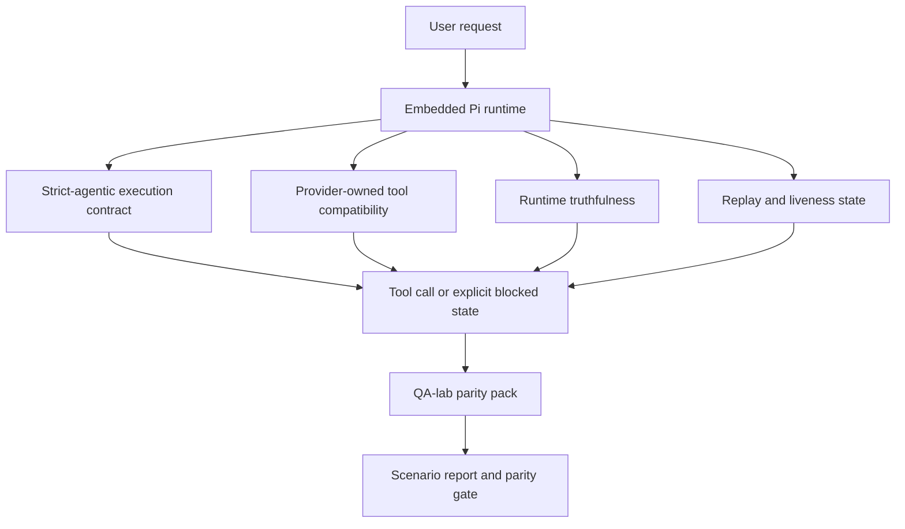
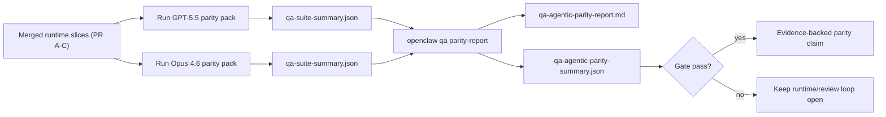

---
read_when:
    - 调试 GPT-5.5 或 Codex 智能体行为
    - 比较 OpenClaw 在前沿模型中的智能体行为
    - 审查 strict-agentic、tool-schema、elevation 和 replay 修复
summary: OpenClaw 如何为 GPT-5.5 和 Codex 风格模型弥合智能体执行缺口
title: GPT-5.5 / Codex 智能体能力对齐
x-i18n:
    generated_at: "2026-04-25T17:09:41Z"
    model: gpt-5.4
    provider: openai
    source_hash: 8a3b9375cd9e9d95855c4a1135953e00fd7a939e52fb7b75342da3bde2d83fe1
    source_path: help/gpt55-codex-agentic-parity.md
    workflow: 15
---

# OpenClaw 中 GPT-5.5 / Codex 智能体能力对齐

OpenClaw 已经能够很好地支持会使用工具的前沿模型，但 GPT-5.5 和 Codex 风格模型在一些实际场景中仍然表现不佳：

- 它们可能会在规划后停止，而不是实际执行工作
- 它们可能会错误使用严格的 OpenAI/Codex 工具 schema
- 即使根本不可能获得完全访问权限，它们也可能请求 `/elevated full`
- 在 replay 或 compaction 期间，它们可能会丢失长时间运行任务的状态
- 与 Claude Opus 4.6 的能力对齐声明此前依赖的是轶事，而不是可重复的场景

这个能力对齐计划通过四个可审查的部分修复这些缺口。

## 发生了哪些变化

### PR A：strict-agentic 执行

这一部分为嵌入式 Pi GPT-5 运行添加了一个可选启用的 `strict-agentic` 执行契约。

启用后，OpenClaw 不再把仅有计划的回合视为“足够好”的完成结果。如果模型只说明它打算做什么，却没有实际使用工具或取得进展，OpenClaw 会通过一个立即行动的引导进行重试；如果仍然没有实际执行，则会以明确的 blocked 状态失败关闭，而不是悄悄结束任务。

这项改进对 GPT-5.5 的体验提升在以下场景中最明显：

- 简短的“好，去做吧”后续回复
- 第一步很明显的代码任务
- `update_plan` 应该用于进度跟踪而不是填充文本的流程

### PR B：运行时真实性

这一部分让 OpenClaw 在两件事上“如实告知”：

- provider / 运行时调用为什么失败
- `/elevated full` 是否真的可用

这意味着 GPT-5.5 能获得更好的运行时信号，用于识别缺失 scope、auth 刷新失败、HTML 403 auth 失败、代理问题、DNS 或超时故障，以及被阻止的完全访问模式。模型因此不太可能臆造错误的修复方法，也不太会继续请求运行时根本无法提供的权限模式。

### PR C：执行正确性

这一部分提升了两类正确性：

- provider 自有的 OpenAI/Codex 工具 schema 兼容性
- replay 和长任务存活状态的可见性

工具兼容性方面的工作减少了严格 OpenAI/Codex 工具注册时的 schema 摩擦，尤其是在无参数工具和严格对象根预期方面。replay / 存活状态方面的工作让长时间运行的任务更易观察，因此 paused、blocked 和 abandoned 状态能够被看见，而不是消失在通用失败文本中。

### PR D：能力对齐 harness

这一部分加入了第一波 QA-lab 能力对齐包，使 GPT-5.5 和 Opus 4.6 可以通过相同场景运行，并使用共享证据进行比较。

这个能力对齐包是证明层。它本身不会改变运行时行为。

当你已经有两个 `qa-suite-summary.json` artifact 后，使用以下命令生成发布门禁对比：

```bash
pnpm openclaw qa parity-report \
  --repo-root . \
  --candidate-summary .artifacts/qa-e2e/gpt55/qa-suite-summary.json \
  --baseline-summary .artifacts/qa-e2e/opus46/qa-suite-summary.json \
  --output-dir .artifacts/qa-e2e/parity
```

该命令会输出：

- 一份人类可读的 Markdown 报告
- 一份机器可读的 JSON 判定结果
- 一个明确的 `pass` / `fail` 门禁结果

## 为什么这在实践中提升了 GPT-5.5

在这项工作之前，OpenClaw 上的 GPT-5.5 在真实编码会话中可能会显得不如 Opus 那么“智能体化”，因为运行时容忍了一些对 GPT-5 风格模型尤其有害的行为：

- 只有评论、没有执行的回合
- 围绕工具的 schema 摩擦
- 含糊不清的权限反馈
- 静默的 replay 或 compaction 损坏

目标不是让 GPT-5.5 模仿 Opus。目标是为 GPT-5.5 提供一种运行时契约：奖励真实进展、提供更清晰的工具与权限语义，并将失败模式转化为机器和人类都可读的显式状态。

这会把用户体验从：

- “模型有一个不错的计划，但停住了”

变成：

- “模型要么实际执行了，要么 OpenClaw 明确指出它无法执行的确切原因”

## 面向 GPT-5.5 用户的前后对比

| 该计划之前 | PR A-D 之后 |
| ---------------------------------------------------------------------------------------------- | ---------------------------------------------------------------------------------------- |
| GPT-5.5 可能会在提出合理计划后停止，而不执行下一步工具操作 | PR A 将“只有计划”变成“立即行动，或显式呈现 blocked 状态” |
| 严格工具 schema 可能会以令人困惑的方式拒绝无参数工具或 OpenAI/Codex 形状的工具 | PR C 让 provider 自有工具的注册和调用更可预测 |
| 在被阻止的运行时中，`/elevated full` 指引可能含糊甚至错误 | PR B 为 GPT-5.5 和用户提供真实的运行时与权限提示 |
| replay 或 compaction 失败可能让任务看起来像是悄悄消失了 | PR C 会明确呈现 paused、blocked、abandoned 和 replay-invalid 结果 |
| “GPT-5.5 感觉比 Opus 差” 过去主要是轶事 | PR D 将其变成相同的场景包、相同的指标，以及硬性的通过 / 失败门禁 |

## 架构



## 发布流程



## 场景包

第一波能力对齐包目前覆盖五个场景：

### `approval-turn-tool-followthrough`

检查模型在收到简短批准后，是否不会停留在“我会去做”的表述上。它应该在同一回合中采取第一个具体行动。

### `model-switch-tool-continuity`

检查使用工具的工作在模型 / 运行时切换边界上能否保持连贯，而不是重置成评论，或丢失执行上下文。

### `source-docs-discovery-report`

检查模型是否能够读取源码和文档、综合分析发现，并以智能体方式继续任务，而不是只给出一段单薄的总结后就提前停止。

### `image-understanding-attachment`

检查涉及附件的混合模式任务是否仍然可执行，而不会退化为含糊的叙述。

### `compaction-retry-mutating-tool`

检查带有真实变更写入的任务在 compaction、重试，或在压力下丢失回复状态时，是否仍然明确呈现 replay 不安全性，而不是悄悄看起来像 replay 安全。

## 场景矩阵

| 场景 | 测试内容 | 良好的 GPT-5.5 行为 | 失败信号 |
| ---------------------------------- | --------------------------------------- | ------------------------------------------------------------------------------ | ------------------------------------------------------------------------------ |
| `approval-turn-tool-followthrough` | 计划之后的简短批准回合 | 立即开始第一个具体工具操作，而不是重述意图 | 只有计划的后续回复、没有工具活动，或在没有真实阻碍时进入 blocked 回合 |
| `model-switch-tool-continuity` | 使用工具时的运行时 / 模型切换 | 保持任务上下文并连贯地继续执行 | 重置为评论、丢失工具上下文，或切换后停止 |
| `source-docs-discovery-report` | 源码读取 + 综合分析 + 行动 | 找到源码，使用工具，并在不中断的情况下产出有用报告 | 单薄总结、缺少工具操作，或在回合未完成时停止 |
| `image-understanding-attachment` | 由附件驱动的智能体工作 | 理解附件，将其与工具关联，并继续任务 | 含糊叙述、忽略附件，或没有具体的下一步行动 |
| `compaction-retry-mutating-tool` | compaction 压力下的变更性工作 | 执行真实写入，并在副作用发生后仍明确保留 replay 不安全性 | 已发生变更写入，但 replay 安全性被暗示、缺失或前后矛盾 |

## 发布门禁

只有当合并后的运行时同时通过能力对齐包和运行时真实性回归测试时，GPT-5.5 才能被视为达到或超过能力对齐水平。

必需结果：

- 当下一步工具操作很明确时，不得出现仅有计划的停滞
- 不得在没有真实执行的情况下伪装成完成
- 不得提供错误的 `/elevated full` 指引
- 不得静默放弃 replay 或 compaction 中的任务
- 能力对齐包中的指标必须至少与约定的 Opus 4.6 基线一样强

对于第一波 harness，门禁比较以下指标：

- 完成率
- 非预期停止率
- 有效工具调用率
- 虚假成功次数

能力对齐证据被有意拆分为两层：

- PR D 通过 QA-lab 证明 GPT-5.5 与 Opus 4.6 在相同场景下的行为
- PR B 的确定性测试套件在 harness 之外证明 auth、代理、DNS 和 `/elevated full` 的真实性

## 目标到证据矩阵

| 完成门禁项 | 负责 PR | 证据来源 | 通过信号 |
| -------------------------------------------------------- | ----------- | ------------------------------------------------------------------ | ---------------------------------------------------------------------------------------- |
| GPT-5.5 不再在规划后停滞 | PR A | `approval-turn-tool-followthrough` 加上 PR A 运行时测试套件 | 批准回合会触发真实工作，或显式进入 blocked 状态 |
| GPT-5.5 不再伪造进展或伪造工具完成 | PR A + PR D | 能力对齐报告中的场景结果和 fake-success 计数 | 没有可疑的通过结果，也没有只有评论的完成 |
| GPT-5.5 不再给出错误的 `/elevated full` 指引 | PR B | 确定性的真实性测试套件 | blocked 原因和完全访问提示始终与运行时状态一致 |
| replay / 存活状态故障保持显式可见 | PR C + PR D | PR C 生命周期 / replay 测试套件加上 `compaction-retry-mutating-tool` | 变更性工作会明确保留 replay 不安全性，而不是悄悄消失 |
| GPT-5.5 在约定指标上达到或超过 Opus 4.6 | PR D | `qa-agentic-parity-report.md` 和 `qa-agentic-parity-summary.json` | 覆盖相同场景，并且在完成率、停止行为或有效工具使用上没有回退 |

## 如何解读能力对齐判定结果

将 `qa-agentic-parity-summary.json` 中的判定结果用作第一波能力对齐包最终的机器可读决策。

- `pass` 表示 GPT-5.5 覆盖了与 Opus 4.6 相同的场景，并且在约定的聚合指标上没有回退。
- `fail` 表示至少有一个硬性门禁被触发：完成率更弱、非预期停止更差、有效工具使用更弱、出现任意 fake-success 情况，或场景覆盖不匹配。
- “shared/base CI issue” 本身并不是能力对齐结果。如果 PR D 之外的 CI 噪声阻塞了某次运行，则应等待一次干净的已合并运行时执行结果后再给出判定，而不是根据分支阶段的日志进行推断。
- auth、代理、DNS 和 `/elevated full` 的真实性仍然来自 PR B 的确定性测试套件，因此最终的发布声明需要同时满足两点：PR D 的能力对齐判定通过，以及 PR B 的真实性覆盖为绿色通过。

## 谁应该启用 `strict-agentic`

在以下情况下使用 `strict-agentic`：

- 当下一步操作很明确时，预期智能体应立即执行
- GPT-5.5 或 Codex 系列模型是主要运行时
- 你更希望看到显式的 blocked 状态，而不是“有帮助”的仅回顾式回复

在以下情况下保留默认契约：

- 你希望保留现有的较宽松行为
- 你没有使用 GPT-5 系列模型
- 你测试的是 prompt，而不是运行时强制约束

## 相关内容

- [GPT-5.5 / Codex 能力对齐维护者说明](/zh-CN/help/gpt55-codex-agentic-parity-maintainers)
