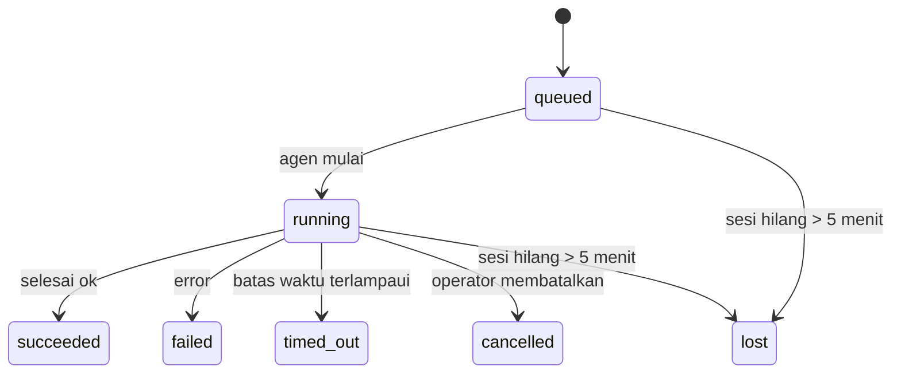

---
read_when:
    - Memeriksa pekerjaan latar belakang yang sedang berlangsung atau yang baru saja selesai
    - Men-debug kegagalan pengiriman untuk proses agen yang berjalan terpisah
    - Memahami bagaimana proses latar belakang terkait dengan sesi, Cron, dan Heartbeat
summary: Pelacakan tugas latar belakang untuk proses ACP, subagen, pekerjaan Cron terisolasi, dan operasi CLI
title: Tugas Latar Belakang
x-i18n:
    generated_at: "2026-04-21T09:16:05Z"
    model: gpt-5.4
    provider: openai
    source_hash: ba5511b1c421bdf505fc7d34f09e453ac44e85213fcb0f082078fa957aa91fe7
    source_path: automation/tasks.md
    workflow: 15
---

# Tugas Latar Belakang

> **Mencari penjadwalan?** Lihat [Automation & Tasks](/id/automation) untuk memilih mekanisme yang tepat. Halaman ini membahas **pelacakan** pekerjaan latar belakang, bukan penjadwalannya.

Tugas latar belakang melacak pekerjaan yang berjalan **di luar sesi percakapan utama Anda**:
proses ACP, pemunculan subagen, eksekusi pekerjaan Cron terisolasi, dan operasi yang dimulai dari CLI.

Tugas **tidak** menggantikan sesi, pekerjaan Cron, atau Heartbeat — tugas adalah **buku catatan aktivitas** yang mencatat pekerjaan terpisah apa yang terjadi, kapan terjadinya, dan apakah berhasil.

<Note>
Tidak setiap proses agen membuat tugas. Giliran Heartbeat dan chat interaktif normal tidak membuatnya. Semua eksekusi Cron, pemunculan ACP, pemunculan subagen, dan perintah agen CLI membuat tugas.
</Note>

## Ringkasannya

- Tugas adalah **catatan**, bukan penjadwal — Cron dan Heartbeat menentukan _kapan_ pekerjaan berjalan, tugas melacak _apa yang terjadi_.
- ACP, subagen, semua pekerjaan Cron, dan operasi CLI membuat tugas. Giliran Heartbeat tidak.
- Setiap tugas bergerak melalui `queued → running → terminal` (succeeded, failed, timed_out, cancelled, atau lost).
- Tugas Cron tetap aktif selama runtime Cron masih memiliki pekerjaan itu; tugas CLI berbasis chat tetap aktif hanya selama konteks proses pemiliknya masih aktif.
- Penyelesaian bersifat didorong push: pekerjaan terpisah dapat memberi tahu secara langsung atau membangunkan sesi/Heartbeat peminta saat selesai, sehingga loop polling status biasanya bukan pola yang tepat.
- Proses Cron terisolasi dan penyelesaian subagen melakukan pembersihan best-effort pada tab/proses browser yang dilacak untuk sesi turunannya sebelum pencatatan pembersihan akhir.
- Pengiriman Cron terisolasi menekan balasan perantara induk yang usang saat pekerjaan subagen turunan masih dikuras, dan lebih memilih keluaran turunan final jika itu tiba sebelum pengiriman.
- Notifikasi penyelesaian dikirim langsung ke channel atau diantrikan untuk Heartbeat berikutnya.
- `openclaw tasks list` menampilkan semua tugas; `openclaw tasks audit` menampilkan masalah.
- Catatan terminal disimpan selama 7 hari, lalu dipangkas secara otomatis.

## Mulai cepat

```bash
# Daftar semua tugas (terbaru lebih dulu)
openclaw tasks list

# Filter berdasarkan runtime atau status
openclaw tasks list --runtime acp
openclaw tasks list --status running

# Tampilkan detail untuk tugas tertentu (berdasarkan ID, run ID, atau session key)
openclaw tasks show <lookup>

# Batalkan tugas yang sedang berjalan (menghentikan child session)
openclaw tasks cancel <lookup>

# Ubah kebijakan notifikasi untuk sebuah tugas
openclaw tasks notify <lookup> state_changes

# Jalankan audit kesehatan
openclaw tasks audit

# Pratinjau atau terapkan pemeliharaan
openclaw tasks maintenance
openclaw tasks maintenance --apply

# Periksa status TaskFlow
openclaw tasks flow list
openclaw tasks flow show <lookup>
openclaw tasks flow cancel <lookup>
```

## Apa yang membuat tugas

| Sumber                 | Jenis runtime | Kapan catatan tugas dibuat                           | Kebijakan notifikasi default |
| ---------------------- | ------------- | ---------------------------------------------------- | ---------------------------- |
| Proses latar belakang ACP | `acp`      | Memunculkan child session ACP                        | `done_only`                  |
| Orkestrasi subagen     | `subagent`    | Memunculkan subagen melalui `sessions_spawn`         | `done_only`                  |
| Pekerjaan Cron (semua jenis) | `cron`  | Setiap eksekusi Cron (sesi utama dan terisolasi)     | `silent`                     |
| Operasi CLI            | `cli`         | Perintah `openclaw agent` yang berjalan melalui Gateway | `silent`                  |
| Pekerjaan media agen   | `cli`         | Proses `video_generate` berbasis sesi                | `silent`                     |

Tugas Cron sesi utama menggunakan kebijakan notifikasi `silent` secara default — tugas ini membuat catatan untuk pelacakan tetapi tidak menghasilkan notifikasi. Tugas Cron terisolasi juga default ke `silent` tetapi lebih terlihat karena berjalan dalam sesinya sendiri.

Proses `video_generate` berbasis sesi juga menggunakan kebijakan notifikasi `silent`. Proses ini tetap membuat catatan tugas, tetapi penyelesaian dikembalikan ke sesi agen asal sebagai wake internal agar agen dapat menulis pesan lanjutan dan melampirkan video yang sudah selesai sendiri. Jika Anda memilih `tools.media.asyncCompletion.directSend`, penyelesaian async `music_generate` dan `video_generate` akan mencoba pengiriman channel langsung terlebih dahulu sebelum kembali ke jalur wake sesi peminta.

Selama tugas `video_generate` berbasis sesi masih aktif, tool ini juga berfungsi sebagai guardrail: pemanggilan `video_generate` berulang dalam sesi yang sama akan mengembalikan status tugas aktif alih-alih memulai generasi kedua yang berjalan bersamaan. Gunakan `action: "status"` ketika Anda ingin pencarian progres/status eksplisit dari sisi agen.

**Apa yang tidak membuat tugas:**

- Giliran Heartbeat — sesi utama; lihat [Heartbeat](/id/gateway/heartbeat)
- Giliran chat interaktif normal
- Respons `/command` langsung

## Siklus hidup tugas



| Status      | Artinya                                                                    |
| ----------- | -------------------------------------------------------------------------- |
| `queued`    | Dibuat, menunggu agen mulai                                                |
| `running`   | Giliran agen sedang dieksekusi secara aktif                                |
| `succeeded` | Selesai dengan sukses                                                      |
| `failed`    | Selesai dengan error                                                       |
| `timed_out` | Melebihi batas waktu yang dikonfigurasi                                    |
| `cancelled` | Dihentikan oleh operator melalui `openclaw tasks cancel`                   |
| `lost`      | Runtime kehilangan status backing otoritatif setelah masa tenggang 5 menit |

Transisi terjadi secara otomatis — ketika proses agen terkait berakhir, status tugas diperbarui agar sesuai.

`lost` bersifat sadar runtime:

- Tugas ACP: metadata child session ACP backing menghilang.
- Tugas subagen: child session backing menghilang dari penyimpanan agen target.
- Tugas Cron: runtime Cron tidak lagi melacak pekerjaan itu sebagai aktif.
- Tugas CLI: tugas child-session terisolasi menggunakan child session; tugas CLI berbasis chat menggunakan konteks proses live sebagai gantinya, sehingga baris sesi channel/grup/langsung yang masih tersisa tidak membuatnya tetap aktif.

## Pengiriman dan notifikasi

Ketika sebuah tugas mencapai status terminal, OpenClaw memberi tahu Anda. Ada dua jalur pengiriman:

**Pengiriman langsung** — jika tugas memiliki target channel (`requesterOrigin`), pesan penyelesaian dikirim langsung ke channel tersebut (Telegram, Discord, Slack, dll.). Untuk penyelesaian subagen, OpenClaw juga mempertahankan perutean thread/topik terikat saat tersedia dan dapat mengisi `to` / akun yang hilang dari rute tersimpan sesi peminta (`lastChannel` / `lastTo` / `lastAccountId`) sebelum menyerah pada pengiriman langsung.

**Pengiriman melalui antrean sesi** — jika pengiriman langsung gagal atau tidak ada origin yang ditetapkan, pembaruan diantrikan sebagai peristiwa sistem di sesi peminta dan muncul pada Heartbeat berikutnya.

<Tip>
Penyelesaian tugas memicu wake Heartbeat segera agar Anda cepat melihat hasilnya — Anda tidak perlu menunggu tick Heartbeat terjadwal berikutnya.
</Tip>

Artinya, alur kerja yang umum bersifat berbasis push: mulai pekerjaan terpisah sekali, lalu biarkan runtime membangunkan atau memberi tahu Anda saat selesai. Poll status tugas hanya ketika Anda memerlukan debugging, intervensi, atau audit eksplisit.

### Kebijakan notifikasi

Kendalikan seberapa banyak Anda menerima kabar tentang setiap tugas:

| Kebijakan             | Yang dikirimkan                                                          |
| --------------------- | ------------------------------------------------------------------------ |
| `done_only` (default) | Hanya status terminal (succeeded, failed, dll.) — **ini default-nya**   |
| `state_changes`       | Setiap transisi status dan pembaruan progres                             |
| `silent`              | Tidak ada sama sekali                                                    |

Ubah kebijakan saat tugas sedang berjalan:

```bash
openclaw tasks notify <lookup> state_changes
```

## Referensi CLI

### `tasks list`

```bash
openclaw tasks list [--runtime <acp|subagent|cron|cli>] [--status <status>] [--json]
```

Kolom keluaran: Task ID, Kind, Status, Delivery, Run ID, Child Session, Summary.

### `tasks show`

```bash
openclaw tasks show <lookup>
```

Token lookup menerima task ID, run ID, atau session key. Menampilkan catatan lengkap termasuk waktu, status pengiriman, error, dan ringkasan terminal.

### `tasks cancel`

```bash
openclaw tasks cancel <lookup>
```

Untuk tugas ACP dan subagen, ini menghentikan child session. Untuk tugas yang dilacak CLI, pembatalan dicatat di registri tugas (tidak ada handle runtime anak terpisah). Status bertransisi ke `cancelled` dan notifikasi pengiriman dikirim jika berlaku.

### `tasks notify`

```bash
openclaw tasks notify <lookup> <done_only|state_changes|silent>
```

### `tasks audit`

```bash
openclaw tasks audit [--json]
```

Menampilkan masalah operasional. Temuan juga muncul di `openclaw status` ketika masalah terdeteksi.

| Temuan                    | Tingkat keparahan | Pemicu                                                |
| ------------------------- | ----------------- | ----------------------------------------------------- |
| `stale_queued`            | warn              | Berada di antrean lebih dari 10 menit                 |
| `stale_running`           | error             | Berjalan lebih dari 30 menit                          |
| `lost`                    | error             | Kepemilikan tugas berbasis runtime menghilang         |
| `delivery_failed`         | warn              | Pengiriman gagal dan kebijakan notifikasi bukan `silent` |
| `missing_cleanup`         | warn              | Tugas terminal tanpa cap waktu pembersihan            |
| `inconsistent_timestamps` | warn              | Pelanggaran linimasa (misalnya berakhir sebelum dimulai) |

### `tasks maintenance`

```bash
openclaw tasks maintenance [--json]
openclaw tasks maintenance --apply [--json]
```

Gunakan ini untuk mempratinjau atau menerapkan rekonsiliasi, pencap-waktu pembersihan, dan pemangkasan untuk status tugas dan Task Flow.

Rekonsiliasi bersifat sadar runtime:

- Tugas ACP/subagen memeriksa child session backing mereka.
- Tugas Cron memeriksa apakah runtime Cron masih memiliki pekerjaan tersebut.
- Tugas CLI berbasis chat memeriksa konteks proses live pemiliknya, bukan hanya baris sesi chat.

Pembersihan penyelesaian juga bersifat sadar runtime:

- Penyelesaian subagen melakukan best-effort menutup tab/proses browser yang dilacak untuk child session sebelum pembersihan pengumuman berlanjut.
- Penyelesaian Cron terisolasi melakukan best-effort menutup tab/proses browser yang dilacak untuk sesi Cron sebelum proses dibongkar sepenuhnya.
- Pengiriman Cron terisolasi menunggu tindak lanjut subagen turunan bila diperlukan dan menekan teks pengakuan induk yang usang alih-alih mengumumkannya.
- Pengiriman penyelesaian subagen lebih memilih teks asisten terlihat terbaru; jika itu kosong maka kembali ke teks tool/toolResult terbaru yang sudah disanitasi, dan proses tool-call yang hanya timeout dapat diringkas menjadi ringkasan progres parsial singkat.
- Kegagalan pembersihan tidak menutupi hasil tugas yang sebenarnya.

### `tasks flow list|show|cancel`

```bash
openclaw tasks flow list [--status <status>] [--json]
openclaw tasks flow show <lookup> [--json]
openclaw tasks flow cancel <lookup>
```

Gunakan ini ketika TaskFlow pengorkestrasi adalah hal yang Anda pedulikan, bukan satu catatan tugas latar belakang individual.

## Papan tugas chat (`/tasks`)

Gunakan `/tasks` di sesi chat mana pun untuk melihat tugas latar belakang yang terkait dengan sesi itu. Papan menampilkan
tugas yang aktif dan yang baru selesai dengan runtime, status, waktu, serta detail progres atau error.

Ketika sesi saat ini tidak memiliki tugas tertaut yang terlihat, `/tasks` kembali ke jumlah tugas lokal agen
agar Anda tetap mendapatkan gambaran umum tanpa membocorkan detail sesi lain.

Untuk buku catatan operator lengkap, gunakan CLI: `openclaw tasks list`.

## Integrasi status (tekanan tugas)

`openclaw status` menyertakan ringkasan tugas sekilas:

```
Tasks: 3 queued · 2 running · 1 issues
```

Ringkasan tersebut melaporkan:

- **active** — jumlah `queued` + `running`
- **failures** — jumlah `failed` + `timed_out` + `lost`
- **byRuntime** — rincian berdasarkan `acp`, `subagent`, `cron`, `cli`

Baik `/status` maupun tool `session_status` menggunakan snapshot tugas yang sadar pembersihan: tugas aktif
diprioritaskan, baris selesai yang usang disembunyikan, dan kegagalan terbaru hanya ditampilkan saat tidak ada pekerjaan aktif
yang tersisa. Ini menjaga kartu status tetap berfokus pada yang penting saat ini.

## Penyimpanan dan pemeliharaan

### Di mana tugas disimpan

Catatan tugas disimpan di SQLite pada:

```
$OPENCLAW_STATE_DIR/tasks/runs.sqlite
```

Registri dimuat ke memori saat Gateway dimulai dan menyinkronkan penulisan ke SQLite agar tetap tahan terhadap restart.

### Pemeliharaan otomatis

Sebuah sweeper berjalan setiap **60 detik** dan menangani tiga hal:

1. **Rekonsiliasi** — memeriksa apakah tugas aktif masih memiliki backing runtime yang otoritatif. Tugas ACP/subagen menggunakan status child session, tugas Cron menggunakan kepemilikan pekerjaan aktif, dan tugas CLI berbasis chat menggunakan konteks proses pemilik. Jika status backing itu hilang selama lebih dari 5 menit, tugas ditandai sebagai `lost`.
2. **Pencap-waktu pembersihan** — menetapkan cap waktu `cleanupAfter` pada tugas terminal (`endedAt + 7 days`).
3. **Pemangkasan** — menghapus catatan yang telah melewati tanggal `cleanupAfter`.

**Retensi**: catatan tugas terminal disimpan selama **7 hari**, lalu dipangkas secara otomatis. Tidak perlu konfigurasi.

## Hubungan tugas dengan sistem lain

### Tugas dan Task Flow

[Task Flow](/id/automation/taskflow) adalah lapisan orkestrasi flow di atas tugas latar belakang. Satu flow dapat mengoordinasikan beberapa tugas selama masa hidupnya dengan mode sinkronisasi terkelola atau tercermin. Gunakan `openclaw tasks` untuk memeriksa catatan tugas individual dan `openclaw tasks flow` untuk memeriksa flow pengorkestrasinya.

Lihat [Task Flow](/id/automation/taskflow) untuk detailnya.

### Tugas dan Cron

Sebuah **definisi** pekerjaan Cron berada di `~/.openclaw/cron/jobs.json`; status eksekusi runtime berada di sebelahnya dalam `~/.openclaw/cron/jobs-state.json`. **Setiap** eksekusi Cron membuat catatan tugas — baik sesi utama maupun terisolasi. Tugas Cron sesi utama menggunakan kebijakan notifikasi `silent` secara default agar tetap terlacak tanpa menghasilkan notifikasi.

Lihat [Cron Jobs](/id/automation/cron-jobs).

### Tugas dan Heartbeat

Proses Heartbeat adalah giliran sesi utama — proses ini tidak membuat catatan tugas. Saat sebuah tugas selesai, tugas itu dapat memicu wake Heartbeat agar Anda segera melihat hasilnya.

Lihat [Heartbeat](/id/gateway/heartbeat).

### Tugas dan sesi

Sebuah tugas dapat merujuk ke `childSessionKey` (tempat pekerjaan berjalan) dan `requesterSessionKey` (siapa yang memulainya). Sesi adalah konteks percakapan; tugas adalah pelacakan aktivitas di atasnya.

### Tugas dan proses agen

`runId` sebuah tugas terhubung ke proses agen yang mengerjakan tugas tersebut. Peristiwa siklus hidup agen (mulai, selesai, error) secara otomatis memperbarui status tugas — Anda tidak perlu mengelola siklus hidupnya secara manual.

## Terkait

- [Automation & Tasks](/id/automation) — semua mekanisme otomatisasi secara ringkas
- [Task Flow](/id/automation/taskflow) — orkestrasi flow di atas tugas
- [Scheduled Tasks](/id/automation/cron-jobs) — penjadwalan pekerjaan latar belakang
- [Heartbeat](/id/gateway/heartbeat) — giliran sesi utama periodik
- [CLI: Tasks](/cli/index#tasks) — referensi perintah CLI
