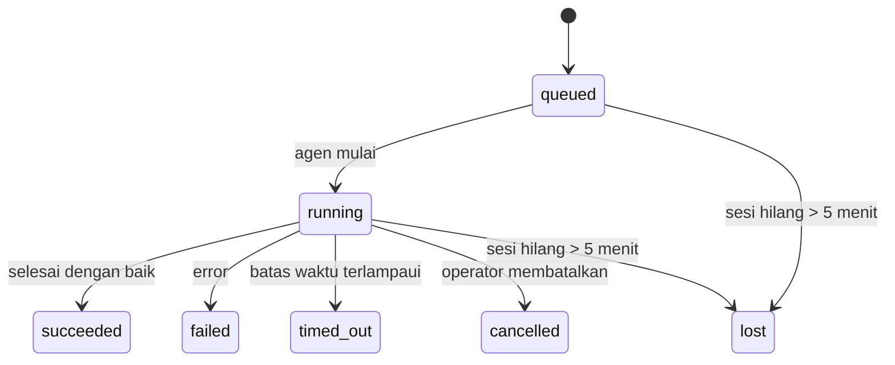

---
read_when:
    - Memeriksa pekerjaan latar belakang yang sedang berlangsung atau baru saja selesai
    - Men-debug kegagalan pengiriman untuk proses agen terlepas
    - Memahami bagaimana proses latar belakang terkait dengan sesi, cron, dan heartbeat
summary: Pelacakan tugas latar belakang untuk proses ACP, subagen, tugas cron terisolasi, dan operasi CLI
title: Tugas Latar Belakang
x-i18n:
    generated_at: "2026-04-10T09:13:14Z"
    model: gpt-5.4
    provider: openai
    source_hash: d7b5ba41f1025e0089986342ce85698bc62f676439c3ccf03f3ed146beb1b1ac
    source_path: automation/tasks.md
    workflow: 15
---

# Tugas Latar Belakang

> **Mencari penjadwalan?** Lihat [Otomasi & Tugas](/id/automation) untuk memilih mekanisme yang tepat. Halaman ini membahas **pelacakan** pekerjaan latar belakang, bukan penjadwalannya.

Tugas latar belakang melacak pekerjaan yang berjalan **di luar sesi percakapan utama Anda**:
proses ACP, pemanggilan subagen, eksekusi tugas cron terisolasi, dan operasi yang dimulai oleh CLI.

Tugas **tidak** menggantikan sesi, tugas cron, atau heartbeat — tugas adalah **buku aktivitas** yang mencatat pekerjaan terlepas apa yang terjadi, kapan, dan apakah pekerjaan tersebut berhasil.

<Note>
Tidak setiap proses agen membuat tugas. Giliran heartbeat dan chat interaktif normal tidak membuat tugas. Semua eksekusi cron, pemanggilan ACP, pemanggilan subagen, dan perintah agen CLI membuat tugas.
</Note>

## Ringkasnya

- Tugas adalah **catatan**, bukan penjadwal — cron dan heartbeat menentukan _kapan_ pekerjaan berjalan, tugas melacak _apa yang terjadi_.
- ACP, subagen, semua tugas cron, dan operasi CLI membuat tugas. Giliran heartbeat tidak.
- Setiap tugas bergerak melalui `queued → running → terminal` (succeeded, failed, timed_out, cancelled, atau lost).
- Tugas cron tetap aktif selama runtime cron masih memiliki tugas tersebut; tugas CLI berbasis chat tetap aktif hanya selama konteks proses pemiliknya masih aktif.
- Penyelesaian bersifat didorong-push: pekerjaan terlepas dapat memberi tahu secara langsung atau membangunkan sesi/heartbeat peminta saat selesai, sehingga loop polling status biasanya bukan pendekatan yang tepat.
- Proses cron terisolasi dan penyelesaian subagen sebisa mungkin membersihkan tab/proses browser yang terlacak untuk sesi turunannya sebelum pembukuan pembersihan akhir.
- Pengiriman cron terisolasi menekan balasan induk sementara yang sudah basi saat pekerjaan subagen turunan masih dikuras, dan lebih memilih output turunan final ketika output itu tiba sebelum pengiriman.
- Notifikasi penyelesaian dikirim langsung ke saluran atau dimasukkan ke antrean untuk heartbeat berikutnya.
- `openclaw tasks list` menampilkan semua tugas; `openclaw tasks audit` menampilkan masalah.
- Catatan terminal disimpan selama 7 hari, lalu dipangkas secara otomatis.

## Mulai cepat

```bash
# Daftar semua tugas (terbaru terlebih dahulu)
openclaw tasks list

# Filter berdasarkan runtime atau status
openclaw tasks list --runtime acp
openclaw tasks list --status running

# Tampilkan detail untuk tugas tertentu (berdasarkan ID, ID run, atau kunci sesi)
openclaw tasks show <lookup>

# Batalkan tugas yang sedang berjalan (menghentikan sesi anak)
openclaw tasks cancel <lookup>

# Ubah kebijakan notifikasi untuk sebuah tugas
openclaw tasks notify <lookup> state_changes

# Jalankan audit kesehatan
openclaw tasks audit

# Pratinjau atau terapkan pemeliharaan
openclaw tasks maintenance
openclaw tasks maintenance --apply

# Periksa status TaskFlow
openclaw tasks flow list
openclaw tasks flow show <lookup>
openclaw tasks flow cancel <lookup>
```

## Apa yang membuat tugas

| Sumber                 | Jenis runtime | Kapan catatan tugas dibuat                           | Kebijakan notifikasi default |
| ---------------------- | ------------- | ---------------------------------------------------- | ---------------------------- |
| Proses latar belakang ACP | `acp`      | Memunculkan sesi ACP anak                            | `done_only`                  |
| Orkestrasi subagen     | `subagent`    | Memunculkan subagen melalui `sessions_spawn`         | `done_only`                  |
| Tugas cron (semua jenis) | `cron`      | Setiap eksekusi cron (sesi utama dan terisolasi)     | `silent`                     |
| Operasi CLI            | `cli`         | Perintah `openclaw agent` yang berjalan melalui gateway | `silent`                  |
| Tugas media agen       | `cli`         | Proses `video_generate` berbasis sesi                | `silent`                     |

Tugas cron sesi utama menggunakan kebijakan notifikasi `silent` secara default — tugas tersebut membuat catatan untuk pelacakan tetapi tidak menghasilkan notifikasi. Tugas cron terisolasi juga default ke `silent` tetapi lebih terlihat karena berjalan dalam sesi mereka sendiri.

Proses `video_generate` berbasis sesi juga menggunakan kebijakan notifikasi `silent`. Proses ini tetap membuat catatan tugas, tetapi penyelesaiannya dikembalikan ke sesi agen asal sebagai wake internal agar agen dapat menulis pesan tindak lanjut dan melampirkan video yang selesai sendiri. Jika Anda memilih `tools.media.asyncCompletion.directSend`, penyelesaian async `music_generate` dan `video_generate` akan mencoba pengiriman saluran langsung terlebih dahulu sebelum kembali ke jalur wake sesi peminta.

Saat tugas `video_generate` berbasis sesi masih aktif, tool tersebut juga bertindak sebagai guardrail: pemanggilan `video_generate` berulang dalam sesi yang sama akan mengembalikan status tugas aktif alih-alih memulai generasi serentak kedua. Gunakan `action: "status"` jika Anda menginginkan pencarian progres/status eksplisit dari sisi agen.

**Apa yang tidak membuat tugas:**

- Giliran heartbeat — sesi utama; lihat [Heartbeat](/id/gateway/heartbeat)
- Giliran chat interaktif normal
- Respons `/command` langsung

## Siklus hidup tugas



| Status      | Artinya                                                                    |
| ----------- | -------------------------------------------------------------------------- |
| `queued`    | Dibuat, menunggu agen mulai                                                |
| `running`   | Giliran agen sedang aktif dieksekusi                                       |
| `succeeded` | Selesai dengan sukses                                                      |
| `failed`    | Selesai dengan error                                                       |
| `timed_out` | Melebihi batas waktu yang dikonfigurasi                                    |
| `cancelled` | Dihentikan oleh operator melalui `openclaw tasks cancel`                   |
| `lost`      | Runtime kehilangan status pendukung otoritatif setelah masa tenggang 5 menit |

Transisi terjadi secara otomatis — ketika proses agen terkait berakhir, status tugas diperbarui agar sesuai.

`lost` bergantung pada runtime:

- Tugas ACP: metadata sesi anak ACP pendukung menghilang.
- Tugas subagen: sesi anak pendukung menghilang dari penyimpanan agen target.
- Tugas cron: runtime cron tidak lagi melacak tugas tersebut sebagai aktif.
- Tugas CLI: tugas sesi anak terisolasi menggunakan sesi anak; tugas CLI berbasis chat menggunakan konteks proses langsung sebagai gantinya, sehingga baris sesi saluran/grup/langsung yang masih tersisa tidak membuatnya tetap aktif.

## Pengiriman dan notifikasi

Ketika sebuah tugas mencapai status terminal, OpenClaw memberi tahu Anda. Ada dua jalur pengiriman:

**Pengiriman langsung** — jika tugas memiliki target saluran (`requesterOrigin`), pesan penyelesaian dikirim langsung ke saluran tersebut (Telegram, Discord, Slack, dan sebagainya). Untuk penyelesaian subagen, OpenClaw juga mempertahankan perutean thread/topik yang terikat bila tersedia dan dapat mengisi `to` / akun yang hilang dari rute tersimpan sesi peminta (`lastChannel` / `lastTo` / `lastAccountId`) sebelum menyerah pada pengiriman langsung.

**Pengiriman yang dimasukkan ke antrean sesi** — jika pengiriman langsung gagal atau tidak ada origin yang ditetapkan, pembaruan dimasukkan ke antrean sebagai event sistem dalam sesi peminta dan muncul pada heartbeat berikutnya.

<Tip>
Penyelesaian tugas memicu wake heartbeat segera sehingga Anda melihat hasilnya dengan cepat — Anda tidak perlu menunggu tick heartbeat terjadwal berikutnya.
</Tip>

Artinya, alur kerja yang umum bersifat berbasis push: mulai pekerjaan terlepas sekali, lalu biarkan runtime membangunkan atau memberi tahu Anda saat selesai. Poll status tugas hanya ketika Anda memerlukan debugging, intervensi, atau audit eksplisit.

### Kebijakan notifikasi

Kendalikan seberapa banyak yang Anda dengar tentang setiap tugas:

| Kebijakan             | Apa yang dikirimkan                                                        |
| --------------------- | -------------------------------------------------------------------------- |
| `done_only` (default) | Hanya status terminal (succeeded, failed, dll.) — **ini adalah default**   |
| `state_changes`       | Setiap transisi status dan pembaruan progres                               |
| `silent`              | Tidak ada sama sekali                                                      |

Ubah kebijakan saat tugas sedang berjalan:

```bash
openclaw tasks notify <lookup> state_changes
```

## Referensi CLI

### `tasks list`

```bash
openclaw tasks list [--runtime <acp|subagent|cron|cli>] [--status <status>] [--json]
```

Kolom output: ID Tugas, Jenis, Status, Pengiriman, ID Run, Sesi Anak, Ringkasan.

### `tasks show`

```bash
openclaw tasks show <lookup>
```

Token lookup menerima ID tugas, ID run, atau kunci sesi. Menampilkan catatan lengkap termasuk waktu, status pengiriman, error, dan ringkasan terminal.

### `tasks cancel`

```bash
openclaw tasks cancel <lookup>
```

Untuk tugas ACP dan subagen, ini menghentikan sesi anak. Untuk tugas yang dilacak CLI, pembatalan dicatat di registri tugas (tidak ada handle runtime anak terpisah). Status bertransisi menjadi `cancelled` dan notifikasi pengiriman dikirim bila berlaku.

### `tasks notify`

```bash
openclaw tasks notify <lookup> <done_only|state_changes|silent>
```

### `tasks audit`

```bash
openclaw tasks audit [--json]
```

Menampilkan masalah operasional. Temuan juga muncul di `openclaw status` ketika masalah terdeteksi.

| Temuan                    | Tingkat keparahan | Pemicu                                              |
| ------------------------- | ----------------- | --------------------------------------------------- |
| `stale_queued`            | warn              | Berada di antrean selama lebih dari 10 menit        |
| `stale_running`           | error             | Berjalan selama lebih dari 30 menit                 |
| `lost`                    | error             | Kepemilikan tugas berbasis runtime menghilang       |
| `delivery_failed`         | warn              | Pengiriman gagal dan kebijakan notifikasi bukan `silent` |
| `missing_cleanup`         | warn              | Tugas terminal tanpa stempel waktu cleanup          |
| `inconsistent_timestamps` | warn              | Pelanggaran linimasa (misalnya selesai sebelum mulai) |

### `tasks maintenance`

```bash
openclaw tasks maintenance [--json]
openclaw tasks maintenance --apply [--json]
```

Gunakan ini untuk mempratinjau atau menerapkan rekonsiliasi, pemberian stempel cleanup, dan pemangkasan untuk tugas serta status Task Flow.

Rekonsiliasi bergantung pada runtime:

- Tugas ACP/subagen memeriksa sesi anak pendukungnya.
- Tugas cron memeriksa apakah runtime cron masih memiliki tugas tersebut.
- Tugas CLI berbasis chat memeriksa konteks proses langsung pemilik, bukan hanya baris sesi chat.

Cleanup penyelesaian juga bergantung pada runtime:

- Penyelesaian subagen sebisa mungkin menutup tab/proses browser yang terlacak untuk sesi anak sebelum cleanup pengumuman berlanjut.
- Penyelesaian cron terisolasi sebisa mungkin menutup tab/proses browser yang terlacak untuk sesi cron sebelum proses benar-benar dibongkar.
- Pengiriman cron terisolasi menunggu tindak lanjut subagen turunan bila diperlukan dan menekan teks pengakuan induk yang sudah basi alih-alih mengumumkannya.
- Pengiriman penyelesaian subagen lebih memilih teks asisten terlihat terbaru; jika kosong, ia kembali ke teks tool/toolResult terbaru yang sudah disanitasi, dan proses khusus pemanggilan tool yang hanya timeout dapat dipadatkan menjadi ringkasan progres parsial singkat.
- Kegagalan cleanup tidak menutupi hasil tugas yang sebenarnya.

### `tasks flow list|show|cancel`

```bash
openclaw tasks flow list [--status <status>] [--json]
openclaw tasks flow show <lookup> [--json]
openclaw tasks flow cancel <lookup>
```

Gunakan ini ketika Task Flow pengorkestrasi adalah hal yang Anda pedulikan daripada satu catatan tugas latar belakang individual.

## Papan tugas chat (`/tasks`)

Gunakan `/tasks` di sesi chat mana pun untuk melihat tugas latar belakang yang ditautkan ke sesi tersebut. Papan ini menampilkan tugas aktif dan yang baru selesai beserta runtime, status, waktu, dan detail progres atau error.

Ketika sesi saat ini tidak memiliki tugas tertaut yang terlihat, `/tasks` kembali ke jumlah tugas lokal agen sehingga Anda tetap mendapatkan gambaran umum tanpa membocorkan detail sesi lain.

Untuk buku aktivitas operator lengkap, gunakan CLI: `openclaw tasks list`.

## Integrasi status (tekanan tugas)

`openclaw status` menyertakan ringkasan tugas sekilas:

```
Tasks: 3 queued · 2 running · 1 issues
```

Ringkasan tersebut melaporkan:

- **active** — jumlah `queued` + `running`
- **failures** — jumlah `failed` + `timed_out` + `lost`
- **byRuntime** — perincian berdasarkan `acp`, `subagent`, `cron`, `cli`

Baik `/status` maupun tool `session_status` menggunakan snapshot tugas yang sadar-cleanup: tugas aktif
diprioritaskan, baris selesai yang sudah basi disembunyikan, dan kegagalan terbaru hanya ditampilkan saat tidak ada pekerjaan aktif
yang tersisa. Ini menjaga kartu status tetap fokus pada hal yang penting saat ini.

## Penyimpanan dan pemeliharaan

### Tempat tugas disimpan

Catatan tugas disimpan secara persisten di SQLite pada:

```
$OPENCLAW_STATE_DIR/tasks/runs.sqlite
```

Registri dimuat ke memori saat gateway dimulai dan menyinkronkan penulisan ke SQLite agar tetap tahan lama setelah restart.

### Pemeliharaan otomatis

Sebuah sweeper berjalan setiap **60 detik** dan menangani tiga hal:

1. **Rekonsiliasi** — memeriksa apakah tugas aktif masih memiliki status pendukung runtime yang otoritatif. Tugas ACP/subagen menggunakan status sesi anak, tugas cron menggunakan kepemilikan tugas aktif, dan tugas CLI berbasis chat menggunakan konteks proses pemilik. Jika status pendukung tersebut hilang selama lebih dari 5 menit, tugas ditandai sebagai `lost`.
2. **Pemberian stempel cleanup** — menetapkan stempel waktu `cleanupAfter` pada tugas terminal (`endedAt + 7 hari`).
3. **Pemangkasan** — menghapus catatan yang telah melewati tanggal `cleanupAfter`.

**Retensi**: catatan tugas terminal disimpan selama **7 hari**, lalu dipangkas secara otomatis. Tidak perlu konfigurasi.

## Bagaimana tugas terkait dengan sistem lain

### Tugas dan Task Flow

[Task Flow](/id/automation/taskflow) adalah lapisan orkestrasi alur di atas tugas latar belakang. Satu flow dapat mengoordinasikan beberapa tugas selama masa hidupnya menggunakan mode sinkronisasi terkelola atau tercermin. Gunakan `openclaw tasks` untuk memeriksa catatan tugas individual dan `openclaw tasks flow` untuk memeriksa flow pengorkestrasi.

Lihat [Task Flow](/id/automation/taskflow) untuk detail.

### Tugas dan cron

Sebuah **definisi** tugas cron berada di `~/.openclaw/cron/jobs.json`. **Setiap** eksekusi cron membuat catatan tugas — baik sesi utama maupun terisolasi. Tugas cron sesi utama default ke kebijakan notifikasi `silent` sehingga tetap terlacak tanpa menghasilkan notifikasi.

Lihat [Tugas Cron](/id/automation/cron-jobs).

### Tugas dan heartbeat

Proses heartbeat adalah giliran sesi utama — proses ini tidak membuat catatan tugas. Saat sebuah tugas selesai, tugas itu dapat memicu wake heartbeat agar Anda segera melihat hasilnya.

Lihat [Heartbeat](/id/gateway/heartbeat).

### Tugas dan sesi

Sebuah tugas dapat mereferensikan `childSessionKey` (tempat pekerjaan berjalan) dan `requesterSessionKey` (siapa yang memulainya). Sesi adalah konteks percakapan; tugas adalah pelacakan aktivitas di atas konteks tersebut.

### Tugas dan proses agen

`runId` sebuah tugas terhubung ke proses agen yang melakukan pekerjaan. Event siklus hidup agen (mulai, selesai, error) secara otomatis memperbarui status tugas — Anda tidak perlu mengelola siklus hidupnya secara manual.

## Terkait

- [Otomasi & Tugas](/id/automation) — semua mekanisme otomasi secara sekilas
- [Task Flow](/id/automation/taskflow) — orkestrasi flow di atas tugas
- [Tugas Terjadwal](/id/automation/cron-jobs) — penjadwalan pekerjaan latar belakang
- [Heartbeat](/id/gateway/heartbeat) — giliran sesi utama berkala
- [CLI: Tugas](/cli/index#tasks) — referensi perintah CLI
