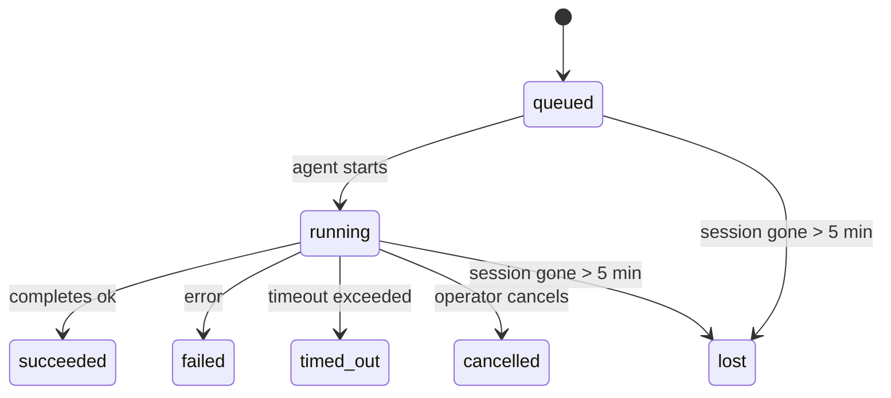

---
read_when:
    - Memeriksa pekerjaan latar belakang yang sedang berlangsung atau baru saja selesai
    - Men-debug kegagalan pengiriman untuk run agent yang dilepas
    - Memahami bagaimana run latar belakang terkait dengan sesi, Cron, dan Heartbeat
summary: Pelacakan tugas latar belakang untuk run ACP, subagent, job Cron terisolasi, dan operasi CLI
title: Tugas Latar Belakang
x-i18n:
    generated_at: "2026-04-23T09:16:12Z"
    model: gpt-5.4
    provider: openai
    source_hash: 5cd0b0db6c20cc677aa5cc50c42e09043d4354e026ca33c020d804761c331413
    source_path: automation/tasks.md
    workflow: 15
---

# Tugas Latar Belakang

> **Mencari penjadwalan?** Lihat [Automation & Tasks](/id/automation) untuk memilih mekanisme yang tepat. Halaman ini membahas **pelacakan** pekerjaan latar belakang, bukan penjadwalannya.

Tugas latar belakang melacak pekerjaan yang berjalan **di luar sesi percakapan utama Anda**:
run ACP, spawn subagent, eksekusi job Cron terisolasi, dan operasi yang dimulai dari CLI.

Tugas **tidak** menggantikan sesi, job Cron, atau Heartbeat — tugas adalah **buku besar aktivitas** yang mencatat pekerjaan terlepas apa yang terjadi, kapan itu terjadi, dan apakah itu berhasil.

<Note>
Tidak setiap run agent membuat tugas. Putaran Heartbeat dan chat interaktif normal tidak. Semua eksekusi Cron, spawn ACP, spawn subagent, dan perintah agent CLI membuat tugas.
</Note>

## TL;DR

- Tugas adalah **catatan**, bukan penjadwal — Cron dan Heartbeat menentukan _kapan_ pekerjaan berjalan, tugas melacak _apa yang terjadi_.
- ACP, subagent, semua job Cron, dan operasi CLI membuat tugas. Putaran Heartbeat tidak.
- Setiap tugas berpindah melalui `queued → running → terminal` (succeeded, failed, timed_out, cancelled, atau lost).
- Tugas Cron tetap aktif selama runtime Cron masih memiliki job tersebut; tugas CLI yang didukung chat tetap aktif hanya selama konteks run pemiliknya masih aktif.
- Penyelesaian bersifat push-driven: pekerjaan terlepas dapat memberi tahu secara langsung atau membangunkan sesi/Heartbeat peminta saat selesai, sehingga loop polling status biasanya bukan pola yang tepat.
- Run Cron terisolasi dan penyelesaian subagent membersihkan tab/proses browser yang dilacak untuk sesi turunannya dengan upaya terbaik sebelum pencatatan pembersihan akhir.
- Pengiriman Cron terisolasi menekan balasan sementara induk yang sudah usang sementara pekerjaan subagent turunan masih dikeringkan, dan lebih mengutamakan output turunan final saat output itu tiba sebelum pengiriman.
- Notifikasi penyelesaian dikirim langsung ke channel atau dimasukkan ke antrean untuk Heartbeat berikutnya.
- `openclaw tasks list` menampilkan semua tugas; `openclaw tasks audit` memunculkan masalah.
- Catatan terminal disimpan selama 7 hari, lalu dipangkas secara otomatis.

## Mulai cepat

```bash
# Tampilkan semua tugas (terbaru lebih dulu)
openclaw tasks list

# Filter berdasarkan runtime atau status
openclaw tasks list --runtime acp
openclaw tasks list --status running

# Tampilkan detail untuk tugas tertentu (berdasarkan ID, ID run, atau kunci sesi)
openclaw tasks show <lookup>

# Batalkan tugas yang sedang berjalan (mematikan sesi turunan)
openclaw tasks cancel <lookup>

# Ubah kebijakan notifikasi untuk sebuah tugas
openclaw tasks notify <lookup> state_changes

# Jalankan audit kesehatan
openclaw tasks audit

# Pratinjau atau terapkan pemeliharaan
openclaw tasks maintenance
openclaw tasks maintenance --apply

# Periksa status TaskFlow
openclaw tasks flow list
openclaw tasks flow show <lookup>
openclaw tasks flow cancel <lookup>
```

## Apa yang membuat tugas

| Sumber                 | Jenis runtime | Kapan catatan tugas dibuat                           | Kebijakan notifikasi default |
| ---------------------- | ------------- | ---------------------------------------------------- | ---------------------------- |
| Run latar belakang ACP | `acp`         | Men-spawn sesi ACP turunan                           | `done_only`                  |
| Orkestrasi subagent    | `subagent`    | Men-spawn subagent melalui `sessions_spawn`          | `done_only`                  |
| Job Cron (semua jenis) | `cron`        | Setiap eksekusi Cron (sesi utama dan terisolasi)     | `silent`                     |
| Operasi CLI            | `cli`         | Perintah `openclaw agent` yang berjalan lewat Gateway | `silent`                     |
| Job media agent        | `cli`         | Run `video_generate` yang didukung sesi              | `silent`                     |

Tugas Cron sesi utama menggunakan kebijakan notifikasi `silent` secara default — tugas tersebut membuat catatan untuk pelacakan tetapi tidak menghasilkan notifikasi. Tugas Cron terisolasi juga default ke `silent` tetapi lebih terlihat karena berjalan di sesi mereka sendiri.

Run `video_generate` yang didukung sesi juga menggunakan kebijakan notifikasi `silent`. Run ini tetap membuat catatan tugas, tetapi penyelesaiannya dikembalikan ke sesi agent asli sebagai wake internal sehingga agent dapat menulis pesan tindak lanjut dan melampirkan video yang sudah selesai sendiri. Jika Anda memilih `tools.media.asyncCompletion.directSend`, penyelesaian asinkron `music_generate` dan `video_generate` mencoba pengiriman channel langsung terlebih dahulu sebelum kembali ke jalur wake sesi peminta.

Saat tugas `video_generate` yang didukung sesi masih aktif, tool ini juga bertindak sebagai guardrail: panggilan `video_generate` berulang dalam sesi yang sama mengembalikan status tugas aktif alih-alih memulai generasi serentak kedua. Gunakan `action: "status"` saat Anda menginginkan pencarian progres/status eksplisit dari sisi agent.

**Apa yang tidak membuat tugas:**

- Putaran Heartbeat — sesi utama; lihat [Heartbeat](/id/gateway/heartbeat)
- Putaran chat interaktif normal
- Respons `/command` langsung

## Siklus hidup tugas



| Status      | Artinya                                                                  |
| ----------- | ------------------------------------------------------------------------ |
| `queued`    | Dibuat, menunggu agent memulai                                           |
| `running`   | Putaran agent sedang dieksekusi secara aktif                             |
| `succeeded` | Selesai dengan sukses                                                    |
| `failed`    | Selesai dengan error                                                     |
| `timed_out` | Melebihi batas waktu yang dikonfigurasi                                  |
| `cancelled` | Dihentikan oleh operator melalui `openclaw tasks cancel`                 |
| `lost`      | Runtime kehilangan status pendukung otoritatif setelah masa tenggang 5 menit |

Transisi terjadi secara otomatis — saat run agent terkait berakhir, status tugas diperbarui agar sesuai.

`lost` sadar-runtime:

- Tugas ACP: metadata sesi turunan ACP pendukung menghilang.
- Tugas subagent: sesi turunan pendukung menghilang dari store agent target.
- Tugas Cron: runtime Cron tidak lagi melacak job tersebut sebagai aktif.
- Tugas CLI: tugas sesi turunan terisolasi menggunakan sesi turunan; tugas CLI yang didukung chat menggunakan konteks run aktif sebagai gantinya, sehingga baris sesi channel/grup/langsung yang tertinggal tidak membuatnya tetap aktif.

## Pengiriman dan notifikasi

Saat sebuah tugas mencapai status terminal, OpenClaw memberi tahu Anda. Ada dua jalur pengiriman:

**Pengiriman langsung** — jika tugas memiliki target channel (`requesterOrigin`), pesan penyelesaian langsung dikirim ke channel tersebut (Telegram, Discord, Slack, dll.). Untuk penyelesaian subagent, OpenClaw juga mempertahankan perutean thread/topik yang terikat jika tersedia dan dapat mengisi `to` / akun yang hilang dari rute tersimpan sesi peminta (`lastChannel` / `lastTo` / `lastAccountId`) sebelum menyerah pada pengiriman langsung.

**Pengiriman yang dimasukkan ke antrean sesi** — jika pengiriman langsung gagal atau tidak ada origin yang disetel, pembaruan dimasukkan ke antrean sebagai peristiwa sistem di sesi peminta dan muncul pada Heartbeat berikutnya.

<Tip>
Penyelesaian tugas memicu wake Heartbeat segera sehingga Anda melihat hasilnya dengan cepat — Anda tidak perlu menunggu tick Heartbeat terjadwal berikutnya.
</Tip>

Artinya, alur kerja yang umum bersifat berbasis push: mulai pekerjaan terlepas satu kali, lalu biarkan runtime membangunkan atau memberi tahu Anda saat selesai. Poll status tugas hanya saat Anda memerlukan debugging, intervensi, atau audit eksplisit.

### Kebijakan notifikasi

Kendalikan seberapa banyak informasi yang Anda terima tentang setiap tugas:

| Kebijakan             | Yang dikirim                                                             |
| --------------------- | ------------------------------------------------------------------------ |
| `done_only` (default) | Hanya status terminal (succeeded, failed, dll.) — **ini adalah default** |
| `state_changes`       | Setiap transisi status dan pembaruan progres                             |
| `silent`              | Tidak ada sama sekali                                                    |

Ubah kebijakan saat tugas sedang berjalan:

```bash
openclaw tasks notify <lookup> state_changes
```

## Referensi CLI

### `tasks list`

```bash
openclaw tasks list [--runtime <acp|subagent|cron|cli>] [--status <status>] [--json]
```

Kolom output: ID Tugas, Jenis, Status, Pengiriman, ID Run, Sesi Turunan, Ringkasan.

### `tasks show`

```bash
openclaw tasks show <lookup>
```

Token lookup menerima ID tugas, ID run, atau kunci sesi. Menampilkan catatan lengkap termasuk waktu, status pengiriman, error, dan ringkasan terminal.

### `tasks cancel`

```bash
openclaw tasks cancel <lookup>
```

Untuk tugas ACP dan subagent, ini mematikan sesi turunan. Untuk tugas yang dilacak CLI, pembatalan dicatat di registry tugas (tidak ada handle runtime turunan terpisah). Status beralih ke `cancelled` dan notifikasi pengiriman dikirim jika berlaku.

### `tasks notify`

```bash
openclaw tasks notify <lookup> <done_only|state_changes|silent>
```

### `tasks audit`

```bash
openclaw tasks audit [--json]
```

Memunculkan masalah operasional. Temuan juga muncul di `openclaw status` saat masalah terdeteksi.

| Temuan                    | Tingkat keparahan | Pemicu                                                |
| ------------------------- | ----------------- | ----------------------------------------------------- |
| `stale_queued`            | warn              | Berada di antrean selama lebih dari 10 menit          |
| `stale_running`           | error             | Berjalan selama lebih dari 30 menit                   |
| `lost`                    | error             | Kepemilikan tugas yang didukung runtime menghilang    |
| `delivery_failed`         | warn              | Pengiriman gagal dan kebijakan notifikasi bukan `silent` |
| `missing_cleanup`         | warn              | Tugas terminal tanpa stempel waktu pembersihan        |
| `inconsistent_timestamps` | warn              | Pelanggaran linimasa (misalnya berakhir sebelum dimulai) |

### `tasks maintenance`

```bash
openclaw tasks maintenance [--json]
openclaw tasks maintenance --apply [--json]
```

Gunakan ini untuk mempratinjau atau menerapkan rekonsiliasi, pemberian stempel pembersihan, dan pemangkasan untuk status tugas dan Task Flow.

Rekonsiliasi sadar-runtime:

- Tugas ACP/subagent memeriksa sesi turunan pendukungnya.
- Tugas Cron memeriksa apakah runtime Cron masih memiliki job tersebut.
- Tugas CLI yang didukung chat memeriksa konteks run aktif pemiliknya, bukan hanya baris sesi chat.

Pembersihan penyelesaian juga sadar-runtime:

- Penyelesaian subagent menutup tab/proses browser yang dilacak untuk sesi turunan dengan upaya terbaik sebelum pembersihan pengumuman berlanjut.
- Penyelesaian Cron terisolasi menutup tab/proses browser yang dilacak untuk sesi Cron dengan upaya terbaik sebelum run sepenuhnya dibongkar.
- Pengiriman Cron terisolasi menunggu tindak lanjut subagent turunan bila diperlukan dan menekan teks pengakuan induk yang sudah usang alih-alih mengumumkannya.
- Pengiriman penyelesaian subagent lebih mengutamakan teks assistant terlihat terbaru; jika kosong, akan kembali ke teks tool/toolResult terbaru yang sudah disanitasi, dan run pemanggilan tool yang hanya timeout dapat diringkas menjadi ringkasan progres parsial singkat. Run gagal terminal mengumumkan status kegagalan tanpa memutar ulang teks balasan yang tertangkap.
- Kegagalan pembersihan tidak menutupi hasil tugas yang sebenarnya.

### `tasks flow list|show|cancel`

```bash
openclaw tasks flow list [--status <status>] [--json]
openclaw tasks flow show <lookup> [--json]
openclaw tasks flow cancel <lookup>
```

Gunakan ini saat Task Flow yang mengorkestrasi adalah hal yang Anda pedulikan, bukan satu catatan tugas latar belakang individual.

## Papan tugas chat (`/tasks`)

Gunakan `/tasks` di sesi chat mana pun untuk melihat tugas latar belakang yang tertaut ke sesi tersebut. Papan menampilkan tugas yang aktif dan yang baru saja selesai dengan runtime, status, waktu, serta detail progres atau error.

Saat sesi saat ini tidak memiliki tugas tertaut yang terlihat, `/tasks` kembali ke jumlah tugas lokal agent
agar Anda tetap mendapatkan gambaran umum tanpa membocorkan detail sesi lain.

Untuk buku besar operator lengkap, gunakan CLI: `openclaw tasks list`.

## Integrasi status (tekanan tugas)

`openclaw status` menyertakan ringkasan tugas sekilas:

```
Tasks: 3 queued · 2 running · 1 issues
```

Ringkasan tersebut melaporkan:

- **active** — jumlah `queued` + `running`
- **failures** — jumlah `failed` + `timed_out` + `lost`
- **byRuntime** — perincian menurut `acp`, `subagent`, `cron`, `cli`

Baik `/status` maupun tool `session_status` menggunakan snapshot tugas yang sadar-pembersihan: tugas aktif
lebih diutamakan, baris selesai yang usang disembunyikan, dan kegagalan terbaru hanya ditampilkan saat tidak ada pekerjaan aktif
yang tersisa. Ini menjaga kartu status tetap fokus pada hal yang penting saat ini.

## Penyimpanan dan pemeliharaan

### Tempat tugas disimpan

Catatan tugas disimpan secara persisten di SQLite pada:

```
$OPENCLAW_STATE_DIR/tasks/runs.sqlite
```

Registry dimuat ke memori saat Gateway dimulai dan menyinkronkan penulisan ke SQLite untuk durabilitas saat restart.

### Pemeliharaan otomatis

Sebuah sweeper berjalan setiap **60 detik** dan menangani tiga hal:

1. **Rekonsiliasi** — memeriksa apakah tugas aktif masih memiliki dukungan runtime otoritatif. Tugas ACP/subagent menggunakan status sesi turunan, tugas Cron menggunakan kepemilikan job aktif, dan tugas CLI yang didukung chat menggunakan konteks run pemilik. Jika status dukungan itu hilang selama lebih dari 5 menit, tugas ditandai `lost`.
2. **Pemberian stempel pembersihan** — menetapkan stempel waktu `cleanupAfter` pada tugas terminal (`endedAt + 7 days`).
3. **Pemangkasan** — menghapus catatan yang melewati tanggal `cleanupAfter` mereka.

**Retensi**: catatan tugas terminal disimpan selama **7 hari**, lalu dipangkas secara otomatis. Tidak perlu konfigurasi.

## Bagaimana tugas terkait dengan sistem lain

### Tugas dan Task Flow

[Task Flow](/id/automation/taskflow) adalah lapisan orkestrasi flow di atas tugas latar belakang. Satu flow dapat mengoordinasikan beberapa tugas sepanjang siklus hidupnya dengan mode sinkronisasi terkelola atau tercermin. Gunakan `openclaw tasks` untuk memeriksa catatan tugas individual dan `openclaw tasks flow` untuk memeriksa flow yang mengorkestrasi.

Lihat [Task Flow](/id/automation/taskflow) untuk detailnya.

### Tugas dan Cron

Sebuah **definisi** job Cron disimpan di `~/.openclaw/cron/jobs.json`; status eksekusi runtime disimpan di sebelahnya dalam `~/.openclaw/cron/jobs-state.json`. **Setiap** eksekusi Cron membuat catatan tugas — baik sesi utama maupun terisolasi. Tugas Cron sesi utama default ke kebijakan notifikasi `silent` sehingga tugas tetap terlacak tanpa menghasilkan notifikasi.

Lihat [Job Cron](/id/automation/cron-jobs).

### Tugas dan Heartbeat

Run Heartbeat adalah putaran sesi utama — run ini tidak membuat catatan tugas. Saat sebuah tugas selesai, tugas tersebut dapat memicu wake Heartbeat sehingga Anda segera melihat hasilnya.

Lihat [Heartbeat](/id/gateway/heartbeat).

### Tugas dan sesi

Sebuah tugas dapat merujuk ke `childSessionKey` (tempat pekerjaan berjalan) dan `requesterSessionKey` (siapa yang memulainya). Sesi adalah konteks percakapan; tugas adalah pelacakan aktivitas di atasnya.

### Tugas dan run agent

`runId` sebuah tugas tertaut ke run agent yang melakukan pekerjaan. Peristiwa siklus hidup agent (mulai, selesai, error) secara otomatis memperbarui status tugas — Anda tidak perlu mengelola siklus hidupnya secara manual.

## Terkait

- [Automation & Tasks](/id/automation) — semua mekanisme otomatisasi secara sekilas
- [Task Flow](/id/automation/taskflow) — orkestrasi flow di atas tugas
- [Scheduled Tasks](/id/automation/cron-jobs) — penjadwalan pekerjaan latar belakang
- [Heartbeat](/id/gateway/heartbeat) — putaran sesi utama berkala
- [CLI: Tasks](/id/cli/tasks) — referensi perintah CLI
