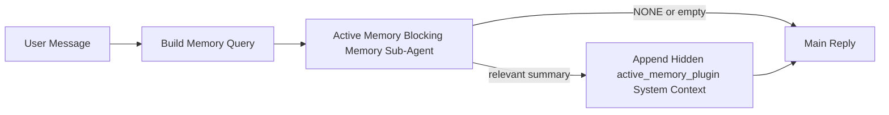

---
read_when:
    - Anda ingin memahami untuk apa memori aktif digunakan
    - Anda ingin mengaktifkan memori aktif untuk agen percakapan
    - Anda ingin menyesuaikan perilaku memori aktif tanpa mengaktifkannya di mana-mana
summary: Sub-agen memori pemblokir milik plugin yang menyuntikkan memori yang relevan ke dalam sesi chat interaktif
title: Memori Aktif
x-i18n:
    generated_at: "2026-04-10T09:13:15Z"
    model: gpt-5.4
    provider: openai
    source_hash: 6a51437df4ae4d9d57764601dfcfcdadb269e2895bf49dc82b9f496c1b3cb341
    source_path: concepts/active-memory.md
    workflow: 15
---

# Memori Aktif

Memori aktif adalah sub-agen memori pemblokir opsional milik plugin yang berjalan
sebelum balasan utama untuk sesi percakapan yang memenuhi syarat.

Fitur ini ada karena sebagian besar sistem memori mampu tetapi reaktif. Mereka bergantung pada
agen utama untuk memutuskan kapan mencari memori, atau pada pengguna untuk mengatakan hal-hal
seperti "ingat ini" atau "cari memori." Pada saat itu, momen ketika memori akan
membuat balasan terasa alami sudah terlewat.

Memori aktif memberi sistem satu kesempatan terbatas untuk memunculkan memori yang relevan
sebelum balasan utama dibuat.

## Tempelkan Ini Ke Dalam Agen Anda

Tempelkan ini ke dalam agen Anda jika Anda ingin mengaktifkan Memori Aktif dengan
pengaturan mandiri dan aman sebagai default:

```json5
{
  plugins: {
    entries: {
      "active-memory": {
        enabled: true,
        config: {
          enabled: true,
          agents: ["main"],
          allowedChatTypes: ["direct"],
          modelFallbackPolicy: "default-remote",
          queryMode: "recent",
          promptStyle: "balanced",
          timeoutMs: 15000,
          maxSummaryChars: 220,
          persistTranscripts: false,
          logging: true,
        },
      },
    },
  },
}
```

Ini mengaktifkan plugin untuk agen `main`, membuatnya tetap terbatas pada sesi
bergaya pesan langsung secara default, memungkinkannya mewarisi model sesi saat ini terlebih dahulu, dan
tetap mengizinkan fallback jarak jauh bawaan jika tidak ada model eksplisit atau turunan yang tersedia.

Setelah itu, mulai ulang gateway:

```bash
node scripts/run-node.mjs gateway --profile dev
```

Untuk memeriksanya secara langsung dalam percakapan:

```text
/verbose on
```

## Aktifkan memori aktif

Pengaturan yang paling aman adalah:

1. aktifkan plugin
2. targetkan satu agen percakapan
3. biarkan logging tetap aktif hanya saat menyesuaikan

Mulai dengan ini di `openclaw.json`:

```json5
{
  plugins: {
    entries: {
      "active-memory": {
        enabled: true,
        config: {
          agents: ["main"],
          allowedChatTypes: ["direct"],
          modelFallbackPolicy: "default-remote",
          queryMode: "recent",
          promptStyle: "balanced",
          timeoutMs: 15000,
          maxSummaryChars: 220,
          persistTranscripts: false,
          logging: true,
        },
      },
    },
  },
}
```

Lalu mulai ulang gateway:

```bash
node scripts/run-node.mjs gateway --profile dev
```

Artinya:

- `plugins.entries.active-memory.enabled: true` mengaktifkan plugin
- `config.agents: ["main"]` hanya mengikutsertakan agen `main` ke dalam memori aktif
- `config.allowedChatTypes: ["direct"]` membuat memori aktif tetap aktif hanya untuk sesi bergaya pesan langsung secara default
- jika `config.model` tidak disetel, memori aktif mewarisi model sesi saat ini terlebih dahulu
- `config.modelFallbackPolicy: "default-remote"` mempertahankan fallback jarak jauh bawaan sebagai default saat tidak ada model eksplisit atau turunan yang tersedia
- `config.promptStyle: "balanced"` menggunakan gaya prompt default serba guna untuk mode `recent`
- memori aktif tetap hanya berjalan pada sesi chat interaktif persisten yang memenuhi syarat

## Cara melihatnya

Memori aktif menyuntikkan konteks sistem tersembunyi untuk model. Fitur ini tidak mengekspos
tag mentah `<active_memory_plugin>...</active_memory_plugin>` kepada klien.

## Toggle sesi

Gunakan perintah plugin saat Anda ingin menjeda atau melanjutkan memori aktif untuk
sesi chat saat ini tanpa mengedit konfigurasi:

```text
/active-memory status
/active-memory off
/active-memory on
```

Ini berlaku pada cakupan sesi. Ini tidak mengubah
`plugins.entries.active-memory.enabled`, penargetan agen, atau konfigurasi
global lainnya.

Jika Anda ingin perintah tersebut menulis konfigurasi dan menjeda atau melanjutkan memori aktif untuk
semua sesi, gunakan bentuk global eksplisit:

```text
/active-memory status --global
/active-memory off --global
/active-memory on --global
```

Bentuk global menulis `plugins.entries.active-memory.config.enabled`. Bentuk ini membiarkan
`plugins.entries.active-memory.enabled` tetap aktif agar perintah tetap tersedia untuk
mengaktifkan kembali memori aktif nanti.

Jika Anda ingin melihat apa yang dilakukan memori aktif dalam sesi langsung, aktifkan mode verbose
untuk sesi tersebut:

```text
/verbose on
```

Dengan verbose diaktifkan, OpenClaw dapat menampilkan:

- baris status memori aktif seperti `Active Memory: ok 842ms recent 34 chars`
- ringkasan debug yang mudah dibaca seperti `Active Memory Debug: Lemon pepper wings with blue cheese.`

Baris-baris tersebut berasal dari pass memori aktif yang sama yang memberi makan konteks
sistem tersembunyi, tetapi diformat untuk manusia alih-alih mengekspos markup prompt mentah.

Secara default, transkrip sub-agen memori pemblokir bersifat sementara dan dihapus
setelah proses selesai.

Contoh alur:

```text
/verbose on
what wings should i order?
```

Bentuk balasan yang diharapkan terlihat:

```text
...normal assistant reply...

🧩 Active Memory: ok 842ms recent 34 chars
🔎 Active Memory Debug: Lemon pepper wings with blue cheese.
```

## Kapan fitur ini berjalan

Memori aktif menggunakan dua gerbang:

1. **Opt-in konfigurasi**
   Plugin harus diaktifkan, dan id agen saat ini harus muncul di
   `plugins.entries.active-memory.config.agents`.
2. **Kelayakan runtime yang ketat**
   Bahkan saat diaktifkan dan ditargetkan, memori aktif hanya berjalan untuk
   sesi chat interaktif persisten yang memenuhi syarat.

Aturan sebenarnya adalah:

```text
plugin enabled
+
agent id targeted
+
allowed chat type
+
eligible interactive persistent chat session
=
active memory runs
```

Jika salah satu dari ini gagal, memori aktif tidak berjalan.

## Jenis sesi

`config.allowedChatTypes` mengontrol jenis percakapan mana yang boleh menjalankan Memori
Aktif sama sekali.

Default-nya adalah:

```json5
allowedChatTypes: ["direct"]
```

Artinya Memori Aktif berjalan secara default dalam sesi bergaya pesan langsung, tetapi
tidak dalam sesi grup atau kanal kecuali Anda secara eksplisit mengikutsertakannya.

Contoh:

```json5
allowedChatTypes: ["direct"]
```

```json5
allowedChatTypes: ["direct", "group"]
```

```json5
allowedChatTypes: ["direct", "group", "channel"]
```

## Di mana fitur ini berjalan

Memori aktif adalah fitur pengayaan percakapan, bukan fitur inferensi
di seluruh platform.

| Surface                                                             | Menjalankan memori aktif?                               |
| ------------------------------------------------------------------- | ------------------------------------------------------ |
| Sesi persisten Control UI / chat web                                | Ya, jika plugin diaktifkan dan agen ditargetkan        |
| Sesi kanal interaktif lain pada jalur chat persisten yang sama      | Ya, jika plugin diaktifkan dan agen ditargetkan        |
| Proses sekali jalan headless                                        | Tidak                                                  |
| Proses heartbeat/latar belakang                                     | Tidak                                                  |
| Jalur internal `agent-command` generik                              | Tidak                                                  |
| Eksekusi sub-agen/helper internal                                   | Tidak                                                  |

## Mengapa menggunakannya

Gunakan memori aktif ketika:

- sesi bersifat persisten dan menghadap pengguna
- agen memiliki memori jangka panjang yang bermakna untuk dicari
- kontinuitas dan personalisasi lebih penting daripada determinisme prompt mentah

Fitur ini bekerja sangat baik untuk:

- preferensi yang stabil
- kebiasaan yang berulang
- konteks pengguna jangka panjang yang seharusnya muncul secara alami

Fitur ini kurang cocok untuk:

- otomasi
- worker internal
- tugas API sekali jalan
- tempat di mana personalisasi tersembunyi akan terasa mengejutkan

## Cara kerjanya

Bentuk runtime-nya adalah:



Sub-agen memori pemblokir hanya dapat menggunakan:

- `memory_search`
- `memory_get`

Jika koneksinya lemah, sub-agen harus mengembalikan `NONE`.

## Mode kueri

`config.queryMode` mengontrol seberapa banyak percakapan yang dilihat oleh sub-agen memori pemblokir.

## Gaya prompt

`config.promptStyle` mengontrol seberapa agresif atau ketat sub-agen memori pemblokir
saat memutuskan apakah akan mengembalikan memori.

Gaya yang tersedia:

- `balanced`: default serba guna untuk mode `recent`
- `strict`: paling tidak agresif; terbaik saat Anda ingin sangat sedikit kebocoran dari konteks di sekitar
- `contextual`: paling ramah kontinuitas; terbaik saat riwayat percakapan harus lebih diperhatikan
- `recall-heavy`: lebih bersedia memunculkan memori pada kecocokan yang lebih lemah tetapi masih masuk akal
- `precision-heavy`: secara agresif lebih memilih `NONE` kecuali kecocokannya jelas
- `preference-only`: dioptimalkan untuk favorit, kebiasaan, rutinitas, selera, dan fakta pribadi yang berulang

Pemetaan default saat `config.promptStyle` tidak disetel:

```text
message -> strict
recent -> balanced
full -> contextual
```

Jika Anda menyetel `config.promptStyle` secara eksplisit, override tersebut yang berlaku.

Contoh:

```json5
promptStyle: "preference-only"
```

## Kebijakan fallback model

Jika `config.model` tidak disetel, Memori Aktif mencoba menyelesaikan model dalam urutan ini:

```text
explicit plugin model
-> current session model
-> agent primary model
-> optional built-in remote fallback
```

`config.modelFallbackPolicy` mengontrol langkah terakhir.

Default:

```json5
modelFallbackPolicy: "default-remote"
```

Opsi lainnya:

```json5
modelFallbackPolicy: "resolved-only"
```

Gunakan `resolved-only` jika Anda ingin Memori Aktif melewati recall alih-alih melakukan
fallback ke default jarak jauh bawaan saat tidak ada model eksplisit atau turunan
yang tersedia.

## Jalur keluar lanjutan

Opsi-opsi ini sengaja tidak menjadi bagian dari pengaturan yang direkomendasikan.

`config.thinking` dapat menimpa level thinking sub-agen memori pemblokir:

```json5
thinking: "medium"
```

Default:

```json5
thinking: "off"
```

Jangan aktifkan ini secara default. Memori Aktif berjalan di jalur balasan, jadi waktu
thinking tambahan secara langsung meningkatkan latensi yang terlihat oleh pengguna.

`config.promptAppend` menambahkan instruksi operator tambahan setelah prompt default Memori
Aktif dan sebelum konteks percakapan:

```json5
promptAppend: "Prefer stable long-term preferences over one-off events."
```

`config.promptOverride` menggantikan prompt default Memori Aktif. OpenClaw
tetap menambahkan konteks percakapan setelahnya:

```json5
promptOverride: "You are a memory search agent. Return NONE or one compact user fact."
```

Kustomisasi prompt tidak direkomendasikan kecuali Anda memang sengaja menguji
kontrak recall yang berbeda. Prompt default disetel untuk mengembalikan `NONE`
atau konteks fakta pengguna yang ringkas untuk model utama.

### `message`

Hanya pesan pengguna terbaru yang dikirim.

```text
Latest user message only
```

Gunakan ini ketika:

- Anda menginginkan perilaku tercepat
- Anda menginginkan bias terkuat terhadap recall preferensi yang stabil
- giliran tindak lanjut tidak memerlukan konteks percakapan

Timeout yang direkomendasikan:

- mulai sekitar `3000` hingga `5000` md

### `recent`

Pesan pengguna terbaru plus sedikit ekor percakapan terbaru dikirim.

```text
Recent conversation tail:
user: ...
assistant: ...
user: ...

Latest user message:
...
```

Gunakan ini ketika:

- Anda menginginkan keseimbangan yang lebih baik antara kecepatan dan landasan percakapan
- pertanyaan tindak lanjut sering bergantung pada beberapa giliran terakhir

Timeout yang direkomendasikan:

- mulai sekitar `15000` md

### `full`

Percakapan lengkap dikirim ke sub-agen memori pemblokir.

```text
Full conversation context:
user: ...
assistant: ...
user: ...
...
```

Gunakan ini ketika:

- kualitas recall terkuat lebih penting daripada latensi
- percakapan berisi penyiapan penting yang jauh di belakang dalam utas

Timeout yang direkomendasikan:

- tingkatkan secara signifikan dibandingkan `message` atau `recent`
- mulai sekitar `15000` md atau lebih tinggi tergantung ukuran utas

Secara umum, timeout harus meningkat seiring ukuran konteks:

```text
message < recent < full
```

## Persistensi transkrip

Proses sub-agen memori pemblokir Memori Aktif membuat transkrip `session.jsonl` nyata
selama panggilan sub-agen memori pemblokir.

Secara default, transkrip tersebut bersifat sementara:

- ditulis ke direktori sementara
- hanya digunakan untuk proses sub-agen memori pemblokir
- langsung dihapus setelah proses selesai

Jika Anda ingin menyimpan transkrip sub-agen memori pemblokir tersebut di disk untuk debugging atau
pemeriksaan, aktifkan persistensi secara eksplisit:

```json5
{
  plugins: {
    entries: {
      "active-memory": {
        enabled: true,
        config: {
          agents: ["main"],
          persistTranscripts: true,
          transcriptDir: "active-memory",
        },
      },
    },
  },
}
```

Saat diaktifkan, memori aktif menyimpan transkrip di direktori terpisah di bawah
folder sesi agen target, bukan di jalur transkrip percakapan pengguna utama.

Tata letak default secara konseptual adalah:

```text
agents/<agent>/sessions/active-memory/<blocking-memory-sub-agent-session-id>.jsonl
```

Anda dapat mengubah subdirektori relatif dengan `config.transcriptDir`.

Gunakan ini dengan hati-hati:

- transkrip sub-agen memori pemblokir dapat cepat menumpuk pada sesi yang sibuk
- mode kueri `full` dapat menduplikasi banyak konteks percakapan
- transkrip ini berisi konteks prompt tersembunyi dan memori yang dipanggil kembali

## Konfigurasi

Semua konfigurasi memori aktif berada di bawah:

```text
plugins.entries.active-memory
```

Bidang yang paling penting adalah:

| Key                         | Type                                                                                                 | Arti                                                                                                   |
| --------------------------- | ---------------------------------------------------------------------------------------------------- | ------------------------------------------------------------------------------------------------------ |
| `enabled`                   | `boolean`                                                                                            | Mengaktifkan plugin itu sendiri                                                                         |
| `config.agents`             | `string[]`                                                                                           | Id agen yang dapat menggunakan memori aktif                                                             |
| `config.model`              | `string`                                                                                             | Referensi model sub-agen memori pemblokir opsional; jika tidak disetel, memori aktif menggunakan model sesi saat ini |
| `config.queryMode`          | `"message" \| "recent" \| "full"`                                                                    | Mengontrol seberapa banyak percakapan yang dilihat sub-agen memori pemblokir                           |
| `config.promptStyle`        | `"balanced" \| "strict" \| "contextual" \| "recall-heavy" \| "precision-heavy" \| "preference-only"` | Mengontrol seberapa agresif atau ketat sub-agen memori pemblokir saat memutuskan apakah akan mengembalikan memori |
| `config.thinking`           | `"off" \| "minimal" \| "low" \| "medium" \| "high" \| "xhigh" \| "adaptive"`                         | Override thinking lanjutan untuk sub-agen memori pemblokir; default `off` untuk kecepatan             |
| `config.promptOverride`     | `string`                                                                                             | Penggantian prompt penuh lanjutan; tidak direkomendasikan untuk penggunaan normal                       |
| `config.promptAppend`       | `string`                                                                                             | Instruksi tambahan lanjutan yang ditambahkan ke prompt default atau prompt yang dioverride             |
| `config.timeoutMs`          | `number`                                                                                             | Timeout keras untuk sub-agen memori pemblokir                                                           |
| `config.maxSummaryChars`    | `number`                                                                                             | Jumlah total karakter maksimum yang diizinkan dalam ringkasan active-memory                            |
| `config.logging`            | `boolean`                                                                                            | Mengeluarkan log memori aktif saat penyesuaian                                                          |
| `config.persistTranscripts` | `boolean`                                                                                            | Menyimpan transkrip sub-agen memori pemblokir di disk alih-alih menghapus file sementara               |
| `config.transcriptDir`      | `string`                                                                                             | Direktori relatif transkrip sub-agen memori pemblokir di bawah folder sesi agen                        |

Bidang penyesuaian yang berguna:

| Key                           | Type     | Arti                                                          |
| ----------------------------- | -------- | ------------------------------------------------------------- |
| `config.maxSummaryChars`      | `number` | Jumlah total karakter maksimum yang diizinkan dalam ringkasan active-memory |
| `config.recentUserTurns`      | `number` | Giliran pengguna sebelumnya yang disertakan saat `queryMode` adalah `recent` |
| `config.recentAssistantTurns` | `number` | Giliran asisten sebelumnya yang disertakan saat `queryMode` adalah `recent` |
| `config.recentUserChars`      | `number` | Karakter maksimum per giliran pengguna terbaru                |
| `config.recentAssistantChars` | `number` | Karakter maksimum per giliran asisten terbaru                 |
| `config.cacheTtlMs`           | `number` | Penggunaan ulang cache untuk kueri identik yang berulang      |

## Pengaturan yang direkomendasikan

Mulailah dengan `recent`.

```json5
{
  plugins: {
    entries: {
      "active-memory": {
        enabled: true,
        config: {
          agents: ["main"],
          queryMode: "recent",
          promptStyle: "balanced",
          timeoutMs: 15000,
          maxSummaryChars: 220,
          logging: true,
        },
      },
    },
  },
}
```

Jika Anda ingin memeriksa perilaku langsung saat menyesuaikan, gunakan `/verbose on` di
sesi tersebut alih-alih mencari perintah debug active-memory terpisah.

Lalu beralih ke:

- `message` jika Anda menginginkan latensi yang lebih rendah
- `full` jika Anda memutuskan bahwa konteks tambahan sepadan dengan sub-agen memori pemblokir yang lebih lambat

## Debugging

Jika memori aktif tidak muncul di tempat yang Anda harapkan:

1. Pastikan plugin diaktifkan di bawah `plugins.entries.active-memory.enabled`.
2. Pastikan id agen saat ini tercantum dalam `config.agents`.
3. Pastikan Anda menguji melalui sesi chat interaktif persisten.
4. Aktifkan `config.logging: true` dan pantau log gateway.
5. Verifikasi bahwa pencarian memori itu sendiri berfungsi dengan `openclaw memory status --deep`.

Jika hasil memori berisik, perketat:

- `maxSummaryChars`

Jika memori aktif terlalu lambat:

- turunkan `queryMode`
- turunkan `timeoutMs`
- kurangi jumlah giliran terbaru
- kurangi batas karakter per giliran

## Halaman terkait

- [Pencarian Memori](/id/concepts/memory-search)
- [Referensi konfigurasi memori](/id/reference/memory-config)
- [Penyiapan Plugin SDK](/id/plugins/sdk-setup)
