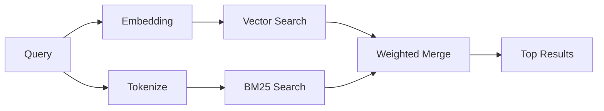

---
read_when:
    - Anda ingin memahami cara kerja memory_search
    - Anda ingin memilih provider embedding
    - Anda ingin menyesuaikan kualitas pencarian
summary: Bagaimana pencarian memori menemukan catatan yang relevan menggunakan embedding dan retrieval hibrida
title: Pencarian memori
x-i18n:
    generated_at: "2026-04-25T13:44:46Z"
    model: gpt-5.4
    provider: openai
    source_hash: 5cc6bbaf7b0a755bbe44d3b1b06eed7f437ebdc41a81c48cca64bd08bbc546b7
    source_path: concepts/memory-search.md
    workflow: 15
---

`memory_search` menemukan catatan yang relevan dari file memori Anda, bahkan ketika
susunan katanya berbeda dari teks aslinya. Ini bekerja dengan mengindeks memori ke dalam potongan-potongan kecil
dan mencarinya menggunakan embedding, kata kunci, atau keduanya.

## Mulai cepat

Jika Anda memiliki langganan GitHub Copilot, OpenAI, Gemini, Voyage, atau Mistral
API key yang dikonfigurasi, pencarian memori bekerja secara otomatis. Untuk menetapkan provider
secara eksplisit:

```json5
{
  agents: {
    defaults: {
      memorySearch: {
        provider: "openai", // atau "gemini", "local", "ollama", dll.
      },
    },
  },
}
```

Untuk embedding lokal tanpa API key, instal paket runtime opsional `node-llama-cpp`
di samping OpenClaw dan gunakan `provider: "local"`.

## Provider yang didukung

| Provider       | ID               | Perlu API key | Catatan                                             |
| -------------- | ---------------- | ------------- | --------------------------------------------------- |
| Bedrock        | `bedrock`        | No            | Terdeteksi otomatis saat rantai kredensial AWS terselesaikan |
| Gemini         | `gemini`         | Yes           | Mendukung pengindeksan gambar/audio                 |
| GitHub Copilot | `github-copilot` | No            | Terdeteksi otomatis, menggunakan langganan Copilot  |
| Local          | `local`          | No            | Model GGUF, unduhan ~0,6 GB                         |
| Mistral        | `mistral`        | Yes           | Terdeteksi otomatis                                 |
| Ollama         | `ollama`         | No            | Lokal, harus disetel secara eksplisit               |
| OpenAI         | `openai`         | Yes           | Terdeteksi otomatis, cepat                          |
| Voyage         | `voyage`         | Yes           | Terdeteksi otomatis                                 |

## Cara kerja pencarian

OpenClaw menjalankan dua jalur retrieval secara paralel dan menggabungkan hasilnya:



- **Pencarian vektor** menemukan catatan dengan makna yang serupa ("gateway host" cocok dengan
  "mesin yang menjalankan OpenClaw").
- **Pencarian kata kunci BM25** menemukan kecocokan yang persis (ID, string error, konfigurasi
  key).

Jika hanya satu jalur yang tersedia (tidak ada embedding atau tidak ada FTS), jalur lainnya berjalan sendiri.

Saat embedding tidak tersedia, OpenClaw tetap menggunakan pemeringkatan leksikal atas hasil FTS alih-alih hanya kembali ke pengurutan kecocokan persis mentah. Mode terdegradasi itu meningkatkan potongan dengan cakupan istilah kueri yang lebih kuat dan path file yang relevan, yang menjaga recall tetap berguna bahkan tanpa `sqlite-vec` atau provider embedding.

## Meningkatkan kualitas pencarian

Dua fitur opsional membantu ketika Anda memiliki riwayat catatan yang besar:

### Temporal decay

Catatan lama secara bertahap kehilangan bobot peringkat sehingga informasi terbaru muncul lebih dulu.
Dengan half-life default 30 hari, catatan dari bulan lalu mendapat skor 50% dari
bobot aslinya. File yang selalu relevan seperti `MEMORY.md` tidak pernah mengalami decay.

<Tip>
Aktifkan temporal decay jika agent Anda memiliki catatan harian selama berbulan-bulan dan
informasi usang terus mengungguli konteks terbaru.
</Tip>

### MMR (diversitas)

Mengurangi hasil yang redundan. Jika lima catatan semuanya menyebut konfigurasi router yang sama, MMR
memastikan hasil teratas mencakup topik yang berbeda alih-alih berulang.

<Tip>
Aktifkan MMR jika `memory_search` terus mengembalikan cuplikan yang hampir duplikat dari
catatan harian yang berbeda.
</Tip>

### Aktifkan keduanya

```json5
{
  agents: {
    defaults: {
      memorySearch: {
        query: {
          hybrid: {
            mmr: { enabled: true },
            temporalDecay: { enabled: true },
          },
        },
      },
    },
  },
}
```

## Memori multimodal

Dengan Gemini Embedding 2, Anda dapat mengindeks file gambar dan audio bersama
Markdown. Kueri pencarian tetap berupa teks, tetapi akan dicocokkan dengan konten visual dan audio. Lihat [referensi konfigurasi Memori](/id/reference/memory-config) untuk
penyiapan.

## Pencarian memori sesi

Anda dapat secara opsional mengindeks transkrip sesi sehingga `memory_search` dapat mengingat
percakapan sebelumnya. Ini bersifat opt-in melalui
`memorySearch.experimental.sessionMemory`. Lihat
[referensi konfigurasi](/id/reference/memory-config) untuk detailnya.

## Pemecahan masalah

**Tidak ada hasil?** Jalankan `openclaw memory status` untuk memeriksa indeks. Jika kosong, jalankan
`openclaw memory index --force`.

**Hanya kecocokan kata kunci?** Provider embedding Anda mungkin belum dikonfigurasi. Periksa
`openclaw memory status --deep`.

**Teks CJK tidak ditemukan?** Bangun ulang indeks FTS dengan
`openclaw memory index --force`.

## Bacaan lebih lanjut

- [Active Memory](/id/concepts/active-memory) -- memori sub-agent untuk sesi obrolan interaktif
- [Memori](/id/concepts/memory) -- tata letak file, backend, tool
- [Referensi konfigurasi memori](/id/reference/memory-config) -- semua knob konfigurasi

## Terkait

- [Ikhtisar memori](/id/concepts/memory)
- [Active Memory](/id/concepts/active-memory)
- [Mesin memori bawaan](/id/concepts/memory-builtin)
