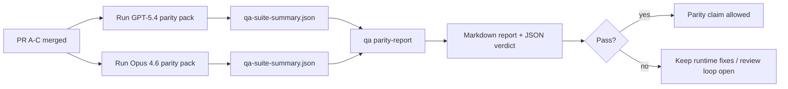

---
read_when:
    - Meninjau seri PR paritas GPT-5.4 / Codex
    - Memelihara arsitektur agentic enam-kontrak di balik program paritas
summary: Cara meninjau program paritas GPT-5.4 / Codex sebagai empat unit merge
title: Catatan Maintainer Paritas GPT-5.4 / Codex
x-i18n:
    generated_at: "2026-04-22T04:22:23Z"
    model: gpt-5.4
    provider: openai
    source_hash: b872d6a33b269c01b44537bfa8646329063298fdfcd3671a17d0eadbc9da5427
    source_path: help/gpt54-codex-agentic-parity-maintainers.md
    workflow: 15
---

# Catatan Maintainer Paritas GPT-5.4 / Codex

Catatan ini menjelaskan cara meninjau program paritas GPT-5.4 / Codex sebagai empat unit merge tanpa kehilangan arsitektur enam-kontrak aslinya.

## Unit merge

### PR A: eksekusi strict-agentic

Mencakup:

- `executionContract`
- tindak lanjut giliran yang sama dengan pendekatan GPT-5-first
- `update_plan` sebagai pelacakan progres non-terminal
- status terblokir eksplisit alih-alih berhenti diam-diam yang hanya berupa plan

Tidak mencakup:

- klasifikasi kegagalan auth/runtime
- truthfulness izin
- desain ulang replay/continuation
- benchmarking paritas

### PR B: truthfulness runtime

Mencakup:

- kebenaran scope OAuth Codex
- klasifikasi kegagalan provider/runtime yang bertipe
- ketersediaan `/elevated full` yang truthful dan alasan pemblokiran

Tidak mencakup:

- normalisasi schema tool
- status replay/liveness
- benchmark gating

### PR C: kebenaran eksekusi

Mencakup:

- kompatibilitas tool OpenAI/Codex yang dimiliki provider
- penanganan schema ketat tanpa parameter
- penampakan replay-invalid
- visibilitas status tugas panjang yang paused, blocked, dan abandoned

Tidak mencakup:

- continuation yang dipilih sendiri
- perilaku dialek Codex generik di luar hook provider
- benchmark gating

### PR D: harness paritas

Mencakup:

- paket skenario gelombang pertama GPT-5.4 vs Opus 4.6
- dokumentasi paritas
- laporan paritas dan mekanisme gerbang rilis

Tidak mencakup:

- perubahan perilaku runtime di luar QA-lab
- simulasi auth/proxy/DNS di dalam harness

## Pemetaan kembali ke enam kontrak asli

| Kontrak asli                             | Unit merge |
| ---------------------------------------- | ---------- |
| Kebenaran transport/auth provider        | PR B       |
| Kompatibilitas kontrak/schema tool       | PR C       |
| Eksekusi pada giliran yang sama          | PR A       |
| Truthfulness izin                        | PR B       |
| Kebenaran replay/continuation/liveness   | PR C       |
| Benchmark/gerbang rilis                  | PR D       |

## Urutan peninjauan

1. PR A
2. PR B
3. PR C
4. PR D

PR D adalah lapisan pembuktian. PR ini tidak boleh menjadi alasan PR kebenaran runtime tertunda.

## Hal yang perlu diperiksa

### PR A

- run GPT-5 bertindak atau gagal tertutup alih-alih berhenti pada komentar
- `update_plan` tidak lagi terlihat sebagai progres dengan sendirinya
- perilaku tetap GPT-5-first dan dibatasi pada embedded-Pi

### PR B

- kegagalan auth/proxy/runtime berhenti melebur menjadi penanganan generik “model failed”
- `/elevated full` hanya dijelaskan tersedia saat memang benar-benar tersedia
- alasan pemblokiran terlihat oleh model dan runtime yang berhadapan dengan pengguna

### PR C

- registrasi tool OpenAI/Codex yang ketat berperilaku dapat diprediksi
- tool tanpa parameter tidak gagal pada pemeriksaan schema ketat
- hasil replay dan Compaction mempertahankan status liveness yang truthful

### PR D

- paket skenario dapat dipahami dan direproduksi
- paket mencakup lane keamanan replay yang memutasi, bukan hanya alur read-only
- laporan dapat dibaca oleh manusia dan otomatisasi
- klaim paritas didukung bukti, bukan anekdotal

Artefak yang diharapkan dari PR D:

- `qa-suite-report.md` / `qa-suite-summary.json` untuk setiap run model
- `qa-agentic-parity-report.md` dengan perbandingan agregat dan tingkat skenario
- `qa-agentic-parity-summary.json` dengan verdict yang dapat dibaca mesin

## Gerbang rilis

Jangan klaim paritas atau superioritas GPT-5.4 atas Opus 4.6 sampai:

- PR A, PR B, dan PR C sudah di-merge
- PR D menjalankan paket paritas gelombang pertama dengan bersih
- suite regresi runtime-truthfulness tetap hijau
- laporan paritas tidak menunjukkan kasus sukses palsu dan tidak ada regresi pada perilaku berhenti

Harness paritas bukan satu-satunya sumber bukti. Pertahankan pemisahan ini secara eksplisit dalam peninjauan:

- PR D memiliki perbandingan berbasis skenario GPT-5.4 vs Opus 4.6
- suite deterministik PR B tetap memiliki bukti auth/proxy/DNS dan truthfulness akses penuh

## Peta tujuan ke bukti

| Item gerbang penyelesaian                | Pemilik utama | Artefak tinjauan                                                    |
| ---------------------------------------- | ------------- | ------------------------------------------------------------------- |
| Tidak ada macet hanya pada plan          | PR A          | pengujian runtime strict-agentic dan `approval-turn-tool-followthrough` |
| Tidak ada progres palsu atau penyelesaian tool palsu | PR A + PR D   | jumlah sukses palsu paritas ditambah detail laporan tingkat skenario |
| Tidak ada panduan `/elevated full` yang keliru | PR B          | suite runtime-truthfulness deterministik                            |
| Kegagalan replay/liveness tetap eksplisit | PR C + PR D   | suite lifecycle/replay ditambah `compaction-retry-mutating-tool`    |
| GPT-5.4 menyamai atau mengungguli Opus 4.6 | PR D          | `qa-agentic-parity-report.md` dan `qa-agentic-parity-summary.json`  |

## Singkatan reviewer: sebelum vs sesudah

| Masalah yang terlihat pengguna sebelumnya                 | Sinyal peninjauan sesudahnya                                                           |
| -------------------------------------------------------- | -------------------------------------------------------------------------------------- |
| GPT-5.4 berhenti setelah membuat plan                    | PR A menunjukkan perilaku bertindak-atau-terblokir alih-alih penyelesaian hanya komentar |
| Penggunaan tool terasa rapuh dengan schema OpenAI/Codex yang ketat | PR C menjaga registrasi tool dan pemanggilan tanpa parameter tetap dapat diprediksi     |
| Petunjuk `/elevated full` kadang menyesatkan             | PR B mengikat panduan ke kemampuan runtime aktual dan alasan pemblokiran               |
| Tugas panjang bisa hilang dalam ambiguitas replay/Compaction | PR C mengeluarkan status paused, blocked, abandoned, dan replay-invalid yang eksplisit |
| Klaim paritas bersifat anekdotal                         | PR D menghasilkan laporan plus verdict JSON dengan cakupan skenario yang sama pada kedua model |
