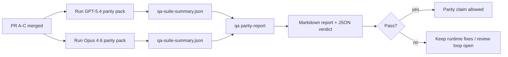

---
read_when:
    - Meninjau rangkaian PR paritas GPT-5.4 / Codex
    - Memelihara arsitektur agentic enam-kontrak di balik program paritas
summary: Cara meninjau program paritas GPT-5.4 / Codex sebagai empat unit merge
title: Catatan maintainer paritas GPT-5.4 / Codex
x-i18n:
    generated_at: "2026-04-25T13:48:21Z"
    model: gpt-5.4
    provider: openai
    source_hash: 162ea68476880d4dbf9b8c3b9397a51a2732c3eb10ac52e421a9c9d90e04eec2
    source_path: help/gpt54-codex-agentic-parity-maintainers.md
    workflow: 15
---

Catatan ini menjelaskan cara meninjau program paritas GPT-5.4 / Codex sebagai empat unit merge tanpa kehilangan arsitektur enam-kontrak aslinya.

## Unit merge

### PR A: eksekusi strict-agentic

Memiliki:

- `executionContract`
- tindak lanjut same-turn dengan GPT-5 sebagai yang utama
- `update_plan` sebagai pelacakan progres non-terminal
- status blocked yang eksplisit alih-alih berhenti diam-diam yang hanya berupa rencana

Tidak memiliki:

- klasifikasi kegagalan auth/runtime
- truthfulness izin
- desain ulang replay/continuation
- benchmarking paritas

### PR B: runtime truthfulness

Memiliki:

- kebenaran cakupan OAuth Codex
- klasifikasi kegagalan provider/runtime bertipe
- ketersediaan `/elevated full` yang jujur dan alasan blocked

Tidak memiliki:

- normalisasi skema alat
- status replay/liveness
- benchmark gating

### PR C: kebenaran eksekusi

Memiliki:

- kompatibilitas alat OpenAI/Codex milik provider
- penanganan skema ketat tanpa parameter
- penampakan replay-invalid
- visibilitas status paused, blocked, dan abandoned untuk tugas panjang

Tidak memiliki:

- continuation yang dipilih sendiri
- perilaku dialek Codex generik di luar hook provider
- benchmark gating

### PR D: harness paritas

Memiliki:

- paket skenario gelombang pertama GPT-5.4 vs Opus 4.6
- dokumentasi paritas
- mekanisme laporan paritas dan gerbang rilis

Tidak memiliki:

- perubahan perilaku runtime di luar QA-lab
- simulasi auth/proxy/DNS di dalam harness

## Pemetaan kembali ke enam kontrak asli

| Kontrak asli                              | Unit merge |
| ----------------------------------------- | ---------- |
| Kebenaran transport/auth provider         | PR B       |
| Kompatibilitas kontrak/skema alat         | PR C       |
| Eksekusi same-turn                        | PR A       |
| Truthfulness izin                         | PR B       |
| Kebenaran replay/continuation/liveness    | PR C       |
| Benchmark/gerbang rilis                   | PR D       |

## Urutan peninjauan

1. PR A
2. PR B
3. PR C
4. PR D

PR D adalah lapisan pembuktian. PR ini tidak seharusnya menjadi alasan PR kebenaran runtime tertunda.

## Apa yang perlu diperhatikan

### PR A

- Run GPT-5 bertindak atau gagal tertutup alih-alih berhenti pada komentar
- `update_plan` tidak lagi tampak sebagai progres dengan sendirinya
- perilaku tetap GPT-5-first dan dicakup ke embedded-Pi

### PR B

- kegagalan auth/proxy/runtime berhenti runtuh menjadi penanganan generik “model failed”
- `/elevated full` hanya dijelaskan sebagai tersedia saat memang benar-benar tersedia
- alasan blocked terlihat oleh model dan runtime yang menghadap pengguna

### PR C

- registrasi alat OpenAI/Codex ketat berperilaku secara dapat diprediksi
- alat tanpa parameter tidak gagal pada pemeriksaan skema ketat
- hasil replay dan Compaction mempertahankan status liveness yang jujur

### PR D

- paket skenario dapat dipahami dan direproduksi
- paket mencakup lane mutating replay-safety, bukan hanya alur read-only
- laporan dapat dibaca oleh manusia dan otomatisasi
- klaim paritas didukung bukti, bukan anekdot

Artefak yang diharapkan dari PR D:

- `qa-suite-report.md` / `qa-suite-summary.json` untuk setiap run model
- `qa-agentic-parity-report.md` dengan perbandingan agregat dan tingkat skenario
- `qa-agentic-parity-summary.json` dengan verdict yang dapat dibaca mesin

## Gerbang rilis

Jangan mengklaim paritas atau superioritas GPT-5.4 atas Opus 4.6 sampai:

- PR A, PR B, dan PR C telah di-merge
- PR D menjalankan paket paritas gelombang pertama dengan bersih
- suite regresi runtime-truthfulness tetap hijau
- laporan paritas tidak menunjukkan kasus fake-success dan tidak ada regresi pada perilaku berhenti

Harness paritas bukan satu-satunya sumber bukti. Pertahankan pemisahan ini tetap eksplisit dalam peninjauan:

- PR D memiliki perbandingan GPT-5.4 vs Opus 4.6 berbasis skenario
- suite deterministik PR B tetap memiliki bukti auth/proxy/DNS dan truthfulness full-access

## Alur merge maintainer cepat

Gunakan ini saat Anda siap melandaskan PR paritas dan menginginkan urutan yang dapat diulang dengan risiko rendah.

1. Konfirmasi bahwa standar bukti terpenuhi sebelum merge:
   - gejala yang dapat direproduksi atau test yang gagal
   - akar masalah yang terverifikasi dalam kode yang disentuh
   - perbaikan pada jalur yang terlibat
   - test regresi atau catatan verifikasi manual yang eksplisit
2. Triase/beri label sebelum merge:
   - terapkan label auto-close `r:*` bila PR tidak seharusnya dilandaskan
   - jaga kandidat merge bebas dari thread blocker yang belum terselesaikan
3. Validasi secara lokal pada permukaan yang disentuh:
   - `pnpm check:changed`
   - `pnpm test:changed` ketika test berubah atau keyakinan perbaikan bug bergantung pada cakupan test
4. Landaskan dengan alur maintainer standar (proses `/landpr`), lalu verifikasi:
   - perilaku auto-close issue yang ditautkan
   - status CI dan pasca-merge di `main`
5. Setelah landing, jalankan pencarian duplikat untuk PR/issue terbuka terkait dan tutup hanya dengan referensi kanonis.

Jika salah satu item standar bukti tidak ada, minta perubahan alih-alih melakukan merge.

## Peta tujuan-ke-bukti

| Item gerbang penyelesaian                 | Pemilik utama | Artefak peninjauan                                                |
| ----------------------------------------- | ------------- | ----------------------------------------------------------------- |
| Tidak ada macet hanya-rencana             | PR A          | test runtime strict-agentic dan `approval-turn-tool-followthrough` |
| Tidak ada progres palsu atau penyelesaian alat palsu | PR A + PR D   | jumlah fake-success paritas ditambah detail laporan tingkat skenario |
| Tidak ada panduan `/elevated full` palsu  | PR B          | suite runtime-truthfulness deterministik                          |
| Kegagalan replay/liveness tetap eksplisit | PR C + PR D   | suite lifecycle/replay ditambah `compaction-retry-mutating-tool`  |
| GPT-5.4 menyamai atau mengungguli Opus 4.6 | PR D         | `qa-agentic-parity-report.md` dan `qa-agentic-parity-summary.json` |

## Singkatan untuk reviewer: sebelum vs sesudah

| Masalah yang terlihat pengguna sebelumnya                      | Sinyal peninjauan sesudahnya                                                              |
| -------------------------------------------------------------- | ------------------------------------------------------------------------------------------ |
| GPT-5.4 berhenti setelah membuat rencana                       | PR A menunjukkan perilaku bertindak-atau-block alih-alih penyelesaian yang hanya komentar |
| Penggunaan alat terasa rapuh dengan skema OpenAI/Codex ketat   | PR C menjaga registrasi alat dan pemanggilan tanpa parameter tetap dapat diprediksi       |
| Petunjuk `/elevated full` terkadang menyesatkan                | PR B mengikat panduan ke kemampuan runtime nyata dan alasan blocked                       |
| Tugas panjang dapat hilang ke dalam ambiguitas replay/Compaction | PR C mengeluarkan status paused, blocked, abandoned, dan replay-invalid yang eksplisit   |
| Klaim paritas bersifat anekdot                                 | PR D menghasilkan laporan ditambah verdict JSON dengan cakupan skenario yang sama pada kedua model |

## Terkait

- [Paritas agentic GPT-5.4 / Codex](/id/help/gpt54-codex-agentic-parity)
