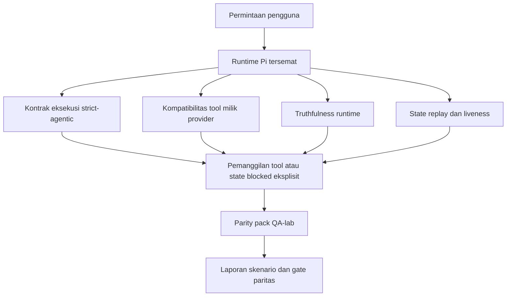
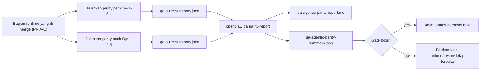

---
read_when:
    - Men-debug perilaku agent GPT-5.4 atau Codex
    - Membandingkan perilaku agentik OpenClaw di berbagai model frontier
    - Meninjau perbaikan strict-agentic, tool-schema, elevation, dan replay
summary: Bagaimana OpenClaw menutup kesenjangan eksekusi agentik untuk GPT-5.4 dan model bergaya Codex
title: Paritas Agentik GPT-5.4 / Codex
x-i18n:
    generated_at: "2026-04-22T04:22:26Z"
    model: gpt-5.4
    provider: openai
    source_hash: 77bc9b8fab289bd35185fa246113503b3f5c94a22bd44739be07d39ae6779056
    source_path: help/gpt54-codex-agentic-parity.md
    workflow: 15
---

# Paritas Agentik GPT-5.4 / Codex di OpenClaw

OpenClaw sudah bekerja dengan baik dengan model frontier yang menggunakan tool, tetapi model bergaya GPT-5.4 dan Codex masih kurang optimal dalam beberapa hal praktis:

- model dapat berhenti setelah membuat rencana alih-alih melakukan pekerjaan
- model dapat menggunakan skema tool OpenAI/Codex yang strict secara keliru
- model dapat meminta `/elevated full` meskipun akses penuh tidak mungkin
- model dapat kehilangan state tugas berjalan lama selama replay atau Compaction
- klaim paritas terhadap Claude Opus 4.6 didasarkan pada anekdot, bukan skenario yang dapat diulang

Program paritas ini menutup kesenjangan tersebut dalam empat bagian yang dapat ditinjau.

## Apa yang berubah

### PR A: eksekusi strict-agentic

Bagian ini menambahkan kontrak eksekusi `strict-agentic` opt-in untuk run GPT-5 Pi tersemat.

Saat diaktifkan, OpenClaw berhenti menerima giliran hanya-berisi-rencana sebagai penyelesaian yang “cukup baik”. Jika model hanya mengatakan apa yang ingin dilakukannya dan tidak benar-benar menggunakan tool atau membuat kemajuan, OpenClaw akan mencoba lagi dengan arahan act-now lalu gagal secara tertutup dengan state blocked yang eksplisit alih-alih diam-diam mengakhiri tugas.

Ini paling meningkatkan pengalaman GPT-5.4 pada:

- tindak lanjut singkat “ok lakukan”
- tugas kode di mana langkah pertama sudah jelas
- alur di mana `update_plan` seharusnya menjadi pelacakan kemajuan, bukan teks pengisi

### PR B: truthfulness runtime

Bagian ini membuat OpenClaw jujur tentang dua hal:

- mengapa panggilan provider/runtime gagal
- apakah `/elevated full` benar-benar tersedia

Artinya GPT-5.4 mendapatkan sinyal runtime yang lebih baik untuk scope yang hilang, kegagalan refresh auth, kegagalan auth HTML 403, masalah proxy, kegagalan DNS atau timeout, dan mode akses penuh yang diblokir. Model jadi lebih kecil kemungkinannya berhalusinasi remediasi yang salah atau terus meminta mode izin yang tidak dapat disediakan runtime.

### PR C: correctness eksekusi

Bagian ini meningkatkan dua jenis correctness:

- kompatibilitas skema tool OpenAI/Codex milik provider
- visibilitas replay dan liveness tugas panjang

Pekerjaan kompatibilitas tool mengurangi friksi skema untuk pendaftaran tool OpenAI/Codex strict, terutama di sekitar tool tanpa parameter dan ekspektasi root objek strict. Pekerjaan replay/liveness membuat tugas yang berjalan lama lebih dapat diamati, sehingga state paused, blocked, dan abandoned terlihat alih-alih hilang ke dalam teks kegagalan generik.

### PR D: harness paritas

Bagian ini menambahkan parity pack QA-lab gelombang pertama agar GPT-5.4 dan Opus 4.6 dapat diuji melalui skenario yang sama dan dibandingkan menggunakan bukti bersama.

Parity pack adalah lapisan pembuktian. Ini tidak mengubah perilaku runtime dengan sendirinya.

Setelah Anda memiliki dua artifact `qa-suite-summary.json`, hasilkan perbandingan gate rilis dengan:

```bash
pnpm openclaw qa parity-report \
  --repo-root . \
  --candidate-summary .artifacts/qa-e2e/gpt54/qa-suite-summary.json \
  --baseline-summary .artifacts/qa-e2e/opus46/qa-suite-summary.json \
  --output-dir .artifacts/qa-e2e/parity
```

Perintah itu menulis:

- laporan Markdown yang dapat dibaca manusia
- verdict JSON yang dapat dibaca mesin
- hasil gate `pass` / `fail` yang eksplisit

## Mengapa ini meningkatkan GPT-5.4 dalam praktik

Sebelum pekerjaan ini, GPT-5.4 di OpenClaw bisa terasa kurang agentik dibanding Opus dalam sesi coding nyata karena runtime mentoleransi perilaku yang sangat merugikan khususnya untuk model gaya GPT-5:

- giliran yang hanya berisi komentar
- friksi skema di sekitar tool
- umpan balik izin yang samar
- kerusakan replay atau Compaction yang diam-diam

Tujuannya bukan membuat GPT-5.4 meniru Opus. Tujuannya adalah memberi GPT-5.4 kontrak runtime yang menghargai kemajuan nyata, menyediakan semantik tool dan izin yang lebih bersih, dan mengubah mode kegagalan menjadi state yang eksplisit serta dapat dibaca mesin maupun manusia.

Itu mengubah pengalaman pengguna dari:

- “model punya rencana bagus tetapi berhenti”

menjadi:

- “model entah bertindak, atau OpenClaw menampilkan alasan persis mengapa model tidak bisa”

## Sebelum vs sesudah untuk pengguna GPT-5.4

| Sebelum program ini                                                                        | Setelah PR A-D                                                                       |
| ------------------------------------------------------------------------------------------ | ------------------------------------------------------------------------------------ |
| GPT-5.4 dapat berhenti setelah rencana yang masuk akal tanpa mengambil langkah tool berikutnya | PR A mengubah “hanya rencana” menjadi “bertindak sekarang atau tampilkan state blocked” |
| Skema tool strict dapat menolak tool tanpa parameter atau berbentuk OpenAI/Codex dengan cara yang membingungkan | PR C membuat pendaftaran dan pemanggilan tool milik provider lebih dapat diprediksi |
| Panduan `/elevated full` bisa samar atau salah di runtime yang diblokir                    | PR B memberi GPT-5.4 dan pengguna petunjuk runtime serta izin yang jujur            |
| Kegagalan replay atau Compaction bisa terasa seperti tugas diam-diam menghilang            | PR C menampilkan hasil paused, blocked, abandoned, dan replay-invalid secara eksplisit |
| “GPT-5.4 terasa lebih buruk daripada Opus” sebagian besar hanya anekdot                    | PR D mengubahnya menjadi parity pack skenario yang sama, metrik yang sama, dan gate pass/fail yang tegas |

## Arsitektur



## Alur rilis



## Pack skenario

Parity pack gelombang pertama saat ini mencakup lima skenario:

### `approval-turn-tool-followthrough`

Memeriksa bahwa model tidak berhenti pada “Saya akan melakukannya” setelah persetujuan singkat. Model seharusnya mengambil tindakan konkret pertama pada giliran yang sama.

### `model-switch-tool-continuity`

Memeriksa bahwa pekerjaan yang menggunakan tool tetap koheren di seluruh batas perpindahan model/runtime alih-alih reset menjadi komentar atau kehilangan konteks eksekusi.

### `source-docs-discovery-report`

Memeriksa bahwa model dapat membaca source dan docs, menyintesis temuan, dan melanjutkan tugas secara agentik alih-alih menghasilkan ringkasan tipis lalu berhenti terlalu cepat.

### `image-understanding-attachment`

Memeriksa bahwa tugas mode campuran yang melibatkan lampiran tetap dapat ditindaklanjuti dan tidak runtuh menjadi narasi yang samar.

### `compaction-retry-mutating-tool`

Memeriksa bahwa tugas dengan penulisan mutatif nyata tetap menampilkan replay-unsafety secara eksplisit alih-alih diam-diam tampak replay-safe jika run mengalami Compaction, retry, atau kehilangan state balasan di bawah tekanan.

## Matriks skenario

| Skenario                           | Apa yang diuji                            | Perilaku GPT-5.4 yang baik                                                      | Sinyal kegagalan                                                                   |
| ---------------------------------- | ----------------------------------------- | -------------------------------------------------------------------------------- | ---------------------------------------------------------------------------------- |
| `approval-turn-tool-followthrough` | Giliran persetujuan singkat setelah rencana | Memulai tindakan tool konkret pertama segera alih-alih mengulang niat           | tindak lanjut hanya-rencana, tidak ada aktivitas tool, atau giliran blocked tanpa blocker nyata |
| `model-switch-tool-continuity`     | Perpindahan runtime/model saat tool digunakan | Mempertahankan konteks tugas dan terus bertindak secara koheren                 | reset menjadi komentar, kehilangan konteks tool, atau berhenti setelah switch     |
| `source-docs-discovery-report`     | Pembacaan source + sintesis + tindakan     | Menemukan source, menggunakan tool, dan menghasilkan laporan yang berguna tanpa macet | ringkasan tipis, pekerjaan tool hilang, atau berhenti di giliran yang belum selesai |
| `image-understanding-attachment`   | Pekerjaan agentik berbasis lampiran        | Menafsirkan lampiran, menghubungkannya ke tool, dan melanjutkan tugas           | narasi samar, lampiran diabaikan, atau tidak ada tindakan konkret berikutnya      |
| `compaction-retry-mutating-tool`   | Pekerjaan mutatif di bawah tekanan Compaction | Melakukan penulisan nyata dan menjaga replay-unsafety tetap eksplisit setelah efek samping | penulisan mutatif terjadi tetapi keamanan replay terkesan aman, hilang, atau kontradiktif |

## Gate rilis

GPT-5.4 hanya dapat dianggap setara atau lebih baik bila runtime yang telah di-merge lolos parity pack dan regresi truthfulness runtime pada saat yang sama.

Hasil yang diwajibkan:

- tidak ada macet hanya-karena-rencana saat tindakan tool berikutnya sudah jelas
- tidak ada penyelesaian palsu tanpa eksekusi nyata
- tidak ada panduan `/elevated full` yang salah
- tidak ada pengabaian replay atau Compaction yang diam-diam
- metrik parity pack yang setidaknya sekuat baseline Opus 4.6 yang disepakati

Untuk harness gelombang pertama, gate membandingkan:

- tingkat penyelesaian
- tingkat berhenti tak disengaja
- tingkat pemanggilan tool valid
- jumlah fake-success

Bukti paritas sengaja dibagi ke dua lapisan:

- PR D membuktikan perilaku GPT-5.4 vs Opus 4.6 pada skenario yang sama dengan QA-lab
- suite deterministik PR B membuktikan truthfulness auth, proxy, DNS, dan `/elevated full` di luar harness

## Matriks goal-to-evidence

| Item gate penyelesaian                                 | PR pemilik   | Sumber bukti                                                       | Sinyal lolos                                                                              |
| ------------------------------------------------------ | ------------ | ------------------------------------------------------------------ | ----------------------------------------------------------------------------------------- |
| GPT-5.4 tidak lagi macet setelah membuat rencana       | PR A         | `approval-turn-tool-followthrough` plus suite runtime PR A         | giliran persetujuan memicu pekerjaan nyata atau state blocked yang eksplisit              |
| GPT-5.4 tidak lagi memalsukan kemajuan atau penyelesaian tool palsu | PR A + PR D  | hasil skenario laporan paritas dan jumlah fake-success             | tidak ada hasil lolos yang mencurigakan dan tidak ada penyelesaian yang hanya berisi komentar |
| GPT-5.4 tidak lagi memberi panduan `/elevated full` yang salah | PR B         | suite truthfulness deterministik                                   | alasan blocked dan petunjuk akses penuh tetap akurat terhadap runtime                     |
| Kegagalan replay/liveness tetap eksplisit              | PR C + PR D  | suite lifecycle/replay PR C plus `compaction-retry-mutating-tool`  | pekerjaan mutatif menjaga replay-unsafety tetap eksplisit alih-alih diam-diam menghilang |
| GPT-5.4 menyamai atau melampaui Opus 4.6 pada metrik yang disepakati | PR D         | `qa-agentic-parity-report.md` dan `qa-agentic-parity-summary.json` | cakupan skenario yang sama dan tidak ada regresi pada penyelesaian, perilaku berhenti, atau penggunaan tool valid |

## Cara membaca verdict paritas

Gunakan verdict di `qa-agentic-parity-summary.json` sebagai keputusan akhir yang dapat dibaca mesin untuk parity pack gelombang pertama.

- `pass` berarti GPT-5.4 mencakup skenario yang sama seperti Opus 4.6 dan tidak mengalami regresi pada metrik agregat yang disepakati.
- `fail` berarti setidaknya satu hard gate terpicu: penyelesaian lebih lemah, unintended stop lebih buruk, penggunaan tool valid lebih lemah, ada kasus fake-success, atau cakupan skenario tidak cocok.
- “shared/base CI issue” sendiri bukan hasil paritas. Jika noise CI di luar PR D memblokir sebuah run, verdict harus menunggu eksekusi merged-runtime yang bersih alih-alih disimpulkan dari log era branch.
- Truthfulness auth, proxy, DNS, dan `/elevated full` tetap berasal dari suite deterministik PR B, jadi klaim rilis akhir memerlukan keduanya: verdict paritas PR D yang lolos dan cakupan truthfulness PR B yang hijau.

## Siapa yang sebaiknya mengaktifkan `strict-agentic`

Gunakan `strict-agentic` ketika:

- agent diharapkan langsung bertindak saat langkah berikutnya sudah jelas
- model keluarga GPT-5.4 atau Codex menjadi runtime utama
- Anda lebih memilih state blocked yang eksplisit daripada balasan yang hanya berupa rangkuman “membantu”

Pertahankan kontrak default ketika:

- Anda menginginkan perilaku lama yang lebih longgar
- Anda tidak menggunakan model keluarga GPT-5
- Anda sedang menguji prompt, bukan enforcement runtime
