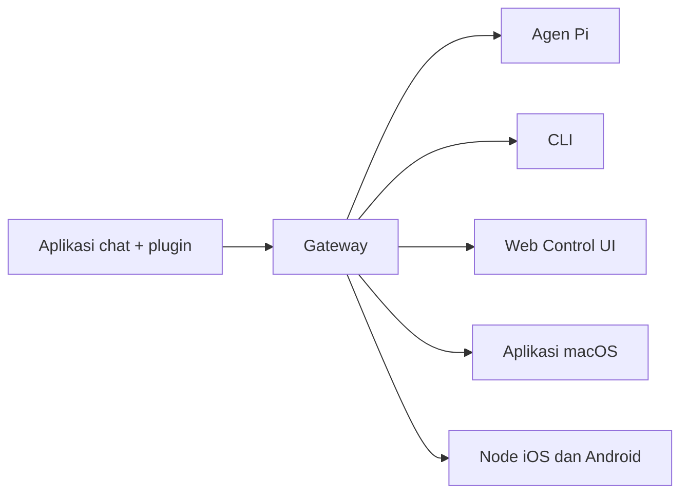

---
read_when:
    - Memperkenalkan OpenClaw kepada pendatang baru
summary: OpenClaw adalah Gateway multi-channel untuk agen AI yang berjalan di sistem operasi apa pun.
title: OpenClaw
x-i18n:
    generated_at: "2026-04-22T04:22:46Z"
    model: gpt-5.4
    provider: openai
    source_hash: 923d34fa604051d502e4bc902802d6921a4b89a9447f76123aa8d2ff085f0b99
    source_path: index.md
    workflow: 15
---

# OpenClaw 🦞

<p align="center">
    
    
</p>

> _"EXFOLIATE! EXFOLIATE!"_ — Seekor lobster luar angkasa, mungkin

<p align="center">
  <strong>Gateway lintas sistem operasi untuk agen AI di Discord, Google Chat, iMessage, Matrix, Microsoft Teams, Signal, Slack, Telegram, WhatsApp, Zalo, dan lainnya.</strong><br />
  Kirim pesan, dapatkan respons agen dari saku Anda. Jalankan satu Gateway di berbagai channel bawaan, plugin channel bawaan, WebChat, dan Node seluler.
</p>

<Columns>
  <Card title="Get Started" href="/id/start/getting-started" icon="rocket">
    Instal OpenClaw dan jalankan Gateway dalam hitungan menit.
  </Card>
  <Card title="Run Onboarding" href="/id/start/wizard" icon="sparkles">
    Penyiapan terpandu dengan `openclaw onboard` dan alur pairing.
  </Card>
  <Card title="Open the Control UI" href="/web/control-ui" icon="layout-dashboard">
    Buka dasbor browser untuk chat, config, dan sesi.
  </Card>
</Columns>

## Apa itu OpenClaw?

OpenClaw adalah **Gateway self-hosted** yang menghubungkan aplikasi chat dan permukaan channel favorit Anda — channel bawaan plus plugin channel bawaan atau eksternal seperti Discord, Google Chat, iMessage, Matrix, Microsoft Teams, Signal, Slack, Telegram, WhatsApp, Zalo, dan lainnya — ke agen coding AI seperti Pi. Anda menjalankan satu proses Gateway di mesin Anda sendiri (atau server), dan proses itu menjadi jembatan antara aplikasi perpesanan Anda dan asisten AI yang selalu tersedia.

**Untuk siapa ini?** Developer dan power user yang menginginkan asisten AI pribadi yang bisa mereka kirimi pesan dari mana saja — tanpa kehilangan kendali atas data mereka atau bergantung pada layanan ter-host.

**Apa yang membuatnya berbeda?**

- **Self-hosted**: berjalan di perangkat keras Anda, aturan Anda
- **Multi-channel**: satu Gateway melayani channel bawaan plus plugin channel bawaan atau eksternal secara bersamaan
- **Native untuk agen**: dibangun untuk agen coding dengan penggunaan tool, sesi, memori, dan perutean multi-agen
- **Open source**: berlisensi MIT, digerakkan oleh komunitas

**Apa yang Anda perlukan?** Node 24 (disarankan), atau Node 22 LTS (`22.14+`) untuk kompatibilitas, API key dari provider pilihan Anda, dan 5 menit. Untuk kualitas dan keamanan terbaik, gunakan model generasi terbaru terkuat yang tersedia.

## Cara kerjanya



Gateway adalah sumber kebenaran tunggal untuk sesi, perutean, dan koneksi channel.

## Kemampuan utama

<Columns>
  <Card title="Multi-channel gateway" icon="network" href="/id/channels">
    Discord, iMessage, Signal, Slack, Telegram, WhatsApp, WebChat, dan lainnya dengan satu proses Gateway.
  </Card>
  <Card title="Plugin channels" icon="plug" href="/id/tools/plugin">
    Plugin bawaan menambahkan Matrix, Nostr, Twitch, Zalo, dan lainnya dalam rilis normal saat ini.
  </Card>
  <Card title="Multi-agent routing" icon="route" href="/id/concepts/multi-agent">
    Sesi terisolasi per agen, workspace, atau pengirim.
  </Card>
  <Card title="Media support" icon="image" href="/id/nodes/images">
    Kirim dan terima gambar, audio, dan dokumen.
  </Card>
  <Card title="Web Control UI" icon="monitor" href="/web/control-ui">
    Dasbor browser untuk chat, config, sesi, dan Node.
  </Card>
  <Card title="Mobile nodes" icon="smartphone" href="/id/nodes">
    Pairing Node iOS dan Android untuk alur kerja Canvas, kamera, dan voice.
  </Card>
</Columns>

## Mulai cepat

<Steps>
  <Step title="Install OpenClaw">
    ```bash
    npm install -g openclaw@latest
    ```
  </Step>
  <Step title="Onboard and install the service">
    ```bash
    openclaw onboard --install-daemon
    ```
  </Step>
  <Step title="Chat">
    Buka Control UI di browser Anda lalu kirim pesan:

    ```bash
    openclaw dashboard
    ```

    Atau hubungkan sebuah channel ([Telegram](/id/channels/telegram) adalah yang tercepat) lalu chat dari ponsel Anda.

  </Step>
</Steps>

Perlu penyiapan instalasi dan pengembangan lengkap? Lihat [Getting Started](/id/start/getting-started).

## Dasbor

Buka Control UI di browser setelah Gateway dimulai.

- Default lokal: [http://127.0.0.1:18789/](http://127.0.0.1:18789/)
- Akses remote: [Web surfaces](/web) dan [Tailscale](/id/gateway/tailscale)

<p align="center">
  
</p>

## Konfigurasi (opsional)

Config berada di `~/.openclaw/openclaw.json`.

- Jika Anda **tidak melakukan apa pun**, OpenClaw menggunakan biner Pi bawaan dalam mode RPC dengan sesi per pengirim.
- Jika Anda ingin menguncinya, mulai dari `channels.whatsapp.allowFrom` dan aturan mention (untuk grup).

Contoh:

```json5
{
  channels: {
    whatsapp: {
      allowFrom: ["+15555550123"],
      groups: { "*": { requireMention: true } },
    },
  },
  messages: { groupChat: { mentionPatterns: ["@openclaw"] } },
}
```

## Mulai dari sini

<Columns>
  <Card title="Docs hubs" href="/id/start/hubs" icon="book-open">
    Semua dokumen dan panduan, diatur berdasarkan kasus penggunaan.
  </Card>
  <Card title="Configuration" href="/id/gateway/configuration" icon="settings">
    Pengaturan inti Gateway, token, dan config provider.
  </Card>
  <Card title="Remote access" href="/id/gateway/remote" icon="globe">
    Pola akses SSH dan tailnet.
  </Card>
  <Card title="Channels" href="/id/channels/telegram" icon="message-square">
    Penyiapan khusus channel untuk Feishu, Microsoft Teams, WhatsApp, Telegram, Discord, dan lainnya.
  </Card>
  <Card title="Nodes" href="/id/nodes" icon="smartphone">
    Node iOS dan Android dengan pairing, Canvas, kamera, dan aksi perangkat.
  </Card>
  <Card title="Help" href="/id/help" icon="life-buoy">
    Perbaikan umum dan titik masuk pemecahan masalah.
  </Card>
</Columns>

## Pelajari lebih lanjut

<Columns>
  <Card title="Full feature list" href="/id/concepts/features" icon="list">
    Kemampuan lengkap channel, perutean, dan media.
  </Card>
  <Card title="Multi-agent routing" href="/id/concepts/multi-agent" icon="route">
    Isolasi workspace dan sesi per agen.
  </Card>
  <Card title="Security" href="/id/gateway/security" icon="shield">
    Token, allowlist, dan kontrol keamanan.
  </Card>
  <Card title="Troubleshooting" href="/id/gateway/troubleshooting" icon="wrench">
    Diagnostik Gateway dan error umum.
  </Card>
  <Card title="About and credits" href="/id/reference/credits" icon="info">
    Asal-usul proyek, kontributor, dan lisensi.
  </Card>
</Columns>
