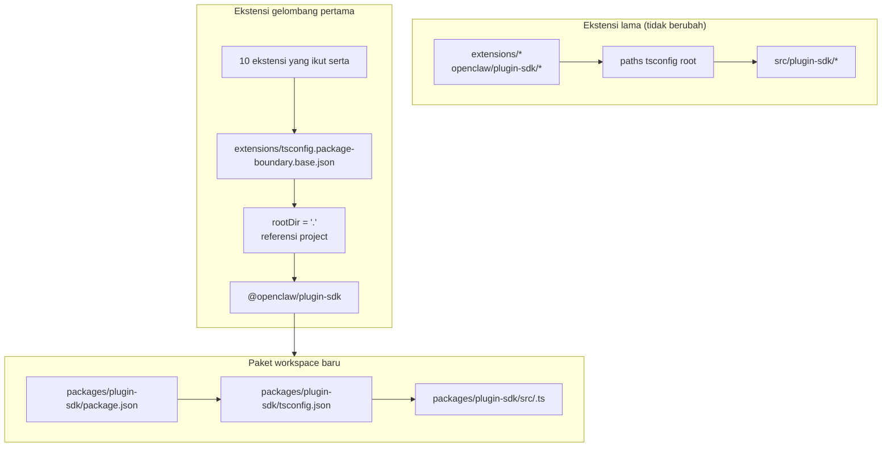

# refactor: Menjadikan plugin-sdk paket workspace nyata secara bertahap

## Ringkasan

Rencana ini memperkenalkan paket workspace nyata untuk plugin SDK di
`packages/plugin-sdk` dan menggunakannya untuk mengikutsertakan gelombang kecil
pertama dari ekstensi ke batas paket yang ditegakkan compiler. Tujuannya adalah
membuat impor relatif ilegal gagal di bawah `tsc` normal untuk sekumpulan
ekstensi provider bawaan yang dipilih, tanpa memaksakan migrasi seluruh repo
atau permukaan konflik merge yang besar.

Langkah inkremental kuncinya adalah menjalankan dua mode secara paralel untuk
sementara waktu:

| Mode        | Bentuk impor            | Siapa yang menggunakannya             | Penegakan                                    |
| ----------- | ----------------------- | ------------------------------------ | -------------------------------------------- |
| Mode lama   | `openclaw/plugin-sdk/*` | semua ekstensi yang belum ikut serta | perilaku permisif saat ini tetap dipertahankan |
| Mode opt-in | `@openclaw/plugin-sdk/*` | hanya ekstensi gelombang pertama     | `rootDir` lokal-paket + referensi project |

## Kerangka masalah

Repo saat ini mengekspor permukaan plugin SDK publik yang besar, tetapi itu
bukan paket workspace nyata. Sebaliknya:

- `tsconfig.json` root memetakan `openclaw/plugin-sdk/*` langsung ke
  `src/plugin-sdk/*.ts`
- ekstensi yang belum ikut serta dalam eksperimen sebelumnya masih berbagi
  perilaku alias source global tersebut
- menambahkan `rootDir` hanya bekerja ketika impor SDK yang diizinkan berhenti
  di-resolve ke source repo mentah

Itu berarti repo dapat mendeskripsikan kebijakan batas yang diinginkan, tetapi
TypeScript tidak menegakkannya secara bersih untuk sebagian besar ekstensi.

Yang Anda inginkan adalah jalur inkremental yang:

- menjadikan `plugin-sdk` nyata
- memindahkan SDK menuju paket workspace bernama `@openclaw/plugin-sdk`
- hanya mengubah sekitar 10 ekstensi dalam PR pertama
- membiarkan sisa tree ekstensi tetap memakai skema lama sampai pembersihan berikutnya
- menghindari alur kerja `tsconfig.plugin-sdk.dts.json` + deklarasi hasil generate postinstall
  sebagai mekanisme utama untuk rollout gelombang pertama

## Jejak kebutuhan

- R1. Buat paket workspace nyata untuk plugin SDK di bawah `packages/`.
- R2. Beri nama paket baru `@openclaw/plugin-sdk`.
- R3. Berikan paket SDK baru `package.json` dan `tsconfig.json` miliknya sendiri.
- R4. Tetap buat impor lama `openclaw/plugin-sdk/*` berfungsi untuk ekstensi
  yang belum ikut serta selama masa migrasi.
- R5. Ikutsertakan hanya gelombang kecil pertama ekstensi dalam PR pertama.
- R6. Ekstensi gelombang pertama harus gagal tertutup untuk impor relatif yang keluar
  dari root paket mereka.
- R7. Ekstensi gelombang pertama harus mengonsumsi SDK melalui dependensi paket
  dan referensi project TS, bukan melalui alias `paths` root.
- R8. Rencana ini harus menghindari langkah wajib generate postinstall seluruh repo
  untuk kebenaran editor.
- R9. Rollout gelombang pertama harus dapat ditinjau dan dapat di-merge sebagai PR
  berukuran sedang, bukan refaktor seluruh repo dengan 300+ file.

## Batas cakupan

- Tidak ada migrasi penuh semua ekstensi bawaan dalam PR pertama.
- Tidak ada keharusan menghapus `src/plugin-sdk` dalam PR pertama.
- Tidak ada keharusan memasang ulang setiap path build atau test root agar
  segera menggunakan paket baru.
- Tidak ada upaya memaksa squiggle VS Code untuk setiap ekstensi yang belum ikut serta.
- Tidak ada pembersihan lint luas untuk sisa tree ekstensi.
- Tidak ada perubahan perilaku runtime besar di luar resolusi impor, kepemilikan
  paket, dan penegakan batas untuk ekstensi yang ikut serta.

## Konteks & riset

### Kode dan pola yang relevan

- `pnpm-workspace.yaml` sudah mencakup `packages/*` dan `extensions/*`, jadi
  paket workspace baru di bawah `packages/plugin-sdk` sesuai dengan tata letak
  repo yang ada.
- Paket workspace yang ada seperti `packages/memory-host-sdk/package.json`
  dan `packages/plugin-package-contract/package.json` sudah menggunakan peta
  `exports` lokal-paket yang berakar di `src/*.ts`.
- `package.json` root saat ini memublikasikan permukaan SDK melalui `./plugin-sdk`
  dan `./plugin-sdk/*` exports yang didukung oleh `dist/plugin-sdk/*.js` dan
  `dist/plugin-sdk/*.d.ts`.
- `src/plugin-sdk/entrypoints.ts` dan `scripts/lib/plugin-sdk-entrypoints.json`
  sudah bertindak sebagai inventaris entrypoint kanonis untuk permukaan SDK.
- `tsconfig.json` root saat ini memetakan:
  - `openclaw/plugin-sdk` -> `src/plugin-sdk/index.ts`
  - `openclaw/plugin-sdk/*` -> `src/plugin-sdk/*.ts`
- Eksperimen batas sebelumnya menunjukkan bahwa `rootDir` lokal-paket bekerja untuk
  impor relatif ilegal hanya setelah impor SDK yang diizinkan berhenti di-resolve ke source mentah
  di luar paket ekstensi.

### Kumpulan ekstensi gelombang pertama

Rencana ini mengasumsikan gelombang pertama adalah kumpulan yang berat di provider
dan paling kecil kemungkinannya menarik edge case runtime channel yang kompleks:

- `extensions/anthropic`
- `extensions/exa`
- `extensions/firecrawl`
- `extensions/groq`
- `extensions/mistral`
- `extensions/openai`
- `extensions/perplexity`
- `extensions/tavily`
- `extensions/together`
- `extensions/xai`

### Inventaris permukaan SDK gelombang pertama

Ekstensi gelombang pertama saat ini mengimpor subset subpath SDK yang dapat
dikelola. Paket `@openclaw/plugin-sdk` awal hanya perlu mencakup yang berikut:

- `agent-runtime`
- `cli-runtime`
- `config-runtime`
- `core`
- `image-generation`
- `media-runtime`
- `media-understanding`
- `plugin-entry`
- `plugin-runtime`
- `provider-auth`
- `provider-auth-api-key`
- `provider-auth-login`
- `provider-auth-runtime`
- `provider-catalog-shared`
- `provider-entry`
- `provider-http`
- `provider-model-shared`
- `provider-onboard`
- `provider-stream-family`
- `provider-stream-shared`
- `provider-tools`
- `provider-usage`
- `provider-web-fetch`
- `provider-web-search`
- `realtime-transcription`
- `realtime-voice`
- `runtime-env`
- `secret-input`
- `security-runtime`
- `speech`
- `testing`

### Pembelajaran institusional

- Tidak ada entri `docs/solutions/` yang relevan di worktree ini.

### Referensi eksternal

- Tidak diperlukan riset eksternal untuk rencana ini. Repo sudah berisi pola
  paket workspace dan ekspor SDK yang relevan.

## Keputusan teknis utama

- Perkenalkan `@openclaw/plugin-sdk` sebagai paket workspace baru sambil
  mempertahankan permukaan lama root `openclaw/plugin-sdk/*` selama migrasi.
  Alasan: ini memungkinkan sekumpulan ekstensi gelombang pertama berpindah ke
  resolusi paket nyata tanpa memaksa setiap ekstensi dan setiap path build root
  berubah sekaligus.

- Gunakan config basis batas opt-in khusus seperti
  `extensions/tsconfig.package-boundary.base.json` alih-alih mengganti basis
  ekstensi yang ada untuk semua orang.
  Alasan: repo perlu mendukung mode ekstensi lama dan opt-in secara bersamaan
  selama migrasi.

- Gunakan referensi project TS dari ekstensi gelombang pertama ke
  `packages/plugin-sdk/tsconfig.json` dan set
  `disableSourceOfProjectReferenceRedirect` untuk mode batas opt-in.
  Alasan: ini memberi `tsc` graf paket nyata sambil mengurangi fallback editor dan
  compiler ke penelusuran source mentah.

- Pertahankan `@openclaw/plugin-sdk` sebagai private pada gelombang pertama.
  Alasan: tujuan langsungnya adalah penegakan batas internal dan keamanan
  migrasi, bukan memublikasikan kontrak SDK eksternal kedua sebelum permukaannya
  stabil.

- Pindahkan hanya subpath SDK gelombang pertama dalam irisan implementasi pertama,
  dan pertahankan jembatan kompatibilitas untuk sisanya.
  Alasan: memindahkan secara fisik semua 315 file `src/plugin-sdk/*.ts` dalam
  satu PR justru menciptakan permukaan konflik merge yang coba dihindari rencana ini.

- Jangan mengandalkan `scripts/postinstall-bundled-plugins.mjs` untuk membangun
  deklarasi SDK pada gelombang pertama.
  Alasan: alur build/referensi yang eksplisit lebih mudah dipahami dan membuat
  perilaku repo lebih dapat diprediksi.

## Pertanyaan terbuka

### Diselesaikan selama perencanaan

- Ekstensi mana yang harus masuk gelombang pertama?
  Gunakan 10 ekstensi provider/web-search yang tercantum di atas karena secara
  struktural lebih terisolasi dibanding paket channel yang lebih berat.

- Haruskah PR pertama mengganti seluruh tree ekstensi?
  Tidak. PR pertama harus mendukung dua mode secara paralel dan hanya
  mengikutsertakan gelombang pertama.

- Haruskah gelombang pertama memerlukan build deklarasi postinstall?
  Tidak. Graf paket/referensi harus eksplisit, dan CI harus menjalankan
  typecheck lokal-paket yang relevan secara sengaja.

### Ditunda ke implementasi

- Apakah paket gelombang pertama dapat menunjuk langsung ke `src/*.ts`
  lokal-paket hanya melalui referensi project, atau apakah langkah kecil emisi deklarasi
  masih diperlukan untuk paket `@openclaw/plugin-sdk`.
  Ini adalah pertanyaan validasi graf TS yang dimiliki implementasi.

- Apakah paket root `openclaw` seharusnya memproksikan subpath SDK gelombang pertama ke
  output `packages/plugin-sdk` segera atau tetap menggunakan shim kompatibilitas hasil generate
  di bawah `src/plugin-sdk`.
  Ini adalah detail kompatibilitas dan bentuk build yang bergantung pada jalur
  implementasi minimal yang menjaga CI tetap hijau.

## Desain teknis tingkat tinggi

> Ini menggambarkan pendekatan yang dimaksud dan merupakan panduan arah untuk peninjauan, bukan spesifikasi implementasi. Agen pelaksana harus memperlakukannya sebagai konteks, bukan kode yang harus direproduksi.

## Unit implementasi

- [ ] **Unit 1: Perkenalkan paket workspace nyata `@openclaw/plugin-sdk`**

**Tujuan:** Buat paket workspace nyata untuk SDK yang dapat memiliki
permukaan gelombang pertama tanpa memaksakan migrasi seluruh repo.

**Kebutuhan:** R1, R2, R3, R8, R9

**Dependensi:** Tidak ada

**File:**

- Buat: `packages/plugin-sdk/package.json`
- Buat: `packages/plugin-sdk/tsconfig.json`
- Buat: `packages/plugin-sdk/src/index.ts`
- Buat: `packages/plugin-sdk/src/*.ts` untuk subpath SDK gelombang pertama
- Ubah: `pnpm-workspace.yaml` hanya jika penyesuaian glob paket diperlukan
- Ubah: `package.json`
- Ubah: `src/plugin-sdk/entrypoints.ts`
- Ubah: `scripts/lib/plugin-sdk-entrypoints.json`
- Test: `src/plugins/contracts/plugin-sdk-workspace-package.contract.test.ts`

**Pendekatan:**

- Tambahkan paket workspace baru bernama `@openclaw/plugin-sdk`.
- Mulai hanya dengan subpath SDK gelombang pertama, bukan seluruh tree 315 file.
- Jika memindahkan entrypoint gelombang pertama secara langsung akan menciptakan diff yang terlalu besar,
  PR pertama dapat memperkenalkan subpath tersebut di `packages/plugin-sdk/src` sebagai wrapper paket tipis terlebih dahulu
  lalu membalik source of truth ke paket dalam PR lanjutan untuk klaster subpath itu.
- Gunakan kembali machinery inventaris entrypoint yang ada agar permukaan paket gelombang pertama
  dideklarasikan di satu tempat kanonis.
- Pertahankan ekspor paket root tetap hidup untuk pengguna lama sementara paket workspace
  menjadi kontrak opt-in yang baru.

**Pola yang harus diikuti:**

- `packages/memory-host-sdk/package.json`
- `packages/plugin-package-contract/package.json`
- `src/plugin-sdk/entrypoints.ts`

**Skenario test:**

- Jalur berhasil: paket workspace mengekspor setiap subpath gelombang pertama yang
  tercantum dalam rencana dan tidak ada ekspor gelombang pertama yang wajib hilang.
- Edge case: metadata ekspor paket tetap stabil saat daftar entry gelombang pertama
  di-generate ulang atau dibandingkan terhadap inventaris kanonis.
- Integrasi: ekspor SDK root lama tetap ada setelah memperkenalkan paket workspace baru.

**Verifikasi:**

- Repo berisi paket workspace `@openclaw/plugin-sdk` yang valid dengan peta ekspor gelombang pertama
  yang stabil dan tanpa regresi ekspor lama di `package.json` root.

- [ ] **Unit 2: Tambahkan mode batas TS opt-in untuk ekstensi yang ditegakkan paket**

**Tujuan:** Definisikan mode konfigurasi TS yang akan digunakan oleh ekstensi
yang ikut serta, sambil membiarkan perilaku TS ekstensi yang ada tidak berubah
untuk semua yang lain.

**Kebutuhan:** R4, R6, R7, R8, R9

**Dependensi:** Unit 1

**File:**

- Buat: `extensions/tsconfig.package-boundary.base.json`
- Buat: `tsconfig.boundary-optin.json`
- Ubah: `extensions/xai/tsconfig.json`
- Ubah: `extensions/openai/tsconfig.json`
- Ubah: `extensions/anthropic/tsconfig.json`
- Ubah: `extensions/mistral/tsconfig.json`
- Ubah: `extensions/groq/tsconfig.json`
- Ubah: `extensions/together/tsconfig.json`
- Ubah: `extensions/perplexity/tsconfig.json`
- Ubah: `extensions/tavily/tsconfig.json`
- Ubah: `extensions/exa/tsconfig.json`
- Ubah: `extensions/firecrawl/tsconfig.json`
- Test: `src/plugins/contracts/extension-package-project-boundaries.test.ts`
- Test: `test/extension-package-tsc-boundary.test.ts`

**Pendekatan:**

- Biarkan `extensions/tsconfig.base.json` tetap ada untuk ekstensi lama.
- Tambahkan config basis opt-in baru yang:
  - menetapkan `rootDir: "."`
  - mereferensikan `packages/plugin-sdk`
  - mengaktifkan `composite`
  - menonaktifkan pengalihan source referensi project bila diperlukan
- Tambahkan config solution khusus untuk graf typecheck gelombang pertama alih-alih
  membentuk ulang project TS repo root dalam PR yang sama.

**Catatan eksekusi:** Mulailah dengan typecheck canary lokal-paket yang gagal untuk satu
ekstensi yang ikut serta sebelum menerapkan pola tersebut ke semua 10 ekstensi.

**Pola yang harus diikuti:**

- Pola `tsconfig.json` lokal-ekstensi yang ada dari pekerjaan batas sebelumnya
- Pola paket workspace dari `packages/memory-host-sdk`

**Skenario test:**

- Jalur berhasil: setiap ekstensi yang ikut serta berhasil typecheck melalui
  config TS batas paket.
- Jalur error: impor relatif canary dari `../../src/cli/acp-cli.ts` gagal
  dengan `TS6059` untuk ekstensi yang ikut serta.
- Integrasi: ekstensi yang belum ikut serta tetap tidak berubah dan tidak perlu
  berpartisipasi dalam config solution baru.

**Verifikasi:**

- Ada graf typecheck khusus untuk 10 ekstensi yang ikut serta, dan impor relatif
  buruk dari salah satu di antaranya gagal melalui `tsc` normal.

- [ ] **Unit 3: Migrasikan ekstensi gelombang pertama ke `@openclaw/plugin-sdk`**

**Tujuan:** Ubah ekstensi gelombang pertama agar mengonsumsi paket SDK nyata
melalui metadata dependensi, referensi project, dan impor nama paket.

**Kebutuhan:** R5, R6, R7, R9

**Dependensi:** Unit 2

**File:**

- Ubah: `extensions/anthropic/package.json`
- Ubah: `extensions/exa/package.json`
- Ubah: `extensions/firecrawl/package.json`
- Ubah: `extensions/groq/package.json`
- Ubah: `extensions/mistral/package.json`
- Ubah: `extensions/openai/package.json`
- Ubah: `extensions/perplexity/package.json`
- Ubah: `extensions/tavily/package.json`
- Ubah: `extensions/together/package.json`
- Ubah: `extensions/xai/package.json`
- Ubah: impor produksi dan test di bawah masing-masing dari 10 root ekstensi yang
  saat ini mereferensikan `openclaw/plugin-sdk/*`

**Pendekatan:**

- Tambahkan `@openclaw/plugin-sdk: workspace:*` ke `devDependencies`
  ekstensi gelombang pertama.
- Ganti impor `openclaw/plugin-sdk/*` di paket tersebut dengan
  `@openclaw/plugin-sdk/*`.
- Pertahankan impor internal-lokal ekstensi pada barrel lokal seperti `./api.ts` dan
  `./runtime-api.ts`.
- Jangan ubah ekstensi yang belum ikut serta dalam PR ini.

**Pola yang harus diikuti:**

- Barrel impor lokal-ekstensi yang ada (`api.ts`, `runtime-api.ts`)
- Bentuk dependensi paket yang digunakan oleh paket workspace `@openclaw/*` lainnya

**Skenario test:**

- Jalur berhasil: setiap ekstensi yang dimigrasikan tetap mendaftar/memuat melalui
  test plugin yang ada setelah penulisan ulang impor.
- Edge case: impor SDK hanya-untuk-test di kumpulan ekstensi yang ikut serta tetap
  di-resolve dengan benar melalui paket baru.
- Integrasi: ekstensi yang dimigrasikan tidak memerlukan alias root
  `openclaw/plugin-sdk/*` untuk typecheck.

**Verifikasi:**

- Ekstensi gelombang pertama build dan test terhadap `@openclaw/plugin-sdk`
  tanpa memerlukan path alias SDK root lama.

- [ ] **Unit 4: Pertahankan kompatibilitas lama saat migrasi masih parsial**

**Tujuan:** Pertahankan sisa repo tetap berfungsi saat SDK ada dalam bentuk lama
dan paket baru selama migrasi.

**Kebutuhan:** R4, R8, R9

**Dependensi:** Unit 1-3

**File:**

- Ubah: `src/plugin-sdk/*.ts` untuk shim kompatibilitas gelombang pertama bila diperlukan
- Ubah: `package.json`
- Ubah: plumbing build atau ekspor yang merakit artefak SDK
- Test: `src/plugins/contracts/plugin-sdk-runtime-api-guardrails.test.ts`
- Test: `src/plugins/contracts/plugin-sdk-index.bundle.test.ts`

**Pendekatan:**

- Pertahankan root `openclaw/plugin-sdk/*` sebagai permukaan kompatibilitas untuk
  ekstensi lama dan untuk konsumen eksternal yang belum berpindah.
- Gunakan shim hasil generate atau wiring proksi ekspor root untuk subpath
  gelombang pertama yang sudah dipindahkan ke `packages/plugin-sdk`.
- Jangan mencoba memensiunkan permukaan SDK root pada fase ini.

**Pola yang harus diikuti:**

- Generate ekspor SDK root yang ada melalui `src/plugin-sdk/entrypoints.ts`
- Kompatibilitas ekspor paket yang ada di `package.json` root

**Skenario test:**

- Jalur berhasil: impor SDK root lama masih di-resolve untuk ekstensi yang belum ikut serta
  setelah paket baru ada.
- Edge case: subpath gelombang pertama bekerja melalui permukaan root lama dan
  permukaan paket baru selama masa migrasi.
- Integrasi: test kontrak indeks/bundle plugin-sdk tetap melihat permukaan publik
  yang koheren.

**Verifikasi:**

- Repo mendukung mode konsumsi SDK lama dan opt-in tanpa
  merusak ekstensi yang tidak berubah.

- [ ] **Unit 5: Tambahkan penegakan terarah dan dokumentasikan kontrak migrasi**

**Tujuan:** Terapkan panduan CI dan kontributor yang menegakkan perilaku baru untuk
gelombang pertama tanpa berpura-pura seluruh tree ekstensi sudah dimigrasikan.

**Kebutuhan:** R5, R6, R8, R9

**Dependensi:** Unit 1-4

**File:**

- Ubah: `package.json`
- Ubah: file workflow CI yang harus menjalankan typecheck batas opt-in
- Ubah: `AGENTS.md`
- Ubah: `docs/plugins/sdk-overview.md`
- Ubah: `docs/plugins/sdk-entrypoints.md`
- Ubah: `docs/plans/2026-04-05-001-refactor-extension-package-resolution-boundary-plan.md`

**Pendekatan:**

- Tambahkan gate gelombang pertama yang eksplisit, seperti solution `tsc -b` khusus untuk
  `packages/plugin-sdk` plus 10 ekstensi yang ikut serta.
- Dokumentasikan bahwa repo sekarang mendukung mode ekstensi lama dan opt-in,
  dan bahwa pekerjaan batas ekstensi baru sebaiknya memilih jalur paket baru.
- Catat aturan migrasi gelombang berikutnya agar PR berikutnya dapat menambahkan lebih banyak ekstensi
  tanpa memperdebatkan ulang arsitekturnya.

**Pola yang harus diikuti:**

- Test kontrak yang ada di bawah `src/plugins/contracts/`
- Pembaruan docs yang ada yang menjelaskan migrasi bertahap

**Skenario test:**

- Jalur berhasil: gate typecheck gelombang pertama yang baru lolos untuk paket workspace
  dan ekstensi yang ikut serta.
- Jalur error: memperkenalkan impor relatif ilegal baru di ekstensi yang ikut serta
  menggagalkan gate typecheck terarah.
- Integrasi: CI belum mengharuskan ekstensi yang belum ikut serta memenuhi mode
  batas paket baru.

**Verifikasi:**

- Jalur penegakan gelombang pertama terdokumentasi, teruji, dan dapat dijalankan
  tanpa memaksa seluruh tree ekstensi bermigrasi.

## Dampak seluruh sistem

- **Graf interaksi:** pekerjaan ini menyentuh source of truth SDK, ekspor paket
  root, metadata paket ekstensi, tata letak graf TS, dan verifikasi CI.
- **Propagasi error:** mode kegagalan utama yang dimaksud menjadi error TS saat compile-time
  (`TS6059`) pada ekstensi yang ikut serta alih-alih kegagalan khusus berbasis script.
- **Risiko siklus hidup state:** migrasi dua permukaan memperkenalkan risiko drift antara
  ekspor kompatibilitas root dan paket workspace baru.
- **Paritas permukaan API:** subpath gelombang pertama harus tetap identik secara semantik
  melalui `openclaw/plugin-sdk/*` dan `@openclaw/plugin-sdk/*` selama
  transisi.
- **Cakupan integrasi:** test unit tidak cukup; typecheck graf paket terarah
  diperlukan untuk membuktikan batas.
- **Invarian yang tidak berubah:** ekstensi yang belum ikut serta mempertahankan perilaku saat ini
  di PR 1. Rencana ini tidak mengklaim penegakan batas impor seluruh repo.

## Risiko & dependensi

| Risiko                                                                                                   | Mitigasi                                                                                                              |
| -------------------------------------------------------------------------------------------------------- | --------------------------------------------------------------------------------------------------------------------- |
| Paket gelombang pertama masih di-resolve kembali ke source mentah dan `rootDir` tidak benar-benar gagal tertutup | Jadikan langkah implementasi pertama sebagai canary referensi paket pada satu ekstensi yang ikut serta sebelum diperluas ke set penuh |
| Memindahkan terlalu banyak source SDK sekaligus menciptakan kembali masalah konflik merge semula          | Pindahkan hanya subpath gelombang pertama dalam PR pertama dan pertahankan jembatan kompatibilitas root             |
| Permukaan SDK lama dan baru menyimpang secara semantik                                                   | Pertahankan inventaris entrypoint tunggal, tambahkan test kontrak kompatibilitas, dan buat paritas dua permukaan menjadi eksplisit |
| Path build/test repo root tanpa sengaja mulai bergantung pada paket baru dengan cara yang tidak terkendali | Gunakan config solution opt-in khusus dan jauhkan perubahan topologi TS seluruh root dari PR pertama                |

## Pengiriman bertahap

### Fase 1

- Perkenalkan `@openclaw/plugin-sdk`
- Definisikan permukaan subpath gelombang pertama
- Buktikan satu ekstensi yang ikut serta dapat gagal tertutup melalui `rootDir`

### Fase 2

- Ikutsertakan 10 ekstensi gelombang pertama
- Pertahankan kompatibilitas root untuk semua yang lain

### Fase 3

- Tambahkan lebih banyak ekstensi di PR berikutnya
- Pindahkan lebih banyak subpath SDK ke paket workspace
- Pensiunkan kompatibilitas root hanya setelah kumpulan ekstensi lama sudah tidak ada

## Catatan dokumentasi / operasional

- PR pertama harus secara eksplisit mendeskripsikan dirinya sebagai migrasi dual-mode, bukan
  penyelesaian penegakan seluruh repo.
- Panduan migrasi harus memudahkan PR berikutnya untuk menambahkan lebih banyak ekstensi
  dengan mengikuti pola paket/dependensi/referensi yang sama.

## Sumber & referensi

- Rencana sebelumnya: `docs/plans/2026-04-05-001-refactor-extension-package-resolution-boundary-plan.md`
- Konfigurasi workspace: `pnpm-workspace.yaml`
- Inventaris entrypoint SDK yang ada: `src/plugin-sdk/entrypoints.ts`
- Ekspor SDK root yang ada: `package.json`
- Pola paket workspace yang ada:
  - `packages/memory-host-sdk/package.json`
  - `packages/plugin-package-contract/package.json`
