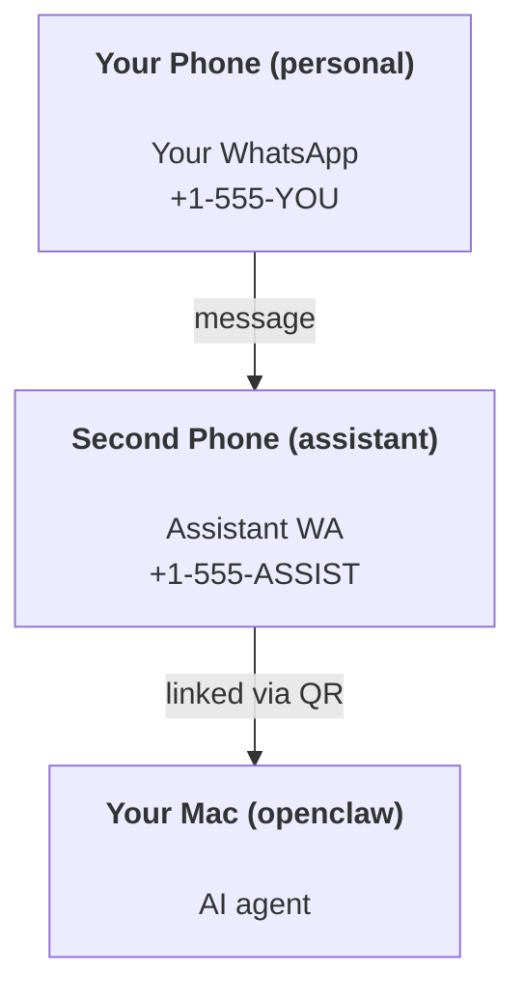

---
read_when:
    - Onboarding instance asisten baru
    - Meninjau implikasi keselamatan/izin
summary: Panduan end-to-end untuk menjalankan OpenClaw sebagai asisten pribadi dengan peringatan keselamatan
title: Penyiapan asisten pribadi
x-i18n:
    generated_at: "2026-04-25T13:56:34Z"
    model: gpt-5.4
    provider: openai
    source_hash: 1647b78e8cf23a3a025969c52fbd8a73aed78df27698abf36bbf62045dc30e3b
    source_path: start/openclaw.md
    workflow: 15
---

# Membangun asisten pribadi dengan OpenClaw

OpenClaw adalah Gateway self-hosted yang menghubungkan Discord, Google Chat, iMessage, Matrix, Microsoft Teams, Signal, Slack, Telegram, WhatsApp, Zalo, dan lainnya ke agen AI. Panduan ini membahas penyiapan "asisten pribadi": nomor WhatsApp khusus yang berperilaku seperti asisten AI Anda yang selalu aktif.

## ⚠️ Utamakan keselamatan

Anda menempatkan agen pada posisi untuk:

- menjalankan perintah di mesin Anda (bergantung pada kebijakan tool Anda)
- membaca/menulis file di workspace Anda
- mengirim pesan kembali keluar melalui WhatsApp/Telegram/Discord/Mattermost dan channel bawaan lainnya

Mulailah secara konservatif:

- Selalu setel `channels.whatsapp.allowFrom` (jangan pernah menjalankan akses terbuka ke seluruh dunia di Mac pribadi Anda).
- Gunakan nomor WhatsApp khusus untuk asisten.
- Heartbeat sekarang default setiap 30 menit. Nonaktifkan sampai Anda memercayai penyiapan ini dengan menyetel `agents.defaults.heartbeat.every: "0m"`.

## Prasyarat

- OpenClaw sudah terpasang dan sudah di-onboard — lihat [Getting Started](/id/start/getting-started) jika Anda belum melakukannya
- Nomor telepon kedua (SIM/eSIM/prabayar) untuk asisten

## Penyiapan dua ponsel (disarankan)

Yang Anda inginkan adalah ini:



Jika Anda menautkan WhatsApp pribadi Anda ke OpenClaw, setiap pesan kepada Anda akan menjadi “input agen”. Itu jarang menjadi yang Anda inginkan.

## Quick start 5 menit

1. Pair WhatsApp Web (menampilkan QR; pindai dengan ponsel asisten):

```bash
openclaw channels login
```

2. Jalankan Gateway (biarkan tetap berjalan):

```bash
openclaw gateway --port 18789
```

3. Letakkan config minimal di `~/.openclaw/openclaw.json`:

```json5
{
  gateway: { mode: "local" },
  channels: { whatsapp: { allowFrom: ["+15555550123"] } },
}
```

Sekarang kirim pesan ke nomor asisten dari ponsel Anda yang ada dalam allowlist.

Saat onboarding selesai, OpenClaw otomatis membuka dashboard dan mencetak tautan bersih (tanpa token). Jika dashboard meminta auth, tempelkan shared secret yang dikonfigurasi ke pengaturan Control UI. Onboarding secara default menggunakan token (`gateway.auth.token`), tetapi auth berbasis password juga berfungsi jika Anda mengubah `gateway.auth.mode` ke `password`. Untuk membukanya lagi nanti: `openclaw dashboard`.

## Berikan workspace kepada agen (AGENTS)

OpenClaw membaca instruksi operasional dan “memori” dari direktori workspace-nya.

Secara default, OpenClaw menggunakan `~/.openclaw/workspace` sebagai workspace agen, dan akan membuatnya (beserta `AGENTS.md`, `SOUL.md`, `TOOLS.md`, `IDENTITY.md`, `USER.md`, `HEARTBEAT.md` awal) secara otomatis saat penyiapan/jalankan agen pertama. `BOOTSTRAP.md` hanya dibuat saat workspace benar-benar baru (tidak akan muncul lagi setelah Anda menghapusnya). `MEMORY.md` bersifat opsional (tidak dibuat otomatis); jika ada, file ini dimuat untuk sesi normal. Sesi subagen hanya menyuntikkan `AGENTS.md` dan `TOOLS.md`.

Tip: perlakukan folder ini seperti “memori” OpenClaw dan jadikan repo git (idealnya privat) agar `AGENTS.md` + file memori Anda dicadangkan. Jika git terpasang, workspace yang benar-benar baru akan diinisialisasi otomatis.

```bash
openclaw setup
```

Tata letak workspace lengkap + panduan cadangan: [Agent workspace](/id/concepts/agent-workspace)  
Alur kerja memori: [Memory](/id/concepts/memory)

Opsional: pilih workspace lain dengan `agents.defaults.workspace` (mendukung `~`).

```json5
{
  agents: {
    defaults: {
      workspace: "~/.openclaw/workspace",
    },
  },
}
```

Jika Anda sudah mengirim file workspace sendiri dari repo, Anda dapat menonaktifkan pembuatan file bootstrap sepenuhnya:

```json5
{
  agents: {
    defaults: {
      skipBootstrap: true,
    },
  },
}
```

## Config yang mengubahnya menjadi "asisten"

OpenClaw secara default menggunakan penyiapan asisten yang baik, tetapi biasanya Anda ingin menyesuaikan:

- persona/instruksi di [`SOUL.md`](/id/concepts/soul)
- default thinking (jika diinginkan)
- Heartbeat (setelah Anda memercayainya)

Contoh:

```json5
{
  logging: { level: "info" },
  agent: {
    model: "anthropic/claude-opus-4-6",
    workspace: "~/.openclaw/workspace",
    thinkingDefault: "high",
    timeoutSeconds: 1800,
    // Mulai dari 0; aktifkan nanti.
    heartbeat: { every: "0m" },
  },
  channels: {
    whatsapp: {
      allowFrom: ["+15555550123"],
      groups: {
        "*": { requireMention: true },
      },
    },
  },
  routing: {
    groupChat: {
      mentionPatterns: ["@openclaw", "openclaw"],
    },
  },
  session: {
    scope: "per-sender",
    resetTriggers: ["/new", "/reset"],
    reset: {
      mode: "daily",
      atHour: 4,
      idleMinutes: 10080,
    },
  },
}
```

## Sesi dan memori

- File sesi: `~/.openclaw/agents/<agentId>/sessions/{{SessionId}}.jsonl`
- Metadata sesi (penggunaan token, rute terakhir, dll.): `~/.openclaw/agents/<agentId>/sessions/sessions.json` (lama: `~/.openclaw/sessions/sessions.json`)
- `/new` atau `/reset` memulai sesi baru untuk chat tersebut (dapat dikonfigurasi melalui `resetTriggers`). Jika dikirim sendirian, agen membalas dengan sapaan singkat untuk mengonfirmasi reset.
- `/compact [instructions]` memadatkan konteks sesi dan melaporkan sisa anggaran konteks.

## Heartbeat (mode proaktif)

Secara default, OpenClaw menjalankan Heartbeat setiap 30 menit dengan prompt:
`Read HEARTBEAT.md if it exists (workspace context). Follow it strictly. Do not infer or repeat old tasks from prior chats. If nothing needs attention, reply HEARTBEAT_OK.`
Setel `agents.defaults.heartbeat.every: "0m"` untuk menonaktifkan.

- Jika `HEARTBEAT.md` ada tetapi secara efektif kosong (hanya berisi baris kosong dan heading markdown seperti `# Heading`), OpenClaw melewati eksekusi Heartbeat untuk menghemat panggilan API.
- Jika file tidak ada, Heartbeat tetap berjalan dan model memutuskan apa yang harus dilakukan.
- Jika agen membalas dengan `HEARTBEAT_OK` (opsional dengan padding singkat; lihat `agents.defaults.heartbeat.ackMaxChars`), OpenClaw menekan pengiriman keluar untuk Heartbeat tersebut.
- Secara default, pengiriman Heartbeat ke target bergaya DM `user:<id>` diizinkan. Setel `agents.defaults.heartbeat.directPolicy: "block"` untuk menekan pengiriman target langsung sambil tetap menjaga eksekusi Heartbeat aktif.
- Heartbeat menjalankan giliran agen penuh — interval yang lebih pendek menghabiskan lebih banyak token.

```json5
{
  agent: {
    heartbeat: { every: "30m" },
  },
}
```

## Media masuk dan keluar

Lampiran masuk (gambar/audio/dokumen) dapat diekspos ke perintah Anda melalui template:

- `{{MediaPath}}` (path file temp lokal)
- `{{MediaUrl}}` (pseudo-URL)
- `{{Transcript}}` (jika transkripsi audio diaktifkan)

Lampiran keluar dari agen: sertakan `MEDIA:<path-or-url>` pada barisnya sendiri (tanpa spasi). Contoh:

```
Ini screenshot-nya.
MEDIA:https://example.com/screenshot.png
```

OpenClaw mengekstraknya dan mengirimkannya sebagai media bersama teks.

Perilaku path lokal mengikuti model kepercayaan pembacaan file yang sama seperti agen:

- Jika `tools.fs.workspaceOnly` bernilai `true`, path lokal `MEDIA:` keluar tetap dibatasi pada root temp OpenClaw, cache media, path workspace agen, dan file yang dihasilkan sandbox.
- Jika `tools.fs.workspaceOnly` bernilai `false`, `MEDIA:` keluar dapat menggunakan file lokal host yang memang sudah diizinkan untuk dibaca oleh agen.
- Pengiriman lokal host tetap hanya mengizinkan media dan tipe dokumen aman (gambar, audio, video, PDF, dan dokumen Office). Teks biasa dan file yang menyerupai rahasia tidak diperlakukan sebagai media yang dapat dikirim.

Artinya, gambar/file yang dihasilkan di luar workspace sekarang dapat dikirim ketika kebijakan fs Anda sudah mengizinkan pembacaan tersebut, tanpa membuka kembali eksfiltrasi lampiran teks host arbitrer.

## Daftar periksa operasional

```bash
openclaw status          # status lokal (kredensial, sesi, peristiwa antre)
openclaw status --all    # diagnosis lengkap (read-only, mudah ditempel)
openclaw status --deep   # meminta gateway untuk probe kesehatan live dengan probe channel jika didukung
openclaw health --json   # snapshot kesehatan gateway (WS; default dapat mengembalikan snapshot cache baru)
```

Log berada di bawah `/tmp/openclaw/` (default: `openclaw-YYYY-MM-DD.log`).

## Langkah berikutnya

- WebChat: [WebChat](/id/web/webchat)
- Operasi Gateway: [Runbook Gateway](/id/gateway)
- Cron + wakeup: [Cron jobs](/id/automation/cron-jobs)
- Pendamping bilah menu macOS: [Aplikasi macOS OpenClaw](/id/platforms/macos)
- Aplikasi Node iOS: [Aplikasi iOS](/id/platforms/ios)
- Aplikasi Node Android: [Aplikasi Android](/id/platforms/android)
- Status Windows: [Windows (WSL2)](/id/platforms/windows)
- Status Linux: [Aplikasi Linux](/id/platforms/linux)
- Keamanan: [Security](/id/gateway/security)

## Terkait

- [Getting started](/id/start/getting-started)
- [Setup](/id/start/setup)
- [Ikhtisar channels](/id/channels)
