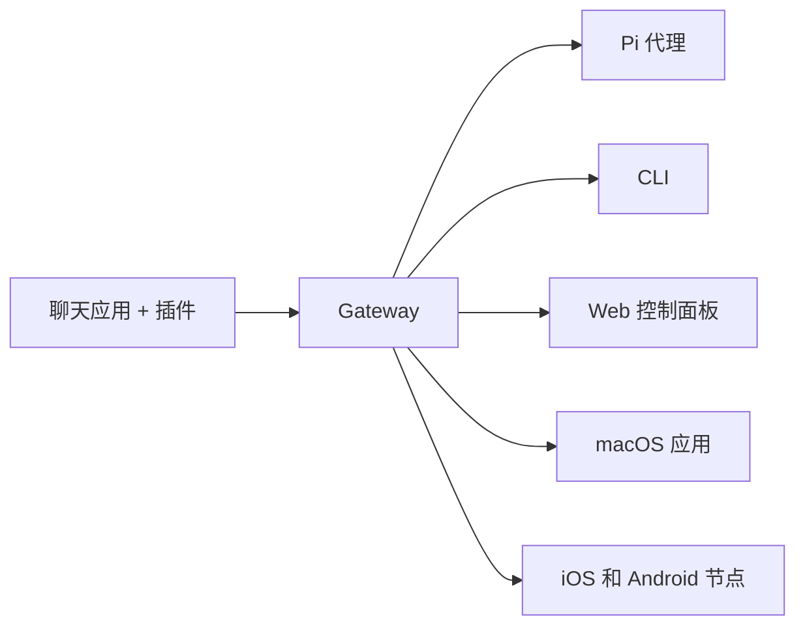

# OpenClaw 🦞 中文文档

<p align="center">
    
    
</p>

> _"EXFOLIATE! EXFOLIATE!"_ — 一只太空龙虾,大概吧

<p align="center">
  <strong>适用于任何操作系统的 AI 代理多通道网关</strong><br />
  支持 Discord、Google Chat、iMessage、Matrix、Microsoft Teams、Signal、Slack、Telegram、WhatsApp、Zalo、微信、飞书等平台。<br />
  发送消息,从口袋里的设备获得 AI 响应。通过内置渠道、 bundled 渠道插件、WebChat 和移动节点运行一个 Gateway。
</p>

<Note type="info">
**关于本文档：** 这是 OpenClaw 的中文社区文档，由中文用户社区维护。我们提供完整的中文翻译、本土化配置示例（如微信、飞书等中国平台），以及针对中文用户的常见问题解答。英文原版请访问 [docs.openclaw.ai](https://docs.openclaw.ai)。
</Note>

<Columns>
  <Card title="快速开始" href="/zh-CN/start/getting-started" icon="rocket">
    几分钟内安装 OpenClaw 并启动 Gateway
  </Card>
  <Card title="运行引导程序" href="/zh-CN/start/wizard" icon="sparkles">
    使用 `openclaw onboard` 进行引导式设置和配对流程
  </Card>
  <Card title="打开控制面板" href="/zh-CN/web/control-ui" icon="layout-dashboard">
    启动浏览器仪表板进行聊天、配置和会话管理
  </Card>
</Columns>

## 什么是 OpenClaw?

OpenClaw 是一个**自托管网关**,将你喜爱的聊天应用和渠道(包括内置渠道以及 bundled 或外部渠道插件,如 Discord、Google Chat、iMessage、Matrix、Microsoft Teams、Signal、Slack、Telegram、WhatsApp、Zalo、微信、飞书等)连接到像 Pi 这样的 AI 编码代理。你在自己的机器(或服务器)上运行单个 Gateway 进程,它就成为你的消息应用和随时可用的 AI 助手之间的桥梁。

**适合谁?** 想要一个可以从任何地方发消息的个人 AI 助手的开发者和高级用户——无需放弃对数据的控制或依赖托管服务。

**有什么不同?**

- **自托管**: 运行在你的硬件上,遵循你的规则
- **多通道**: 一个 Gateway 同时服务于内置渠道和 bundled 或外部渠道插件
- **代理原生**: 为编码代理构建,支持工具使用、会话、记忆和多代理路由
- **开源**: MIT 许可,社区驱动

**你需要什么?** Node 24(推荐),或 Node 22 LTS (`22.14+`)以获得兼容性,来自你选择的提供商的 API 密钥,以及 5 分钟时间。为了最佳质量和安全性,请使用最强的最新一代模型。

## 工作原理



Gateway 是会话、路由和渠道连接的单一事实来源。

## 核心功能

<Columns>
  <Card title="多通道网关" icon="network" href="/zh-CN/channels">
    Discord、iMessage、Signal、Slack、Telegram、WhatsApp、WebChat 等,只需一个 Gateway 进程
  </Card>
  <Card title="插件渠道" icon="plug" href="/zh-CN/tools/plugin">
    Bundled 插件在正常当前版本中添加 Matrix、Nostr、Twitch、Zalo 等
  </Card>
  <Card title="多代理路由" icon="route" href="/zh-CN/concepts/multi-agent">
    每个代理、工作区或发送者的隔离会话
  </Card>
  <Card title="媒体支持" icon="image" href="/zh-CN/nodes/images">
    发送和接收图片、音频和文档
  </Card>
  <Card title="Web 控制面板" icon="monitor" href="/zh-CN/web/control-ui">
    用于聊天、配置、会话和节点的浏览器仪表板
  </Card>
  <Card title="移动节点" icon="smartphone" href="/zh-CN/nodes">
    配对 iOS 和 Android 节点,实现 Canvas、相机和语音增强工作流
  </Card>
</Columns>

## 快速开始

<Steps>
  <Step title="安装 OpenClaw">
    ```bash
    npm install -g openclaw@latest
    ```
  </Step>
  <Step title="引导并安装服务">
    ```bash
    openclaw onboard --install-daemon
    ```
  </Step>
  <Step title="开始聊天">
    在浏览器中打开控制面板并发送消息:

    ```bash
    openclaw dashboard
    ```

    或连接一个渠道([Telegram](/zh-CN/channels/telegram) 最快)并从手机聊天。

  </Step>
</Steps>

需要完整的安装和开发设置?查看[快速开始指南](/zh-CN/start/getting-started)。

## 控制面板

Gateway 启动后打开浏览器控制面板。

- 本地默认: [http://127.0.0.1:18789/](http://127.0.0.1:18789/)
- 远程访问: [Web 界面](/zh-CN/web)和[Tailscale](/zh-CN/gateway/tailscale)

<p align="center">
  
</p>

## 配置(可选)

配置文件位于 `~/.openclaw/openclaw.json`。

- 如果**什么都不做**,OpenClaw 使用 bundled 的 Pi 二进制文件在 RPC 模式下,每个发送者独立会话
- 如果想锁定它,从 `channels.whatsapp.allowFrom` 开始,对于群组使用提及规则

示例:

```json5
{
  channels: {
    whatsapp: {
      allowFrom: ["+15555550123"],
      groups: { "*": { requireMention: true } },
    },
  },
  messages: { groupChat: { mentionPatterns: ["@openclaw"] } },
}
```

## 从这里开始

<Columns>
  <Card title="文档中心" href="/zh-CN/start/hubs" icon="book-open">
    所有文档和指南,按用例组织
  </Card>
  <Card title="配置" href="/zh-CN/gateway/configuration" icon="settings">
    核心 Gateway 设置、令牌和提供商配置
  </Card>
  <Card title="远程访问" href="/zh-CN/gateway/remote" icon="globe">
    SSH 和 tailnet 访问模式
  </Card>
  <Card title="渠道" href="/zh-CN/channels/telegram" icon="message-square">
    飞书、Microsoft Teams、WhatsApp、Telegram、Discord 等的渠道特定设置
  </Card>
  <Card title="节点" href="/zh-CN/nodes" icon="smartphone">
    带有配对、Canvas、相机和设备操作的 iOS 和 Android 节点
  </Card>
  <Card title="帮助" href="/zh-CN/help" icon="life-buoy">
    常见修复和故障排除入口点
  </Card>
  <Card title="关于中文文档" href="/zh-CN/about-zh-docs" icon="info">
    了解中文社区文档的特色和贡献方式
  </Card>
</Columns>

## 了解更多

<Columns>
  <Card title="完整功能列表" href="/zh-CN/concepts/features" icon="list">
    完整的渠道、路由和媒体功能
  </Card>
  <Card title="多代理路由" href="/zh-CN/concepts/multi-agent" icon="route">
    工作区隔离和每代理会话
  </Card>
  <Card title="安全" href="/zh-CN/gateway/security" icon="shield">
    令牌、允许列表和安全控制
  </Card>
  <Card title="故障排除" href="/zh-CN/gateway/troubleshooting" icon="wrench">
    Gateway 诊断和常见错误
  </Card>
  <Card title="关于和致谢" href="/zh-CN/reference/credits" icon="info">
    项目起源、贡献者和许可证
  </Card>
</Columns>

---

## 🇨🇳 中文社区特色

本文档针对中文用户进行了以下优化：

- **完整中文化**：所有文档内容均已翻译为简体中文
- **本土化示例**：包含微信、飞书等中国流行平台的配置指南
- **中文常见问题**：针对中文用户的使用习惯提供 FAQ
- **社区支持**：欢迎中文用户提交改进建议和翻译修正

### 与官方文档的区别

| 特性 | 中文文档 (clawcn.me) | 官方文档 (docs.openclaw.ai) |
|------|---------------------|----------------------------|
| 语言 | 简体中文 | 英文 |
| 本土化 | 包含微信、飞书等中国平台示例 | 国际平台为主 |
| 维护者 | 中文社区 | OpenClaw 官方团队 |
| 更新频率 | 跟随官方同步 | 实时更新 |
| 独特内容 | 中文社区介绍、本土化FAQ | 无 |

> **提示**：如果你发现翻译错误或想改进文档，欢迎在 [GitHub Issues](https://github.com/openclaw/openclaw/issues) 中反馈。

---

## 💡 为什么选择中文文档？

### 1. 更适合中文用户
- 完整的中文界面和术语
- 符合中文阅读习惯的排版
- 针对中国网络环境的部署建议

### 2. 本土化平台支持
我们特别关注中国用户常用的平台：
- **微信 (WeChat)**：详细的配置指南和常见问题
- **飞书 (Feishu)**：企业级部署方案
- **QQ Bot**：QQ 机器人集成教程

### 3. 社区驱动
- 由中文用户社区维护
- 快速响应中文用户问题
- 持续改进翻译质量

---

> **注意**: 这是 OpenClaw 的中文社区文档。英文原版请访问 [docs.openclaw.ai](https://docs.openclaw.ai)
