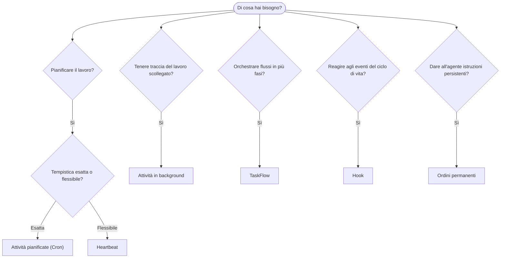

---
read_when:
    - Decidere come automatizzare il lavoro con OpenClaw
    - Scegliere tra Heartbeat, Cron, hook e ordini permanenti
    - Trovare il punto di ingresso giusto per l'automazione
summary: 'Panoramica dei meccanismi di automazione: attività, Cron, hook, ordini permanenti e TaskFlow'
title: Automazione e attività
x-i18n:
    generated_at: "2026-04-25T13:40:58Z"
    model: gpt-5.4
    provider: openai
    source_hash: 54524eb5d1fcb2b2e3e51117339be1949d980afaef1f6ae71fcfd764049f3f47
    source_path: automation/index.md
    workflow: 15
---

OpenClaw esegue il lavoro in background tramite attività, processi pianificati, hook di evento e istruzioni permanenti. Questa pagina ti aiuta a scegliere il meccanismo giusto e a capire come si integrano tra loro.

## Guida rapida alla scelta

| Caso d'uso                               | Consigliato            | Motivo                                           |
| ---------------------------------------- | ---------------------- | ------------------------------------------------ |
| Inviare un report giornaliero alle 9:00 precise | Attività pianificate (Cron) | Tempistica esatta, esecuzione isolata            |
| Ricordarmelo tra 20 minuti               | Attività pianificate (Cron) | Esecuzione singola con tempistica precisa (`--at`) |
| Eseguire un'analisi approfondita settimanale | Attività pianificate (Cron) | Attività autonoma, può usare un modello diverso  |
| Controllare la posta in arrivo ogni 30 min | Heartbeat              | Raggruppa con altri controlli, sensibile al contesto |
| Monitorare il calendario per eventi imminenti | Heartbeat              | Scelta naturale per una consapevolezza periodica |
| Ispezionare lo stato di un subagente o di un'esecuzione ACP | Attività in background       | Il registro delle attività tiene traccia di tutto il lavoro scollegato |
| Verificare cosa è stato eseguito e quando | Attività in background       | `openclaw tasks list` e `openclaw tasks audit` |
| Ricerca in più fasi e poi riepilogo      | TaskFlow              | Orchestrazione durevole con tracciamento delle revisioni |
| Eseguire uno script al reset della sessione | Hook                  | Basato su eventi, si attiva sugli eventi del ciclo di vita |
| Eseguire codice a ogni chiamata di strumento | Hook di Plugin           | Gli hook in-process possono intercettare le chiamate agli strumenti |
| Controllare sempre la conformità prima di rispondere | Ordini permanenti        | Iniettati automaticamente in ogni sessione       |

### Attività pianificate (Cron) vs Heartbeat

| Dimensione      | Attività pianificate (Cron)         | Heartbeat                            |
| --------------- | ----------------------------------- | ------------------------------------ |
| Tempistica      | Esatta (espressioni cron, esecuzione singola) | Approssimativa (predefinita ogni 30 min) |
| Contesto della sessione | Nuovo (isolato) o condiviso          | Contesto completo della sessione principale |
| Record delle attività | Creati sempre                      | Mai creati                           |
| Consegna        | Canale, Webhook o silenziosa         | Inline nella sessione principale     |
| Ideale per      | Report, promemoria, processi in background | Controlli posta in arrivo, calendario, notifiche |

Usa Attività pianificate (Cron) quando hai bisogno di una tempistica precisa o di un'esecuzione isolata. Usa Heartbeat quando il lavoro beneficia del contesto completo della sessione e una tempistica approssimativa va bene.

## Concetti principali

### Attività pianificate (cron)

Cron è lo scheduler integrato del Gateway per una tempistica precisa. Mantiene i processi, riattiva l'agente al momento giusto e può consegnare l'output a un canale chat o a un endpoint Webhook. Supporta promemoria una tantum, espressioni ricorrenti e trigger Webhook in ingresso.

Vedi [Attività pianificate](/it/automation/cron-jobs).

### Attività

Il registro delle attività in background tiene traccia di tutto il lavoro scollegato: esecuzioni ACP, avvii di subagenti, esecuzioni cron isolate e operazioni CLI. Le attività sono record, non scheduler. Usa `openclaw tasks list` e `openclaw tasks audit` per ispezionarle.

Vedi [Attività in background](/it/automation/tasks).

### Task Flow

Task Flow è il substrato di orchestrazione dei flussi sopra le attività in background. Gestisce flussi durevoli in più fasi con modalità di sincronizzazione gestita e mirror, tracciamento delle revisioni e `openclaw tasks flow list|show|cancel` per l'ispezione.

Vedi [Task Flow](/it/automation/taskflow).

### Ordini permanenti

Gli ordini permanenti concedono all'agente un'autorità operativa permanente per programmi definiti. Vivono nei file dello spazio di lavoro (tipicamente `AGENTS.md`) e vengono iniettati in ogni sessione. Combinali con cron per l'applicazione basata sul tempo.

Vedi [Ordini permanenti](/it/automation/standing-orders).

### Hook

Gli hook interni sono script guidati da eventi attivati dagli eventi del ciclo di vita dell'agente
(`/new`, `/reset`, `/stop`), dalla Compaction della sessione, dall'avvio del gateway e dal flusso
dei messaggi. Vengono rilevati automaticamente dalle directory e possono essere gestiti
con `openclaw hooks`. Per l'intercettazione in-process delle chiamate agli strumenti, usa
[gli hook di Plugin](/it/plugins/hooks).

Vedi [Hook](/it/automation/hooks).

### Heartbeat

Heartbeat è un turno periodico della sessione principale (predefinito ogni 30 minuti). Raggruppa più controlli (posta in arrivo, calendario, notifiche) in un unico turno dell'agente con il contesto completo della sessione. I turni Heartbeat non creano record di attività. Usa `HEARTBEAT.md` per una piccola checklist, oppure un blocco `tasks:` quando vuoi controlli periodici solo-se-scaduti all'interno di heartbeat stesso. I file heartbeat vuoti vengono saltati come `empty-heartbeat-file`; la modalità attività solo-se-scadute viene saltata come `no-tasks-due`.

Vedi [Heartbeat](/it/gateway/heartbeat).

## Come lavorano insieme

- **Cron** gestisce pianificazioni precise (report giornalieri, revisioni settimanali) e promemoria una tantum. Tutte le esecuzioni cron creano record di attività.
- **Heartbeat** gestisce il monitoraggio di routine (posta in arrivo, calendario, notifiche) in un unico turno raggruppato ogni 30 minuti.
- **Hook** reagiscono a eventi specifici (reset di sessione, Compaction, flusso dei messaggi) con script personalizzati. Gli hook di Plugin coprono le chiamate agli strumenti.
- **Ordini permanenti** forniscono all'agente contesto persistente e limiti di autorità.
- **Task Flow** coordina flussi in più fasi sopra le singole attività.
- **Attività** tengono automaticamente traccia di tutto il lavoro scollegato, così puoi ispezionarlo e verificarlo.

## Correlati

- [Attività pianificate](/it/automation/cron-jobs) — pianificazione precisa e promemoria una tantum
- [Attività in background](/it/automation/tasks) — registro delle attività per tutto il lavoro scollegato
- [Task Flow](/it/automation/taskflow) — orchestrazione durevole di flussi in più fasi
- [Hook](/it/automation/hooks) — script del ciclo di vita guidati da eventi
- [Hook di Plugin](/it/plugins/hooks) — hook in-process per strumenti, prompt, messaggi e ciclo di vita
- [Ordini permanenti](/it/automation/standing-orders) — istruzioni persistenti dell'agente
- [Heartbeat](/it/gateway/heartbeat) — turni periodici della sessione principale
- [Riferimento configurazione](/it/gateway/configuration-reference) — tutte le chiavi di configurazione
