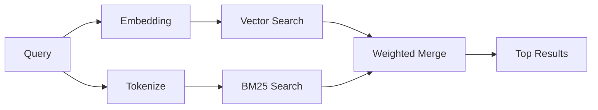

---
read_when:
    - Vuoi capire come funziona memory_search
    - Vuoi scegliere un provider di embedding
    - Vuoi ottimizzare la qualità della ricerca
summary: Come la ricerca in memoria trova note pertinenti usando embedding e recupero ibrido
title: Ricerca in memoria
x-i18n:
    generated_at: "2026-04-26T11:27:02Z"
    model: gpt-5.4
    provider: openai
    source_hash: 95d86fb3efe79aae92f5e3590f1c15fb0d8f3bb3301f8fe9a41f891e290d7a14
    source_path: concepts/memory-search.md
    workflow: 15
---

`memory_search` trova note pertinenti dai tuoi file di memoria, anche quando la
formulazione differisce dal testo originale. Funziona indicizzando la memoria in piccoli
chunk e cercandoli usando embedding, parole chiave o entrambi.

## Avvio rapido

Se hai configurato un abbonamento GitHub Copilot oppure una chiave API OpenAI, Gemini, Voyage o Mistral,
la ricerca in memoria funziona automaticamente. Per impostare esplicitamente
un provider:

```json5
{
  agents: {
    defaults: {
      memorySearch: {
        provider: "openai", // oppure "gemini", "local", "ollama", ecc.
      },
    },
  },
}
```

Per embedding locali senza chiave API, installa il pacchetto runtime opzionale `node-llama-cpp`
accanto a OpenClaw e usa `provider: "local"`.

## Provider supportati

| Provider       | ID               | Richiede chiave API | Note                                                 |
| -------------- | ---------------- | ------------------- | ---------------------------------------------------- |
| Bedrock        | `bedrock`        | No                  | Rilevato automaticamente quando la catena di credenziali AWS viene risolta |
| Gemini         | `gemini`         | Sì                  | Supporta indicizzazione di immagini/audio            |
| GitHub Copilot | `github-copilot` | No                  | Rilevato automaticamente, usa l'abbonamento Copilot  |
| Local          | `local`          | No                  | Modello GGUF, download di ~0,6 GB                    |
| Mistral        | `mistral`        | Sì                  | Rilevato automaticamente                             |
| Ollama         | `ollama`         | No                  | Locale, deve essere impostato esplicitamente         |
| OpenAI         | `openai`         | Sì                  | Rilevato automaticamente, veloce                     |
| Voyage         | `voyage`         | Sì                  | Rilevato automaticamente                             |

## Come funziona la ricerca

OpenClaw esegue due percorsi di recupero in parallelo e ne unisce i risultati:



- **Ricerca vettoriale** trova note con significato simile ("gateway host" corrisponde a
  "la macchina che esegue OpenClaw").
- **Ricerca per parole chiave BM25** trova corrispondenze esatte (ID, stringhe di errore, chiavi
  di configurazione).

Se è disponibile un solo percorso (nessun embedding o nessun FTS), viene eseguito solo l'altro.

Quando gli embedding non sono disponibili, OpenClaw usa comunque il ranking lessicale sui risultati FTS invece di ripiegare solo sull'ordinamento grezzo per corrispondenza esatta. Questa modalità degradata potenzia i chunk con una copertura più forte dei termini della query e percorsi file pertinenti, mantenendo utile il richiamo anche senza `sqlite-vec` o un provider di embedding.

## Migliorare la qualità della ricerca

Due funzionalità opzionali aiutano quando hai una cronologia di note molto ampia:

### Decadimento temporale

Le note vecchie perdono gradualmente peso nel ranking, così le informazioni recenti emergono per prime.
Con l'emivita predefinita di 30 giorni, una nota del mese scorso ottiene il 50% del
suo peso originale. I file evergreen come `MEMORY.md` non subiscono mai decadimento.

<Tip>
Abilita il decadimento temporale se il tuo agente ha mesi di note giornaliere e
le informazioni obsolete continuano a superare nel ranking il contesto recente.
</Tip>

### MMR (diversità)

Riduce i risultati ridondanti. Se cinque note menzionano tutte la stessa configurazione del router, MMR
fa sì che i risultati principali coprano argomenti diversi invece di ripetersi.

<Tip>
Abilita MMR se `memory_search` continua a restituire snippet quasi duplicati da
note giornaliere diverse.
</Tip>

### Abilitare entrambi

```json5
{
  agents: {
    defaults: {
      memorySearch: {
        query: {
          hybrid: {
            mmr: { enabled: true },
            temporalDecay: { enabled: true },
          },
        },
      },
    },
  },
}
```

## Memoria multimodale

Con Gemini Embedding 2, puoi indicizzare file di immagini e audio insieme al
Markdown. Le query di ricerca restano testuali, ma corrispondono al contenuto visivo e audio. Vedi il [Riferimento della configurazione della memoria](/it/reference/memory-config) per
la configurazione.

## Ricerca nella memoria della sessione

Puoi facoltativamente indicizzare le trascrizioni delle sessioni in modo che `memory_search` possa richiamare
conversazioni precedenti. Questa funzione è opt-in tramite
`memorySearch.experimental.sessionMemory`. Vedi il
[riferimento della configurazione](/it/reference/memory-config) per i dettagli.

## Risoluzione dei problemi

**Nessun risultato?** Esegui `openclaw memory status` per controllare l'indice. Se è vuoto, esegui
`openclaw memory index --force`.

**Solo corrispondenze per parole chiave?** Il tuo provider di embedding potrebbe non essere configurato. Controlla
`openclaw memory status --deep`.

**Gli embedding locali vanno in timeout?** `ollama`, `lmstudio` e `local` usano per impostazione predefinita
un timeout batch inline più lungo. Se l'host è semplicemente lento, imposta
`agents.defaults.memorySearch.sync.embeddingBatchTimeoutSeconds` ed esegui di nuovo
`openclaw memory index --force`.

**Testo CJK non trovato?** Ricostruisci l'indice FTS con
`openclaw memory index --force`.

## Approfondimenti

- [Active Memory](/it/concepts/active-memory) -- memoria del subagente per sessioni di chat interattive
- [Memory](/it/concepts/memory) -- layout dei file, backend, strumenti
- [Riferimento della configurazione della memoria](/it/reference/memory-config) -- tutte le opzioni di configurazione

## Correlati

- [Panoramica della memoria](/it/concepts/memory)
- [Active Memory](/it/concepts/active-memory)
- [Motore di memoria integrato](/it/concepts/memory-builtin)
