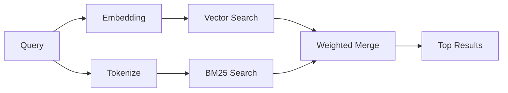

---
read_when:
    - Vuoi capire come funziona `memory_search`
    - Vuoi scegliere un provider di embedding
    - Vuoi regolare la qualità della ricerca
summary: Come la ricerca nella memoria trova note pertinenti usando embedding e recupero ibrido
title: Ricerca nella memoria
x-i18n:
    generated_at: "2026-04-25T13:45:21Z"
    model: gpt-5.4
    provider: openai
    source_hash: 5cc6bbaf7b0a755bbe44d3b1b06eed7f437ebdc41a81c48cca64bd08bbc546b7
    source_path: concepts/memory-search.md
    workflow: 15
---

`memory_search` trova note pertinenti dai tuoi file di memoria, anche quando la
formulazione è diversa dal testo originale. Funziona indicizzando la memoria in piccoli
blocchi e cercandoli usando embedding, parole chiave oppure entrambi.

## Avvio rapido

Se hai configurato una sottoscrizione GitHub Copilot, oppure una chiave API di OpenAI, Gemini, Voyage o Mistral,
la ricerca nella memoria funziona automaticamente. Per impostare un provider
in modo esplicito:

```json5
{
  agents: {
    defaults: {
      memorySearch: {
        provider: "openai", // oppure "gemini", "local", "ollama", ecc.
      },
    },
  },
}
```

Per embedding locali senza chiave API, installa il pacchetto runtime opzionale `node-llama-cpp`
accanto a OpenClaw e usa `provider: "local"`.

## Provider supportati

| Provider       | ID               | Richiede chiave API | Note                                                     |
| -------------- | ---------------- | ------------------- | -------------------------------------------------------- |
| Bedrock        | `bedrock`        | No                  | Rilevato automaticamente quando la catena credenziali AWS viene risolta |
| Gemini         | `gemini`         | Sì                  | Supporta l'indicizzazione di immagini/audio              |
| GitHub Copilot | `github-copilot` | No                  | Rilevato automaticamente, usa la sottoscrizione Copilot  |
| Local          | `local`          | No                  | Modello GGUF, download di ~0,6 GB                        |
| Mistral        | `mistral`        | Sì                  | Rilevato automaticamente                                 |
| Ollama         | `ollama`         | No                  | Locale, deve essere impostato esplicitamente             |
| OpenAI         | `openai`         | Sì                  | Rilevato automaticamente, veloce                         |
| Voyage         | `voyage`         | Sì                  | Rilevato automaticamente                                 |

## Come funziona la ricerca

OpenClaw esegue due percorsi di recupero in parallelo e unisce i risultati:



- **Ricerca vettoriale** trova note con significato simile ("gateway host" corrisponde
  a "la macchina che esegue OpenClaw").
- **Ricerca per parole chiave BM25** trova corrispondenze esatte (ID, stringhe di errore, chiavi di configurazione).

Se è disponibile un solo percorso (nessun embedding o nessun FTS), viene eseguito da solo l'altro.

Quando gli embedding non sono disponibili, OpenClaw continua a usare il ranking lessicale sui risultati FTS invece di tornare solo all'ordinamento grezzo per corrispondenza esatta. Questa modalità degradata aumenta il peso dei blocchi con una copertura più forte dei termini della query e con percorsi file pertinenti, mantenendo utile il richiamo anche senza `sqlite-vec` o un provider di embedding.

## Migliorare la qualità della ricerca

Due funzionalità opzionali aiutano quando hai una cronologia ampia di note:

### Decadimento temporale

Le note vecchie perdono gradualmente peso nel ranking, così le informazioni recenti emergono per prime.
Con l'emivita predefinita di 30 giorni, una nota del mese scorso ottiene un punteggio pari al 50% del
suo peso originale. I file sempreverdi come `MEMORY.md` non subiscono mai decadimento.

<Tip>
Abilita il decadimento temporale se il tuo agente ha mesi di note giornaliere e le
informazioni obsolete continuano a superare nel ranking il contesto recente.
</Tip>

### MMR (diversità)

Riduce i risultati ridondanti. Se cinque note menzionano tutte la stessa configurazione del router, MMR
fa sì che i risultati principali coprano argomenti diversi invece di ripetersi.

<Tip>
Abilita MMR se `memory_search` continua a restituire frammenti quasi duplicati da
note giornaliere diverse.
</Tip>

### Abilitare entrambi

```json5
{
  agents: {
    defaults: {
      memorySearch: {
        query: {
          hybrid: {
            mmr: { enabled: true },
            temporalDecay: { enabled: true },
          },
        },
      },
    },
  },
}
```

## Memoria multimodale

Con Gemini Embedding 2, puoi indicizzare immagini e file audio insieme a
Markdown. Le query di ricerca restano testuali, ma trovano corrispondenze con contenuti visivi e audio. Vedi il [riferimento della configurazione della memoria](/it/reference/memory-config) per
la configurazione.

## Ricerca nella memoria di sessione

Puoi opzionalmente indicizzare le trascrizioni di sessione così `memory_search` può richiamare
conversazioni precedenti. Questa funzione è opt-in tramite
`memorySearch.experimental.sessionMemory`. Vedi il
[riferimento della configurazione](/it/reference/memory-config) per i dettagli.

## Risoluzione dei problemi

**Nessun risultato?** Esegui `openclaw memory status` per controllare l'indice. Se è vuoto, esegui
`openclaw memory index --force`.

**Solo corrispondenze per parole chiave?** Il tuo provider di embedding potrebbe non essere configurato. Controlla
`openclaw memory status --deep`.

**Testo CJK non trovato?** Ricostruisci l'indice FTS con
`openclaw memory index --force`.

## Approfondimenti

- [Active Memory](/it/concepts/active-memory) -- memoria del subagente per sessioni di chat interattive
- [Memoria](/it/concepts/memory) -- layout dei file, backend, strumenti
- [Riferimento della configurazione della memoria](/it/reference/memory-config) -- tutte le opzioni di configurazione

## Correlati

- [Panoramica della memoria](/it/concepts/memory)
- [Active Memory](/it/concepts/active-memory)
- [Motore di memoria integrato](/it/concepts/memory-builtin)
