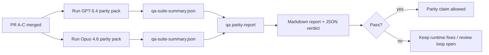

---
read_when:
    - Revisione della serie di PR sulla parità GPT-5.4 / Codex
    - Mantenere l'architettura agentica a sei contratti alla base del programma di parità
summary: Come rivedere il programma di parità GPT-5.4 / Codex come quattro unità di merge
title: Note del maintainer sulla parità GPT-5.4 / Codex
x-i18n:
    generated_at: "2026-04-22T04:22:52Z"
    model: gpt-5.4
    provider: openai
    source_hash: b872d6a33b269c01b44537bfa8646329063298fdfcd3671a17d0eadbc9da5427
    source_path: help/gpt54-codex-agentic-parity-maintainers.md
    workflow: 15
---

# Note del maintainer sulla parità GPT-5.4 / Codex

Questa nota spiega come rivedere il programma di parità GPT-5.4 / Codex come quattro unità di merge senza perdere l'architettura originale a sei contratti.

## Unità di merge

### PR A: esecuzione strict-agentic

Possiede:

- `executionContract`
- follow-through nello stesso turno con priorità a GPT-5
- `update_plan` come tracciamento del progresso non terminale
- stati di blocco espliciti invece di arresti silenziosi solo basati sul piano

Non possiede:

- classificazione dei guasti auth/runtime
- veridicità dei permessi
- riprogettazione di replay/continuazione
- benchmarking della parità

### PR B: veridicità del runtime

Possiede:

- correttezza dello scope OAuth di Codex
- classificazione tipizzata dei guasti provider/runtime
- disponibilità veritiera di `/elevated full` e motivi di blocco

Non possiede:

- normalizzazione dello schema degli strumenti
- stato di replay/liveness
- gating del benchmark

### PR C: correttezza dell'esecuzione

Possiede:

- compatibilità degli strumenti OpenAI/Codex posseduta dal provider
- gestione strict dello schema senza parametri
- esposizione di replay-invalid
- visibilità dello stato paused, blocked e abandoned per task di lunga durata

Non possiede:

- continuazione autoeletta
- comportamento generico del dialetto Codex al di fuori degli hook del provider
- gating del benchmark

### PR D: harness di parità

Possiede:

- primo pacchetto di scenari GPT-5.4 vs Opus 4.6
- documentazione della parità
- meccaniche del report di parità e del release gate

Non possiede:

- cambiamenti di comportamento del runtime al di fuori di QA-lab
- simulazione auth/proxy/DNS all'interno dell'harness

## Mappatura ai sei contratti originali

| Contratto originale                     | Unità di merge |
| --------------------------------------- | -------------- |
| Correttezza del transport/auth provider | PR B           |
| Compatibilità contratto/schema strumenti | PR C          |
| Esecuzione nello stesso turno           | PR A           |
| Veridicità dei permessi                 | PR B           |
| Correttezza replay/continuazione/liveness | PR C         |
| Benchmark/release gate                  | PR D           |

## Ordine di revisione

1. PR A
2. PR B
3. PR C
4. PR D

PR D è il livello di prova. Non dovrebbe essere il motivo per cui le PR di correttezza del runtime vengono ritardate.

## Cosa cercare

### PR A

- le esecuzioni GPT-5 agiscono o falliscono in modalità chiusa invece di fermarsi al commento
- `update_plan` non sembra più progresso da solo
- il comportamento resta con priorità a GPT-5 e limitato a embedded-Pi

### PR B

- i guasti auth/proxy/runtime smettono di collassare in una gestione generica “model failed”
- `/elevated full` viene descritto come disponibile solo quando lo è davvero
- i motivi di blocco sono visibili sia al modello sia al runtime rivolto all'utente

### PR C

- la registrazione strict degli strumenti OpenAI/Codex si comporta in modo prevedibile
- gli strumenti senza parametri non falliscono i controlli strict dello schema
- gli esiti di replay e Compaction preservano uno stato di liveness veritiero

### PR D

- il pacchetto di scenari è comprensibile e riproducibile
- il pacchetto include una lane mutating replay-safety, non solo flussi in sola lettura
- i report sono leggibili da esseri umani e automazione
- le affermazioni di parità sono supportate da prove, non aneddotiche

Artifact attesi da PR D:

- `qa-suite-report.md` / `qa-suite-summary.json` per ogni esecuzione del modello
- `qa-agentic-parity-report.md` con confronto aggregato e a livello di scenario
- `qa-agentic-parity-summary.json` con un verdetto leggibile da macchina

## Release gate

Non affermare parità o superiorità di GPT-5.4 rispetto a Opus 4.6 finché:

- PR A, PR B e PR C non sono mergeate
- PR D non esegue in modo pulito il primo pacchetto di parità
- le suite di regressione runtime-truthfulness restano verdi
- il report di parità non mostra casi di fake-success e nessuna regressione nel comportamento di arresto

L'harness di parità non è l'unica fonte di prove. Mantieni esplicita questa separazione nella revisione:

- PR D possiede il confronto basato su scenari GPT-5.4 vs Opus 4.6
- le suite deterministiche di PR B restano proprietarie delle prove su auth/proxy/DNS e veridicità dell'accesso completo

## Mappa obiettivo-prove

| Voce del completion gate                | Proprietario principale | Artifact di revisione                                               |
| --------------------------------------- | ----------------------- | ------------------------------------------------------------------- |
| Nessuno stallo solo-piano               | PR A                    | test runtime strict-agentic e `approval-turn-tool-followthrough`    |
| Nessun falso progresso o falso completamento strumenti | PR A + PR D | conteggio fake-success della parità più dettagli del report a livello di scenario |
| Nessuna guida falsa su `/elevated full` | PR B                    | suite deterministiche runtime-truthfulness                          |
| I guasti replay/liveness restano espliciti | PR C + PR D          | suite lifecycle/replay più `compaction-retry-mutating-tool`         |
| GPT-5.4 eguaglia o supera Opus 4.6      | PR D                    | `qa-agentic-parity-report.md` e `qa-agentic-parity-summary.json`    |

## Abbreviazione per i reviewer: prima vs dopo

| Problema visibile all'utente prima                      | Segnale di revisione dopo                                                                 |
| ------------------------------------------------------- | ----------------------------------------------------------------------------------------- |
| GPT-5.4 si fermava dopo la pianificazione               | PR A mostra comportamento act-or-block invece di completamento solo-commento              |
| L'uso degli strumenti sembrava fragile con schemi strict OpenAI/Codex | PR C mantiene prevedibili registrazione degli strumenti e invocazione senza parametri |
| I suggerimenti `/elevated full` erano talvolta fuorvianti | PR B collega la guida alla reale capacità del runtime e ai motivi di blocco             |
| I task lunghi potevano sparire nell'ambiguità di replay/Compaction | PR C emette stato esplicito paused, blocked, abandoned e replay-invalid          |
| Le affermazioni di parità erano aneddotiche            | PR D produce un report più un verdetto JSON con la stessa copertura di scenari su entrambi i modelli |
