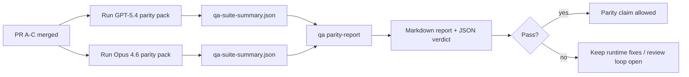

---
read_when:
    - Revisione della serie di PR sulla parità GPT-5.4 / Codex
    - Manutenzione dell'architettura agentica a sei contratti alla base del programma di parità
summary: Come esaminare il programma di parità GPT-5.4 / Codex come quattro unità di merge
title: Note del maintainer sulla parità GPT-5.4 / Codex
x-i18n:
    generated_at: "2026-04-25T13:49:06Z"
    model: gpt-5.4
    provider: openai
    source_hash: 162ea68476880d4dbf9b8c3b9397a51a2732c3eb10ac52e421a9c9d90e04eec2
    source_path: help/gpt54-codex-agentic-parity-maintainers.md
    workflow: 15
---

Questa nota spiega come esaminare il programma di parità GPT-5.4 / Codex come quattro unità di merge senza perdere l'architettura originale a sei contratti.

## Unità di merge

### PR A: esecuzione strict-agentic

Gestisce:

- `executionContract`
- same-turn follow-through GPT-5-first
- `update_plan` come tracciamento del progresso non terminale
- stati bloccati espliciti invece di arresti silenziosi basati solo sul piano

Non gestisce:

- classificazione degli errori di autenticazione/runtime
- veridicità dei permessi
- riprogettazione di replay/continuazione
- benchmarking della parità

### PR B: veridicità del runtime

Gestisce:

- correttezza dell'ambito OAuth Codex
- classificazione tipizzata degli errori provider/runtime
- disponibilità veritiera di `/elevated full` e motivi del blocco

Non gestisce:

- normalizzazione dello schema degli strumenti
- stato di replay/liveness
- gating del benchmark

### PR C: correttezza dell'esecuzione

Gestisce:

- compatibilità degli strumenti OpenAI/Codex posseduta dal provider
- gestione rigorosa degli schemi senza parametri
- esposizione di replay-invalid
- visibilità dello stato dei task lunghi in pausa, bloccati e abbandonati

Non gestisce:

- continuazione autoeletta
- comportamento generico del dialetto Codex al di fuori degli hook del provider
- gating del benchmark

### PR D: harness di parità

Gestisce:

- primo pacchetto di scenari GPT-5.4 vs Opus 4.6
- documentazione della parità
- meccaniche del report di parità e del release gate

Non gestisce:

- modifiche al comportamento del runtime al di fuori di qa-lab
- simulazione auth/proxy/DNS all'interno dell'harness

## Mappatura ai sei contratti originali

| Contratto originale                      | Unità di merge |
| ---------------------------------------- | -------------- |
| Correttezza di transport/auth del provider | PR B         |
| Compatibilità contratto/schema degli strumenti | PR C      |
| Esecuzione same-turn                     | PR A           |
| Veridicità dei permessi                  | PR B           |
| Correttezza di replay/continuazione/liveness | PR C      |
| Benchmark/release gate                   | PR D           |

## Ordine di revisione

1. PR A
2. PR B
3. PR C
4. PR D

PR D è il livello di prova. Non dovrebbe essere il motivo per ritardare le PR di correttezza del runtime.

## Cosa cercare

### PR A

- le esecuzioni GPT-5 agiscono o falliscono in modalità chiusa invece di fermarsi al commento
- `update_plan` non sembra più progresso di per sé
- il comportamento resta con ambito GPT-5-first e embedded-Pi

### PR B

- i guasti auth/proxy/runtime smettono di collassare nella gestione generica “model failed”
- `/elevated full` viene descritto come disponibile solo quando lo è davvero
- i motivi del blocco sono visibili sia al modello sia al runtime rivolto all'utente

### PR C

- la registrazione rigorosa degli strumenti OpenAI/Codex si comporta in modo prevedibile
- gli strumenti senza parametri non falliscono i controlli rigorosi dello schema
- gli esiti di replay e Compaction preservano uno stato di liveness veritiero

### PR D

- il pacchetto di scenari è comprensibile e riproducibile
- il pacchetto include una corsia mutating replay-safety, non solo flussi in sola lettura
- i report sono leggibili sia dagli esseri umani sia dall'automazione
- le affermazioni di parità sono supportate da prove, non aneddotiche

Artefatti attesi da PR D:

- `qa-suite-report.md` / `qa-suite-summary.json` per ogni esecuzione del modello
- `qa-agentic-parity-report.md` con confronto aggregato e a livello di scenario
- `qa-agentic-parity-summary.json` con un verdetto leggibile da macchina

## Release gate

Non affermare parità o superiorità di GPT-5.4 su Opus 4.6 finché:

- PR A, PR B e PR C non sono stati uniti
- PR D non esegue in modo pulito il primo pacchetto di parità
- le suite di regressione runtime-truthfulness restano verdi
- il report di parità non mostra casi di fake-success né regressioni nel comportamento di arresto

L'harness di parità non è l'unica fonte di prova. Mantieni esplicita questa separazione nella revisione:

- PR D gestisce il confronto basato su scenari GPT-5.4 vs Opus 4.6
- le suite deterministiche di PR B continuano a gestire le prove su auth/proxy/DNS e sulla veridicità del full-access

## Flusso rapido di merge per maintainer

Usalo quando sei pronto a integrare una PR di parità e vuoi una sequenza ripetibile e a basso rischio.

1. Conferma che il livello di prova sia soddisfatto prima del merge:
   - sintomo riproducibile o test in errore
   - root cause verificata nel codice toccato
   - fix nel percorso implicato
   - test di regressione o nota esplicita di verifica manuale
2. Triage/etichettatura prima del merge:
   - applica eventuali etichette `r:*` di auto-close quando la PR non deve essere integrata
   - mantieni i candidati al merge privi di thread bloccanti non risolti
3. Convalida localmente sulla superficie toccata:
   - `pnpm check:changed`
   - `pnpm test:changed` quando i test sono cambiati o la fiducia nel fix del bug dipende dalla copertura di test
4. Integra con il flusso standard del maintainer (processo `/landpr`), poi verifica:
   - comportamento di auto-close delle issue collegate
   - CI e stato post-merge su `main`
5. Dopo l'integrazione, esegui una ricerca di duplicati per PR/issue aperte correlate e chiudi solo con un riferimento canonico.

Se manca anche solo uno degli elementi del livello di prova, richiedi modifiche invece di integrare.

## Mappa obiettivo-prova

| Voce del completion gate                 | Proprietario principale | Artefatto di revisione                                            |
| ---------------------------------------- | ----------------------- | ----------------------------------------------------------------- |
| Nessun blocco dovuto solo al piano       | PR A                    | test runtime strict-agentic e `approval-turn-tool-followthrough`  |
| Nessun falso progresso o falso completamento degli strumenti | PR A + PR D | conteggio di fake-success nella parità più dettagli del report a livello di scenario |
| Nessuna guida falsa su `/elevated full`  | PR B                    | suite deterministiche runtime-truthfulness                        |
| I guasti di replay/liveness restano espliciti | PR C + PR D        | suite lifecycle/replay più `compaction-retry-mutating-tool`       |
| GPT-5.4 eguaglia o supera Opus 4.6       | PR D                    | `qa-agentic-parity-report.md` e `qa-agentic-parity-summary.json`  |

## Abbreviazioni per i reviewer: prima vs dopo

| Problema visibile all'utente prima                         | Segnale di revisione dopo                                                               |
| ---------------------------------------------------------- | --------------------------------------------------------------------------------------- |
| GPT-5.4 si fermava dopo la pianificazione                  | PR A mostra un comportamento act-or-block invece di un completamento solo commentato   |
| L'uso degli strumenti sembrava fragile con schemi rigorosi OpenAI/Codex | PR C mantiene prevedibili registrazione degli strumenti e invocazione senza parametri |
| I suggerimenti `/elevated full` a volte erano fuorvianti   | PR B collega i suggerimenti alla capacità runtime reale e ai motivi del blocco         |
| I task lunghi potevano sparire nell'ambiguità di replay/Compaction | PR C emette stati espliciti paused, blocked, abandoned e replay-invalid          |
| Le affermazioni di parità erano aneddotiche                | PR D produce un report più un verdetto JSON con la stessa copertura di scenari su entrambi i modelli |

## Correlati

- [Parità agentica GPT-5.4 / Codex](/it/help/gpt54-codex-agentic-parity)
