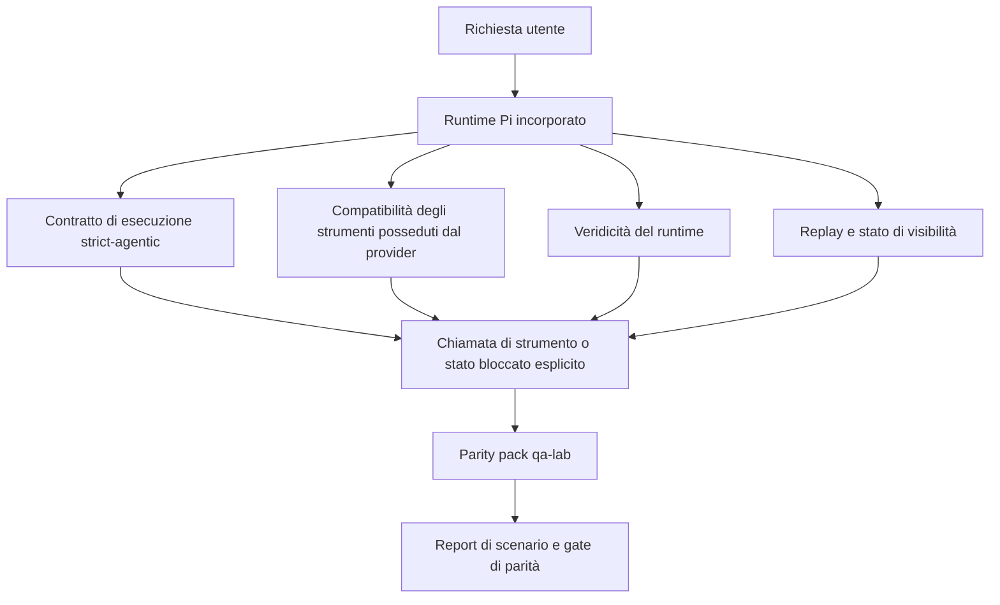
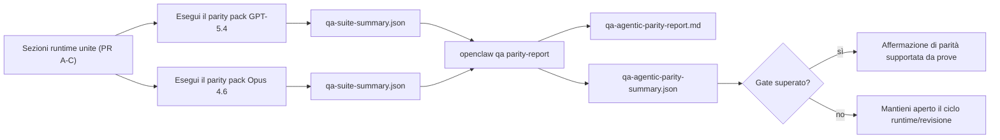

---
read_when:
    - Debug del comportamento agentico di GPT-5.4 o Codex
    - Confronto del comportamento agentico di OpenClaw tra modelli frontier
    - Revisione delle correzioni strict-agentic, tool-schema, elevation e replay
summary: Come OpenClaw colma le lacune di esecuzione agentica per GPT-5.4 e i modelli in stile Codex
title: Parità agentica GPT-5.4 / Codex
x-i18n:
    generated_at: "2026-04-22T04:22:55Z"
    model: gpt-5.4
    provider: openai
    source_hash: 77bc9b8fab289bd35185fa246113503b3f5c94a22bd44739be07d39ae6779056
    source_path: help/gpt54-codex-agentic-parity.md
    workflow: 15
---

# Parità agentica GPT-5.4 / Codex in OpenClaw

OpenClaw funzionava già bene con i modelli frontier che usano strumenti, ma GPT-5.4 e i modelli in stile Codex continuavano a rendere meno bene in alcuni aspetti pratici:

- potevano fermarsi dopo la pianificazione invece di eseguire il lavoro
- potevano usare in modo errato gli schemi degli strumenti OpenAI/Codex strict
- potevano chiedere `/elevated full` anche quando l'accesso completo era impossibile
- potevano perdere lo stato delle attività di lunga durata durante replay o Compaction
- le affermazioni di parità rispetto a Claude Opus 4.6 si basavano su aneddoti invece che su scenari ripetibili

Questo programma di parità colma queste lacune in quattro sezioni verificabili.

## Cosa è cambiato

### PR A: esecuzione strict-agentic

Questa sezione aggiunge un contratto di esecuzione `strict-agentic` opt-in per le esecuzioni GPT-5 incorporate su Pi.

Quando è abilitato, OpenClaw smette di accettare turni solo di pianificazione come completamento “abbastanza buono”. Se il modello si limita a dire cosa intende fare e non usa davvero strumenti né compie progressi, OpenClaw riprova con un indirizzamento act-now e poi fallisce in modalità chiusa con uno stato bloccato esplicito invece di terminare silenziosamente l'attività.

Questo migliora soprattutto l'esperienza GPT-5.4 in:

- brevi follow-up “ok fallo”
- attività di codice in cui il primo passo è ovvio
- flussi in cui `update_plan` dovrebbe tracciare i progressi invece di essere testo riempitivo

### PR B: veridicità del runtime

Questa sezione fa sì che OpenClaw dica la verità su due cose:

- perché la chiamata del provider/runtime è fallita
- se `/elevated full` è davvero disponibile

Questo significa che GPT-5.4 riceve segnali runtime migliori per scope mancanti, errori di refresh dell'autenticazione, errori di autenticazione HTML 403, problemi di proxy, errori DNS o timeout e modalità di accesso completo bloccate. Il modello ha meno probabilità di allucinare la correzione sbagliata o di continuare a chiedere una modalità di permessi che il runtime non può fornire.

### PR C: correttezza dell'esecuzione

Questa sezione migliora due tipi di correttezza:

- compatibilità con gli schemi degli strumenti OpenAI/Codex posseduti dal provider
- visibilità di replay e stato di attività lunghe

Il lavoro sulla compatibilità degli strumenti riduce l'attrito degli schemi per la registrazione strict degli strumenti OpenAI/Codex, soprattutto per gli strumenti senza parametri e le aspettative strict sull'oggetto radice. Il lavoro su replay/visibilità rende più osservabili le attività di lunga durata, così gli stati in pausa, bloccati e abbandonati sono visibili invece di sparire in un generico testo di errore.

### PR D: harness di parità

Questa sezione aggiunge il parity pack di prima ondata di qa-lab in modo che GPT-5.4 e Opus 4.6 possano essere esercitati sugli stessi scenari e confrontati usando prove condivise.

Il parity pack è il livello di prova. Da solo non modifica il comportamento del runtime.

Dopo aver ottenuto due artifact `qa-suite-summary.json`, genera il confronto di release-gate con:

```bash
pnpm openclaw qa parity-report \
  --repo-root . \
  --candidate-summary .artifacts/qa-e2e/gpt54/qa-suite-summary.json \
  --baseline-summary .artifacts/qa-e2e/opus46/qa-suite-summary.json \
  --output-dir .artifacts/qa-e2e/parity
```

Quel comando scrive:

- un report Markdown leggibile da persone
- un verdetto JSON leggibile da macchina
- un risultato di gate esplicito `pass` / `fail`

## Perché questo migliora GPT-5.4 nella pratica

Prima di questo lavoro, GPT-5.4 su OpenClaw poteva sembrare meno agentico di Opus nelle sessioni di coding reali perché il runtime tollerava comportamenti particolarmente dannosi per i modelli in stile GPT-5:

- turni di solo commento
- attrito di schema attorno agli strumenti
- feedback dei permessi vago
- rotture silenziose di replay o Compaction

L'obiettivo non è far imitare Opus a GPT-5.4. L'obiettivo è fornire a GPT-5.4 un contratto runtime che premi il progresso reale, offra semantiche più pulite per strumenti e permessi e trasformi le modalità di errore in stati espliciti leggibili sia da macchina sia da persone.

Questo cambia l'esperienza utente da:

- “il modello aveva un buon piano ma si è fermato”

a:

- “il modello o ha agito, oppure OpenClaw ha mostrato il motivo esatto per cui non poteva farlo”

## Prima e dopo per gli utenti GPT-5.4

| Prima di questo programma                                                                  | Dopo PR A-D                                                                              |
| ------------------------------------------------------------------------------------------ | ---------------------------------------------------------------------------------------- |
| GPT-5.4 poteva fermarsi dopo un piano ragionevole senza eseguire il passo di strumento successivo | PR A trasforma “solo piano” in “agisci ora o mostra uno stato bloccato”                 |
| Gli schemi strict degli strumenti potevano rifiutare strumenti senza parametri o con forma OpenAI/Codex in modi confusi | PR C rende più prevedibili registrazione e invocazione degli strumenti posseduti dal provider |
| La guida `/elevated full` poteva essere vaga o errata in runtime bloccati                  | PR B fornisce a GPT-5.4 e all'utente suggerimenti veritieri su runtime e permessi       |
| I fallimenti di replay o Compaction potevano dare l'impressione che l'attività fosse sparita silenziosamente | PR C mostra esplicitamente esiti in pausa, bloccati, abbandonati e replay-invalid       |
| “GPT-5.4 sembra peggiore di Opus” era per lo più aneddotico                                | PR D lo trasforma nello stesso pacchetto di scenari, nelle stesse metriche e in un gate rigido pass/fail |

## Architettura



## Flusso di release



## Pacchetto di scenari

Il parity pack di prima ondata al momento copre cinque scenari:

### `approval-turn-tool-followthrough`

Verifica che il modello non si fermi a “lo farò” dopo una breve approvazione. Dovrebbe eseguire la prima azione concreta nello stesso turno.

### `model-switch-tool-continuity`

Verifica che il lavoro con strumenti resti coerente attraverso i confini di cambio modello/runtime invece di reimpostarsi in commento o perdere il contesto di esecuzione.

### `source-docs-discovery-report`

Verifica che il modello possa leggere codice sorgente e documentazione, sintetizzare i risultati e continuare l'attività in modo agentico invece di produrre un riepilogo superficiale e fermarsi presto.

### `image-understanding-attachment`

Verifica che le attività a modalità mista che coinvolgono allegati restino eseguibili e non collassino in una narrazione vaga.

### `compaction-retry-mutating-tool`

Verifica che un'attività con una vera scrittura mutante mantenga esplicita la non sicurezza del replay invece di sembrare silenziosamente replay-safe se l'esecuzione subisce Compaction, retry o perde lo stato della risposta sotto pressione.

## Matrice degli scenari

| Scenario                           | Cosa verifica                              | Buon comportamento GPT-5.4                                                    | Segnale di errore                                                                |
| ---------------------------------- | ------------------------------------------ | ------------------------------------------------------------------------------ | --------------------------------------------------------------------------------- |
| `approval-turn-tool-followthrough` | Turni di approvazione brevi dopo un piano  | Avvia subito la prima azione concreta con strumento invece di ripetere l'intento | follow-up di solo piano, nessuna attività di strumento o turno bloccato senza un vero blocco |
| `model-switch-tool-continuity`     | Cambio runtime/modello durante uso di strumenti | Conserva il contesto dell'attività e continua ad agire in modo coerente        | si reimposta in commento, perde il contesto degli strumenti o si ferma dopo il cambio |
| `source-docs-discovery-report`     | Lettura del sorgente + sintesi + azione    | Trova le fonti, usa strumenti e produce un report utile senza bloccarsi        | riepilogo superficiale, lavoro con strumenti mancante o arresto a turno incompleto |
| `image-understanding-attachment`   | Lavoro agentico guidato da allegati        | Interpreta l'allegato, lo collega agli strumenti e continua l'attività         | narrazione vaga, allegato ignorato o nessuna azione concreta successiva           |
| `compaction-retry-mutating-tool`   | Lavoro mutante sotto pressione di Compaction | Esegue una vera scrittura e mantiene esplicita la non sicurezza del replay dopo l'effetto collaterale | avviene una scrittura mutante ma la sicurezza del replay è implicita, mancante o contraddittoria |

## Gate di release

GPT-5.4 può essere considerato alla pari o migliore solo quando il runtime unito supera contemporaneamente il parity pack e le regressioni di veridicità del runtime.

Esiti richiesti:

- nessun blocco di solo piano quando la prossima azione di strumento è chiara
- nessun falso completamento senza esecuzione reale
- nessuna guida `/elevated full` errata
- nessun abbandono silenzioso di replay o Compaction
- metriche del parity pack almeno forti quanto la baseline concordata di Opus 4.6

Per l'harness di prima ondata, il gate confronta:

- tasso di completamento
- tasso di arresto non intenzionale
- tasso di chiamate di strumento valide
- conteggio dei falsi successi

Le prove di parità sono intenzionalmente divise in due livelli:

- PR D dimostra con qa-lab il comportamento GPT-5.4 vs Opus 4.6 sugli stessi scenari
- le suite deterministiche di PR B dimostrano veridicità di autenticazione, proxy, DNS e `/elevated full` fuori dall'harness

## Matrice obiettivo-prova

| Elemento del gate di completamento                         | PR responsabile | Fonte di prova                                                     | Segnale di superamento                                                                 |
| ---------------------------------------------------------- | --------------- | ------------------------------------------------------------------ | --------------------------------------------------------------------------------------- |
| GPT-5.4 non si blocca più dopo la pianificazione           | PR A            | `approval-turn-tool-followthrough` più suite runtime PR A          | i turni di approvazione attivano lavoro reale o uno stato bloccato esplicito           |
| GPT-5.4 non finge più progresso o completamento fittizio dello strumento | PR A + PR D     | esiti degli scenari nel parity report e conteggio dei falsi successi | nessun risultato di superamento sospetto e nessun completamento di solo commento       |
| GPT-5.4 non fornisce più falsa guida `/elevated full`      | PR B            | suite deterministiche di veridicità                                | i motivi di blocco e i suggerimenti di accesso completo restano accurati rispetto al runtime |
| I fallimenti di replay/visibilità restano espliciti        | PR C + PR D     | suite di ciclo di vita/replay PR C più `compaction-retry-mutating-tool` | il lavoro mutante mantiene esplicita la non sicurezza del replay invece di sparire silenziosamente |
| GPT-5.4 eguaglia o supera Opus 4.6 sulle metriche concordate | PR D            | `qa-agentic-parity-report.md` e `qa-agentic-parity-summary.json`   | stessa copertura di scenari e nessuna regressione su completamento, comportamento di arresto o uso valido degli strumenti |

## Come leggere il verdetto di parità

Usa il verdetto in `qa-agentic-parity-summary.json` come decisione finale leggibile da macchina per il parity pack di prima ondata.

- `pass` significa che GPT-5.4 ha coperto gli stessi scenari di Opus 4.6 e non è regredito nelle metriche aggregate concordate.
- `fail` significa che è scattato almeno un gate rigido: completamento più debole, arresti non intenzionali peggiori, uso valido degli strumenti più debole, qualsiasi caso di falso successo o copertura degli scenari non corrispondente.
- “shared/base CI issue” non è di per sé un risultato di parità. Se rumore CI esterno a PR D blocca un'esecuzione, il verdetto dovrebbe attendere un'esecuzione pulita del runtime unito invece di essere dedotto dai log dell'epoca del branch.
- L'autenticazione, il proxy, il DNS e la veridicità di `/elevated full` continuano a provenire dalle suite deterministiche di PR B, quindi l'affermazione finale di release richiede entrambe le cose: un verdetto di parità PR D superato e una copertura di veridicità PR B verde.

## Chi dovrebbe abilitare `strict-agentic`

Usa `strict-agentic` quando:

- ci si aspetta che l'agente agisca immediatamente quando il passo successivo è ovvio
- GPT-5.4 o i modelli della famiglia Codex sono il runtime principale
- preferisci stati bloccati espliciti invece di risposte “utili” di solo riepilogo

Mantieni il contratto predefinito quando:

- vuoi il comportamento esistente più permissivo
- non stai usando modelli della famiglia GPT-5
- stai testando i prompt invece dell'applicazione del runtime
