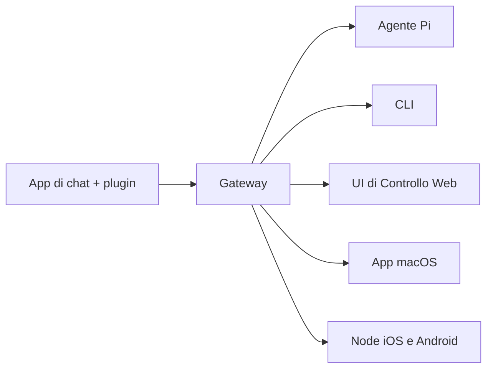

---
read_when:
    - Presentazione di OpenClaw ai nuovi utenti
summary: OpenClaw è un Gateway multicanale per agenti AI che funziona su qualsiasi sistema operativo.
title: OpenClaw
x-i18n:
    generated_at: "2026-04-22T04:23:15Z"
    model: gpt-5.4
    provider: openai
    source_hash: 923d34fa604051d502e4bc902802d6921a4b89a9447f76123aa8d2ff085f0b99
    source_path: index.md
    workflow: 15
---

# OpenClaw 🦞

<p align="center">
    
    
</p>

> _"EXFOLIATE! EXFOLIATE!"_ — Un'aragosta spaziale, probabilmente

<p align="center">
  <strong>Gateway per qualsiasi sistema operativo per agenti AI su Discord, Google Chat, iMessage, Matrix, Microsoft Teams, Signal, Slack, Telegram, WhatsApp, Zalo e altro ancora.</strong><br />
  Invia un messaggio, ricevi una risposta da un agente dal tuo taschino. Esegui un Gateway su canali integrati, plugin di canale inclusi, WebChat e Node mobili.
</p>

<Columns>
  <Card title="Per iniziare" href="/it/start/getting-started" icon="rocket">
    Installa OpenClaw e avvia il Gateway in pochi minuti.
  </Card>
  <Card title="Esegui l'onboarding" href="/it/start/wizard" icon="sparkles">
    Configurazione guidata con `openclaw onboard` e flussi di abbinamento.
  </Card>
  <Card title="Apri la UI di controllo" href="/web/control-ui" icon="layout-dashboard">
    Avvia la dashboard nel browser per chat, configurazione e sessioni.
  </Card>
</Columns>

## Che cos'è OpenClaw?

OpenClaw è un **Gateway self-hosted** che collega le tue app di chat e superfici di canale preferite — canali integrati più plugin di canale inclusi o esterni come Discord, Google Chat, iMessage, Matrix, Microsoft Teams, Signal, Slack, Telegram, WhatsApp, Zalo e altri — ad agenti AI di coding come Pi. Esegui un singolo processo Gateway sulla tua macchina (o su un server), e questo diventa il ponte tra le tue app di messaggistica e un assistente AI sempre disponibile.

**Per chi è?** Sviluppatori e power user che vogliono un assistente AI personale a cui poter scrivere da qualsiasi luogo — senza rinunciare al controllo dei propri dati o dipendere da un servizio ospitato.

**Cosa lo rende diverso?**

- **Self-hosted**: gira sul tuo hardware, con le tue regole
- **Multicanale**: un Gateway serve contemporaneamente canali integrati più plugin di canale inclusi o esterni
- **Nativo per agenti**: progettato per agenti di coding con uso di strumenti, sessioni, memoria e instradamento multi-agent
- **Open source**: con licenza MIT, guidato dalla comunità

**Di cosa hai bisogno?** Node 24 (consigliato), oppure Node 22 LTS (`22.14+`) per compatibilità, una chiave API del provider scelto e 5 minuti. Per qualità e sicurezza ottimali, usa il modello di ultima generazione più potente disponibile.

## Come funziona



Il Gateway è l'unica fonte di verità per sessioni, instradamento e connessioni ai canali.

## Capacità principali

<Columns>
  <Card title="Gateway multicanale" icon="network" href="/it/channels">
    Discord, iMessage, Signal, Slack, Telegram, WhatsApp, WebChat e altro con un singolo processo Gateway.
  </Card>
  <Card title="Canali Plugin" icon="plug" href="/it/tools/plugin">
    I plugin inclusi aggiungono Matrix, Nostr, Twitch, Zalo e altro nelle normali release correnti.
  </Card>
  <Card title="Instradamento multi-agent" icon="route" href="/it/concepts/multi-agent">
    Sessioni isolate per agente, spazio di lavoro o mittente.
  </Card>
  <Card title="Supporto media" icon="image" href="/it/nodes/images">
    Invia e ricevi immagini, audio e documenti.
  </Card>
  <Card title="UI di controllo Web" icon="monitor" href="/web/control-ui">
    Dashboard nel browser per chat, configurazione, sessioni e Node.
  </Card>
  <Card title="Node mobili" icon="smartphone" href="/it/nodes">
    Abbina Node iOS e Android per flussi di lavoro con Canvas, fotocamera e voce.
  </Card>
</Columns>

## Avvio rapido

<Steps>
  <Step title="Installa OpenClaw">
    ```bash
    npm install -g openclaw@latest
    ```
  </Step>
  <Step title="Esegui onboarding e installa il servizio">
    ```bash
    openclaw onboard --install-daemon
    ```
  </Step>
  <Step title="Chatta">
    Apri la UI di controllo nel browser e invia un messaggio:

    ```bash
    openclaw dashboard
    ```

    Oppure collega un canale ([Telegram](/it/channels/telegram) è il più rapido) e chatta dal tuo telefono.

  </Step>
</Steps>

Ti servono l'installazione completa e la configurazione di sviluppo? Vedi [Per iniziare](/it/start/getting-started).

## Dashboard

Apri la UI di controllo nel browser dopo l'avvio del Gateway.

- Predefinito locale: [http://127.0.0.1:18789/](http://127.0.0.1:18789/)
- Accesso remoto: [Superfici web](/web) e [Tailscale](/it/gateway/tailscale)

<p align="center">
  
</p>

## Configurazione (opzionale)

La configurazione si trova in `~/.openclaw/openclaw.json`.

- Se **non fai nulla**, OpenClaw usa il binario Pi incluso in modalità RPC con sessioni per mittente.
- Se vuoi limitarlo, inizia con `channels.whatsapp.allowFrom` e (per i gruppi) le regole di menzione.

Esempio:

```json5
{
  channels: {
    whatsapp: {
      allowFrom: ["+15555550123"],
      groups: { "*": { requireMention: true } },
    },
  },
  messages: { groupChat: { mentionPatterns: ["@openclaw"] } },
}
```

## Inizia da qui

<Columns>
  <Card title="Hub della documentazione" href="/it/start/hubs" icon="book-open">
    Tutta la documentazione e le guide, organizzate per caso d'uso.
  </Card>
  <Card title="Configurazione" href="/it/gateway/configuration" icon="settings">
    Impostazioni principali del Gateway, token e configurazione del provider.
  </Card>
  <Card title="Accesso remoto" href="/it/gateway/remote" icon="globe">
    Modelli di accesso tramite SSH e tailnet.
  </Card>
  <Card title="Canali" href="/it/channels/telegram" icon="message-square">
    Configurazione specifica del canale per Feishu, Microsoft Teams, WhatsApp, Telegram, Discord e altro.
  </Card>
  <Card title="Node" href="/it/nodes" icon="smartphone">
    Node iOS e Android con abbinamento, Canvas, fotocamera e azioni del dispositivo.
  </Card>
  <Card title="Aiuto" href="/it/help" icon="life-buoy">
    Correzioni comuni e punto di ingresso per la risoluzione dei problemi.
  </Card>
</Columns>

## Scopri di più

<Columns>
  <Card title="Elenco completo delle funzionalità" href="/it/concepts/features" icon="list">
    Capacità complete di canale, instradamento e media.
  </Card>
  <Card title="Instradamento multi-agent" href="/it/concepts/multi-agent" icon="route">
    Isolamento dello spazio di lavoro e sessioni per agente.
  </Card>
  <Card title="Sicurezza" href="/it/gateway/security" icon="shield">
    Token, allowlist e controlli di sicurezza.
  </Card>
  <Card title="Risoluzione dei problemi" href="/it/gateway/troubleshooting" icon="wrench">
    Diagnostica del Gateway ed errori comuni.
  </Card>
  <Card title="Informazioni e crediti" href="/it/reference/credits" icon="info">
    Origini del progetto, contributori e licenza.
  </Card>
</Columns>
