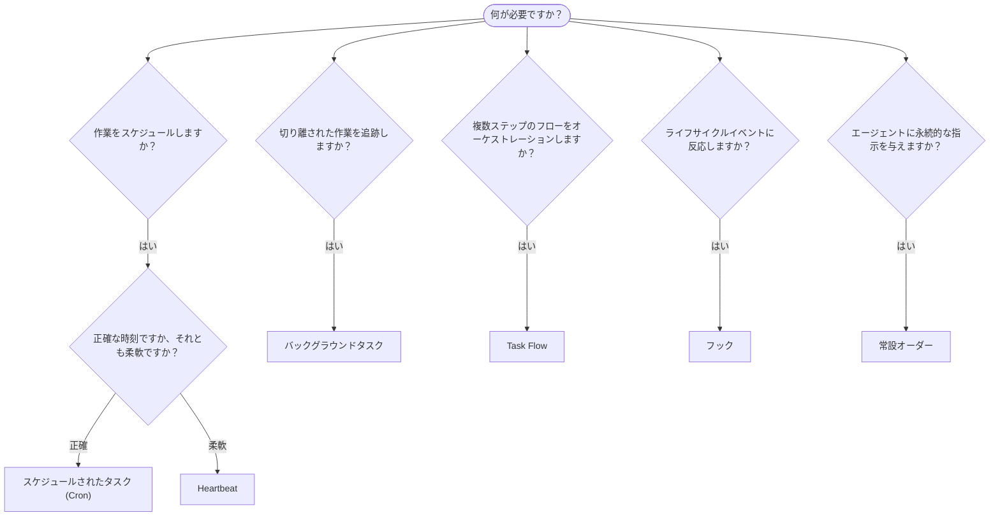

---
read_when:
    - OpenClawで作業を自動化する方法の決定
    - Heartbeat、Cron、フック、常設オーダーのどれを選ぶか
    - 適切な自動化の開始点を探す
summary: '自動化メカニズムの概要: タスク、Cron、フック、常設オーダー、TaskFlow'
title: 自動化とタスク
x-i18n:
    generated_at: "2026-04-25T13:41:03Z"
    model: gpt-5.4
    provider: openai
    source_hash: 54524eb5d1fcb2b2e3e51117339be1949d980afaef1f6ae71fcfd764049f3f47
    source_path: automation/index.md
    workflow: 15
---

OpenClawは、タスク、スケジュールされたジョブ、イベントフック、常設の指示を通じて、バックグラウンドで作業を実行します。このページでは、適切なメカニズムを選び、それらがどのように連携するかを理解できるようにします。

## クイック判断ガイド

| ユースケース | 推奨 | 理由 |
| --------------------------------------- | ---------------------- | ------------------------------------------------ |
| 毎日午前9時ちょうどに日次レポートを送信する | スケジュールされたタスク (Cron) | 正確なタイミング、独立した実行 |
| 20分後に通知する | スケジュールされたタスク (Cron) | 正確なタイミングのワンショット (`--at`) |
| 毎週詳細な分析を実行する | スケジュールされたタスク (Cron) | 独立したタスクで、別のモデルを使用可能 |
| 30分ごとに受信トレイを確認する | Heartbeat | 他の確認とまとめて実行され、コンテキストを認識する |
| 今後の予定についてカレンダーを監視する | Heartbeat | 定期的な認識に自然に適している |
| サブエージェントまたはACP実行の状態を確認する | バックグラウンドタスク | タスク台帳がすべての切り離された作業を追跡する |
| 何がいつ実行されたかを監査する | バックグラウンドタスク | `openclaw tasks list` と `openclaw tasks audit` |
| 複数ステップの調査を行ってから要約する | Task Flow | リビジョン追跡を備えた永続的なオーケストレーション |
| セッションのリセット時にスクリプトを実行する | フック | イベント駆動で、ライフサイクルイベント時に発火する |
| すべてのツール呼び出しでコードを実行する | Plugin hooks | インプロセスフックがツール呼び出しをインターセプトできる |
| 返信前に常にコンプライアンスを確認する | 常設オーダー | すべてのセッションに自動的に注入される |

### スケジュールされたタスク (Cron) と Heartbeat の比較

| 観点 | スケジュールされたタスク (Cron) | Heartbeat |
| --------------- | ----------------------------------- | ------------------------------------- |
| タイミング | 正確（cron式、ワンショット） | おおよそ（デフォルトでは30分ごと） |
| セッションコンテキスト | 新規（独立）または共有 | メインセッションの完全なコンテキスト |
| タスク記録 | 常に作成される | 作成されない |
| 配信 | チャネル、Webhook、またはサイレント | メインセッション内にインラインで配信 |
| 最適な用途 | レポート、リマインダー、バックグラウンドジョブ | 受信トレイ確認、カレンダー、通知 |

正確なタイミングや独立した実行が必要な場合は、スケジュールされたタスク (Cron) を使用します。作業が完全なセッションコンテキストの恩恵を受け、タイミングがおおよそで問題ない場合は、Heartbeat を使用します。

## コアコンセプト

### スケジュールされたタスク (cron)

Cronは、正確なタイミングのためのGateway組み込みスケジューラーです。ジョブを永続化し、適切なタイミングでエージェントを起動し、出力をチャットチャネルまたはWebhookエンドポイントに配信できます。ワンショットのリマインダー、繰り返し式、受信Webhookトリガーをサポートします。

[Scheduled Tasks](/ja-JP/automation/cron-jobs) を参照してください。

### タスク

バックグラウンドタスク台帳は、ACP実行、サブエージェントの起動、独立したcron実行、CLI操作など、すべての切り離された作業を追跡します。タスクはスケジューラーではなく、記録です。`openclaw tasks list` と `openclaw tasks audit` を使って確認します。

[Background Tasks](/ja-JP/automation/tasks) を参照してください。

### Task Flow

Task Flowは、バックグラウンドタスクの上位にあるフローオーケストレーション基盤です。managedおよびmirroredの同期モード、リビジョン追跡、そして確認用の `openclaw tasks flow list|show|cancel` によって、永続的な複数ステップのフローを管理します。

[Task Flow](/ja-JP/automation/taskflow) を参照してください。

### 常設オーダー

常設オーダーは、定義されたプログラムに対する恒久的な運用権限をエージェントに付与します。ワークスペースファイル（通常は `AGENTS.md`）に保存され、すべてのセッションに注入されます。時間ベースの適用にはcronと組み合わせてください。

[Standing Orders](/ja-JP/automation/standing-orders) を参照してください。

### フック

内部フックは、エージェントのライフサイクルイベント
（`/new`、`/reset`、`/stop`）、セッションCompaction、Gateway起動、メッセージ
フローによってトリガーされるイベント駆動スクリプトです。ディレクトリから自動的に検出され、`openclaw hooks` で管理できます。インプロセスのツール呼び出しインターセプトには、
[Plugin hooks](/ja-JP/plugins/hooks) を使用します。

[Hooks](/ja-JP/automation/hooks) を参照してください。

### Heartbeat

Heartbeatは、定期的なメインセッションのターンです（デフォルトは30分ごと）。複数の確認（受信トレイ、カレンダー、通知）を、完全なセッションコンテキストを持つ1回のエージェントターンにまとめます。Heartbeatターンではタスク記録は作成されません。小さなチェックリストには `HEARTBEAT.md` を使い、Heartbeat自体の中で期限到来時のみの定期確認を行いたい場合は `tasks:` ブロックを使います。空のHeartbeatファイルは `empty-heartbeat-file` としてスキップされ、期限到来時のみのタスクモードは `no-tasks-due` としてスキップされます。

[Heartbeat](/ja-JP/gateway/heartbeat) を参照してください。

## これらがどのように連携するか

- **Cron** は、正確なスケジュール（日次レポート、週次レビュー）とワンショットのリマインダーを処理します。すべてのcron実行はタスク記録を作成します。
- **Heartbeat** は、定期的な監視（受信トレイ、カレンダー、通知）を30分ごとに1回のバッチ処理で実行します。
- **フック** は、特定のイベント（セッションのリセット、Compaction、メッセージフロー）に対してカスタムスクリプトで反応します。Plugin hooks はツール呼び出しを対象とします。
- **常設オーダー** は、エージェントに永続的なコンテキストと権限の境界を与えます。
- **Task Flow** は、個々のタスクの上位で複数ステップのフローを調整します。
- **タスク** は、すべての切り離された作業を自動的に追跡するため、確認や監査ができます。

## 関連

- [Scheduled Tasks](/ja-JP/automation/cron-jobs) — 正確なスケジューリングとワンショットのリマインダー
- [Background Tasks](/ja-JP/automation/tasks) — すべての切り離された作業のためのタスク台帳
- [Task Flow](/ja-JP/automation/taskflow) — 永続的な複数ステップのフローオーケストレーション
- [Hooks](/ja-JP/automation/hooks) — イベント駆動のライフサイクルスクリプト
- [Plugin hooks](/ja-JP/plugins/hooks) — インプロセスのツール、プロンプト、メッセージ、ライフサイクルフック
- [Standing Orders](/ja-JP/automation/standing-orders) — 永続的なエージェント指示
- [Heartbeat](/ja-JP/gateway/heartbeat) — 定期的なメインセッションターン
- [Configuration Reference](/ja-JP/gateway/configuration-reference) — すべての設定キー
