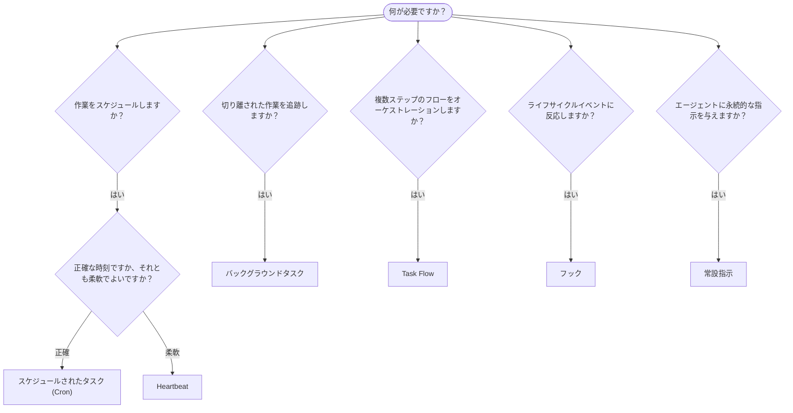

---
read_when:
    - OpenClawで作業を自動化する方法の決定
    - Heartbeat、Cron、フック、常設指示のどれを選ぶか
    - 適切な自動化の開始点を探す
summary: '自動化メカニズムの概要: タスク、Cron、フック、常設指示、TaskFlow'
title: 自動化とタスク
x-i18n:
    generated_at: "2026-04-26T11:23:05Z"
    model: gpt-5.4
    provider: openai
    source_hash: 6d2a2d3ef58830133e07b34f33c611664fc1032247e9dd81005adf7fc0c43cdb
    source_path: automation/index.md
    workflow: 15
---

OpenClawは、タスク、スケジュールされたジョブ、イベントフック、常設指示を通じて、バックグラウンドで作業を実行します。このページでは、適切なメカニズムを選び、それらがどのように連携するかを理解するのに役立ちます。

## クイック判断ガイド

| ユースケース | 推奨 | 理由 |
| --------------------------------------- | ---------------------- | ------------------------------------------------ |
| 毎日午前9時ちょうどにレポートを送信する | スケジュールされたタスク (Cron) | 正確な時刻、分離された実行 |
| 20分後にリマインドする | スケジュールされたタスク (Cron) | 正確な時刻指定によるワンショット (`--at`) |
| 毎週詳細な分析を実行する | スケジュールされたタスク (Cron) | 独立したタスクで、別のモデルも使用可能 |
| 30分ごとに受信トレイを確認する | Heartbeat | 他の確認とまとめて実行され、コンテキストを認識する |
| 予定されているイベントについてカレンダーを監視する | Heartbeat | 定期的な状況把握に自然に適合する |
| サブエージェントまたはACP実行の状態を確認する | バックグラウンドタスク | タスク台帳がすべての切り離された作業を追跡する |
| 何がいつ実行されたかを監査する | バックグラウンドタスク | `openclaw tasks list` と `openclaw tasks audit` |
| 複数ステップの調査を行ってから要約する | Task Flow | リビジョン追跡を備えた耐久性のあるオーケストレーション |
| セッションのリセット時にスクリプトを実行する | フック | イベント駆動で、ライフサイクルイベント時に起動する |
| すべてのツール呼び出しでコードを実行する | Plugin hooks | インプロセスフックがツール呼び出しをインターセプトできる |
| 返信前に常にコンプライアンスを確認する | 常設指示 | すべてのセッションに自動的に注入される |

### スケジュールされたタスク (Cron) と Heartbeat の比較

| 次元 | スケジュールされたタスク (Cron) | Heartbeat |
| --------------- | ----------------------------------- | ------------------------------------- |
| タイミング | 正確（cron式、ワンショット） | おおよそ（デフォルトで30分ごと） |
| セッションコンテキスト | 新規（分離）または共有 | メインセッションの完全なコンテキスト |
| タスク記録 | 常に作成される | 作成されない |
| 配信 | チャネル、Webhook、またはサイレント | メインセッション内にインライン |
| 最適な用途 | レポート、リマインダー、バックグラウンドジョブ | 受信トレイ確認、カレンダー、通知 |

正確な時刻指定や分離された実行が必要な場合は、スケジュールされたタスク (Cron) を使用してください。作業が完全なセッションコンテキストから恩恵を受け、おおよそのタイミングで問題ない場合は、Heartbeatを使用してください。

## コアコンセプト

### スケジュールされたタスク (cron)

Cronは、正確なタイミングのためのGateway内蔵スケジューラーです。ジョブを永続化し、適切な時刻にエージェントを起動し、出力をチャットチャネルまたはWebhookエンドポイントに配信できます。ワンショットのリマインダー、定期式、受信Webhookトリガーをサポートします。

[Scheduled Tasks](/ja-JP/automation/cron-jobs)を参照してください。

### タスク

バックグラウンドタスク台帳は、すべての切り離された作業を追跡します。ACP実行、サブエージェントの起動、分離されたcron実行、CLI操作が含まれます。タスクはスケジューラーではなく記録です。`openclaw tasks list` と `openclaw tasks audit` を使用して確認します。

[Background Tasks](/ja-JP/automation/tasks)を参照してください。

### Task Flow

Task Flowは、バックグラウンドタスクの上位にあるフローオーケストレーション基盤です。管理モードおよびミラー同期モード、リビジョン追跡、確認用の `openclaw tasks flow list|show|cancel` によって、耐久性のある複数ステップのフローを管理します。

[Task Flow](/ja-JP/automation/taskflow)を参照してください。

### 常設指示

常設指示は、定義されたプログラムに対してエージェントに永続的な運用権限を付与します。これらはワークスペースファイル（通常は `AGENTS.md`）に存在し、すべてのセッションに注入されます。時間ベースの適用にはcronと組み合わせてください。

[Standing Orders](/ja-JP/automation/standing-orders)を参照してください。

### フック

内部フックは、エージェントのライフサイクルイベント
（`/new`、`/reset`、`/stop`）、セッションのCompaction、Gatewayの起動、メッセージフローによってトリガーされるイベント駆動型スクリプトです。ディレクトリから自動的に検出され、`openclaw hooks` で管理できます。インプロセスでのツール呼び出しインターセプトには、[Plugin hooks](/ja-JP/plugins/hooks)を使用してください。

[Hooks](/ja-JP/automation/hooks)を参照してください。

### Heartbeat

Heartbeatは、定期的なメインセッションターンです（デフォルトでは30分ごと）。1回のエージェントターンで複数の確認（受信トレイ、カレンダー、通知）を、完全なセッションコンテキストとともにまとめて実行します。Heartbeatターンではタスク記録は作成されず、毎日またはアイドルによるセッションリセットの新鮮さも延長されません。小さなチェックリストには `HEARTBEAT.md` を使用し、Heartbeat自体の中で期限到来時のみの定期確認を行いたい場合は `tasks:` ブロックを使用してください。空のHeartbeatファイルは `empty-heartbeat-file` としてスキップされ、期限到来時のみのタスクモードは `no-tasks-due` としてスキップされます。

[Heartbeat](/ja-JP/gateway/heartbeat)を参照してください。

## どのように連携するか

- **Cron** は、正確なスケジュール（日次レポート、週次レビュー）とワンショットのリマインダーを処理します。すべてのcron実行でタスク記録が作成されます。
- **Heartbeat** は、定期的な監視（受信トレイ、カレンダー、通知）を30分ごとに1回のバッチターンで処理します。
- **フック** は、特定のイベント（セッションリセット、Compaction、メッセージフロー）に対してカスタムスクリプトで反応します。Plugin hooks はツール呼び出しを対象とします。
- **常設指示** は、エージェントに永続的なコンテキストと権限の境界を与えます。
- **Task Flow** は、個々のタスクの上位で複数ステップのフローを調整します。
- **タスク** は、すべての切り離された作業を自動的に追跡するため、確認と監査が可能です。

## 関連

- [Scheduled Tasks](/ja-JP/automation/cron-jobs) — 正確なスケジューリングとワンショットのリマインダー
- [Background Tasks](/ja-JP/automation/tasks) — すべての切り離された作業のためのタスク台帳
- [Task Flow](/ja-JP/automation/taskflow) — 耐久性のある複数ステップのフローオーケストレーション
- [Hooks](/ja-JP/automation/hooks) — イベント駆動のライフサイクルスクリプト
- [Plugin hooks](/ja-JP/plugins/hooks) — インプロセスのツール、プロンプト、メッセージ、ライフサイクルフック
- [Standing Orders](/ja-JP/automation/standing-orders) — 永続的なエージェント指示
- [Heartbeat](/ja-JP/gateway/heartbeat) — 定期的なメインセッションターン
- [Configuration Reference](/ja-JP/gateway/configuration-reference) — すべての設定キー
