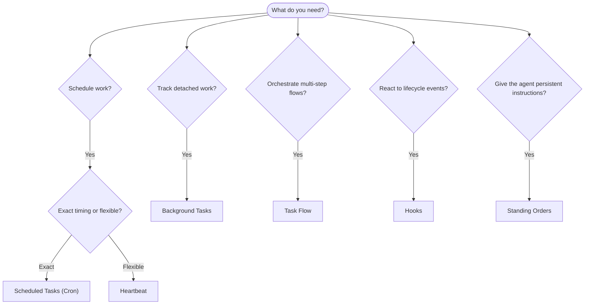

---
read_when:
    - OpenClaw で作業をどのように自動化するかを決めるとき
    - heartbeat、cron、フック、常設指示のどれを使うか選ぶとき
    - 適切な自動化の起点を探しているとき
summary: タスク、cron、フック、常設指示、タスクフローなどのオートメーションの仕組みの概要
title: オートメーションとタスク
x-i18n:
    generated_at: "2026-04-05T12:34:27Z"
    model: gpt-5.4
    provider: openai
    source_hash: 13cd05dcd2f38737f7bb19243ad1136978bfd727006fd65226daa3590f823afe
    source_path: automation/index.md
    workflow: 15
---

# オートメーションとタスク

OpenClaw は、タスク、スケジュール済みジョブ、イベントフック、常設指示を通じてバックグラウンドで作業を実行します。このページでは、適切な仕組みを選び、それらがどのように連携するかを理解できるようにします。

## クイック判断ガイド

| ユースケース | 推奨 | 理由 |
| --------------------------------------- | ---------------------- | ------------------------------------------------ |
| 毎日午前 9 時ちょうどにレポートを送信する | スケジュール済みタスク（cron） | 正確な時刻指定、分離された実行 |
| 20 分後にリマインドする | スケジュール済みタスク（cron） | 正確な時刻を指定した一回限りの実行（`--at`） |
| 毎週詳細な分析を実行する | スケジュール済みタスク（cron） | 独立したタスクで、別のモデルも使える |
| 30 分ごとに受信箱を確認する | heartbeat | ほかの確認とまとめて処理され、コンテキストを認識できる |
| 今後の予定についてカレンダーを監視する | heartbeat | 定期的な状況把握に自然に適している |
| サブエージェントまたは ACP 実行の状態を確認する | バックグラウンドタスク | タスク台帳がすべての分離された作業を追跡する |
| 何がいつ実行されたかを監査する | バックグラウンドタスク | `openclaw tasks list` と `openclaw tasks audit` |
| 複数段階の調査を行ってから要約する | タスクフロー | リビジョン追跡付きの永続的なオーケストレーション |
| セッションのリセット時にスクリプトを実行する | フック | イベント駆動で、ライフサイクルイベント時に実行される |
| すべてのツール呼び出しでコードを実行する | フック | フックはイベント種別で絞り込める |
| 返信前に常にコンプライアンスを確認する | 常設指示 | すべてのセッションに自動的に注入される |

### スケジュール済みタスク（cron）と heartbeat の比較

| 観点 | スケジュール済みタスク（cron） | heartbeat |
| --------------- | ----------------------------------- | ------------------------------------- |
| タイミング | 正確（cron 式、一回限りの実行） | おおよそ（既定では 30 分ごと） |
| セッションコンテキスト | 新規（分離）または共有 | メインセッションの完全なコンテキスト |
| タスク記録 | 常に作成される | 作成されない |
| 配信 | チャネル、webhook、または無通知 | メインセッション内にインラインで表示 |
| 最適な用途 | レポート、リマインダー、バックグラウンドジョブ | 受信箱確認、カレンダー、通知 |

正確な時刻指定や分離された実行が必要な場合は、スケジュール済みタスク（cron）を使ってください。作業が完全なセッションコンテキストの恩恵を受け、おおよそのタイミングで十分な場合は、heartbeat を使ってください。

## コア概念

### スケジュール済みタスク（cron）

cron は、正確な時刻指定のための Gateway 組み込みスケジューラーです。ジョブを永続化し、適切な時刻にエージェントを起動し、出力をチャットチャネルまたは webhook エンドポイントに配信できます。一回限りのリマインダー、繰り返し式、受信 webhook トリガーをサポートします。

[スケジュール済みタスク](/automation/cron-jobs)を参照してください。

### タスク

バックグラウンドタスク台帳は、ACP 実行、サブエージェント起動、分離された cron 実行、CLI 操作など、すべての分離された作業を追跡します。タスクはスケジューラーではなく記録です。確認には `openclaw tasks list` と `openclaw tasks audit` を使います。

[バックグラウンドタスク](/automation/tasks)を参照してください。

### タスクフロー

タスクフローは、バックグラウンドタスクの上にあるフローオーケストレーション基盤です。管理同期モードとミラー同期モード、リビジョン追跡、確認用の `openclaw tasks flow list|show|cancel` によって、永続的な複数段階フローを管理します。

[タスクフロー](/automation/taskflow)を参照してください。

### 常設指示

常設指示は、定義されたプログラムに対する永続的な実行権限をエージェントに付与します。これらはワークスペースファイル（通常は `AGENTS.md`）に存在し、すべてのセッションに注入されます。時間ベースの適用には cron と組み合わせてください。

[常設指示](/automation/standing-orders)を参照してください。

### フック

フックは、エージェントのライフサイクルイベント（`/new`、`/reset`、`/stop`）、セッション圧縮、Gateway 起動、メッセージフロー、ツール呼び出しによってトリガーされるイベント駆動スクリプトです。フックはディレクトリから自動検出され、`openclaw hooks` で管理できます。

[フック](/automation/hooks)を参照してください。

### Heartbeat

heartbeat は、定期的に実行されるメインセッションのターンです（既定では 30 分ごと）。複数の確認事項（受信箱、カレンダー、通知）を、完全なセッションコンテキストを持つ 1 回のエージェントターンにまとめます。heartbeat のターンではタスク記録は作成されません。小さなチェックリストには `HEARTBEAT.md` を使い、heartbeat 自体の中で期限到来時のみの定期チェックを行いたい場合は `tasks:` ブロックを使います。heartbeat ファイルが空の場合は `empty-heartbeat-file` としてスキップされ、期限到来時のみのタスクモードでは `no-tasks-due` としてスキップされます。

[Heartbeat](/gateway/heartbeat)を参照してください。

## それぞれの連携方法

- **cron** は、正確なスケジュール（日次レポート、週次レビュー）と一回限りのリマインダーを扱います。すべての cron 実行でタスク記録が作成されます。
- **heartbeat** は、受信箱、カレンダー、通知などの日常的な監視を、30 分ごとの 1 回のまとめたターンで処理します。
- **フック** は、特定のイベント（ツール呼び出し、セッションリセット、圧縮）に対してカスタムスクリプトで反応します。
- **常設指示** は、永続的なコンテキストと権限の境界をエージェントに与えます。
- **タスクフロー** は、個々のタスクの上位で複数段階のフローを調整します。
- **タスク** は、すべての分離された作業を自動的に追跡し、確認や監査を可能にします。

## 関連

- [スケジュール済みタスク](/automation/cron-jobs) — 正確なスケジューリングと一回限りのリマインダー
- [バックグラウンドタスク](/automation/tasks) — すべての分離された作業のタスク台帳
- [タスクフロー](/automation/taskflow) — 永続的な複数段階フローのオーケストレーション
- [フック](/automation/hooks) — イベント駆動のライフサイクルスクリプト
- [常設指示](/automation/standing-orders) — 永続的なエージェント指示
- [Heartbeat](/gateway/heartbeat) — 定期的なメインセッションターン
- [設定リファレンス](/gateway/configuration-reference) — すべての設定キー
