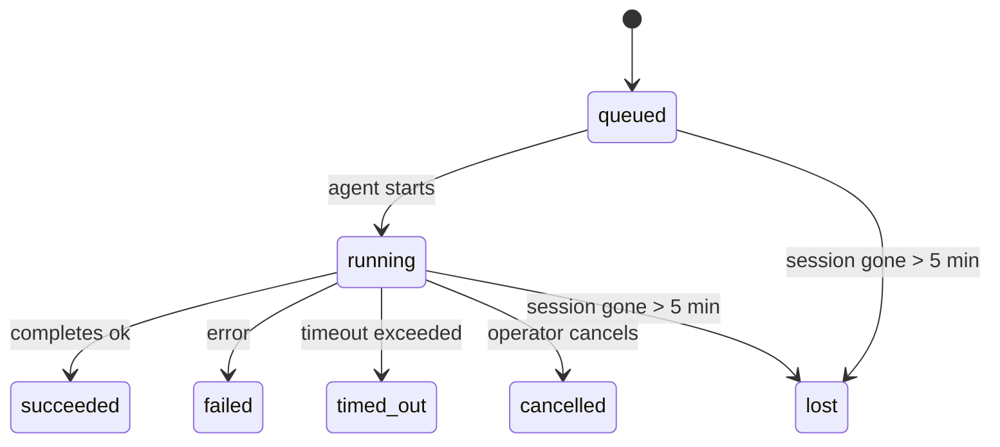

---
read_when:
    - 進行中または最近完了したバックグラウンド作業を確認するとき
    - 切り離されたエージェント実行の配信失敗をデバッグするとき
    - バックグラウンド実行がセッション、cron、heartbeat とどう関係するかを理解するとき
summary: ACP 実行、サブエージェント、分離された cron ジョブ、CLI 操作向けのバックグラウンドタスク追跡
title: バックグラウンドタスク
x-i18n:
    generated_at: "2026-04-05T12:34:51Z"
    model: gpt-5.4
    provider: openai
    source_hash: 6c95ccf4388d07e60a7bb68746b161793f4bb5ff2ba3d5ce9e51f2225dab2c4d
    source_path: automation/tasks.md
    workflow: 15
---

# バックグラウンドタスク

> **スケジュール設定を探していますか？** 適切な仕組みを選ぶには、[Automation & Tasks](/automation)を参照してください。このページで扱うのはバックグラウンド作業の**追跡**であり、スケジュール設定ではありません。

バックグラウンドタスクは、**メインの会話セッションの外側**で実行される作業を追跡します。
ACP 実行、サブエージェントの起動、分離された cron ジョブの実行、CLI から開始された操作が対象です。

タスクはセッション、cron ジョブ、heartbeat を置き換えるものではありません。これは、どのような切り離された作業が、いつ発生し、成功したかどうかを記録する**アクティビティ台帳**です。

<Note>
すべてのエージェント実行でタスクが作成されるわけではありません。heartbeat ターンと通常の対話チャットでは作成されません。すべての cron 実行、ACP 起動、サブエージェント起動、CLI エージェントコマンドでは作成されます。
</Note>

## 要点

- タスクはスケジューラではなく**記録**です。cron と heartbeat が作業を _いつ_ 実行するかを決め、タスクは _何が起きたか_ を追跡します。
- ACP、サブエージェント、すべての cron ジョブ、CLI 操作はタスクを作成します。heartbeat ターンでは作成されません。
- 各タスクは `queued → running → terminal`（succeeded、failed、timed_out、cancelled、または lost）を遷移します。
- cron タスクは、cron ランタイムがそのジョブを所有している間は有効なままです。チャットをバックエンドに持つ CLI タスクは、その所有元の実行コンテキストがまだアクティブな間だけ有効です。
- 完了はプッシュ駆動です。切り離された作業は、完了時に直接通知するか、要求元のセッション/heartbeat を起こせるため、通常はステータスをポーリングするループは適切ではありません。
- 分離された cron 実行とサブエージェント完了では、最終的なクリーンアップ記録処理の前に、子セッション向けに追跡中のブラウザータブ/プロセスのベストエフォートなクリーンアップが行われます。
- 分離された cron 配信では、子孫サブエージェント作業の排出が続いている間は古い中間親返信を抑制し、配信前に最終的な子孫出力が到着した場合はそれを優先します。
- 完了通知は、チャネルへ直接配信されるか、次の heartbeat 用にキューに入れられます。
- `openclaw tasks list` はすべてのタスクを表示し、`openclaw tasks audit` は問題を検出します。
- 終端状態の記録は 7 日間保持され、その後自動的に削除されます。

## クイックスタート

```bash
# すべてのタスクを一覧表示（新しい順）
openclaw tasks list

# ランタイムまたはステータスで絞り込む
openclaw tasks list --runtime acp
openclaw tasks list --status running

# 特定のタスクの詳細を表示（ID、run ID、または session key）
openclaw tasks show <lookup>

# 実行中のタスクをキャンセル（子セッションを終了）
openclaw tasks cancel <lookup>

# タスクの通知ポリシーを変更
openclaw tasks notify <lookup> state_changes

# ヘルス監査を実行
openclaw tasks audit

# メンテナンスのプレビューまたは適用
openclaw tasks maintenance
openclaw tasks maintenance --apply

# TaskFlow の状態を確認
openclaw tasks flow list
openclaw tasks flow show <lookup>
openclaw tasks flow cancel <lookup>
```

## タスクを作成するもの

| ソース | ランタイム種別 | タスクレコードが作成されるタイミング | デフォルトの通知ポリシー |
| ---------------------- | ------------ | ------------------------------------------------------ | --------------------- |
| ACP バックグラウンド実行 | `acp`        | 子 ACP セッションを起動したとき                        | `done_only`           |
| サブエージェントオーケストレーション | `subagent`   | `sessions_spawn` 経由でサブエージェントを起動したとき | `done_only`           |
| cron ジョブ（全種類） | `cron`       | cron 実行のたびに（メインセッションと分離の両方）      | `silent`              |
| CLI 操作 | `cli`        | Gateway 経由で実行される `openclaw agent` コマンド   | `silent`              |

メインセッションの cron タスクは、デフォルトで `silent` 通知ポリシーを使います。追跡用のレコードは作成しますが、通知は生成しません。分離された cron タスクもデフォルトは `silent` ですが、独自のセッションで実行されるため、より目立ちます。

**タスクを作成しないもの:**

- heartbeat ターン — メインセッション。詳細は[Heartbeat](/gateway/heartbeat)を参照
- 通常の対話チャットターン
- 直接の `/command` 応答

## タスクのライフサイクル



| ステータス | 意味 |
| ----------- | -------------------------------------------------------------------------- |
| `queued`    | 作成済みで、エージェントの開始を待っている状態                             |
| `running`   | エージェントターンが現在実行中                                             |
| `succeeded` | 正常に完了した状態                                                         |
| `failed`    | エラーで完了した状態                                                       |
| `timed_out` | 設定されたタイムアウトを超過した状態                                       |
| `cancelled` | オペレーターが `openclaw tasks cancel` で停止した状態                      |
| `lost`      | 5 分の猶予期間後に、ランタイムが権威あるバックエンド状態を失った状態       |

遷移は自動で行われます。関連するエージェント実行が終了すると、タスクステータスはそれに合わせて更新されます。

`lost` はランタイム認識型です。

- ACP タスク: バックエンドの ACP 子セッションメタデータが消失した。
- サブエージェントタスク: バックエンドの子セッションが対象エージェントストアから消失した。
- cron タスク: cron ランタイムがそのジョブをアクティブとして追跡しなくなった。
- CLI タスク: 分離された子セッションタスクは子セッションを使い、チャットをバックエンドに持つ CLI タスクは代わりにライブ実行コンテキストを使うため、チャネル/グループ/直接セッションの行が残っていてもそれだけでは有効状態は維持されません。

## 配信と通知

タスクが終端状態に達すると、OpenClaw が通知します。配信経路は 2 つあります。

**直接配信** — タスクにチャネル宛先（`requesterOrigin`）がある場合、完了メッセージはそのチャネル（Telegram、Discord、Slack など）へ直接送られます。サブエージェント完了では、利用可能な場合は紐付いたスレッド/トピックのルーティングも保持され、直接配信を諦める前に、要求元セッションに保存されたルート（`lastChannel` / `lastTo` / `lastAccountId`）から欠けている `to` / アカウントを補完できます。

**セッションキュー配信** — 直接配信に失敗した場合、または origin が設定されていない場合、更新は要求元セッションのシステムイベントとしてキューに入り、次の heartbeat で表示されます。

<Tip>
タスク完了は即時の heartbeat wake を引き起こすため、結果をすぐに確認できます。次に予定された heartbeat tick を待つ必要はありません。
</Tip>

つまり、通常のワークフローはプッシュベースです。切り離された作業を一度開始したら、完了時の wake または通知はランタイムに任せます。タスク状態をポーリングするのは、デバッグ、介入、または明示的な監査が必要な場合だけにしてください。

### 通知ポリシー

各タスクについてどの程度通知を受けるかを制御します。

| ポリシー | 配信される内容 |
| --------------------- | ----------------------------------------------------------------------- |
| `done_only` (default) | 終端状態のみ（succeeded、failed など）— **これがデフォルトです**         |
| `state_changes`       | すべての状態遷移と進捗更新                                               |
| `silent`              | 何も配信しない                                                           |

タスクの実行中にポリシーを変更できます。

```bash
openclaw tasks notify <lookup> state_changes
```

## CLI リファレンス

### `tasks list`

```bash
openclaw tasks list [--runtime <acp|subagent|cron|cli>] [--status <status>] [--json]
```

出力列: Task ID、Kind、Status、Delivery、Run ID、Child Session、Summary。

### `tasks show`

```bash
openclaw tasks show <lookup>
```

lookup トークンには task ID、run ID、または session key を指定できます。タイミング、配信状態、エラー、終端サマリーを含む完全なレコードを表示します。

### `tasks cancel`

```bash
openclaw tasks cancel <lookup>
```

ACP タスクとサブエージェントタスクでは、これにより子セッションを終了します。ステータスは `cancelled` に遷移し、配信通知が送信されます。

### `tasks notify`

```bash
openclaw tasks notify <lookup> <done_only|state_changes|silent>
```

### `tasks audit`

```bash
openclaw tasks audit [--json]
```

運用上の問題を検出します。問題が検出された場合は、`openclaw status` にも表示されます。

| 検出項目 | 重大度 | トリガー |
| ------------------------- | -------- | ----------------------------------------------------- |
| `stale_queued`            | warn     | 10 分を超えて queued のまま                            |
| `stale_running`           | error    | 30 分を超えて running のまま                           |
| `lost`                    | error    | ランタイムに裏付けられたタスク所有権が消失した         |
| `delivery_failed`         | warn     | 配信に失敗し、通知ポリシーが `silent` ではない         |
| `missing_cleanup`         | warn     | 終端タスクに cleanup timestamp がない                  |
| `inconsistent_timestamps` | warn     | タイムライン違反（たとえば started より前に ended）    |

### `tasks maintenance`

```bash
openclaw tasks maintenance [--json]
openclaw tasks maintenance --apply [--json]
```

これを使うと、タスクおよび Task Flow 状態の照合、クリーンアップ刻印、削除のプレビューまたは適用ができます。

照合はランタイム認識型です。

- ACP/サブエージェントタスクはバックエンドの子セッションを確認します。
- cron タスクは、cron ランタイムがまだそのジョブを所有しているかを確認します。
- チャットをバックエンドに持つ CLI タスクは、チャットセッション行だけでなく、所有元のライブ実行コンテキストを確認します。

完了クリーンアップもランタイム認識型です。

- サブエージェント完了時は、通知クリーンアップの継続前に、子セッション向けに追跡中のブラウザータブ/プロセスをベストエフォートで閉じます。
- 分離された cron 完了時は、実行が完全に終了する前に、cron セッション向けに追跡中のブラウザータブ/プロセスをベストエフォートで閉じます。
- 分離された cron 配信では、必要に応じて子孫サブエージェントの後続処理が完了するまで待機し、古い親確認テキストを通知せずに抑制します。
- サブエージェント完了配信では、最新の表示可能な assistant テキストを優先します。これが空の場合は、サニタイズ済みの最新 tool/toolResult テキストにフォールバックし、タイムアウトのみの tool-call 実行は短い部分進捗サマリーにまとめられることがあります。
- クリーンアップ失敗によって、本来のタスク結果が隠されることはありません。

### `tasks flow list|show|cancel`

```bash
openclaw tasks flow list [--status <status>] [--json]
openclaw tasks flow show <lookup> [--json]
openclaw tasks flow cancel <lookup>
```

個々のバックグラウンドタスクレコードではなく、オーケストレーションを行う Task Flow 自体を確認したい場合に使います。

## チャットタスクボード（`/tasks`）

任意のチャットセッションで `/tasks` を使うと、そのセッションにリンクされたバックグラウンドタスクを確認できます。ボードには、アクティブなタスクと最近完了したタスクが、ランタイム、ステータス、タイミング、進捗またはエラー詳細とともに表示されます。

現在のセッションに表示可能なリンク済みタスクがない場合、`/tasks` はエージェントローカルのタスク数にフォールバックするため、他セッションの詳細を漏らさずに概要を確認できます。

完全なオペレーター台帳については、CLI の `openclaw tasks list` を使ってください。

## ステータス統合（task pressure）

`openclaw status` には、ひと目でわかるタスクサマリーが含まれます。

```
Tasks: 3 queued · 2 running · 1 issues
```

サマリーが報告する内容:

- **active** — `queued` + `running` の件数
- **failures** — `failed` + `timed_out` + `lost` の件数
- **byRuntime** — `acp`、`subagent`、`cron`、`cli` ごとの内訳

`/status` と `session_status` ツールはどちらも、クリーンアップ認識型のタスクスナップショットを使用します。アクティブなタスクが優先され、古い完了行は隠され、最近の失敗はアクティブな作業が残っていない場合にのみ表示されます。これにより、ステータスカードは今重要なことに集中できます。

## ストレージとメンテナンス

### タスクの保存場所

タスクレコードは、次の SQLite に永続化されます。

```
$OPENCLAW_STATE_DIR/tasks/runs.sqlite
```

レジストリは Gateway 起動時にメモリへ読み込まれ、再起動をまたいで耐久性を保つために書き込みは SQLite に同期されます。

### 自動メンテナンス

スイーパーは **60 秒**ごとに実行され、次の 3 つを処理します。

1. **照合** — アクティブなタスクに、まだ権威あるランタイムの裏付けがあるかを確認します。ACP/サブエージェントタスクは子セッション状態を使い、cron タスクはアクティブジョブ所有権を使い、チャットをバックエンドに持つ CLI タスクは所有元の実行コンテキストを使います。その裏付け状態が 5 分を超えて消失している場合、タスクは `lost` としてマークされます。
2. **クリーンアップ刻印** — 終端タスクに `cleanupAfter` タイムスタンプ（endedAt + 7 日）を設定します。
3. **削除** — `cleanupAfter` 日付を過ぎたレコードを削除します。

**保持期間**: 終端タスクレコードは **7 日間**保持され、その後自動的に削除されます。設定は不要です。

## タスクと他システムの関係

### タスクと Task Flow

[Task Flow](/automation/taskflow)は、バックグラウンドタスクの上位にあるフローオーケストレーション層です。1 つのフローが、その生存期間中に managed または mirrored の sync モードを使って複数のタスクを調整することがあります。個々のタスクレコードを確認するには `openclaw tasks` を、オーケストレーションフローを確認するには `openclaw tasks flow` を使います。

詳細は[Task Flow](/automation/taskflow)を参照してください。

### タスクと cron

cron ジョブの**定義**は `~/.openclaw/cron/jobs.json` に保存されます。**すべての** cron 実行でタスクレコードが作成されます。メインセッションと分離型の両方が対象です。メインセッションの cron タスクはデフォルトで `silent` 通知ポリシーを使うため、通知を生成せずに追跡だけを行います。

[cron ジョブ](/automation/cron-jobs)を参照してください。

### タスクと heartbeat

heartbeat 実行はメインセッションのターンです。タスクレコードは作成されません。タスクが完了すると、すぐに結果を確認できるように heartbeat wake を引き起こすことがあります。

[Heartbeat](/gateway/heartbeat)を参照してください。

### タスクとセッション

タスクは `childSessionKey`（作業が実行される場所）と `requesterSessionKey`（それを開始した人）を参照することがあります。セッションは会話コンテキストであり、タスクはその上にあるアクティビティ追跡です。

### タスクとエージェント実行

タスクの `runId` は、その作業を行うエージェント実行にリンクしています。エージェントのライフサイクルイベント（開始、終了、エラー）は、自動的にタスクステータスを更新します。ライフサイクルを手動で管理する必要はありません。

## 関連

- [Automation & Tasks](/automation) — すべての自動化メカニズムの概要
- [Task Flow](/automation/taskflow) — タスクの上位にあるフローオーケストレーション
- [Scheduled Tasks](/automation/cron-jobs) — バックグラウンド作業のスケジュール設定
- [Heartbeat](/gateway/heartbeat) — 定期的なメインセッションターン
- [CLI: Tasks](/cli/index#tasks) — CLI コマンドリファレンス
