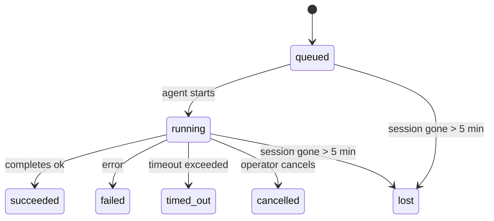

---
read_when:
    - 進行中または最近完了したバックグラウンド作業の確認
    - 分離されたエージェント実行の配信失敗のデバッグ
    - バックグラウンド実行がセッション、Cron、Heartbeatとどのように関係するかを理解する
summary: ACP実行、サブエージェント、分離されたCronジョブ、CLI操作のためのバックグラウンドタスク追跡
title: バックグラウンドタスク
x-i18n:
    generated_at: "2026-04-21T19:20:40Z"
    model: gpt-5.4
    provider: openai
    source_hash: a4cd666b3eaffde8df0b5e1533eb337e44a0824824af6f8a240f18a89f71b402
    source_path: automation/tasks.md
    workflow: 15
---

# バックグラウンドタスク

> **スケジュール設定を探していますか？** 適切な仕組みを選ぶには、[Automation & Tasks](/ja-JP/automation)を参照してください。このページで扱うのはバックグラウンド作業の**追跡**であり、スケジュール設定ではありません。

バックグラウンドタスクは、**メインの会話セッションの外側で**実行される作業を追跡します。
ACP実行、サブエージェントの起動、分離されたCronジョブ実行、CLIから開始された操作が対象です。

タスクはセッション、Cronジョブ、Heartbeatを置き換えるものではありません — これらは切り離された作業で何が起こったか、いつ起こったか、成功したかどうかを記録する**アクティビティ台帳**です。

<Note>
すべてのエージェント実行でタスクが作成されるわけではありません。Heartbeatターンと通常の対話チャットでは作成されません。すべてのCron実行、ACP起動、サブエージェント起動、CLIエージェントコマンドでは作成されます。
</Note>

## 要点

- タスクはスケジューラではなく**記録**です — CronとHeartbeatが作業の実行_タイミング_を決め、タスクが_何が起きたか_を追跡します。
- ACP、サブエージェント、すべてのCronジョブ、CLI操作はタスクを作成します。Heartbeatターンは作成しません。
- 各タスクは `queued → running → terminal`（succeeded、failed、timed_out、cancelled、またはlost）を移動します。
- Cronタスクは、Cronランタイムがまだそのジョブを所有している間は存続します。チャットに紐づくCLIタスクは、その所有元の実行コンテキストがまだアクティブな間だけ存続します。
- 完了はプッシュ駆動です。切り離された作業は、完了時に直接通知するか、リクエスターのセッション/Heartbeatを起こせるため、通常はステータスポーリングループは適切ではありません。
- 分離されたCron実行とサブエージェントの完了では、最終的なクリーンアップ記録処理の前に、子セッションに対して追跡中のブラウザタブ/プロセスをベストエフォートでクリーンアップします。
- 分離されたCron配信では、子孫サブエージェント作業の排出中は古い中間親返信を抑制し、配信前に到着すれば最終的な子孫出力を優先します。
- 完了通知は、チャンネルに直接配信されるか、次のHeartbeat用にキューされます。
- `openclaw tasks list` はすべてのタスクを表示し、`openclaw tasks audit` は問題を表面化します。
- 終端レコードは7日間保持され、その後自動的に削除されます。

## クイックスタート

```bash
# すべてのタスクを一覧表示（新しい順）
openclaw tasks list

# ランタイムまたはステータスで絞り込む
openclaw tasks list --runtime acp
openclaw tasks list --status running

# 特定のタスクの詳細を表示（ID、run ID、またはsession keyで指定）
openclaw tasks show <lookup>

# 実行中のタスクをキャンセル（子セッションを終了）
openclaw tasks cancel <lookup>

# タスクの通知ポリシーを変更
openclaw tasks notify <lookup> state_changes

# ヘルス監査を実行
openclaw tasks audit

# メンテナンスをプレビューまたは適用
openclaw tasks maintenance
openclaw tasks maintenance --apply

# TaskFlowの状態を確認
openclaw tasks flow list
openclaw tasks flow show <lookup>
openclaw tasks flow cancel <lookup>
```

## タスクを作成するもの

| 発生元 | ランタイム種別 | タスクレコードが作成されるタイミング | デフォルト通知ポリシー |
| ---------------------- | ------------ | ------------------------------------------------------ | --------------------- |
| ACPバックグラウンド実行 | `acp`        | 子ACPセッションを起動したとき                          | `done_only`           |
| サブエージェントオーケストレーション | `subagent`   | `sessions_spawn` によってサブエージェントを起動したとき | `done_only`           |
| Cronジョブ（全種別） | `cron`       | すべてのCron実行時（メインセッションと分離実行）       | `silent`              |
| CLI操作 | `cli`        | Gatewayを通る `openclaw agent` コマンド                 | `silent`              |
| エージェントメディアジョブ | `cli`        | セッションに紐づく `video_generate` 実行               | `silent`              |

メインセッションのCronタスクはデフォルトで `silent` 通知ポリシーを使います — 追跡用のレコードは作成されますが、通知は生成されません。分離されたCronタスクもデフォルトでは `silent` ですが、独自のセッションで実行されるため、より可視性があります。

セッションに紐づく `video_generate` 実行も `silent` 通知ポリシーを使います。これらもタスクレコードは作成されますが、完了は内部ウェイクとして元のエージェントセッションに返されるため、エージェント自身がフォローアップメッセージを書き、完成した動画を添付できます。`tools.media.asyncCompletion.directSend` を有効にすると、非同期の `music_generate` および `video_generate` 完了は、リクエスターセッションを起こす経路にフォールバックする前に、まずチャンネルへの直接配信を試みます。

セッションに紐づく `video_generate` タスクがまだアクティブな間、このツールはガードレールとしても機能します。同じセッション内で `video_generate` を繰り返し呼び出すと、2つ目の並行生成を開始する代わりに、アクティブなタスク状態を返します。エージェント側から明示的に進捗/状態を確認したい場合は `action: "status"` を使ってください。

**タスクを作成しないもの:**

- Heartbeatターン — メインセッション。詳細は[Heartbeat](/ja-JP/gateway/heartbeat)を参照
- 通常の対話チャットターン
- 直接の `/command` 応答

## タスクのライフサイクル



| ステータス | 意味 |
| ----------- | -------------------------------------------------------------------------- |
| `queued`    | 作成済みで、エージェントの開始待ち                                    |
| `running`   | エージェントターンが現在実行中                                           |
| `succeeded` | 正常に完了                                                     |
| `failed`    | エラーで完了                                                    |
| `timed_out` | 設定されたタイムアウトを超過                                            |
| `cancelled` | オペレーターが `openclaw tasks cancel` により停止                        |
| `lost`      | 5分の猶予期間後に、ランタイムが権威ある裏付け状態を失った |

遷移は自動的に行われます — 関連するエージェント実行が終了すると、タスクのステータスはそれに合わせて更新されます。

`lost` はランタイム認識型です。

- ACPタスク: 裏付けとなるACP子セッションのメタデータが消えた。
- サブエージェントタスク: 裏付けとなる子セッションが対象エージェントストアから消えた。
- Cronタスク: Cronランタイムがそのジョブをアクティブとして追跡しなくなった。
- CLIタスク: 分離された子セッションタスクは子セッションを使います。チャットに紐づくCLIタスクは代わりに生きた実行コンテキストを使うため、チャンネル/グループ/ダイレクトのセッション行が残っていても存続扱いにはなりません。

## 配信と通知

タスクが終端状態に到達すると、OpenClawが通知します。配信経路は2つあります。

**直接配信** — タスクにチャンネルの宛先（`requesterOrigin`）がある場合、完了メッセージはそのチャンネル（Telegram、Discord、Slackなど）に直接送られます。サブエージェント完了では、OpenClawは利用可能な場合に紐づくスレッド/トピックのルーティングも保持し、直接配信を諦める前に、リクエスターセッションに保存されたルート（`lastChannel` / `lastTo` / `lastAccountId`）から不足している `to` / アカウントを補える場合があります。

**セッションキュー配信** — 直接配信に失敗した場合、またはoriginが設定されていない場合、更新はリクエスターのセッション内のシステムイベントとしてキューされ、次のHeartbeatで表示されます。

<Tip>
タスク完了は即時のHeartbeatウェイクを引き起こすため、結果をすぐに確認できます — 次回スケジュールされたHeartbeatティックまで待つ必要はありません。
</Tip>

つまり通常のワークフローはプッシュベースです。切り離された作業を一度開始したら、完了時にランタイムが起こすか通知するのに任せてください。タスク状態のポーリングは、デバッグ、介入、または明示的な監査が必要なときにだけ行ってください。

### 通知ポリシー

各タスクについてどれだけ通知を受けるかを制御します。

| ポリシー | 配信されるもの |
| --------------------- | ----------------------------------------------------------------------- |
| `done_only` (default) | 終端状態のみ（succeeded、failedなど） — **これがデフォルトです** |
| `state_changes`       | すべての状態遷移と進捗更新                              |
| `silent`              | 何も配信しない                                                          |

タスクの実行中にポリシーを変更できます。

```bash
openclaw tasks notify <lookup> state_changes
```

## CLIリファレンス

### `tasks list`

```bash
openclaw tasks list [--runtime <acp|subagent|cron|cli>] [--status <status>] [--json]
```

出力列: Task ID、種類、ステータス、配信、Run ID、子セッション、要約。

### `tasks show`

```bash
openclaw tasks show <lookup>
```

lookupトークンには、task ID、run ID、またはsession keyを指定できます。タイミング、配信状態、エラー、終端サマリーを含む完全なレコードを表示します。

### `tasks cancel`

```bash
openclaw tasks cancel <lookup>
```

ACPタスクとサブエージェントタスクでは、これにより子セッションを終了します。CLI追跡タスクでは、キャンセルはタスクレジストリに記録されます（別個の子ランタイムハンドルはありません）。ステータスは `cancelled` に遷移し、該当する場合は配信通知が送られます。

### `tasks notify`

```bash
openclaw tasks notify <lookup> <done_only|state_changes|silent>
```

### `tasks audit`

```bash
openclaw tasks audit [--json]
```

運用上の問題を表面化します。問題が検出された場合、検出結果は `openclaw status` にも表示されます。

| 検出項目 | 深刻度 | トリガー |
| ------------------------- | -------- | ----------------------------------------------------- |
| `stale_queued`            | warn     | 10分以上キュー状態                       |
| `stale_running`           | error    | 30分以上実行中                      |
| `lost`                    | error    | ランタイムに裏付けられたタスク所有権が消失             |
| `delivery_failed`         | warn     | 配信に失敗し、通知ポリシーが `silent` ではない     |
| `missing_cleanup`         | warn     | 終端タスクにクリーンアップタイムスタンプがない               |
| `inconsistent_timestamps` | warn     | タイムライン違反（たとえば開始前に終了している） |

### `tasks maintenance`

```bash
openclaw tasks maintenance [--json]
openclaw tasks maintenance --apply [--json]
```

これを使うと、タスクおよびTask Flow状態の照合、クリーンアップ記録、削除をプレビューまたは適用できます。

照合はランタイム認識型です。

- ACP/サブエージェントタスクは、裏付けとなる子セッションを確認します。
- Cronタスクは、Cronランタイムがまだそのジョブを所有しているかを確認します。
- チャットに紐づくCLIタスクは、チャットセッション行だけでなく、所有元の生きた実行コンテキストを確認します。

完了クリーンアップもランタイム認識型です。

- サブエージェント完了では、通知クリーンアップが続行する前に、子セッションの追跡対象ブラウザタブ/プロセスをベストエフォートで閉じます。
- 分離されたCron完了では、実行が完全に終了する前に、Cronセッションの追跡対象ブラウザタブ/プロセスをベストエフォートで閉じます。
- 分離されたCron配信では、必要に応じて子孫サブエージェントのフォローアップを待ち、古い親確認テキストを通知せずに抑制します。
- サブエージェント完了配信では、最新の可視なassistantテキストを優先します。それが空なら、サニタイズされた最新のtool/toolResultテキストにフォールバックし、タイムアウトのみのtool-call実行は短い部分進捗サマリーに折りたためることがあります。終端failed実行では、キャプチャ済みの返信テキストを再送せずに失敗ステータスを通知します。
- クリーンアップの失敗によって、実際のタスク結果が隠されることはありません。

### `tasks flow list|show|cancel`

```bash
openclaw tasks flow list [--status <status>] [--json]
openclaw tasks flow show <lookup> [--json]
openclaw tasks flow cancel <lookup>
```

個々のバックグラウンドタスクレコードではなく、オーケストレーションしているTask Flow自体を重視したい場合は、これらを使ってください。

## チャットタスクボード（`/tasks`）

任意のチャットセッションで `/tasks` を使うと、そのセッションに紐づくバックグラウンドタスクを確認できます。このボードには、アクティブなタスクと最近完了したタスクが、ランタイム、ステータス、タイミング、進捗またはエラー詳細とともに表示されます。

現在のセッションに表示可能な紐づけ済みタスクがない場合、`/tasks` はエージェントローカルのタスク数にフォールバックするため、他セッションの詳細を漏らさずに概要を確認できます。

完全なオペレーター台帳については、CLIの `openclaw tasks list` を使用してください。

## ステータス統合（タスク負荷）

`openclaw status` には、ひと目で分かるタスク概要が含まれます。

```
Tasks: 3 queued · 2 running · 1 issues
```

この概要では、以下が報告されます。

- **active** — `queued` + `running` の件数
- **failures** — `failed` + `timed_out` + `lost` の件数
- **byRuntime** — `acp`、`subagent`、`cron`、`cli` ごとの内訳

`/status` と `session_status` ツールの両方で、クリーンアップを考慮したタスクスナップショットが使用されます。アクティブなタスクが優先され、古い完了行は非表示になり、最近の失敗はアクティブな作業が残っていない場合にのみ表示されます。これにより、ステータスカードは今重要なものに集中できます。

## ストレージとメンテナンス

### タスクの保存場所

タスクレコードは、次のSQLiteに永続化されます。

```
$OPENCLAW_STATE_DIR/tasks/runs.sqlite
```

レジストリはGateway起動時にメモリへ読み込まれ、再起動後も永続性を保つために書き込みはSQLiteへ同期されます。

### 自動メンテナンス

スイーパーは**60秒**ごとに実行され、次の3つを処理します。

1. **照合** — アクティブなタスクに、まだ権威あるランタイムの裏付けがあるかを確認します。ACP/サブエージェントタスクは子セッション状態を使い、Cronタスクはアクティブジョブの所有権を使い、チャットに紐づくCLIタスクは所有元の実行コンテキストを使います。その裏付け状態が5分を超えて失われている場合、タスクは `lost` としてマークされます。
2. **クリーンアップ記録** — 終端タスクに `cleanupAfter` タイムスタンプを設定します（endedAt + 7日）。
3. **削除** — `cleanupAfter` 日付を過ぎたレコードを削除します。

**保持期間**: 終端タスクレコードは**7日間**保持され、その後自動的に削除されます。設定は不要です。

## タスクと他システムとの関係

### タスクとTask Flow

[Task Flow](/ja-JP/automation/taskflow) は、バックグラウンドタスクの上位にあるフローオーケストレーション層です。1つのフローが、その存続期間中に管理モードまたはミラー同期モードを使って複数のタスクを調整することがあります。個々のタスクレコードを調べるには `openclaw tasks` を使い、オーケストレーションしているフローを調べるには `openclaw tasks flow` を使ってください。

詳細は [Task Flow](/ja-JP/automation/taskflow) を参照してください。

### タスクとCron

Cronジョブの**定義**は `~/.openclaw/cron/jobs.json` に保存され、ランタイム実行状態はその隣の `~/.openclaw/cron/jobs-state.json` に保存されます。**すべての**Cron実行で、メインセッションでも分離実行でもタスクレコードが作成されます。メインセッションのCronタスクは、通知を生成せずに追跡するため、デフォルトで `silent` 通知ポリシーです。

[Cron Jobs](/ja-JP/automation/cron-jobs) を参照してください。

### タスクとHeartbeat

Heartbeat実行はメインセッションのターンです — タスクレコードは作成されません。タスクが完了すると、結果をすぐ確認できるようにHeartbeatウェイクをトリガーできます。

[Heartbeat](/ja-JP/gateway/heartbeat) を参照してください。

### タスクとセッション

タスクは `childSessionKey`（作業が実行される場所）と `requesterSessionKey`（それを開始した主体）を参照することがあります。セッションは会話コンテキストであり、タスクはその上にあるアクティビティ追跡です。

### タスクとエージェント実行

タスクの `runId` は、作業を行うエージェント実行にリンクします。エージェントのライフサイクルイベント（開始、終了、エラー）はタスクステータスを自動的に更新するため、ライフサイクルを手動で管理する必要はありません。

## 関連

- [Automation & Tasks](/ja-JP/automation) — すべての自動化メカニズムの概要
- [Task Flow](/ja-JP/automation/taskflow) — タスクの上位にあるフローオーケストレーション
- [Scheduled Tasks](/ja-JP/automation/cron-jobs) — バックグラウンド作業のスケジュール設定
- [Heartbeat](/ja-JP/gateway/heartbeat) — 定期的なメインセッションターン
- [CLI: Tasks](/cli/index#tasks) — CLIコマンドリファレンス
