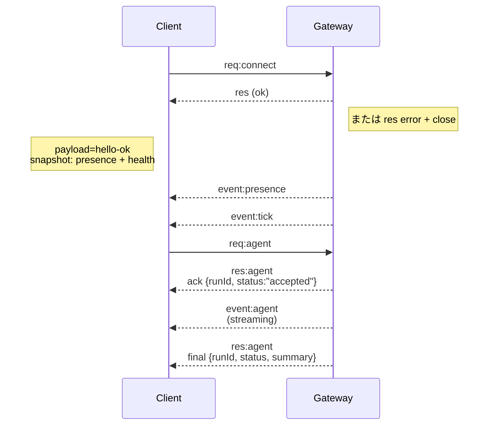

---
read_when:
    - Gatewayプロトコル、クライアント、またはトランスポートに取り組んでいる場合
summary: WebSocket Gatewayのアーキテクチャ、コンポーネント、およびクライアントフロー
title: Gatewayアーキテクチャ
x-i18n:
    generated_at: "2026-04-05T12:40:41Z"
    model: gpt-5.4
    provider: openai
    source_hash: 2b12a2a29e94334c6d10787ac85c34b5b046f9a14f3dd53be453368ca4a7547d
    source_path: concepts/architecture.md
    workflow: 15
---

# Gatewayアーキテクチャ

## 概要

- 単一の長寿命な**Gateway**が、すべてのメッセージングインターフェース（Baileys経由のWhatsApp、grammY経由のTelegram、Slack、Discord、Signal、iMessage、WebChat）を管理します。
- コントロールプレーンクライアント（macOSアプリ、CLI、web UI、自動化）は、設定されたバインドホスト上の**WebSocket**経由でGatewayに接続します（デフォルトは`127.0.0.1:18789`）。
- **ノード**（macOS/iOS/Android/ヘッドレス）も**WebSocket**経由で接続しますが、明示的なcaps/commandsを指定して`role: node`を宣言します。
- ホストごとにGatewayは1つであり、WhatsAppセッションを開くのはそれだけです。
- **canvas host**は、Gateway HTTPサーバー上で次のパスで提供されます:
  - `/__openclaw__/canvas/`（エージェントが編集可能なHTML/CSS/JS）
  - `/__openclaw__/a2ui/`（A2UIホスト）
    これはGatewayと同じポート（デフォルト`18789`）を使用します。

## コンポーネントとフロー

### Gateway（デーモン）

- プロバイダー接続を維持します。
- 型付きのWS API（リクエスト、レスポンス、サーバープッシュイベント）を公開します。
- 受信フレームをJSON Schemaに対して検証します。
- `agent`、`chat`、`presence`、`health`、`heartbeat`、`cron` などのイベントを発行します。

### クライアント（macアプリ / CLI / web管理画面）

- クライアントごとに1つのWS接続。
- リクエストを送信します（`health`、`status`、`send`、`agent`、`system-presence`）。
- イベントを購読します（`tick`、`agent`、`presence`、`shutdown`）。

### ノード（macOS / iOS / Android / ヘッドレス）

- `role: node` を指定して**同じWSサーバー**に接続します。
- `connect` でデバイスIDを提供します。ペアリングは**デバイスベース**（role `node`）で、承認はデバイスペアリングストアに保存されます。
- `canvas.*`、`camera.*`、`screen.record`、`location.get` などのコマンドを公開します。

プロトコルの詳細:

- [Gatewayプロトコル](/gateway/protocol)

### WebChat

- チャット履歴と送信のためにGateway WS APIを使用する静的UIです。
- リモート構成では、ほかのクライアントと同じSSH/Tailscaleトンネルを通じて接続します。

## 接続ライフサイクル（単一クライアント）



## ワイヤープロトコル（概要）

- トランスポート: WebSocket、JSONペイロードを持つテキストフレーム。
- 最初のフレームは**必ず**`connect`でなければなりません。
- ハンドシェイク後:
  - リクエスト: `{type:"req", id, method, params}` → `{type:"res", id, ok, payload|error}`
  - イベント: `{type:"event", event, payload, seq?, stateVersion?}`
- `hello-ok.features.methods` / `events` は検出用メタデータであり、呼び出し可能なすべてのヘルパールートを生成してダンプしたものではありません。
- 共有シークレット認証では、設定されたGateway認証モードに応じて`connect.params.auth.token`または`connect.params.auth.password`を使用します。
- Tailscale Serve（`gateway.auth.allowTailscale: true`）や非loopbackの`gateway.auth.mode: "trusted-proxy"`のようなIDベースのモードでは、認証は`connect.params.auth.*`ではなくリクエストヘッダーから満たされます。
- プライベートingress向けの`gateway.auth.mode: "none"`は共有シークレット認証を完全に無効にします。このモードは公開または信頼できないingressでは無効のままにしてください。
- 副作用のあるメソッド（`send`、`agent`）では、安全に再試行するために冪等性キーが必須です。サーバーは短時間有効な重複排除キャッシュを保持します。
- ノードは`connect`に`role: "node"`に加えてcaps/commands/permissionsを含める必要があります。

## ペアリング + ローカル信頼

- すべてのWSクライアント（オペレーター + ノード）は、`connect`時に**デバイスID**を含めます。
- 新しいデバイスIDにはペアリング承認が必要です。Gatewayは以後の接続のために**device token**を発行します。
- 直接のlocal loopback接続は、同一ホスト上のUXをスムーズに保つために自動承認できます。
- OpenClawには、信頼された共有シークレットのヘルパーフロー向けに、限定的なバックエンド/コンテナローカル自己接続パスもあります。
- 同一ホストのtailnet bindを含むTailnetおよびLAN接続でも、引き続き明示的なペアリング承認が必要です。
- すべての接続は`connect.challenge` nonceに署名する必要があります。
- 署名ペイロード`v3`は`platform`と`deviceFamily`にもバインドします。gatewayは再接続時にペアリング済みメタデータを固定し、メタデータ変更時には再ペアリングを要求します。
- **ローカル以外**の接続では、引き続き明示的な承認が必要です。
- Gateway認証（`gateway.auth.*`）は、ローカル・リモートを問わず**すべて**の接続に引き続き適用されます。

詳細: [Gatewayプロトコル](/gateway/protocol)、[ペアリング](/ja-JP/channels/pairing)、[セキュリティ](/gateway/security)。

## プロトコルの型付けとコード生成

- TypeBoxスキーマがプロトコルを定義します。
- JSON Schemaはそれらのスキーマから生成されます。
- SwiftモデルはJSON Schemaから生成されます。

## リモートアクセス

- 推奨: TailscaleまたはVPN。
- 代替: SSHトンネル

  ```bash
  ssh -N -L 18789:127.0.0.1:18789 user@host
  ```

- 同じハンドシェイク + 認証トークンがトンネル経由でも適用されます。
- リモート構成では、WS向けにTLS + オプションのピン留めを有効にできます。

## 運用スナップショット

- 起動: `openclaw gateway`（フォアグラウンド、ログはstdoutへ）。
- ヘルス: WS経由の`health`（`hello-ok`にも含まれます）。
- 監視: 自動再起動のためのlaunchd/systemd。

## 不変条件

- 各ホストで、単一のBaileysセッションを制御するGatewayは必ず1つだけです。
- ハンドシェイクは必須です。最初のフレームがJSONでない、または`connect`でない場合は即座に接続を閉じます。
- イベントは再配信されません。欠落がある場合、クライアントは再取得する必要があります。

## 関連

- [Agent Loop](/concepts/agent-loop) — エージェント実行サイクルの詳細
- [Gateway Protocol](/gateway/protocol) — WebSocketプロトコル契約
- [Queue](/concepts/queue) — コマンドキューと並行性
- [Security](/gateway/security) — 信頼モデルとハードニング
