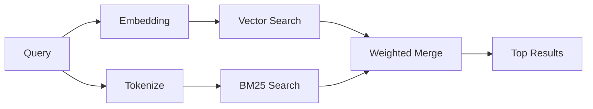

---
read_when:
    - '`memory_search` の仕組みを理解したい場合'
    - 埋め込みプロバイダーを選びたい場合
    - 検索品質を調整したい場合
summary: メモリ検索が embeddings とハイブリッド検索を使って関連ノートを見つける仕組み
title: メモリ検索
x-i18n:
    generated_at: "2026-04-26T11:27:42Z"
    model: gpt-5.4
    provider: openai
    source_hash: 95d86fb3efe79aae92f5e3590f1c15fb0d8f3bb3301f8fe9a41f891e290d7a14
    source_path: concepts/memory-search.md
    workflow: 15
---

`memory_search` は、元のテキストと表現が異なっていても、メモリファイルから関連ノートを見つけます。これは、メモリを小さなチャンクにインデックス化し、それらを embeddings、キーワード、またはその両方で検索することで動作します。

## クイックスタート

GitHub Copilot サブスクリプション、OpenAI、Gemini、Voyage、または Mistral の
API キーが設定されていれば、メモリ検索は自動的に動作します。プロバイダーを
明示的に設定するには:

```json5
{
  agents: {
    defaults: {
      memorySearch: {
        provider: "openai", // または "gemini", "local", "ollama" など
      },
    },
  },
}
```

API キーなしでローカル embeddings を使うには、OpenClaw の隣にオプションの `node-llama-cpp`
ランタイムパッケージをインストールし、`provider: "local"` を使用します。

## サポートされているプロバイダー

| Provider       | ID               | Needs API key | Notes                                                |
| -------------- | ---------------- | ------------- | ---------------------------------------------------- |
| Bedrock        | `bedrock`        | いいえ        | AWS 認証チェーンが解決されると自動検出               |
| Gemini         | `gemini`         | はい          | 画像/音声インデックスをサポート                      |
| GitHub Copilot | `github-copilot` | いいえ        | 自動検出、Copilot サブスクリプションを使用           |
| Local          | `local`          | いいえ        | GGUF モデル、約 0.6 GB のダウンロード                |
| Mistral        | `mistral`        | はい          | 自動検出                                             |
| Ollama         | `ollama`         | いいえ        | ローカル、明示的な設定が必要                         |
| OpenAI         | `openai`         | はい          | 自動検出、高速                                       |
| Voyage         | `voyage`         | はい          | 自動検出                                             |

## 検索の仕組み

OpenClaw は 2 つの検索経路を並列実行し、結果をマージします:



- **ベクトル検索** は意味が似ているノートを見つけます（「gateway host」が
  「OpenClaw を実行しているマシン」と一致するなど）。
- **BM25 キーワード検索** は完全一致を見つけます（ID、エラー文字列、設定キー）。

一方の経路しか利用できない場合（embeddings なし、または FTS なし）は、
もう一方だけが実行されます。

embeddings が利用できない場合でも、OpenClaw は生の完全一致順にだけフォールバックするのではなく、FTS 結果に対する語彙ランキングを引き続き使用します。この劣化モードでは、クエリ語のカバレッジが強いチャンクや関連するファイルパスを持つチャンクが強化されるため、`sqlite-vec` や埋め込みプロバイダーがなくても有用な再現率を維持できます。

## 検索品質の改善

ノート履歴が多い場合に役立つ、2 つの任意機能があります:

### 時間減衰

古いノートは徐々にランキングの重みを失うため、新しい情報が先に上がってきます。
デフォルトの半減期 30 日では、先月のノートは元の重みの 50% でスコア付けされます。
`MEMORY.md` のようなエバーグリーンファイルには減衰は適用されません。

<Tip>
エージェントに数か月分の日次ノートがあり、古い情報が最近のコンテキストよりも上位に来てしまう場合は、時間減衰を有効にしてください。
</Tip>

### MMR（多様性）

重複した結果を減らします。5 つのノートすべてに同じルーター設定への言及がある場合、
MMR により上位結果が繰り返しではなく異なるトピックをカバーするようになります。

<Tip>
`memory_search` が異なる日次ノートからほぼ同じスニペットばかり返す場合は、MMR を有効にしてください。
</Tip>

### 両方を有効にする

```json5
{
  agents: {
    defaults: {
      memorySearch: {
        query: {
          hybrid: {
            mmr: { enabled: true },
            temporalDecay: { enabled: true },
          },
        },
      },
    },
  },
}
```

## マルチモーダルメモリ

Gemini Embedding 2 を使うと、Markdown と一緒に画像や音声ファイルも
インデックス化できます。検索クエリは引き続きテキストですが、視覚コンテンツや音声コンテンツにも一致します。セットアップについては [Memory 設定リファレンス](/ja-JP/reference/memory-config) を参照してください。

## セッションメモリ検索

オプションでセッショントランスクリプトをインデックス化し、`memory_search` が
過去の会話を呼び出せるようにできます。これは
`memorySearch.experimental.sessionMemory` でオプトインします。詳細は
[設定リファレンス](/ja-JP/reference/memory-config) を参照してください。

## トラブルシューティング

**結果が出ない?** インデックスを確認するには `openclaw memory status` を実行してください。空であれば、
`openclaw memory index --force` を実行します。

**キーワード一致しか出ない?** 埋め込みプロバイダーが設定されていない可能性があります。
`openclaw memory status --deep` を確認してください。

**ローカル embeddings がタイムアウトする?** `ollama`、`lmstudio`、`local` はデフォルトで
より長いインラインバッチタイムアウトを使用します。単にホストが遅い場合は、
`agents.defaults.memorySearch.sync.embeddingBatchTimeoutSeconds` を設定してから
`openclaw memory index --force` を再実行してください。

**CJK テキストが見つからない?** FTS インデックスを
`openclaw memory index --force` で再構築してください。

## さらに読む

- [Active Memory](/ja-JP/concepts/active-memory) -- 対話型チャットセッション用のサブエージェントメモリ
- [Memory](/ja-JP/concepts/memory) -- ファイルレイアウト、バックエンド、ツール
- [Memory 設定リファレンス](/ja-JP/reference/memory-config) -- すべての設定項目

## 関連

- [Memory 概要](/ja-JP/concepts/memory)
- [Active Memory](/ja-JP/concepts/active-memory)
- [内蔵メモリエンジン](/ja-JP/concepts/memory-builtin)
