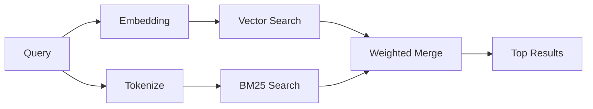

---
read_when:
    - '`memory_search`がどのように動作するかを理解したい場合'
    - embedding providerを選びたい場合
    - 検索品質を調整したい場合
summary: memory searchがembeddingとハイブリッド検索を使って関連ノートを見つける仕組み
title: memory search
x-i18n:
    generated_at: "2026-04-25T13:45:42Z"
    model: gpt-5.4
    provider: openai
    source_hash: 5cc6bbaf7b0a755bbe44d3b1b06eed7f437ebdc41a81c48cca64bd08bbc546b7
    source_path: concepts/memory-search.md
    workflow: 15
---

`memory_search`は、元の文面と表現が異なる場合でも、memoryファイルから関連ノートを見つけます。これは、memoryを小さなチャンクにインデックス化し、embedding、キーワード、またはその両方を使って検索することで実現します。

## クイックスタート

GitHub Copilotサブスクリプション、OpenAI、Gemini、Voyage、またはMistralのAPIキーが設定されていれば、memory searchは自動的に動作します。providerを明示的に設定するには、次のようにします。

```json5
{
  agents: {
    defaults: {
      memorySearch: {
        provider: "openai", // or "gemini", "local", "ollama", etc.
      },
    },
  },
}
```

APIキーなしでローカルembeddingを使う場合は、任意の`node-llama-cpp` runtime packageをOpenClawの隣にインストールし、`provider: "local"`を使用します。

## サポートされるprovider

| Provider | ID | APIキーが必要 | 備考 |
| -------------- | ---------------- | ------------- | ---------------------------------------------------- |
| Bedrock | `bedrock` | いいえ | AWS認証情報チェーンが解決されると自動検出されます |
| Gemini | `gemini` | はい | 画像/音声インデックスをサポートします |
| GitHub Copilot | `github-copilot` | いいえ | 自動検出され、Copilotサブスクリプションを使用します |
| Local | `local` | いいえ | GGUFモデル、約0.6 GBのダウンロード |
| Mistral | `mistral` | はい | 自動検出されます |
| Ollama | `ollama` | いいえ | ローカル、明示的に設定する必要があります |
| OpenAI | `openai` | はい | 自動検出、高速 |
| Voyage | `voyage` | はい | 自動検出されます |

## 検索の仕組み

OpenClawは2つの検索経路を並列で実行し、その結果をマージします。



- **ベクトル検索**は、意味が似ているノートを見つけます（「gateway host」が「OpenClawを実行しているマシン」に一致するなど）。
- **BM25キーワード検索**は、正確な一致を見つけます（ID、エラー文字列、configキーなど）。

片方の経路しか利用できない場合（embeddingなし、またはFTSなし）は、もう片方だけが実行されます。

embeddingが利用できない場合でも、OpenClawは生の完全一致順序だけにフォールバックするのではなく、FTS結果に対する語彙ランキングを引き続き使用します。この劣化モードでは、クエリ語のカバレッジが強いチャンクや関連するファイルパスをブーストするため、`sqlite-vec`やembedding providerがなくても有用な再現率を維持できます。

## 検索品質の改善

大量のノート履歴がある場合、2つの任意機能が役立ちます。

### 時間減衰

古いノートは徐々にランキング重みを失うため、最近の情報が先に表示されます。デフォルトの半減期30日では、先月のノートは元の重みの50%でスコアリングされます。`MEMORY.md`のようなエバーグリーンファイルは減衰しません。

<Tip>
agentに数か月分の日次ノートがあり、古い情報が最近のコンテキストより上位に出続ける場合は、時間減衰を有効にしてください。
</Tip>

### MMR（多様性）

冗長な結果を減らします。5つのノートが同じルーター設定に言及している場合、MMRは上位結果が同じ内容の繰り返しではなく、異なるトピックをカバーするようにします。

<Tip>
`memory_search`が異なる日次ノートからほぼ重複したスニペットを返し続ける場合は、MMRを有効にしてください。
</Tip>

### 両方を有効にする

```json5
{
  agents: {
    defaults: {
      memorySearch: {
        query: {
          hybrid: {
            mmr: { enabled: true },
            temporalDecay: { enabled: true },
          },
        },
      },
    },
  },
}
```

## マルチモーダルmemory

Gemini Embedding 2を使うと、Markdownと一緒に画像や音声ファイルもインデックス化できます。検索クエリは引き続きテキストですが、視覚コンテンツや音声コンテンツにも一致します。セットアップについては、[Memory configuration reference](/ja-JP/reference/memory-config)を参照してください。

## セッションmemory search

必要に応じてセッションtranscriptをインデックス化し、`memory_search`が過去の会話を想起できるようにすることもできます。これは`memorySearch.experimental.sessionMemory`によるオプトインです。詳しくは[configuration reference](/ja-JP/reference/memory-config)を参照してください。

## トラブルシューティング

**結果が出ない場合**: インデックスを確認するには`openclaw memory status`を実行してください。空の場合は`openclaw memory index --force`を実行します。

**キーワード一致しか出ない場合**: embedding providerが設定されていない可能性があります。`openclaw memory status --deep`を確認してください。

**CJKテキストが見つからない場合**: `openclaw memory index --force`でFTSインデックスを再構築してください。

## さらに読む

- [Active Memory](/ja-JP/concepts/active-memory) -- 対話型チャットセッション向けのsub-agent memory
- [Memory](/ja-JP/concepts/memory) -- ファイルレイアウト、バックエンド、tools
- [Memory configuration reference](/ja-JP/reference/memory-config) -- すべてのconfigノブ

## 関連

- [Memory overview](/ja-JP/concepts/memory)
- [Active memory](/ja-JP/concepts/active-memory)
- [Builtin memory engine](/ja-JP/concepts/memory-builtin)
