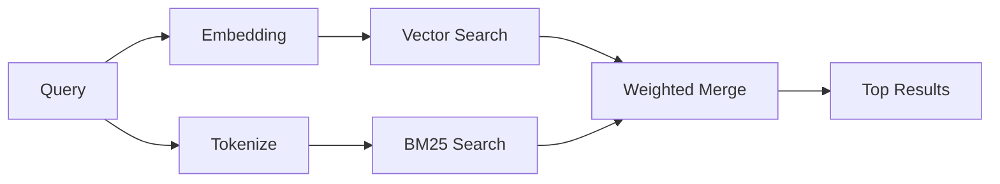

---
read_when:
    - '`memory_search`の仕組みを理解したい場合'
    - 埋め込みプロバイダーを選びたい場合
    - 検索品質を調整したい場合
summary: 埋め込みとハイブリッド取得を使用して、メモリ検索が関連ノートを見つける方法
title: メモリ検索
x-i18n:
    generated_at: "2026-04-05T12:41:21Z"
    model: gpt-5.4
    provider: openai
    source_hash: 87b1cb3469c7805f95bca5e77a02919d1e06d626ad3633bbc5465f6ab9db12a2
    source_path: concepts/memory-search.md
    workflow: 15
---

# メモリ検索

`memory_search`は、元のテキストと表現が異なる場合でも、メモリファイルから関連するノートを見つけます。これは、メモリを小さなチャンクにインデックス化し、埋め込み、キーワード、またはその両方を使って検索することで動作します。

## クイックスタート

OpenAI、Gemini、Voyage、またはMistralのAPIキーが設定されている場合、メモリ検索は自動的に動作します。プロバイダーを明示的に設定するには:

```json5
{
  agents: {
    defaults: {
      memorySearch: {
        provider: "openai", // または "gemini"、"local"、"ollama" など
      },
    },
  },
}
```

APIキーなしでローカル埋め込みを使用するには、`provider: "local"`を使用します（`node-llama-cpp`が必要です）。

## サポートされているプロバイダー

| プロバイダー | ID        | APIキーが必要 | 注記                              |
| ------------ | --------- | ------------- | --------------------------------- |
| OpenAI       | `openai`  | はい          | 自動検出、高速                    |
| Gemini       | `gemini`  | はい          | 画像/音声のインデックス作成をサポート |
| Voyage       | `voyage`  | はい          | 自動検出                          |
| Mistral      | `mistral` | はい          | 自動検出                          |
| Ollama       | `ollama`  | いいえ        | ローカル、明示的に設定が必要      |
| Local        | `local`   | いいえ        | GGUFモデル、約0.6 GBダウンロード   |

## 検索の仕組み

OpenClawは2つの取得パスを並列で実行し、結果を統合します:



- **ベクトル検索**は、意味が似ているノートを見つけます（「gateway host」が「OpenClawを実行しているマシン」に一致するなど）。
- **BM25キーワード検索**は、完全一致を見つけます（ID、エラー文字列、設定キー）。

どちらか一方のパスしか利用できない場合（埋め込みなし、またはFTSなし）は、もう一方だけが実行されます。

## 検索品質の改善

ノート履歴が多い場合は、2つの任意機能が役立ちます:

### 時間減衰

古いノートはランキングの重みを徐々に失うため、新しい情報が先に表示されます。デフォルトの半減期30日では、先月のノートのスコアは元の重みの50%になります。`MEMORY.md`のような恒久的なファイルには減衰は適用されません。

<Tip>
エージェントに数か月分の日次ノートがあり、古い情報が新しいコンテキストより上位に出続ける場合は、時間減衰を有効にしてください。
</Tip>

### MMR（多様性）

重複した結果を減らします。5つのノートすべてに同じルーター設定が書かれている場合、MMRによって上位結果が繰り返しではなく異なるトピックをカバーするようになります。

<Tip>
`memory_search`が異なる日次ノートからほぼ同一のスニペットを返し続ける場合は、MMRを有効にしてください。
</Tip>

### 両方を有効にする

```json5
{
  agents: {
    defaults: {
      memorySearch: {
        query: {
          hybrid: {
            mmr: { enabled: true },
            temporalDecay: { enabled: true },
          },
        },
      },
    },
  },
}
```

## マルチモーダルメモリ

Gemini Embedding 2を使うと、Markdownと一緒に画像ファイルや音声ファイルもインデックス化できます。検索クエリは引き続きテキストですが、視覚および音声コンテンツに対して一致します。設定については、[メモリ設定リファレンス](/reference/memory-config)を参照してください。

## セッションメモリ検索

必要に応じてセッショントランスクリプトをインデックス化し、`memory_search`が以前の会話を思い出せるようにできます。これは`memorySearch.experimental.sessionMemory`によるオプトイン機能です。詳細は[設定リファレンス](/reference/memory-config)を参照してください。

## トラブルシューティング

**結果が出ませんか？** インデックスを確認するには`openclaw memory status`を実行してください。空の場合は、`openclaw memory index --force`を実行してください。

**キーワード一致しか出ませんか？** 埋め込みプロバイダーが設定されていない可能性があります。`openclaw memory status --deep`を確認してください。

**CJKテキストが見つかりませんか？** `openclaw memory index --force`でFTSインデックスを再構築してください。

## さらに読む

- [メモリ](/concepts/memory) -- ファイルレイアウト、バックエンド、ツール
- [メモリ設定リファレンス](/reference/memory-config) -- すべての設定項目
