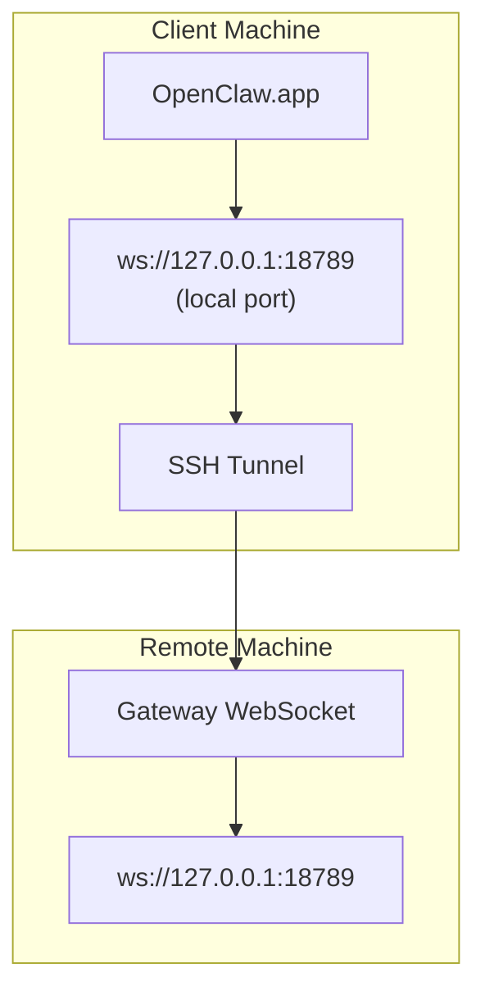

> この内容は [Remote Access](/gateway/remote#macos-persistent-ssh-tunnel-via-launchagent) に統合されました。現在のガイドはそのページを参照してください。

# リモートGatewayでOpenClaw.appを実行する

OpenClaw.appは、リモートGatewayに接続するためにSSHトンネリングを使用します。このガイドでは、そのセットアップ方法を説明します。

## 概要



## クイックセットアップ

### ステップ1: SSH設定を追加する

`~/.ssh/config` を編集して、次を追加します。

```ssh
Host remote-gateway
    HostName <REMOTE_IP>          # 例: 172.27.187.184
    User <REMOTE_USER>            # 例: jefferson
    LocalForward 18789 127.0.0.1:18789
    IdentityFile ~/.ssh/id_rsa
```

`<REMOTE_IP>` と `<REMOTE_USER>` を自分の値に置き換えてください。

### ステップ2: SSHキーをコピーする

公開鍵をリモートマシンへコピーします（パスワード入力は1回だけです）。

```bash
ssh-copy-id -i ~/.ssh/id_rsa <REMOTE_USER>@<REMOTE_IP>
```

### ステップ3: リモートGateway認証を設定する

```bash
openclaw config set gateway.remote.token "<your-token>"
```

リモートGatewayがパスワード認証を使用している場合は、代わりに `gateway.remote.password` を使用してください。
`OPENCLAW_GATEWAY_TOKEN` もシェルレベルの上書きとしては有効ですが、永続的な
リモートクライアント設定は `gateway.remote.token` / `gateway.remote.password` です。

### ステップ4: SSHトンネルを開始する

```bash
ssh -N remote-gateway &
```

### ステップ5: OpenClaw.appを再起動する

```bash
# OpenClaw.appを終了（⌘Q）してから、再度開きます:
open /path/to/OpenClaw.app
```

これでアプリはSSHトンネル経由でリモートGatewayに接続します。

---

## ログイン時にトンネルを自動起動する

ログイン時にSSHトンネルを自動的に開始したい場合は、Launch Agentを作成します。

### PLISTファイルを作成する

これを `~/Library/LaunchAgents/ai.openclaw.ssh-tunnel.plist` として保存します。

```xml
<?xml version="1.0" encoding="UTF-8"?>
<!DOCTYPE plist PUBLIC "-//Apple//DTD PLIST 1.0//EN" "http://www.apple.com/DTDs/PropertyList-1.0.dtd">
<plist version="1.0">
<dict>
    <key>Label</key>
    <string>ai.openclaw.ssh-tunnel</string>
    <key>ProgramArguments</key>
    <array>
        <string>/usr/bin/ssh</string>
        <string>-N</string>
        <string>remote-gateway</string>
    </array>
    <key>KeepAlive</key>
    <true/>
    <key>RunAtLoad</key>
    <true/>
</dict>
</plist>
```

### Launch Agentを読み込む

```bash
launchctl bootstrap gui/$UID ~/Library/LaunchAgents/ai.openclaw.ssh-tunnel.plist
```

これでトンネルは次のように動作します。

- ログイン時に自動的に開始する
- クラッシュした場合に再起動する
- バックグラウンドで実行を継続する

レガシー注: もし残っていれば、古い `com.openclaw.ssh-tunnel` LaunchAgent を削除してください。

---

## トラブルシューティング

**トンネルが実行中か確認する:**

```bash
ps aux | grep "ssh -N remote-gateway" | grep -v grep
lsof -i :18789
```

**トンネルを再起動する:**

```bash
launchctl kickstart -k gui/$UID/ai.openclaw.ssh-tunnel
```

**トンネルを停止する:**

```bash
launchctl bootout gui/$UID/ai.openclaw.ssh-tunnel
```

---

## 仕組み

| コンポーネント                            | 役割                                                         |
| ------------------------------------ | ------------------------------------------------------------ |
| `LocalForward 18789 127.0.0.1:18789` | ローカルポート18789をリモートポート18789へ転送する               |
| `ssh -N`                             | リモートコマンドを実行しないSSH（ポート転送のみ）               |
| `KeepAlive`                          | クラッシュ時にトンネルを自動的に再起動する                     |
| `RunAtLoad`                          | エージェント読み込み時にトンネルを開始する                     |

OpenClaw.appは、クライアントマシン上の `ws://127.0.0.1:18789` に接続します。SSHトンネルは、その接続をGatewayが動作しているリモートマシン上のポート18789へ転送します。
