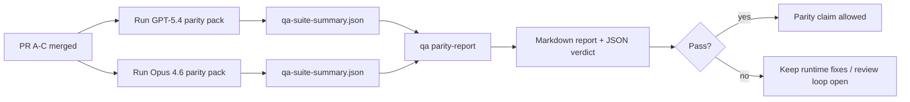

---
read_when:
    - GPT-5.4 / CodexパリティPRシリーズをレビューする場合
    - パリティプログラムを支える6つの契約からなるagenticアーキテクチャを保守する場合
summary: GPT-5.4 / Codexパリティプログラムを4つのマージ単位としてレビューする方法
title: GPT-5.4 / Codexパリティのメンテナー向け注記
x-i18n:
    generated_at: "2026-04-25T13:50:10Z"
    model: gpt-5.4
    provider: openai
    source_hash: 162ea68476880d4dbf9b8c3b9397a51a2732c3eb10ac52e421a9c9d90e04eec2
    source_path: help/gpt54-codex-agentic-parity-maintainers.md
    workflow: 15
---

この注記では、元の6契約アーキテクチャを失わずに、GPT-5.4 / Codexパリティプログラムを4つのマージ単位としてレビューする方法を説明します。

## マージ単位

### PR A: strict-agentic execution

担当範囲:

- `executionContract`
- GPT-5優先の同一ターン内フォロースルー
- 非終端の進捗追跡としての`update_plan`
- 計画だけで無言停止するのではなく、明示的なblocked状態

担当外:

- auth/runtime失敗の分類
- permissionのtruthfulness
- replay/continuationの再設計
- パリティベンチマーク

### PR B: runtime truthfulness

担当範囲:

- Codex OAuthスコープの正確性
- 型付きprovider/runtime失敗分類
- truthfulな`/elevated full`の利用可否とblocked理由

担当外:

- ツールスキーマの正規化
- replay/liveness状態
- ベンチマークゲーティング

### PR C: execution correctness

担当範囲:

- providerが所有するOpenAI/Codexツール互換性
- パラメーターなしのstrict schema処理
- replay-invalidの可視化
- paused、blocked、abandonedな長時間タスク状態の可視性

担当外:

- 自己選択によるcontinuation
- provider hook外の一般的なCodex dialect挙動
- ベンチマークゲーティング

### PR D: parity harness

担当範囲:

- 第1波のGPT-5.4 vs Opus 4.6シナリオパック
- パリティドキュメント
- パリティレポートとリリースゲートの仕組み

担当外:

- QA-lab外のruntime挙動変更
- ハーネス内のauth/proxy/DNSシミュレーション

## 元の6契約への対応関係

| 元の契約 | マージ単位 |
| ---------------------------------------- | ---------- |
| Provider transport/auth correctness      | PR B       |
| Tool contract/schema compatibility       | PR C       |
| Same-turn execution                      | PR A       |
| Permission truthfulness                  | PR B       |
| Replay/continuation/liveness correctness | PR C       |
| Benchmark/release gate                   | PR D       |

## レビュー順序

1. PR A
2. PR B
3. PR C
4. PR D

PR Dは証明レイヤーです。runtime correctnessのPRが遅れる理由にしてはいけません。

## 確認すべきこと

### PR A

- GPT-5実行が、コメントだけして止まるのではなく、実行するかフェイルクローズドになる
- `update_plan`だけでは進捗に見えなくなっている
- 挙動がGPT-5優先かつembedded-Piスコープにとどまっている

### PR B

- auth/proxy/runtime失敗が、汎用的な「model failed」処理へ潰れなくなっている
- `/elevated full`が、実際に利用可能な場合にのみ利用可能と説明される
- blocked理由がモデルとユーザー向けruntimeの両方に可視化されている

### PR C

- strictなOpenAI/Codexツール登録が予測可能に動作する
- パラメーターなしツールがstrict schemaチェックで失敗しない
- replayおよびCompactionの結果がtruthfulなliveness状態を保持する

### PR D

- シナリオパックが理解可能かつ再現可能である
- パックに読み取り専用フローだけでなく、変更を伴うreplay-safetyレーンが含まれている
- レポートが人間にも自動化にも読みやすい
- パリティ主張が逸話ではなく証拠に基づいている

PR Dから期待されるアーティファクト:

- 各モデル実行の`qa-suite-report.md` / `qa-suite-summary.json`
- 集約およびシナリオ単位比較を含む`qa-agentic-parity-report.md`
- 機械可読な判定を含む`qa-agentic-parity-summary.json`

## リリースゲート

次の条件が満たされるまでは、Opus 4.6に対するGPT-5.4のパリティまたは優位性を主張しないでください。

- PR A、PR B、PR Cがマージ済み
- PR Dが第1波パリティパックをクリーンに実行
- runtime-truthfulness回帰スイートが引き続きグリーン
- パリティレポートにfake-successケースがなく、stop挙動の回帰もない

パリティハーネスは唯一の証拠ソースではありません。レビューではこの分担を明確に維持してください。

- PR Dは、シナリオベースのGPT-5.4 vs Opus 4.6比較を担当する
- PR Bの決定論的スイートは、引き続きauth/proxy/DNSおよび完全アクセスtruthfulnessの証拠を担当する

## メンテナー向けクイックマージワークフロー

パリティPRをマージする準備ができていて、再現性が高く低リスクな手順を使いたい場合に使ってください。

1. マージ前に証拠基準を満たしていることを確認する:
   - 再現可能な症状または失敗テスト
   - 変更対象コード内で検証済みの根本原因
   - 関係する経路に対する修正
   - 回帰テストまたは明示的な手動検証メモ
2. マージ前にトリアージ/ラベル付け:
   - PRをマージすべきでない場合は該当する`r:*`自動クローズラベルを適用する
   - マージ候補には未解決のブロッカースレッドを残さない
3. 変更したサーフェスをローカルで検証:
   - `pnpm check:changed`
   - テストが変更された場合、またはバグ修正の信頼性がテストカバレッジに依存する場合は`pnpm test:changed`
4. 標準メンテナーフロー（`/landpr`プロセス）でマージし、その後検証:
   - 関連issueの自動クローズ挙動
   - `main`上のCIとマージ後ステータス
5. マージ後、関連する未クローズの重複PR/issueを検索し、正典参照付きでのみクローズする

証拠基準の項目が1つでも欠けている場合は、マージではなく変更要求にしてください。

## 目標から証拠への対応表

| 完了ゲート項目 | 主担当 | レビュー用アーティファクト |
| ---------------------------------------- | ------------- | ------------------------------------------------------------------- |
| planだけで止まることがない                      | PR A          | strict-agentic runtimeテストと`approval-turn-tool-followthrough` |
| fake progressやfake tool completionがない | PR A + PR D   | parity fake-success件数とシナリオ単位レポート詳細        |
| 誤った`/elevated full`ガイダンスがない       | PR B          | 決定論的runtime-truthfulnessスイート                           |
| replay/liveness失敗が明示的なままである | PR C + PR D   | lifecycle/replayスイートと`compaction-retry-mutating-tool`       |
| GPT-5.4がOpus 4.6と同等以上        | PR D          | `qa-agentic-parity-report.md`と`qa-agentic-parity-summary.json`  |

## レビュアー向け短縮表記: before vs after

| 変更前のユーザー可視問題 | 変更後のレビューシグナル |
| ----------------------------------------------------------- | --------------------------------------------------------------------------------------- |
| GPT-5.4が計画後に停止していた                              | PR Aが、コメントだけの完了ではなく、実行またはblocked挙動を示す                  |
| strictなOpenAI/Codex schemaではツール使用が不安定だった      | PR Cが、ツール登録とパラメーターなし呼び出しを予測可能に保つ                  |
| `/elevated full`のヒントが時々誤解を招いていた            | PR Bが、ガイダンスを実際のruntime capabilityとblocked理由に結び付ける                     |
| 長時間タスクがreplay/Compactionの曖昧さに埋もれることがあった | PR Cが、paused、blocked、abandoned、replay-invalid状態を明示的に出力する                |
| パリティ主張が逸話ベースだった                                | PR Dが、両モデルで同じシナリオカバレッジを持つレポートとJSON判定を生成する |

## 関連

- [GPT-5.4 / Codex agentic parity](/ja-JP/help/gpt54-codex-agentic-parity)
