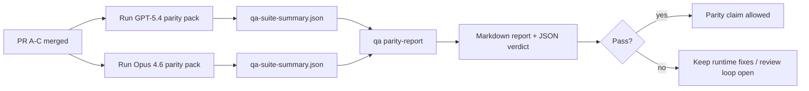

---
read_when:
    - GPT-5.4 / CodexパリティPRシリーズのレビュー
    - パリティプログラムの背後にある6つのコントラクトによるエージェント型アーキテクチャを維持すること
summary: GPT-5.4 / Codexパリティプログラムを4つのマージ単位としてレビューする方法
title: GPT-5.4 / Codexパリティのメンテナーノート
x-i18n:
    generated_at: "2026-04-22T04:22:59Z"
    model: gpt-5.4
    provider: openai
    source_hash: b872d6a33b269c01b44537bfa8646329063298fdfcd3671a17d0eadbc9da5427
    source_path: help/gpt54-codex-agentic-parity-maintainers.md
    workflow: 15
---

# GPT-5.4 / Codexパリティのメンテナーノート

このノートでは、元の6つのコントラクトアーキテクチャを失わずに、GPT-5.4 / Codexパリティプログラムを4つのマージ単位としてレビューする方法を説明します。

## マージ単位

### PR A: strict-agentic execution

担当範囲:

- `executionContract`
- GPT-5優先の同一ターン内フォロースルー
- 非終端の進捗追跡としての`update_plan`
- 計画だけで無言停止するのではなく、明示的なblocked state

担当外:

- auth/runtime障害の分類
- permissionのtruthfulness
- replay/continuationの再設計
- パリティベンチマーク

### PR B: runtime truthfulness

担当範囲:

- Codex OAuthスコープの正確性
- 型付きprovider/runtime障害分類
- 真実に基づく`/elevated full`の利用可否とblocked reason

担当外:

- ツールスキーマの正規化
- replay/liveness state
- benchmarkゲーティング

### PR C: execution correctness

担当範囲:

- providerが所有するOpenAI/Codexツール互換性
- パラメーターなしのstrict schema handling
- replay-invalidの可視化
- paused、blocked、abandonedな長時間タスク状態の可視化

担当外:

- 自己選択によるcontinuation
- provider hook外での汎用Codex dialect動作
- benchmarkゲーティング

### PR D: parity harness

担当範囲:

- 第1波のGPT-5.4対Opus 4.6シナリオパック
- パリティドキュメント
- パリティレポートとリリースゲートの仕組み

担当外:

- QA-lab外のruntime動作変更
- harness内でのauth/proxy/DNSシミュレーション

## 元の6つのコントラクトへの対応関係

| 元のコントラクト | マージ単位 |
| ---------------------------------------- | ---------- |
| Provider transport/auth correctness      | PR B       |
| Tool contract/schema compatibility       | PR C       |
| Same-turn execution                      | PR A       |
| Permission truthfulness                  | PR B       |
| Replay/continuation/liveness correctness | PR C       |
| Benchmark/release gate                   | PR D       |

## レビュー順序

1. PR A
2. PR B
3. PR C
4. PR D

PR Dは証明レイヤーです。runtime correctnessのPRが遅れる理由にしてはいけません。

## 確認すべき点

### PR A

- GPT-5の実行が、コメントだけで止まるのではなく、動作するかfail closedする
- `update_plan`単体では進捗に見えなくなる
- 動作がGPT-5優先かつembedded-Piスコープにとどまっている

### PR B

- auth/proxy/runtime障害が、一般的な「model failed」処理にまとめられなくなる
- `/elevated full`は、実際に利用可能なときにのみ利用可能と説明される
- blocked reasonが、モデルとユーザー向けruntimeの両方に見える

### PR C

- strictなOpenAI/Codexツール登録が予測どおりに動作する
- パラメーターなしツールがstrict schemaチェックで失敗しない
- replayとCompactionの結果がtruthfulなliveness stateを維持する

### PR D

- シナリオパックが理解しやすく再現可能である
- パックに読み取り専用フローだけでなく、変更を伴うreplay-safetyレーンが含まれている
- レポートが人にも自動化にも読みやすい
- パリティの主張が逸話ではなく証拠に裏付けられている

PR Dから期待されるartifact:

- 各モデル実行ごとの`qa-suite-report.md` / `qa-suite-summary.json`
- 集約およびシナリオ単位比較を含む`qa-agentic-parity-report.md`
- 機械可読な判定を含む`qa-agentic-parity-summary.json`

## リリースゲート

次の条件を満たすまでは、GPT-5.4がOpus 4.6と同等、またはそれ以上であると主張しないでください。

- PR A、PR B、PR Cがマージされている
- PR Dが第1波パリティパックをクリーンに実行している
- runtime truthfulnessの回帰スイートが引き続きgreenである
- パリティレポートにfake-successケースがなく、停止動作の回帰もない

パリティharnessは唯一の証拠ソースではありません。レビューではこの分離を明示したままにしてください。

- PR Dは、シナリオベースのGPT-5.4対Opus 4.6比較を担当します
- PR Bの決定的スイートは、auth/proxy/DNSおよびfull-access truthfulnessの証拠を引き続き担当します

## 目標と証拠の対応表

| 完了ゲート項目 | 主担当 | レビューartifact |
| ---------------------------------------- | ------------- | ------------------------------------------------------------------- |
| 計画だけで停止しない | PR A          | strict-agentic runtimeテストと`approval-turn-tool-followthrough` |
| 偽の進捗や偽のツール完了がない | PR A + PR D   | パリティfake-success件数とシナリオ単位レポート詳細 |
| 誤った`/elevated full`ガイダンスがない | PR B          | 決定的runtime truthfulnessスイート |
| replay/liveness障害が明示されたままである | PR C + PR D   | lifecycle/replayスイートと`compaction-retry-mutating-tool` |
| GPT-5.4がOpus 4.6と同等以上 | PR D          | `qa-agentic-parity-report.md`と`qa-agentic-parity-summary.json` |

## レビュアー向け短縮表現: 変更前と変更後

| 変更前のユーザー可視問題 | 変更後のレビューシグナル |
| ----------------------------------------------------------- | --------------------------------------------------------------------------------------- |
| GPT-5.4が計画後に停止していた | PR Aで、コメントだけの完了ではなくact-or-block動作が示されている |
| strictなOpenAI/Codex schemaでツール利用が不安定に感じられた | PR Cで、ツール登録とパラメーターなし呼び出しが予測可能に保たれている |
| `/elevated full`のヒントがときどき誤解を招いていた | PR Bで、ガイダンスが実際のruntime capabilityとblocked reasonに結び付けられている |
| 長時間タスクがreplay/Compactionの曖昧さの中に消えることがあった | PR Cで、明示的なpaused、blocked、abandoned、replay-invalid stateが出力される |
| パリティの主張が逸話ベースだった | PR Dで、両モデルに同じシナリオカバレッジを適用したレポートとJSON verdictが生成される |
