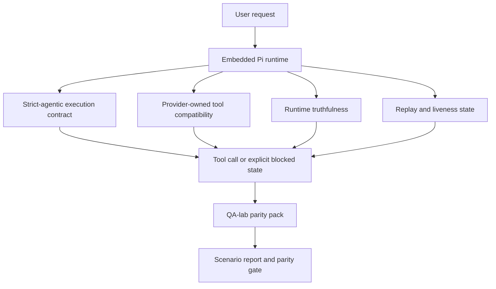
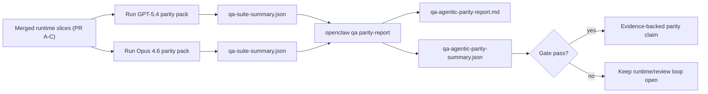

---
read_when:
    - GPT-5.4またはCodexエージェントの動作のデバッグ
    - フロンティアモデル間でのOpenClawのagentic動作の比較
    - strict-agentic、ツールスキーマ、昇格、リプレイ修正のレビュー
summary: OpenClawがGPT-5.4やCodex系モデル向けのagentic execution gapをどのように埋めるか
title: GPT-5.4 / CodexのAgentic Parity
x-i18n:
    generated_at: "2026-04-22T04:23:01Z"
    model: gpt-5.4
    provider: openai
    source_hash: 77bc9b8fab289bd35185fa246113503b3f5c94a22bd44739be07d39ae6779056
    source_path: help/gpt54-codex-agentic-parity.md
    workflow: 15
---

# OpenClawにおけるGPT-5.4 / CodexのAgentic Parity

OpenClawはすでにツール利用型のフロンティアモデルとうまく連携していましたが、GPT-5.4やCodex系モデルには、実運用上まだいくつか性能不足の点がありました:

- 作業を実行せず、計画だけで止まることがある
- strictなOpenAI/Codexツールスキーマを誤って使うことがある
- フルアクセスが不可能な場合でも `/elevated full` を要求することがある
- リプレイやCompaction中に長時間タスクの状態を失うことがある
- Claude Opus 4.6とのparity主張が、再現可能なシナリオではなく逸話ベースだった

このparityプログラムは、レビュー可能な4つのスライスでそれらのギャップを埋めます。

## 何が変わったか

### PR A: strict-agentic実行

このスライスでは、埋め込みPi GPT-5実行向けのオプトインな `strict-agentic` 実行契約を追加します。

有効にすると、OpenClawは計画だけのターンを「十分な」完了として受け入れなくなります。モデルが何をするつもりかだけを述べ、実際にはツールを使わず進捗も出さない場合、OpenClawは「今すぐ実行する」方向のsteerで再試行し、それでもだめなら、タスクを黙って終了させる代わりに、明示的なblocked状態でfail closedします。

これは特に次のようなケースでGPT-5.4体験を改善します:

- 短い「ok do it」系のフォローアップ
- 最初のステップが明白なコードタスク
- `update_plan` が埋め草テキストではなく進捗追跡であるべきフロー

### PR B: ランタイムの真実性

このスライスでは、OpenClawが次の2点について正直に伝えるようにします:

- なぜprovider/runtime呼び出しが失敗したか
- `/elevated full` が実際に利用可能かどうか

これによりGPT-5.4は、不足しているスコープ、認証更新失敗、HTML 403認証失敗、プロキシ問題、DNSまたはタイムアウト障害、blockedされたフルアクセスモードについて、より良いランタイムシグナルを得られます。モデルは誤った対処法を幻覚する可能性や、ランタイムが提供できない権限モードを要求し続ける可能性が低くなります。

### PR C: 実行の正確性

このスライスは、2種類の正確性を改善します:

- providerが所有するOpenAI/Codexツールスキーマ互換性
- リプレイと長時間タスクのliveness可視化

ツール互換性の改善は、strictなOpenAI/Codexツール登録におけるスキーマ摩擦を減らします。特に、パラメータなしツールやstrictなオブジェクトルート期待値まわりで効果があります。リプレイ/livenessの改善は、長時間実行タスクをより観測しやすくし、paused、blocked、abandoned状態が、汎用的な失敗テキストに埋もれず見えるようにします。

### PR D: parity harness

このスライスでは、GPT-5.4とOpus 4.6を同じシナリオで実行し、共通のエビデンスで比較できる、最初のQA-lab parity packを追加します。

parity packは証明レイヤーです。これ自体ではランタイム動作は変更しません。

2つの `qa-suite-summary.json` アーティファクトが揃ったら、次でrelease-gate比較を生成します:

```bash
pnpm openclaw qa parity-report \
  --repo-root . \
  --candidate-summary .artifacts/qa-e2e/gpt54/qa-suite-summary.json \
  --baseline-summary .artifacts/qa-e2e/opus46/qa-suite-summary.json \
  --output-dir .artifacts/qa-e2e/parity
```

このコマンドは次を書き出します:

- 人間が読めるMarkdownレポート
- 機械可読なJSON verdict
- 明示的な `pass` / `fail` gate結果

## これが実際にGPT-5.4を改善する理由

この作業以前、OpenClaw上のGPT-5.4は、実際のコーディングセッションではOpusよりagentic性が低く感じられることがありました。これは、ランタイムがGPT-5系モデルに特に有害な挙動を許容していたためです:

- 解説だけのターン
- ツールまわりのスキーマ摩擦
- あいまいな権限フィードバック
- 黙って発生するリプレイまたはCompaction破損

目標は、GPT-5.4をOpusの模倣にすることではありません。目標は、実際の進捗に報酬を与え、より明確なツールと権限の意味論を提供し、失敗モードを明示的な機械可読・人間可読状態に変えるランタイム契約をGPT-5.4に与えることです。

これにより、ユーザー体験は次のように変わります:

- 「モデルは良い計画を立てたが止まった」

から:

- 「モデルは実行したか、あるいはOpenClawが実行できなかった正確な理由を示した」

へ。

## GPT-5.4ユーザーにとってのBefore vs After

| Before this program                                                                            | After PR A-D                                                                                   |
| ---------------------------------------------------------------------------------------------- | ---------------------------------------------------------------------------------------------- |
| GPT-5.4は、妥当な計画の後でも次のツール操作を行わずに止まることがあった                         | PR Aにより「計画だけ」は「今すぐ実行するか、blocked状態を表面化するか」に変わる                  |
| strictなツールスキーマは、パラメータなしツールやOpenAI/Codex形状のツールを分かりにくい形で拒否することがあった | PR Cにより、provider所有のツール登録と呼び出しがより予測可能になる                              |
| `/elevated full` のガイダンスが、blockedなランタイムではあいまいまたは誤っていることがあった     | PR Bにより、GPT-5.4とユーザーに真実に基づくランタイムおよび権限ヒントが与えられる                |
| リプレイやCompaction失敗により、タスクが黙って消えたように感じられることがあった                  | PR Cにより、paused、blocked、abandoned、replay-invalidの結果が明示的に表面化される              |
| 「GPT-5.4はOpusより悪く感じる」は、ほぼ逸話ベースだった                                        | PR Dにより、それが同一シナリオパック、同一メトリクス、厳格なpass/fail gateへ変わる               |

## アーキテクチャ



## リリースフロー



## シナリオパック

第1波のparity packは現在、5つのシナリオをカバーしています:

### `approval-turn-tool-followthrough`

短い承認のあとに、モデルが「やります」で止まらないことを確認します。同じターン内で最初の具体的アクションを取る必要があります。

### `model-switch-tool-continuity`

ツール利用中の作業が、モデル/ランタイム切り替え境界をまたいでも、解説に戻ったり実行コンテキストを失ったりせず、一貫して保たれることを確認します。

### `source-docs-discovery-report`

モデルがソースとドキュメントを読み、発見事項を統合し、薄い要約を出して早期停止するのではなく、agenticにタスクを継続できることを確認します。

### `image-understanding-attachment`

添付ファイルを含む混合モードタスクが、あいまいな説明に崩れず、実行可能なままであることを確認します。

### `compaction-retry-mutating-tool`

実際に変更を書き込むタスクが、Compaction、再試行、または圧力下での返信状態喪失が発生しても、replay-unsafe性を黙ってreplay-safeのように見せるのではなく、明示したまま保つことを確認します。

## シナリオマトリクス

| Scenario                           | 何をテストするか                       | 良いGPT-5.4の挙動                                                              | 失敗シグナル                                                                       |
| ---------------------------------- | -------------------------------------- | ------------------------------------------------------------------------------ | ---------------------------------------------------------------------------------- |
| `approval-turn-tool-followthrough` | 計画後の短い承認ターン                 | 意図を言い直すのではなく、最初の具体的なツール操作を即座に開始する              | 計画だけのフォローアップ、ツールアクティビティなし、または実際のブロッカーなしのblockedターン |
| `model-switch-tool-continuity`     | ツール利用下でのランタイム/モデル切り替え | タスクコンテキストを保持し、一貫して行動を続ける                               | 解説に戻る、ツールコンテキストを失う、または切り替え後に停止する                     |
| `source-docs-discovery-report`     | ソース読解 + 統合 + アクション         | ソースを見つけ、ツールを使い、停滞せず有用なレポートを作る                      | 薄い要約、ツール作業不足、または不完全ターンでの停止                                 |
| `image-understanding-attachment`   | 添付ファイル主導のagentic作業          | 添付ファイルを解釈し、ツールに結びつけ、タスクを継続する                        | あいまいな説明、添付無視、または具体的な次アクションなし                             |
| `compaction-retry-mutating-tool`   | Compaction圧力下での変更作業           | 実際の書き込みを行い、副作用後もreplay-unsafe性を明示したまま保つ               | 変更書き込みは発生したのに、replay安全性がほのめかされる、欠落する、または矛盾する     |

## リリースゲート

GPT-5.4がparity以上と見なされるには、マージ済みランタイムがparity packとruntime-truthfulness回帰の両方に同時に合格する必要があります。

必要な結果:

- 次のツール操作が明確なときに、計画だけで停滞しないこと
- 実際の実行なしの偽完了がないこと
- 誤った `/elevated full` ガイダンスがないこと
- 黙ったリプレイまたはCompaction放棄がないこと
- 合意済みのOpus 4.6ベースラインと同等以上に強いparity-packメトリクス

第1波harnessでは、ゲートは次を比較します:

- completion rate
- unintended-stop rate
- valid-tool-call rate
- fake-success count

parityエビデンスは、意図的に2つのレイヤーに分割されています:

- PR Dは、QA-labで同一シナリオのGPT-5.4 vs Opus 4.6挙動を証明する
- PR Bの決定的スイートは、harness外でのauth、proxy、DNS、`/elevated full` の真実性を証明する

## 目標からエビデンスへのマトリクス

| Completion gate item                                     | Owning PR   | エビデンスソース                                                  | 合格シグナル                                                                            |
| -------------------------------------------------------- | ----------- | ----------------------------------------------------------------- | --------------------------------------------------------------------------------------- |
| GPT-5.4が計画後に停滞しなくなる                          | PR A        | `approval-turn-tool-followthrough` とPR Aランタイムスイート       | 承認ターンが実際の作業、または明示的なblocked状態を引き起こす                           |
| GPT-5.4が偽の進捗や偽のツール完了を出さなくなる          | PR A + PR D | parity reportのシナリオ結果とfake-success count                  | 疑わしいpass結果がなく、解説だけの完了もない                                           |
| GPT-5.4が誤った `/elevated full` ガイダンスを出さなくなる | PR B        | 決定的なtruthfulnessスイート                                      | blocked理由とフルアクセスヒントがランタイムに対して正確なまま保たれる                  |
| リプレイ/liveness失敗が明示されたままになる              | PR C + PR D | PR Cのlifecycle/replayスイートと `compaction-retry-mutating-tool` | 変更作業が、黙って消えるのではなく、replay-unsafe性を明示したまま保たれる               |
| GPT-5.4が合意済みメトリクスでOpus 4.6に並ぶか上回る      | PR D        | `qa-agentic-parity-report.md` と `qa-agentic-parity-summary.json` | 同一シナリオカバレッジがあり、completion、停止挙動、有効なツール利用で回帰がない         |

## parity verdictの読み方

第1波parity packの最終的な機械可読判定として、`qa-agentic-parity-summary.json` 内のverdictを使ってください。

- `pass` は、GPT-5.4がOpus 4.6と同じシナリオをカバーし、合意済みの集計メトリクスで回帰しなかったことを意味します。
- `fail` は、少なくとも1つのハードゲートに引っかかったことを意味します。具体的には、より弱い完了率、より悪い意図しない停止、より弱い有効なツール利用、何らかのfake-successケース、またはシナリオカバレッジ不一致です。
- 「shared/base CI issue」は、それ自体ではparity結果ではありません。PR Dの外にあるCIノイズが実行を妨げた場合、verdictはブランチ時代のログから推測するのではなく、クリーンなマージ済みランタイム実行を待つべきです。
- auth、proxy、DNS、`/elevated full` の真実性は引き続きPR Bの決定的スイートから得られるため、最終的なリリース主張には両方が必要です。つまり、PR Dのparity verdictの合格と、PR Bのtruthfulnessカバレッジがgreenであることです。

## `strict-agentic` を有効にすべき人

次の場合は `strict-agentic` を使用してください:

- 次のステップが明白なときに、エージェントが即座に行動することが期待される
- GPT-5.4またはCodex系モデルが主要ランタイムである
- 「親切な」要約だけの返信よりも、明示的なblocked状態を好む

次の場合はデフォルト契約のままにしてください:

- 既存のより緩い挙動を望む
- GPT-5系モデルを使っていない
- ランタイム強制ではなくプロンプトをテストしている
