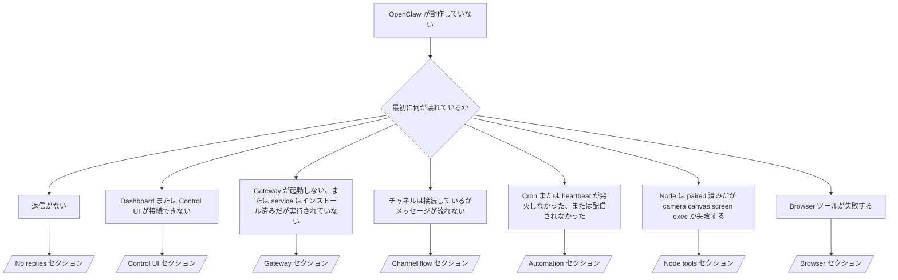

---
read_when:
    - OpenClaw が動作しておらず、最短で解決したい場合
    - 詳細なランブックに入る前にトリアージフローを確認したい場合
summary: OpenClaw の症状別トラブルシューティングハブ
title: General Troubleshooting
x-i18n:
    generated_at: "2026-04-05T12:47:05Z"
    model: gpt-5.4
    provider: openai
    source_hash: 23ae9638af5edf5a5e0584ccb15ba404223ac3b16c2d62eb93b2c9dac171c252
    source_path: help/troubleshooting.md
    workflow: 15
---

# Troubleshooting

2 分しかない場合は、このページをトリアージの入口として使ってください。

## 最初の 60 秒

次の手順をこの順番でそのまま実行してください:

```bash
openclaw status
openclaw status --all
openclaw gateway probe
openclaw gateway status
openclaw doctor
openclaw channels status --probe
openclaw logs --follow
```

良好な出力の目安:

- `openclaw status` → 設定済みチャネルが表示され、明らかな auth エラーがない。
- `openclaw status --all` → 完全なレポートが存在し、共有可能である。
- `openclaw gateway probe` → 期待される gateway ターゲットに到達できる（`Reachable: yes`）。`RPC: limited - missing scope: operator.read` は診断機能の劣化であり、接続失敗ではありません。
- `openclaw gateway status` → `Runtime: running` および `RPC probe: ok`。
- `openclaw doctor` → config / service に起動を妨げるエラーがない。
- `openclaw channels status --probe` → 到達可能な gateway は、アカウントごとのライブな
  transport 状態に加えて、`works` や `audit ok` などの probe / audit 結果を返します。gateway に到達できない場合、このコマンドは config のみのサマリーにフォールバックします。
- `openclaw logs --follow` → 安定したアクティビティがあり、繰り返される致命的エラーがない。

## Anthropic の長いコンテキストでの 429

次のような表示が出た場合:
`HTTP 429: rate_limit_error: Extra usage is required for long context requests`
[/gateway/troubleshooting#anthropic-429-extra-usage-required-for-long-context](/gateway/troubleshooting#anthropic-429-extra-usage-required-for-long-context) を参照してください。

## プラグインのインストールが missing openclaw extensions で失敗する

インストールが `package.json missing openclaw.extensions` で失敗する場合、
そのプラグインパッケージは、OpenClaw が現在受け付けない古い形式を使用しています。

プラグインパッケージ側での修正:

1. `package.json` に `openclaw.extensions` を追加する。
2. エントリーをビルド済みの実行時ファイル（通常は `./dist/index.js`）に向ける。
3. プラグインを再公開し、もう一度 `openclaw plugins install <package>` を実行する。

例:

```json
{
  "name": "@openclaw/my-plugin",
  "version": "1.2.3",
  "openclaw": {
    "extensions": ["./dist/index.js"]
  }
}
```

参考: [Plugin architecture](/plugins/architecture)

## 判断ツリー



<AccordionGroup>
  <Accordion title="返信がない">
    ```bash
    openclaw status
    openclaw gateway status
    openclaw channels status --probe
    openclaw pairing list --channel <channel> [--account <id>]
    openclaw logs --follow
    ```

    良好な出力の目安:

    - `Runtime: running`
    - `RPC probe: ok`
    - あなたのチャネルで transport が接続済みであり、対応している場合は `channels status --probe` に `works` または `audit ok` が表示される
    - 送信者が承認済みである（または DM policy が open / allowlist である）

    よくあるログシグネチャ:

    - `drop guild message (mention required` → Discord で mention gating によってメッセージ処理がブロックされた。
    - `pairing request` → 送信者は未承認で、DM pairing 承認待ち。
    - チャネルログ内の `blocked` / `allowlist` → 送信者、room、または group がフィルタリングされている。

    詳細ページ:

    - [/gateway/troubleshooting#no-replies](/gateway/troubleshooting#no-replies)
    - [/channels/troubleshooting](/ja-JP/channels/troubleshooting)
    - [/channels/pairing](/ja-JP/channels/pairing)

  </Accordion>

  <Accordion title="Dashboard または Control UI が接続できない">
    ```bash
    openclaw status
    openclaw gateway status
    openclaw logs --follow
    openclaw doctor
    openclaw channels status --probe
    ```

    良好な出力の目安:

    - `openclaw gateway status` に `Dashboard: http://...` が表示される
    - `RPC probe: ok`
    - ログに auth ループがない

    よくあるログシグネチャ:

    - `device identity required` → HTTP / 非セキュアコンテキストでは device auth を完了できない。
    - `origin not allowed` → ブラウザーの `Origin` が、その Control UI
      gateway ターゲットで許可されていない。
    - `AUTH_TOKEN_MISMATCH` とリトライヒント（`canRetryWithDeviceToken=true`）→ 信頼済み device token による 1 回の限定リトライが自動的に発生することがあります。
    - そのキャッシュ済みトークンによるリトライでは、paired
      device token とともに保存されたキャッシュ済み scope セットが再利用されます。明示的な `deviceToken` / 明示的な `scopes` を指定した呼び出し元は、代わりに自分が要求した scope セットを維持します。
    - 非同期 Tailscale Serve Control UI パスでは、同じ
      `{scope, ip}` に対する失敗した試行は、limiter が失敗を記録する前に直列化されるため、2 回目の同時不正リトライでもすでに `retry later` が表示されることがあります。
    - localhost ブラウザー origin からの `too many failed authentication attempts (retry later)` → 同じ `Origin` からの繰り返し失敗が一時的にロックアウトされています。別の localhost origin は別バケットを使用します。
    - そのリトライ後も `unauthorized` が繰り返される → token / password が誤っている、auth mode が一致していない、または paired device token が古い。
    - `gateway connect failed:` → UI が誤った URL / port を参照しているか、gateway に到達できない。

    詳細ページ:

    - [/gateway/troubleshooting#dashboard-control-ui-connectivity](/gateway/troubleshooting#dashboard-control-ui-connectivity)
    - [/web/control-ui](/web/control-ui)
    - [/gateway/authentication](/gateway/authentication)

  </Accordion>

  <Accordion title="Gateway が起動しない、または service はインストール済みだが実行されていない">
    ```bash
    openclaw status
    openclaw gateway status
    openclaw logs --follow
    openclaw doctor
    openclaw channels status --probe
    ```

    良好な出力の目安:

    - `Service: ... (loaded)`
    - `Runtime: running`
    - `RPC probe: ok`

    よくあるログシグネチャ:

    - `Gateway start blocked: set gateway.mode=local` または `existing config is missing gateway.mode` → gateway mode が remote であるか、config ファイルに local mode のスタンプがなく、修復が必要。
    - `refusing to bind gateway ... without auth` → 有効な gateway auth パス（token / password、または設定済み trusted-proxy）がない non-loopback bind。
    - `another gateway instance is already listening` または `EADDRINUSE` → その port はすでに使用中。

    詳細ページ:

    - [/gateway/troubleshooting#gateway-service-not-running](/gateway/troubleshooting#gateway-service-not-running)
    - [/gateway/background-process](/gateway/background-process)
    - [/gateway/configuration](/gateway/configuration)

  </Accordion>

  <Accordion title="チャネルは接続しているがメッセージが流れない">
    ```bash
    openclaw status
    openclaw gateway status
    openclaw logs --follow
    openclaw doctor
    openclaw channels status --probe
    ```

    良好な出力の目安:

    - チャネル transport が接続済みである。
    - Pairing / allowlist チェックを通過している。
    - 必要な場所で mention が検出されている。

    よくあるログシグネチャ:

    - `mention required` → グループの mention gating によって処理がブロックされた。
    - `pairing` / `pending` → DM の送信者がまだ承認されていない。
    - `not_in_channel`, `missing_scope`, `Forbidden`, `401/403` → チャネル権限 token の問題。

    詳細ページ:

    - [/gateway/troubleshooting#channel-connected-messages-not-flowing](/gateway/troubleshooting#channel-connected-messages-not-flowing)
    - [/channels/troubleshooting](/ja-JP/channels/troubleshooting)

  </Accordion>

  <Accordion title="Cron または heartbeat が発火しなかった、または配信されなかった">
    ```bash
    openclaw status
    openclaw gateway status
    openclaw cron status
    openclaw cron list
    openclaw cron runs --id <jobId> --limit 20
    openclaw logs --follow
    ```

    良好な出力の目安:

    - `cron.status` に enabled と次回 wake が表示される。
    - `cron runs` に最近の `ok` エントリーが表示される。
    - heartbeat が有効で、active hours の外ではない。

    よくあるログシグネチャ:

- `cron: scheduler disabled; jobs will not run automatically` → cron が無効。
- `heartbeat skipped` with `reason=quiet-hours` → 設定された active hours の外。
- `heartbeat skipped` with `reason=empty-heartbeat-file` → `HEARTBEAT.md` は存在するが、空またはヘッダーだけのひな形しか含まれていない。
- `heartbeat skipped` with `reason=no-tasks-due` → `HEARTBEAT.md` の task mode は有効だが、まだどの task interval も期限に達していない。
- `heartbeat skipped` with `reason=alerts-disabled` → すべての heartbeat 可視性が無効（`showOk`、`showAlerts`、`useIndicator` がすべて off）。
- `requests-in-flight` → main レーンがビジーで、heartbeat wake が延期された。 - `unknown accountId` → heartbeat 配信先 account が存在しない。

      詳細ページ:

      - [/gateway/troubleshooting#cron-and-heartbeat-delivery](/gateway/troubleshooting#cron-and-heartbeat-delivery)
      - [/automation/cron-jobs#troubleshooting](/ja-JP/automation/cron-jobs#troubleshooting)
      - [/gateway/heartbeat](/gateway/heartbeat)

    </Accordion>

    <Accordion title="Node は paired 済みだが tool で camera canvas screen exec が失敗する">
      ```bash
      openclaw status
      openclaw gateway status
      openclaw nodes status
      openclaw nodes describe --node <idOrNameOrIp>
      openclaw logs --follow
      ```

      良好な出力の目安:

      - Node が接続済みで、role `node` として paired 済みで表示される。
      - 呼び出そうとしているコマンドに対応する capability が存在する。
      - その tool に対する permission 状態が許可済みである。

      よくあるログシグネチャ:

      - `NODE_BACKGROUND_UNAVAILABLE` → node app をフォアグラウンドに戻す。
      - `*_PERMISSION_REQUIRED` → OS の権限が拒否されている / 不足している。
      - `SYSTEM_RUN_DENIED: approval required` → exec 承認待ち。
      - `SYSTEM_RUN_DENIED: allowlist miss` → コマンドが exec allowlist にない。

      詳細ページ:

      - [/gateway/troubleshooting#node-paired-tool-fails](/gateway/troubleshooting#node-paired-tool-fails)
      - [/nodes/troubleshooting](/nodes/troubleshooting)
      - [/tools/exec-approvals](/tools/exec-approvals)

    </Accordion>

    <Accordion title="Exec が突然承認を求めるようになった">
      ```bash
      openclaw config get tools.exec.host
      openclaw config get tools.exec.security
      openclaw config get tools.exec.ask
      openclaw gateway restart
      ```

      何が変わったか:

      - `tools.exec.host` が未設定の場合、デフォルトは `auto`。
      - `host=auto` は、sandbox 実行時環境がアクティブなら `sandbox`、そうでなければ `gateway` に解決される。
      - `host=auto` はルーティングのみであり、プロンプトなしの「YOLO」動作は gateway / node 上の `security=full` + `ask=off` によって決まる。
      - `gateway` と `node` では、未設定の `tools.exec.security` のデフォルトは `full`。
      - 未設定の `tools.exec.ask` のデフォルトは `off`。
      - 結果として、承認が表示されている場合は、ホストローカルまたはセッション単位のポリシーによって、exec が現在のデフォルトより厳しくなっています。

      現在のデフォルトの無承認動作に戻す:

      ```bash
      openclaw config set tools.exec.host gateway
      openclaw config set tools.exec.security full
      openclaw config set tools.exec.ask off
      openclaw gateway restart
      ```

      より安全な代替手段:

      - 安定したホストルーティングだけが必要なら `tools.exec.host=gateway` のみ設定する。
      - ホスト exec を使いつつ allowlist ミス時には確認したいなら、`security=allowlist` と `ask=on-miss` を使う。
      - `host=auto` を再び `sandbox` に解決させたいなら sandbox mode を有効にする。

      よくあるログシグネチャ:

      - `Approval required.` → コマンドは `/approve ...` を待っている。
      - `SYSTEM_RUN_DENIED: approval required` → node-host exec 承認待ち。
      - `exec host=sandbox requires a sandbox runtime for this session` → 暗黙的 / 明示的に sandbox を選択しているが、sandbox mode が off。

      詳細ページ:

      - [/tools/exec](/tools/exec)
      - [/tools/exec-approvals](/tools/exec-approvals)
      - [/gateway/security#runtime-expectation-drift](/gateway/security#runtime-expectation-drift)

    </Accordion>

    <Accordion title="Browser ツールが失敗する">
      ```bash
      openclaw status
      openclaw gateway status
      openclaw browser status
      openclaw logs --follow
      openclaw doctor
      ```

      良好な出力の目安:

      - Browser status に `running: true` と選択された browser / profile が表示される。
      - `openclaw` が起動する、または `user` がローカルの Chrome タブを参照できる。

      よくあるログシグネチャ:

      - `unknown command "browser"` または `unknown command 'browser'` → `plugins.allow` が設定されており、`browser` が含まれていない。
      - `Failed to start Chrome CDP on port` → ローカル browser の起動に失敗した。
      - `browser.executablePath not found` → 設定されたバイナリパスが誤っている。
      - `browser.cdpUrl must be http(s) or ws(s)` → 設定された CDP URL が未対応スキームを使っている。
      - `browser.cdpUrl has invalid port` → 設定された CDP URL に不正または範囲外の port がある。
      - `No Chrome tabs found for profile="user"` → Chrome MCP attach profile に開いているローカル Chrome タブがない。
      - `Remote CDP for profile "<name>" is not reachable` → 設定されたリモート CDP エンドポイントにこのホストから到達できない。
      - `Browser attachOnly is enabled ... not reachable` または `Browser attachOnly is enabled and CDP websocket ... is not reachable` → attach-only profile にライブ CDP ターゲットがない。
      - attach-only または remote CDP profile 上で viewport / dark-mode / locale / offline のオーバーライドが古いまま残る → `openclaw browser stop --browser-profile <name>` を実行して、gateway を再起動せずにアクティブな制御セッションを閉じ、エミュレーション状態を解放する。

      詳細ページ:

      - [/gateway/troubleshooting#browser-tool-fails](/gateway/troubleshooting#browser-tool-fails)
      - [/tools/browser#missing-browser-command-or-tool](/tools/browser#missing-browser-command-or-tool)
      - [/tools/browser-linux-troubleshooting](/tools/browser-linux-troubleshooting)
      - [/tools/browser-wsl2-windows-remote-cdp-troubleshooting](/tools/browser-wsl2-windows-remote-cdp-troubleshooting)

    </Accordion>
  </AccordionGroup>

## 関連

- [FAQ](/help/faq) — よくある質問
- [Gateway Troubleshooting](/gateway/troubleshooting) — Gateway 固有の問題
- [Doctor](/gateway/doctor) — 自動化されたヘルスチェックと修復
- [Channel Troubleshooting](/ja-JP/channels/troubleshooting) — チャネル接続の問題
- [Automation Troubleshooting](/ja-JP/automation/cron-jobs#troubleshooting) — cron と heartbeat の問題
