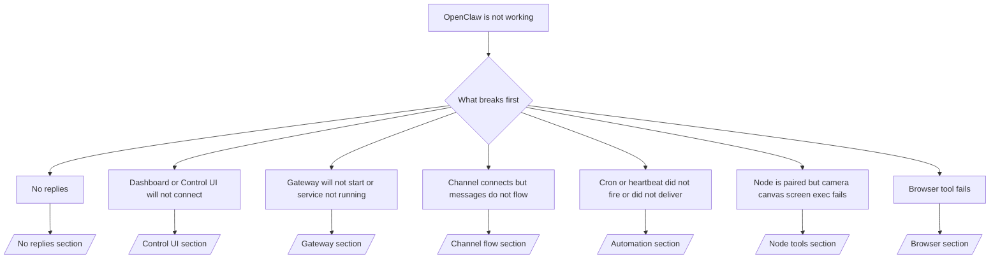

---
read_when:
    - OpenClawが動作しておらず、最短で修正する方法が必要だ
    - 詳細なランブックに入る前に、トリアージの流れが欲しい
summary: OpenClawの症状別トラブルシューティングハブ
title: 一般的なトラブルシューティング
x-i18n:
    generated_at: "2026-04-24T08:58:32Z"
    model: gpt-5.4
    provider: openai
    source_hash: c832c3f7609c56a5461515ed0f693d2255310bf2d3958f69f57c482bcbef97f0
    source_path: help/troubleshooting.md
    workflow: 15
---

2分しかない場合は、このページをトリアージの入口として使ってください。

## 最初の60秒

この順番で、次のコマンドをそのまま実行してください:

```bash
openclaw status
openclaw status --all
openclaw gateway probe
openclaw gateway status
openclaw doctor
openclaw channels status --probe
openclaw logs --follow
```

1行での良い出力の目安:

- `openclaw status` → 設定済みのchannelが表示され、明らかなauthエラーがない。
- `openclaw status --all` → 完全なレポートが表示され、共有可能である。
- `openclaw gateway probe` → 期待するgateway targetに到達できる（`Reachable: yes`）。`Capability: ...`は、probeで証明できたauthレベルを示します。`Read probe: limited - missing scope: operator.read`は診断機能の劣化であり、接続失敗ではありません。
- `openclaw gateway status` → `Runtime: running`、`Connectivity probe: ok`、そして妥当な`Capability: ...`行がある。read-scope RPCの確認も必要なら`--require-rpc`を使ってください。
- `openclaw doctor` → 設定やサービスにブロッキングなエラーがない。
- `openclaw channels status --probe` → 到達可能なgatewayは、アカウントごとのライブtransport stateと、`works`や`audit ok`のようなprobe/audit結果を返す。gatewayに到達できない場合、このコマンドはconfig-only summaryにフォールバックする。
- `openclaw logs --follow` → 安定したアクティビティがあり、繰り返す致命的エラーがない。

## Anthropic long context 429

次のメッセージが表示された場合:
`HTTP 429: rate_limit_error: Extra usage is required for long context requests`
[/gateway/troubleshooting#anthropic-429-extra-usage-required-for-long-context](/ja-JP/gateway/troubleshooting#anthropic-429-extra-usage-required-for-long-context)に進んでください。

## ローカルのOpenAI互換バックエンドは直接では動くがOpenClawでは失敗する

ローカルまたはself-hostedの`/v1`バックエンドが、小さな直接の
`/v1/chat/completions` probeには応答するのに、`openclaw infer model run`や通常の
agent turnでは失敗する場合:

1. エラーに`messages[].content`が文字列を期待しているとある場合は、
   `models.providers.<provider>.models[].compat.requiresStringContent: true`を設定します。
2. バックエンドがそれでもOpenClaw agent turnでのみ失敗する場合は、
   `models.providers.<provider>.models[].compat.supportsTools: false`を設定して再試行します。
3. ごく小さな直接呼び出しはまだ動作するが、より大きいOpenClaw promptでバックエンドがクラッシュする場合、残っている問題はupstreamのmodel/serverの制限として扱い、詳細ランブックに進んでください:
   [/gateway/troubleshooting#local-openai-compatible-backend-passes-direct-probes-but-agent-runs-fail](/ja-JP/gateway/troubleshooting#local-openai-compatible-backend-passes-direct-probes-but-agent-runs-fail)

## Pluginインストールがopenclaw extensions不足で失敗する

インストールが`package.json missing openclaw.extensions`で失敗する場合、そのplugin packageはOpenClawが現在受け付けない古い形式を使っています。

plugin packageでの修正:

1. `package.json`に`openclaw.extensions`を追加します。
2. エントリをビルド済みランタイムファイル（通常は`./dist/index.js`）に向けます。
3. pluginを再公開し、`openclaw plugins install <package>`を再度実行します。

例:

```json
{
  "name": "@openclaw/my-plugin",
  "version": "1.2.3",
  "openclaw": {
    "extensions": ["./dist/index.js"]
  }
}
```

参考: [Plugin architecture](/ja-JP/plugins/architecture)

## 判断ツリー



<AccordionGroup>
  <Accordion title="返信がない">
    ```bash
    openclaw status
    openclaw gateway status
    openclaw channels status --probe
    openclaw pairing list --channel <channel> [--account <id>]
    openclaw logs --follow
    ```

    良い出力の目安:

    - `Runtime: running`
    - `Connectivity probe: ok`
    - `Capability: read-only`、`write-capable`、または`admin-capable`
    - あなたのchannelでtransport connectedが表示され、対応している場合は`channels status --probe`で`works`または`audit ok`が出る
    - 送信者が承認済みである（またはDM policyがopen/allowlistである）

    よくあるログシグネチャ:

    - `drop guild message (mention required` → Discordでmention gatingによりメッセージがブロックされた。
    - `pairing request` → 送信者が未承認で、DM pairing approval待ち。
    - channelログの`blocked` / `allowlist` → 送信者、room、またはgroupがフィルタされている。

    詳細ページ:

    - [/gateway/troubleshooting#no-replies](/ja-JP/gateway/troubleshooting#no-replies)
    - [/channels/troubleshooting](/ja-JP/channels/troubleshooting)
    - [/channels/pairing](/ja-JP/channels/pairing)

  </Accordion>

  <Accordion title="DashboardまたはControl UIが接続できない">
    ```bash
    openclaw status
    openclaw gateway status
    openclaw logs --follow
    openclaw doctor
    openclaw channels status --probe
    ```

    良い出力の目安:

    - `openclaw gateway status`に`Dashboard: http://...`が表示される
    - `Connectivity probe: ok`
    - `Capability: read-only`、`write-capable`、または`admin-capable`
    - ログにauth loopがない

    よくあるログシグネチャ:

    - `device identity required` → HTTP/non-secure contextではdevice authを完了できない。
    - `origin not allowed` → browserの`Origin`がControl UIのgateway targetで許可されていない。
    - `AUTH_TOKEN_MISMATCH`とretryヒント（`canRetryWithDeviceToken=true`）→ 信頼済みdevice-tokenによる1回のretryが自動で行われることがある。
    - そのcached-token retryでは、paired device tokenと一緒に保存されたcached scope setが再利用される。明示的な`deviceToken` / 明示的な`scopes`呼び出し元は、要求したscope setをそのまま保持する。
    - 非同期のTailscale Serve Control UI pathでは、同じ`{scope, ip}`に対する失敗した試行は、limiterが失敗を記録する前に直列化されるため、2回目の同時並行のbad retryではすでに`retry later`が表示されることがある。
    - localhost browser originからの`too many failed authentication attempts (retry later)` → 同じ`Origin`からの繰り返し失敗は一時的にロックアウトされる。別のlocalhost originは別bucketを使う。
    - そのretry後も`unauthorized`が繰り返される → token/passwordの誤り、auth modeの不一致、またはpaired device tokenの期限切れ。
    - `gateway connect failed:` → UIが間違ったURL/portを向いているか、gatewayに到達できない。

    詳細ページ:

    - [/gateway/troubleshooting#dashboard-control-ui-connectivity](/ja-JP/gateway/troubleshooting#dashboard-control-ui-connectivity)
    - [/web/control-ui](/ja-JP/web/control-ui)
    - [/gateway/authentication](/ja-JP/gateway/authentication)

  </Accordion>

  <Accordion title="Gatewayが起動しない、またはサービスがインストール済みだが実行されていない">
    ```bash
    openclaw status
    openclaw gateway status
    openclaw logs --follow
    openclaw doctor
    openclaw channels status --probe
    ```

    良い出力の目安:

    - `Service: ... (loaded)`
    - `Runtime: running`
    - `Connectivity probe: ok`
    - `Capability: read-only`、`write-capable`、または`admin-capable`

    よくあるログシグネチャ:

    - `Gateway start blocked: set gateway.mode=local`または`existing config is missing gateway.mode` → gateway modeがremoteであるか、config fileにlocal-mode stampがなく、修復が必要。
    - `refusing to bind gateway ... without auth` → 有効なgateway auth path（token/password、または設定されているtrusted-proxy）なしでnon-loopback bindしようとしている。
    - `another gateway instance is already listening`または`EADDRINUSE` → portがすでに使用されている。

    詳細ページ:

    - [/gateway/troubleshooting#gateway-service-not-running](/ja-JP/gateway/troubleshooting#gateway-service-not-running)
    - [/gateway/background-process](/ja-JP/gateway/background-process)
    - [/gateway/configuration](/ja-JP/gateway/configuration)

  </Accordion>

  <Accordion title="Channelは接続されるがメッセージが流れない">
    ```bash
    openclaw status
    openclaw gateway status
    openclaw logs --follow
    openclaw doctor
    openclaw channels status --probe
    ```

    良い出力の目安:

    - Channel transportが接続済みである。
    - Pairing/allowlistチェックに通る。
    - 必要な場合、mentionが検出されている。

    よくあるログシグネチャ:

    - `mention required` → group mention gatingにより処理がブロックされた。
    - `pairing` / `pending` → DM送信者がまだ承認されていない。
    - `not_in_channel`、`missing_scope`、`Forbidden`、`401/403` → channel permission tokenの問題。

    詳細ページ:

    - [/gateway/troubleshooting#channel-connected-messages-not-flowing](/ja-JP/gateway/troubleshooting#channel-connected-messages-not-flowing)
    - [/channels/troubleshooting](/ja-JP/channels/troubleshooting)

  </Accordion>

  <Accordion title="CronまたはHeartbeatが起動しなかった、または配信されなかった">
    ```bash
    openclaw status
    openclaw gateway status
    openclaw cron status
    openclaw cron list
    openclaw cron runs --id <jobId> --limit 20
    openclaw logs --follow
    ```

    良い出力の目安:

    - `cron.status`でenabledかつ次回起動時刻が表示される。
    - `cron runs`に最近の`ok`エントリがある。
    - Heartbeatが有効で、active hoursの外ではない。

    よくあるログシグネチャ:

    - `cron: scheduler disabled; jobs will not run automatically` → Cronが無効。
    - `heartbeat skipped`と`reason=quiet-hours` → 設定されたactive hoursの外。
    - `heartbeat skipped`と`reason=empty-heartbeat-file` → `HEARTBEAT.md`は存在するが、空またはheaderだけの雛形しか含まれていない。
    - `heartbeat skipped`と`reason=no-tasks-due` → `HEARTBEAT.md`のtask modeが有効だが、task intervalがまだどれも期限に達していない。
    - `heartbeat skipped`と`reason=alerts-disabled` → Heartbeat visibilityがすべて無効（`showOk`、`showAlerts`、`useIndicator`がすべてオフ）。
    - `requests-in-flight` → メインレーンがビジーで、Heartbeat wakeが延期された。
    - `unknown accountId` → Heartbeatの配信先accountが存在しない。

    詳細ページ:

    - [/gateway/troubleshooting#cron-and-heartbeat-delivery](/ja-JP/gateway/troubleshooting#cron-and-heartbeat-delivery)
    - [/automation/cron-jobs#troubleshooting](/ja-JP/automation/cron-jobs#troubleshooting)
    - [/gateway/heartbeat](/ja-JP/gateway/heartbeat)

  </Accordion>

  <Accordion title="Nodeはpairedされているが、toolでcamera canvas screen execが失敗する">
    ```bash
    openclaw status
    openclaw gateway status
    openclaw nodes status
    openclaw nodes describe --node <idOrNameOrIp>
    openclaw logs --follow
    ```

    良い出力の目安:

    - Nodeがconnectedかつrole `node`でpaired済みとして表示される。
    - 呼び出しているコマンドに対するCapabilityが存在する。
    - そのtoolに必要なpermission stateがgrantedである。

    よくあるログシグネチャ:

    - `NODE_BACKGROUND_UNAVAILABLE` → Node appをforegroundに戻す。
    - `*_PERMISSION_REQUIRED` → OS permissionが拒否されているか存在しない。
    - `SYSTEM_RUN_DENIED: approval required` → exec approval待ち。
    - `SYSTEM_RUN_DENIED: allowlist miss` → コマンドがexec allowlistにない。

    詳細ページ:

    - [/gateway/troubleshooting#node-paired-tool-fails](/ja-JP/gateway/troubleshooting#node-paired-tool-fails)
    - [/nodes/troubleshooting](/ja-JP/nodes/troubleshooting)
    - [/tools/exec-approvals](/ja-JP/tools/exec-approvals)

  </Accordion>

  <Accordion title="Execが急に承認を求めるようになった">
    ```bash
    openclaw config get tools.exec.host
    openclaw config get tools.exec.security
    openclaw config get tools.exec.ask
    openclaw gateway restart
    ```

    何が変わったか:

    - `tools.exec.host`が未設定の場合、デフォルトは`auto`です。
    - `host=auto`は、sandbox runtimeがアクティブな場合は`sandbox`に、そうでない場合は`gateway`に解決されます。
    - `host=auto`はルーティングのみです。プロンプトなしの「YOLO」動作は、gateway/node上の`security=full`と`ask=off`によって決まります。
    - `gateway`と`node`では、未設定の`tools.exec.security`のデフォルトは`full`です。
    - 未設定の`tools.exec.ask`のデフォルトは`off`です。
    - 結果として、承認が表示されている場合は、何らかのhost-localまたはper-session policyによって、現在のデフォルトより厳しくexecが制限されています。

    現在のデフォルトの承認不要動作に戻すには:

    ```bash
    openclaw config set tools.exec.host gateway
    openclaw config set tools.exec.security full
    openclaw config set tools.exec.ask off
    openclaw gateway restart
    ```

    より安全な代替案:

    - 安定したhost routingだけが必要なら、`tools.exec.host=gateway`だけを設定する。
    - host execを使いたいが、allowlist miss時にはレビューもしたい場合は、`security=allowlist`と`ask=on-miss`を使う。
    - `host=auto`を再び`sandbox`に解決させたい場合は、sandbox modeを有効にする。

    よくあるログシグネチャ:

    - `Approval required.` → コマンドは`/approve ...`待ち。
    - `SYSTEM_RUN_DENIED: approval required` → node-host exec approval待ち。
    - `exec host=sandbox requires a sandbox runtime for this session` → 暗黙的または明示的にsandboxが選択されているが、sandbox modeがオフ。

    詳細ページ:

    - [/tools/exec](/ja-JP/tools/exec)
    - [/tools/exec-approvals](/ja-JP/tools/exec-approvals)
    - [/gateway/security#what-the-audit-checks-high-level](/ja-JP/gateway/security#what-the-audit-checks-high-level)

  </Accordion>

  <Accordion title="Browser toolが失敗する">
    ```bash
    openclaw status
    openclaw gateway status
    openclaw browser status
    openclaw logs --follow
    openclaw doctor
    ```

    良い出力の目安:

    - Browser statusに`running: true`と、選択されたbrowser/profileが表示される。
    - `openclaw`が起動する、または`user`がローカルのChromeタブを参照できる。

    よくあるログシグネチャ:

    - `unknown command "browser"`または`unknown command 'browser'` → `plugins.allow`が設定されており、`browser`が含まれていない。
    - `Failed to start Chrome CDP on port` → ローカルbrowserの起動に失敗した。
    - `browser.executablePath not found` → 設定されたバイナリパスが誤っている。
    - `browser.cdpUrl must be http(s) or ws(s)` → 設定されたCDP URLが未対応のschemeを使っている。
    - `browser.cdpUrl has invalid port` → 設定されたCDP URLのportが不正または範囲外。
    - `No Chrome tabs found for profile="user"` → Chrome MCP attach profileに、開いているローカルChromeタブがない。
    - `Remote CDP for profile "<name>" is not reachable` → 設定されたリモートCDP endpointにこのホストから到達できない。
    - `Browser attachOnly is enabled ... not reachable`または`Browser attachOnly is enabled and CDP websocket ... is not reachable` → attach-only profileに有効なCDP targetがない。
    - attach-onlyまたはremote CDP profileでviewport / dark-mode / locale / offline overrideが古いまま残っている → `openclaw browser stop --browser-profile <name>`を実行して、gatewayを再起動せずにアクティブなcontrol sessionを閉じ、emulation stateを解放する。

    詳細ページ:

    - [/gateway/troubleshooting#browser-tool-fails](/ja-JP/gateway/troubleshooting#browser-tool-fails)
    - [/tools/browser#missing-browser-command-or-tool](/ja-JP/tools/browser#missing-browser-command-or-tool)
    - [/tools/browser-linux-troubleshooting](/ja-JP/tools/browser-linux-troubleshooting)
    - [/tools/browser-wsl2-windows-remote-cdp-troubleshooting](/ja-JP/tools/browser-wsl2-windows-remote-cdp-troubleshooting)

  </Accordion>

</AccordionGroup>

## 関連

- [FAQ](/ja-JP/help/faq) — よくある質問
- [Gatewayのトラブルシューティング](/ja-JP/gateway/troubleshooting) — Gateway固有の問題
- [Doctor](/ja-JP/gateway/doctor) — 自動ヘルスチェックと修復
- [Channelのトラブルシューティング](/ja-JP/channels/troubleshooting) — channel接続の問題
- [Automationのトラブルシューティング](/ja-JP/automation/cron-jobs#troubleshooting) — CronとHeartbeatの問題
