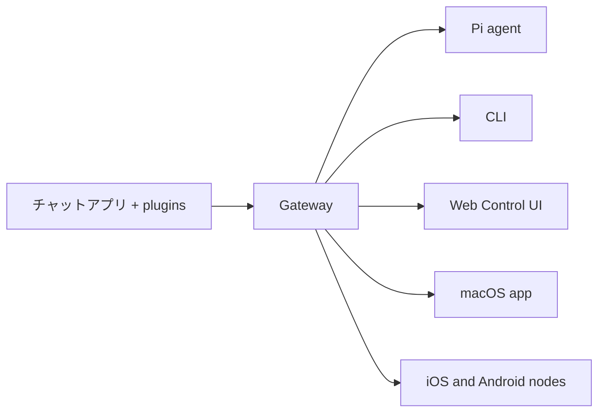

---
read_when:
    - OpenClaw を初めて使う人に紹介する場合
summary: OpenClaw は、あらゆる OS で動作する、AI エージェント向けのマルチチャネル Gateway です。
title: OpenClaw
x-i18n:
    generated_at: "2026-04-05T12:46:45Z"
    model: gpt-5.4
    provider: openai
    source_hash: 9c29a8d9fc41a94b650c524bb990106f134345560e6d615dac30e8815afff481
    source_path: index.md
    workflow: 15
---

# OpenClaw 🦞

<p align="center">
    
    
</p>

> _「EXFOLIATE! EXFOLIATE!」_ — たぶん宇宙ロブスター

<p align="center">
  <strong>Discord、Google Chat、iMessage、Matrix、Microsoft Teams、Signal、Slack、Telegram、WhatsApp、Zalo などにまたがって AI エージェントを使える、あらゆる OS 向けの Gateway。</strong><br />
  メッセージを送ると、ポケットからエージェントの応答を受け取れます。組み込みチャネル、バンドルされたチャネル plugin、WebChat、モバイルノードをまたいで、1 つの Gateway を実行できます。
</p>

<Columns>
  <Card title="はじめに" href="/ja-JP/start/getting-started" icon="rocket">
    OpenClaw をインストールし、数分で Gateway を起動します。
  </Card>
  <Card title="オンボーディングを実行" href="/ja-JP/start/wizard" icon="sparkles">
    `openclaw onboard` とペアリングフローによるガイド付きセットアップ。
  </Card>
  <Card title="Control UI を開く" href="/web/control-ui" icon="layout-dashboard">
    チャット、設定、セッション用のブラウザダッシュボードを起動します。
  </Card>
</Columns>

## OpenClaw とは?

OpenClaw は、Discord、Google Chat、iMessage、Matrix、Microsoft Teams、Signal、Slack、Telegram、WhatsApp、Zalo などの組み込みチャネルに加え、バンドルまたは外部のチャネル plugin など、お気に入りのチャットアプリやチャネルサーフェスを、Pi のような AI コーディングエージェントに接続する**セルフホスト型 Gateway**です。自分のマシン（またはサーバー）上で単一の Gateway プロセスを実行すると、それがメッセージングアプリと常時利用可能な AI アシスタントとの橋渡しになります。

**どんな人向けか?** データの制御を手放さず、ホスト型サービスに頼ることなく、どこからでもメッセージできる個人用 AI アシスタントを求める開発者やパワーユーザー向けです。

**何が違うのか?**

- **セルフホスト**: 自分のハードウェアで、自分のルールで動作
- **マルチチャネル**: 1 つの Gateway で、組み込みチャネルに加えてバンドルまたは外部のチャネル plugin を同時に提供
- **エージェントネイティブ**: ツール利用、セッション、メモリ、マルチエージェントルーティングを備えたコーディングエージェント向けに設計
- **オープンソース**: MIT ライセンス、コミュニティ主導

**何が必要か?** Node 24（推奨）、または互換性のための Node 22 LTS（`22.14+`）、選択したプロバイダーの API キー、そして 5 分です。品質とセキュリティを最大限にするには、利用可能な最新世代の最も強力なモデルを使ってください。

## 仕組み



Gateway は、セッション、ルーティング、チャネル接続の単一の信頼できる情報源です。

## 主な機能

<Columns>
  <Card title="マルチチャネル Gateway" icon="network">
    Discord、iMessage、Signal、Slack、Telegram、WhatsApp、WebChat などを、単一の Gateway プロセスで利用できます。
  </Card>
  <Card title="Plugin チャネル" icon="plug">
    バンドルされた plugins により、通常の現行リリースで Matrix、Nostr、Twitch、Zalo などが追加されます。
  </Card>
  <Card title="マルチエージェントルーティング" icon="route">
    エージェント、ワークスペース、または送信者ごとに分離されたセッション。
  </Card>
  <Card title="メディア対応" icon="image">
    画像、音声、ドキュメントを送受信できます。
  </Card>
  <Card title="Web Control UI" icon="monitor">
    チャット、設定、セッション、ノード用のブラウザダッシュボード。
  </Card>
  <Card title="モバイルノード" icon="smartphone">
    Canvas、カメラ、音声対応ワークフローのために iOS と Android ノードをペアリングします。
  </Card>
</Columns>

## クイックスタート

<Steps>
  <Step title="OpenClaw をインストール">
    ```bash
    npm install -g openclaw@latest
    ```
  </Step>
  <Step title="オンボーディングを実行してサービスをインストール">
    ```bash
    openclaw onboard --install-daemon
    ```
  </Step>
  <Step title="チャットする">
    ブラウザで Control UI を開いて、メッセージを送信します:

    ```bash
    openclaw dashboard
    ```

    またはチャネルを接続し（[Telegram](/ja-JP/channels/telegram) が最速です）、スマートフォンからチャットします。

  </Step>
</Steps>

完全なインストール手順と開発セットアップが必要ですか? [はじめに](/ja-JP/start/getting-started) を参照してください。

## ダッシュボード

Gateway の起動後に、ブラウザの Control UI を開きます。

- ローカルデフォルト: [http://127.0.0.1:18789/](http://127.0.0.1:18789/)
- リモートアクセス: [Web surfaces](/web) と [Tailscale](/gateway/tailscale)

<p align="center">
  
</p>

## 設定（任意）

設定は `~/.openclaw/openclaw.json` にあります。

- **何もしない** 場合、OpenClaw は RPC モードのバンドルされた Pi バイナリと、送信者ごとのセッションを使用します。
- 制限を強めたい場合は、`channels.whatsapp.allowFrom` と（グループ向けの）メンションルールから始めてください。

例:

```json5
{
  channels: {
    whatsapp: {
      allowFrom: ["+15555550123"],
      groups: { "*": { requireMention: true } },
    },
  },
  messages: { groupChat: { mentionPatterns: ["@openclaw"] } },
}
```

## ここから始める

<Columns>
  <Card title="ドキュメントハブ" href="/start/hubs" icon="book-open">
    ユースケース別に整理された、すべてのドキュメントとガイド。
  </Card>
  <Card title="設定" href="/gateway/configuration" icon="settings">
    中核となる Gateway 設定、トークン、プロバイダー設定。
  </Card>
  <Card title="リモートアクセス" href="/gateway/remote" icon="globe">
    SSH と tailnet のアクセスパターン。
  </Card>
  <Card title="チャネル" href="/ja-JP/channels/telegram" icon="message-square">
    Feishu、Microsoft Teams、WhatsApp、Telegram、Discord などのチャネル固有セットアップ。
  </Card>
  <Card title="ノード" href="/nodes" icon="smartphone">
    ペアリング、Canvas、カメラ、デバイス操作に対応した iOS と Android ノード。
  </Card>
  <Card title="ヘルプ" href="/help" icon="life-buoy">
    一般的な修正方法とトラブルシューティングの入口。
  </Card>
</Columns>

## さらに詳しく

<Columns>
  <Card title="完全な機能一覧" href="/concepts/features" icon="list">
    チャネル、ルーティング、メディア機能の全体像。
  </Card>
  <Card title="マルチエージェントルーティング" href="/concepts/multi-agent" icon="route">
    ワークスペース分離とエージェントごとのセッション。
  </Card>
  <Card title="セキュリティ" href="/gateway/security" icon="shield">
    トークン、allowlist、安全制御。
  </Card>
  <Card title="トラブルシューティング" href="/gateway/troubleshooting" icon="wrench">
    Gateway の診断と一般的なエラー。
  </Card>
  <Card title="概要とクレジット" href="/reference/credits" icon="info">
    プロジェクトの起源、貢献者、ライセンス。
  </Card>
</Columns>
