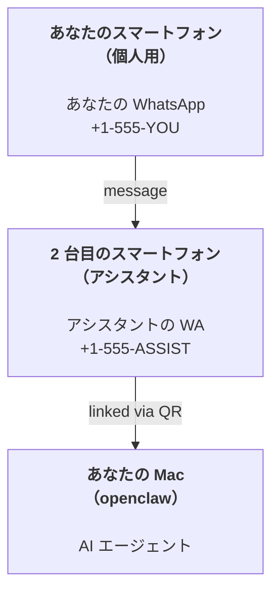

---
read_when:
    - 新しいアシスタントインスタンスをオンボーディングするとき
    - 安全性や権限の影響を確認するとき
summary: OpenClaw を個人アシスタントとして運用するための、注意すべき安全性も含めたエンドツーエンドガイド
title: 個人アシスタントのセットアップ
x-i18n:
    generated_at: "2026-04-05T12:57:49Z"
    model: gpt-5.4
    provider: openai
    source_hash: 02f10a9f7ec08f71143cbae996d91cbdaa19897a40f725d8ef524def41cf2759
    source_path: start/openclaw.md
    workflow: 15
---

# OpenClaw で個人アシスタントを構築する

OpenClaw は、Discord、Google Chat、iMessage、Matrix、Microsoft Teams、Signal、Slack、Telegram、WhatsApp、Zalo などを AI エージェントに接続するセルフホスト型 Gateway です。このガイドでは「個人アシスタント」構成、つまり、常時稼働する AI アシスタントとして振る舞う専用の WhatsApp 番号を使うセットアップを扱います。

## ⚠️ まず安全性を優先

あなたはエージェントを、次のことができる立場に置くことになります。

- あなたのマシン上でコマンドを実行する（tool policy による）
- ワークスペース内のファイルを読み書きする
- WhatsApp/Telegram/Discord/Mattermost やその他の同梱チャンネル経由でメッセージを外部送信する

最初は保守的に始めてください。

- 必ず `channels.whatsapp.allowFrom` を設定する（個人の Mac で世界中から開放された状態では絶対に運用しない）
- アシスタントには専用の WhatsApp 番号を使う
- heartbeat は現在デフォルトで 30 分ごとです。セットアップを信頼できるようになるまでは `agents.defaults.heartbeat.every: "0m"` を設定して無効化してください

## 前提条件

- OpenClaw のインストールとオンボーディングが完了していること — まだなら [はじめに](/ja-JP/start/getting-started) を参照してください
- アシスタント用の 2 つ目の電話番号（SIM/eSIM/プリペイド）

## 2台のスマートフォン構成（推奨）

目指す構成はこれです。



個人用の WhatsApp を OpenClaw にリンクすると、あなた宛てのすべてのメッセージが「agent input」になります。多くの場合、それは望ましい挙動ではありません。

## 5 分でできるクイックスタート

1. WhatsApp Web をペアリングする（QR が表示されるので、アシスタント用スマートフォンでスキャンします）:

```bash
openclaw channels login
```

2. Gateway を起動する（起動したままにします）:

```bash
openclaw gateway --port 18789
```

3. 最小構成の config を `~/.openclaw/openclaw.json` に置く:

```json5
{
  gateway: { mode: "local" },
  channels: { whatsapp: { allowFrom: ["+15555550123"] } },
}
```

これで、許可リストに入っているあなたの電話からアシスタント番号へメッセージを送ってください。

オンボーディングが完了すると、ダッシュボードが自動で開き、すっきりした（トークン付きでない）リンクが表示されます。認証を求められた場合は、設定済みの shared secret を Control UI settings に貼り付けてください。オンボーディングはデフォルトでトークン（`gateway.auth.token`）を使いますが、`gateway.auth.mode` を `password` に切り替えている場合は password auth でも動作します。後で再度開くには `openclaw dashboard` を使います。

## エージェントにワークスペースを与える（AGENTS）

OpenClaw は、ワークスペースディレクトリーから操作指示と「記憶」を読み取ります。

デフォルトでは、OpenClaw は `~/.openclaw/workspace` をエージェントのワークスペースとして使い、セットアップ時または初回のエージェント実行時に自動でそれを作成します（加えて、初期の `AGENTS.md`、`SOUL.md`、`TOOLS.md`、`IDENTITY.md`、`USER.md`、`HEARTBEAT.md` も作成します）。`BOOTSTRAP.md` はワークスペースがまったく新しい場合にのみ作成されます（削除後に再び現れてはいけません）。`MEMORY.md` は任意です（自動作成されません）。存在する場合は通常セッションで読み込まれます。サブエージェントのセッションでは `AGENTS.md` と `TOOLS.md` だけが注入されます。

ヒント: このフォルダーは OpenClaw の「記憶」と考え、`AGENTS.md` と記憶ファイルをバックアップできるよう git リポジトリー（理想的には非公開）にしてください。git がインストールされていれば、まったく新しいワークスペースは自動で初期化されます。

```bash
openclaw setup
```

完全なワークスペース構成とバックアップガイド: [エージェントワークスペース](/ja-JP/concepts/agent-workspace)
メモリーワークフロー: [Memory](/ja-JP/concepts/memory)

任意: `agents.defaults.workspace` で別のワークスペースを選べます（`~` をサポート）。

```json5
{
  agent: {
    workspace: "~/.openclaw/workspace",
  },
}
```

すでに独自のワークスペースファイルをリポジトリーから配布している場合は、ブートストラップファイルの作成を完全に無効化できます。

```json5
{
  agent: {
    skipBootstrap: true,
  },
}
```

## 「アシスタント」にするための config

OpenClaw は優れたアシスタント構成をデフォルトで備えていますが、通常は次を調整したくなるでしょう。

- [`SOUL.md`](/ja-JP/concepts/soul) の persona/instructions
- 思考のデフォルト値（必要なら）
- heartbeat（信頼できるようになったら）

例:

```json5
{
  logging: { level: "info" },
  agent: {
    model: "anthropic/claude-opus-4-6",
    workspace: "~/.openclaw/workspace",
    thinkingDefault: "high",
    timeoutSeconds: 1800,
    // 最初は 0 で始め、後で有効化します。
    heartbeat: { every: "0m" },
  },
  channels: {
    whatsapp: {
      allowFrom: ["+15555550123"],
      groups: {
        "*": { requireMention: true },
      },
    },
  },
  routing: {
    groupChat: {
      mentionPatterns: ["@openclaw", "openclaw"],
    },
  },
  session: {
    scope: "per-sender",
    resetTriggers: ["/new", "/reset"],
    reset: {
      mode: "daily",
      atHour: 4,
      idleMinutes: 10080,
    },
  },
}
```

## セッションと記憶

- セッションファイル: `~/.openclaw/agents/<agentId>/sessions/{{SessionId}}.jsonl`
- セッションメタデータ（トークン使用量、最後のルートなど）: `~/.openclaw/agents/<agentId>/sessions/sessions.json`（旧形式: `~/.openclaw/sessions/sessions.json`）
- `/new` または `/reset` は、そのチャットの新しいセッションを開始します（`resetTriggers` で設定可能）。単独で送信された場合、エージェントは短い挨拶で返信し、リセットを確認します。
- `/compact [instructions]` はセッションコンテキストを圧縮し、残りのコンテキスト予算を報告します。

## heartbeat（能動モード）

デフォルトでは、OpenClaw は 30 分ごとに次のプロンプトで heartbeat を実行します:
`Read HEARTBEAT.md if it exists (workspace context). Follow it strictly. Do not infer or repeat old tasks from prior chats. If nothing needs attention, reply HEARTBEAT_OK.`
無効化するには `agents.defaults.heartbeat.every: "0m"` を設定します。

- `HEARTBEAT.md` が存在しても、実質的に空（空行と `# Heading` のような Markdown 見出しだけ）の場合、OpenClaw は API 呼び出しを節約するため heartbeat 実行をスキップします。
- ファイルが存在しない場合でも heartbeat は実行され、何をすべきかはモデルが判断します。
- エージェントが `HEARTBEAT_OK` で返信した場合（必要に応じて短い余白を含んでも可。`agents.defaults.heartbeat.ackMaxChars` を参照）、OpenClaw はその heartbeat の外向き配信を抑制します。
- デフォルトでは、DM 形式の `user:<id>` 宛先への heartbeat 配信は許可されています。heartbeat 実行は維持したまま直接宛先への配信を抑制するには `agents.defaults.heartbeat.directPolicy: "block"` を設定します。
- heartbeat は完全なエージェントターンとして実行されます。間隔が短いほどトークン消費は増えます。

```json5
{
  agent: {
    heartbeat: { every: "30m" },
  },
}
```

## メディアの入出力

受信した添付ファイル（画像/音声/ドキュメント）は、テンプレートを通してコマンドに渡せます。

- `{{MediaPath}}`（ローカルの一時ファイルパス）
- `{{MediaUrl}}`（疑似 URL）
- `{{Transcript}}`（音声文字起こしが有効な場合）

エージェントからの送信添付ファイル: 単独行で `MEDIA:<path-or-url>` を含めてください（空白なし）。例:

```
スクリーンショットはこちらです。
MEDIA:https://example.com/screenshot.png
```

OpenClaw はこれを抽出し、テキストと一緒にメディアとして送信します。

ローカルパスの挙動は、エージェントと同じファイル読み取りの信頼モデルに従います。

- `tools.fs.workspaceOnly` が `true` の場合、送信用の `MEDIA:` ローカルパスは OpenClaw の temp ルート、media cache、agent workspace のパス、sandbox が生成したファイルに制限されます。
- `tools.fs.workspaceOnly` が `false` の場合、送信用の `MEDIA:` には、エージェントがすでに読み取りを許可されているホストローカルファイルを使えます。
- ホストローカル送信では、引き続きメディアと安全なドキュメント種類（画像、音声、動画、PDF、Office ドキュメント）のみが許可されます。プレーンテキストや秘密情報らしいファイルは送信可能なメディアとして扱われません。

つまり、ワークスペース外で生成された画像やファイルでも、あなたの fs policy がすでにその読み取りを許可しているなら、任意のホストテキスト添付の持ち出しを再び開放することなく送信できるようになります。

## 運用チェックリスト

```bash
openclaw status          # ローカル状態（認証情報、セッション、キューされたイベント）
openclaw status --all    # 完全な診断（読み取り専用、貼り付け可能）
openclaw status --deep   # Gateway に問い合わせ、サポートされていればチャンネルプローブ付きのライブヘルスプローブを取得
openclaw health --json   # Gateway のヘルススナップショット（WS; デフォルトでは新しいキャッシュ済みスナップショットを返すことがあります）
```

ログは `/tmp/openclaw/` 配下にあります（デフォルト: `openclaw-YYYY-MM-DD.log`）。

## 次のステップ

- WebChat: [WebChat](/web/webchat)
- Gateway 運用: [Gateway runbook](/ja-JP/gateway)
- Cron + wakeup: [Cron jobs](/ja-JP/automation/cron-jobs)
- macOS メニューバーコンパニオン: [OpenClaw macOS app](/ja-JP/platforms/macos)
- iOS ノードアプリ: [iOS app](/ja-JP/platforms/ios)
- Android ノードアプリ: [Android app](/ja-JP/platforms/android)
- Windows の状況: [Windows (WSL2)](/ja-JP/platforms/windows)
- Linux の状況: [Linux app](/ja-JP/platforms/linux)
- セキュリティ: [Security](/ja-JP/gateway/security)
