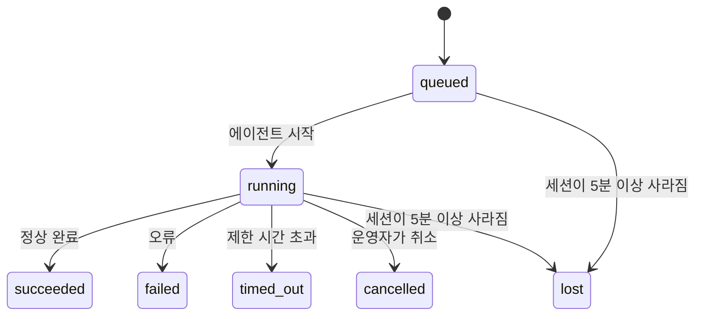

---
read_when:
    - 진행 중이거나 최근 완료된 백그라운드 작업 검사
    - 분리된 에이전트 실행의 전달 실패 디버깅
    - 백그라운드 실행이 세션, Cron, Heartbeat와 어떻게 연관되는지 이해하기
summary: ACP 실행, 하위 에이전트, 격리된 Cron 작업, CLI 작업을 위한 백그라운드 작업 추적
title: 백그라운드 작업
x-i18n:
    generated_at: "2026-04-23T06:01:39Z"
    model: gpt-5.4
    provider: openai
    source_hash: 5cd0b0db6c20cc677aa5cc50c42e09043d4354e026ca33c020d804761c331413
    source_path: automation/tasks.md
    workflow: 15
---

# 백그라운드 작업

> **스케줄링을 찾고 있나요?** 적절한 메커니즘을 선택하려면 [Automation & Tasks](/ko/automation)를 참조하세요. 이 페이지는 백그라운드 작업의 **추적**을 다루며, 스케줄링을 다루지 않습니다.

백그라운드 작업은 **기본 대화 세션 외부**에서 실행되는 작업을 추적합니다:
ACP 실행, 하위 에이전트 생성, 격리된 Cron 작업 실행, 그리고 CLI로 시작된 작업입니다.

작업은 세션, Cron 작업, 또는 Heartbeat를 대체하지 않습니다. 작업은 분리된 작업이 무엇이었는지, 언제 발생했는지, 그리고 성공했는지를 기록하는 **활동 원장**입니다.

<Note>
모든 에이전트 실행이 작업을 생성하는 것은 아닙니다. Heartbeat 턴과 일반 대화형 채팅은 생성하지 않습니다. 모든 Cron 실행, ACP 생성, 하위 에이전트 생성, 그리고 CLI 에이전트 명령은 생성합니다.
</Note>

## 핵심 요약

- 작업은 스케줄러가 아니라 **기록**입니다. 작업이 _언제_ 실행될지는 Cron과 Heartbeat가 결정하고, 작업은 _무슨 일이 일어났는지_를 추적합니다.
- ACP, 하위 에이전트, 모든 Cron 작업, 그리고 CLI 작업은 작업을 생성합니다. Heartbeat 턴은 생성하지 않습니다.
- 각 작업은 `queued → running → terminal`(succeeded, failed, timed_out, cancelled, 또는 lost) 단계를 거칩니다.
- Cron 작업은 Cron 런타임이 여전히 해당 작업을 소유하는 동안 활성 상태를 유지합니다. 채팅 기반 CLI 작업은 소유 실행 컨텍스트가 여전히 활성 상태인 동안에만 활성 상태를 유지합니다.
- 완료는 푸시 기반입니다. 분리된 작업은 완료 시 직접 알리거나 요청자 세션/Heartbeat를 깨울 수 있으므로, 상태 폴링 루프는 보통 올바른 방식이 아닙니다.
- 격리된 Cron 실행과 하위 에이전트 완료는 최종 정리 bookkeeping 전에 자식 세션의 추적된 브라우저 탭/프로세스를 가능한 범위에서 정리합니다.
- 격리된 Cron 전달은 하위 하위 에이전트 작업이 아직 비워지는 동안 오래된 중간 부모 응답을 억제하며, 전달 전에 최종 하위 결과가 도착하면 그것을 우선합니다.
- 완료 알림은 채널로 직접 전달되거나 다음 Heartbeat를 위해 대기열에 들어갑니다.
- `openclaw tasks list`는 모든 작업을 보여주고, `openclaw tasks audit`는 문제를 표시합니다.
- 종료된 기록은 7일 동안 보관된 뒤 자동으로 정리됩니다.

## 빠른 시작

```bash
# 모든 작업 나열(최신순)
openclaw tasks list

# 런타임 또는 상태로 필터링
openclaw tasks list --runtime acp
openclaw tasks list --status running

# 특정 작업의 세부 정보 표시(ID, 실행 ID, 또는 세션 키로 조회)
openclaw tasks show <lookup>

# 실행 중인 작업 취소(자식 세션 종료)
openclaw tasks cancel <lookup>

# 작업의 알림 정책 변경
openclaw tasks notify <lookup> state_changes

# 상태 감사 실행
openclaw tasks audit

# 유지보수 미리보기 또는 적용
openclaw tasks maintenance
openclaw tasks maintenance --apply

# TaskFlow 상태 검사
openclaw tasks flow list
openclaw tasks flow show <lookup>
openclaw tasks flow cancel <lookup>
```

## 작업을 생성하는 것

| 소스 | 런타임 유형 | 작업 기록이 생성되는 시점 | 기본 알림 정책 |
| ---------------------- | ------------ | ------------------------------------------------------ | --------------------- |
| ACP 백그라운드 실행 | `acp` | 자식 ACP 세션 생성 시 | `done_only` |
| 하위 에이전트 오케스트레이션 | `subagent` | `sessions_spawn`을 통해 하위 에이전트 생성 시 | `done_only` |
| Cron 작업(모든 유형) | `cron` | 모든 Cron 실행(기본 세션 및 격리 실행) | `silent` |
| CLI 작업 | `cli` | 게이트웨이를 통해 실행되는 `openclaw agent` 명령 | `silent` |
| 에이전트 미디어 작업 | `cli` | 세션 기반 `video_generate` 실행 | `silent` |

기본 세션 Cron 작업은 기본적으로 `silent` 알림 정책을 사용합니다. 즉, 추적용 기록은 생성하지만 알림은 생성하지 않습니다. 격리된 Cron 작업도 기본적으로 `silent`이지만 자체 세션에서 실행되므로 더 눈에 띕니다.

세션 기반 `video_generate` 실행도 `silent` 알림 정책을 사용합니다. 여전히 작업 기록은 생성되지만, 완료는 내부 깨우기 방식으로 원래 에이전트 세션에 다시 전달되어 에이전트가 후속 메시지를 작성하고 완료된 비디오를 직접 첨부할 수 있게 합니다. `tools.media.asyncCompletion.directSend`를 활성화하면 비동기 `music_generate` 및 `video_generate` 완료는 먼저 채널 직접 전달을 시도하고, 실패하면 요청자 세션 깨우기 경로로 되돌아갑니다.

세션 기반 `video_generate` 작업이 아직 활성 상태인 동안에는 이 도구가 가드레일 역할도 합니다. 같은 세션에서 반복되는 `video_generate` 호출은 두 번째 동시 생성을 시작하는 대신 활성 작업 상태를 반환합니다. 에이전트 측에서 명시적인 진행 상황/상태 조회가 필요하면 `action: "status"`를 사용하세요.

**작업을 생성하지 않는 것:**

- Heartbeat 턴 — 기본 세션, [Heartbeat](/ko/gateway/heartbeat) 참조
- 일반 대화형 채팅 턴
- 직접 `/command` 응답

## 작업 수명 주기



| 상태 | 의미 |
| ----------- | -------------------------------------------------------------------------- |
| `queued` | 생성되었으며 에이전트 시작 대기 중 |
| `running` | 에이전트 턴이 현재 실행 중 |
| `succeeded` | 성공적으로 완료됨 |
| `failed` | 오류와 함께 완료됨 |
| `timed_out` | 구성된 제한 시간을 초과함 |
| `cancelled` | 운영자가 `openclaw tasks cancel`을 통해 중지함 |
| `lost` | 5분의 유예 기간 후 런타임이 권한 있는 백킹 상태를 잃음 |

전이는 자동으로 발생합니다. 연결된 에이전트 실행이 끝나면 작업 상태가 그에 맞게 업데이트됩니다.

`lost`는 런타임 인지 방식입니다.

- ACP 작업: 백킹 ACP 자식 세션 메타데이터가 사라졌습니다.
- 하위 에이전트 작업: 대상 에이전트 저장소에서 백킹 자식 세션이 사라졌습니다.
- Cron 작업: Cron 런타임이 더 이상 해당 작업을 활성 상태로 추적하지 않습니다.
- CLI 작업: 격리된 자식 세션 작업은 자식 세션을 사용합니다. 채팅 기반 CLI 작업은 대신 활성 실행 컨텍스트를 사용하므로, 남아 있는 채널/그룹/직접 세션 행이 그것들을 활성 상태로 유지하지 않습니다.

## 전달 및 알림

작업이 종료 상태에 도달하면 OpenClaw가 알려줍니다. 전달 경로는 두 가지입니다.

**직접 전달** — 작업에 채널 대상(`requesterOrigin`)이 있으면 완료 메시지가 해당 채널(Telegram, Discord, Slack 등)로 바로 전송됩니다. 하위 에이전트 완료의 경우 OpenClaw는 가능할 때 바인딩된 스레드/토픽 라우팅도 유지하며, 직접 전달을 포기하기 전에 요청자 세션의 저장된 경로(`lastChannel` / `lastTo` / `lastAccountId`)에서 누락된 `to` / 계정 값을 채울 수 있습니다.

**세션 대기열 전달** — 직접 전달에 실패했거나 origin이 설정되지 않은 경우, 업데이트는 요청자 세션의 시스템 이벤트로 대기열에 들어가며 다음 Heartbeat에서 표시됩니다.

<Tip>
작업 완료는 결과를 빠르게 볼 수 있도록 즉시 Heartbeat 깨우기를 트리거합니다. 다음 예약된 Heartbeat 틱까지 기다릴 필요가 없습니다.
</Tip>

즉, 일반적인 워크플로는 푸시 기반입니다. 분리된 작업을 한 번 시작한 뒤, 완료 시 런타임이 깨우거나 알려주도록 두세요. 디버깅, 개입, 또는 명시적인 감사가 필요할 때만 작업 상태를 폴링하세요.

### 알림 정책

각 작업에 대해 얼마나 많이 알림을 받을지 제어합니다.

| 정책 | 전달되는 내용 |
| --------------------- | ----------------------------------------------------------------------- |
| `done_only` (기본값) | 종료 상태만(성공, 실패 등) — **이것이 기본값입니다** |
| `state_changes` | 모든 상태 전이와 진행 상황 업데이트 |
| `silent` | 아무것도 전달하지 않음 |

작업이 실행 중일 때 정책을 변경할 수 있습니다.

```bash
openclaw tasks notify <lookup> state_changes
```

## CLI 참조

### `tasks list`

```bash
openclaw tasks list [--runtime <acp|subagent|cron|cli>] [--status <status>] [--json]
```

출력 열: 작업 ID, 종류, 상태, 전달, 실행 ID, 자식 세션, 요약.

### `tasks show`

```bash
openclaw tasks show <lookup>
```

조회 토큰은 작업 ID, 실행 ID, 또는 세션 키를 허용합니다. 타이밍, 전달 상태, 오류, 종료 요약을 포함한 전체 기록을 보여줍니다.

### `tasks cancel`

```bash
openclaw tasks cancel <lookup>
```

ACP 및 하위 에이전트 작업의 경우 자식 세션을 종료합니다. CLI 추적 작업의 경우 취소가 작업 레지스트리에 기록됩니다(별도의 자식 런타임 핸들은 없습니다). 상태는 `cancelled`로 전이되며, 해당하는 경우 전달 알림이 전송됩니다.

### `tasks notify`

```bash
openclaw tasks notify <lookup> <done_only|state_changes|silent>
```

### `tasks audit`

```bash
openclaw tasks audit [--json]
```

운영상 문제를 표시합니다. 문제가 감지되면 결과는 `openclaw status`에도 나타납니다.

| 항목 | 심각도 | 트리거 |
| ------------------------- | -------- | ----------------------------------------------------- |
| `stale_queued` | warn | 10분 이상 대기 상태 |
| `stale_running` | error | 30분 이상 실행 상태 |
| `lost` | error | 런타임 기반 작업 소유 상태가 사라짐 |
| `delivery_failed` | warn | 전달에 실패했고 알림 정책이 `silent`가 아님 |
| `missing_cleanup` | warn | 정리 타임스탬프가 없는 종료 작업 |
| `inconsistent_timestamps` | warn | 타임라인 위반(예: 시작 전 종료) |

### `tasks maintenance`

```bash
openclaw tasks maintenance [--json]
openclaw tasks maintenance --apply [--json]
```

이를 사용해 작업 및 Task Flow 상태에 대한 조정, 정리 타임스탬프 기록, 정리 삭제를 미리 보거나 적용하세요.

조정은 런타임 인지 방식입니다.

- ACP/하위 에이전트 작업은 백킹 자식 세션을 확인합니다.
- Cron 작업은 Cron 런타임이 여전히 해당 작업을 소유하는지 확인합니다.
- 채팅 기반 CLI 작업은 단순히 채팅 세션 행이 아니라 소유 중인 활성 실행 컨텍스트를 확인합니다.

완료 정리도 런타임 인지 방식입니다.

- 하위 에이전트 완료는 알림 정리가 계속되기 전에 자식 세션의 추적된 브라우저 탭/프로세스를 가능한 범위에서 닫습니다.
- 격리된 Cron 완료는 실행이 완전히 종료되기 전에 Cron 세션의 추적된 브라우저 탭/프로세스를 가능한 범위에서 닫습니다.
- 격리된 Cron 전달은 필요할 경우 하위 하위 에이전트 후속 작업이 끝날 때까지 기다리며, 이를 알리는 대신 오래된 부모 확인 텍스트를 억제합니다.
- 하위 에이전트 완료 전달은 가장 최근에 보이는 어시스턴트 텍스트를 우선합니다. 이것이 비어 있으면 정리된 최신 tool/toolResult 텍스트로 대체하고, 제한 시간 초과만 있는 tool-call 실행은 짧은 부분 진행 요약으로 축약될 수 있습니다. 종료된 실패 실행은 캡처된 응답 텍스트를 재생하지 않고 실패 상태를 알립니다.
- 정리 실패가 실제 작업 결과를 가리지는 않습니다.

### `tasks flow list|show|cancel`

```bash
openclaw tasks flow list [--status <status>] [--json]
openclaw tasks flow show <lookup> [--json]
openclaw tasks flow cancel <lookup>
```

개별 백그라운드 작업 기록 하나보다 그것을 오케스트레이션하는 Task Flow 자체가 중요할 때 이것을 사용하세요.

## 채팅 작업 보드(`/tasks`)

어떤 채팅 세션에서든 `/tasks`를 사용해 그 세션에 연결된 백그라운드 작업을 볼 수 있습니다. 이 보드는 활성 작업과 최근 완료된 작업을 런타임, 상태, 타이밍, 그리고 진행 상황 또는 오류 세부 정보와 함께 보여줍니다.

현재 세션에 눈에 보이는 연결 작업이 없으면, `/tasks`는 에이전트 로컬 작업 수로 대체되어
다른 세션의 세부 정보를 노출하지 않고도 개요를 계속 볼 수 있습니다.

전체 운영자 원장을 보려면 CLI를 사용하세요: `openclaw tasks list`.

## 상태 통합(작업 압력)

`openclaw status`에는 한눈에 보는 작업 요약이 포함됩니다.

```
Tasks: 3 queued · 2 running · 1 issues
```

요약은 다음을 보고합니다.

- **active** — `queued` + `running` 개수
- **failures** — `failed` + `timed_out` + `lost` 개수
- **byRuntime** — `acp`, `subagent`, `cron`, `cli`별 분류

`/status`와 `session_status` 도구는 모두 정리 인지 작업 스냅샷을 사용합니다. 활성 작업이 우선되며, 오래된 완료 행은 숨겨지고, 최근 실패는 활성 작업이 더 이상 없을 때만 표시됩니다. 이렇게 하면 상태 카드가 지금 중요한 항목에 집중할 수 있습니다.

## 저장소 및 유지보수

### 작업이 저장되는 위치

작업 기록은 다음 위치의 SQLite에 영구 저장됩니다.

```
$OPENCLAW_STATE_DIR/tasks/runs.sqlite
```

레지스트리는 게이트웨이 시작 시 메모리로 로드되며, 재시작 후에도 내구성을 유지하기 위해 쓰기 내용을 SQLite와 동기화합니다.

### 자동 유지보수

스위퍼는 **60초**마다 실행되며 세 가지를 처리합니다.

1. **조정** — 활성 작업에 여전히 권한 있는 런타임 백킹이 있는지 확인합니다. ACP/하위 에이전트 작업은 자식 세션 상태를 사용하고, Cron 작업은 활성 작업 소유 상태를 사용하며, 채팅 기반 CLI 작업은 소유 실행 컨텍스트를 사용합니다. 그 백킹 상태가 5분 이상 사라져 있으면 작업은 `lost`로 표시됩니다.
2. **정리 타임스탬프 기록** — 종료된 작업에 `cleanupAfter` 타임스탬프를 설정합니다(`endedAt + 7일`).
3. **정리 삭제** — `cleanupAfter` 날짜가 지난 기록을 삭제합니다.

**보존 기간**: 종료된 작업 기록은 **7일** 동안 보관된 뒤 자동으로 정리 삭제됩니다. 별도 설정은 필요하지 않습니다.

## 작업과 다른 시스템의 관계

### 작업과 Task Flow

[Task Flow](/ko/automation/taskflow)는 백그라운드 작업 위에 있는 흐름 오케스트레이션 계층입니다. 하나의 flow는 수명 주기 동안 관리형 또는 미러링된 동기화 모드를 사용해 여러 작업을 조정할 수 있습니다. 개별 작업 기록을 검사하려면 `openclaw tasks`를 사용하고, 오케스트레이션 flow를 검사하려면 `openclaw tasks flow`를 사용하세요.

자세한 내용은 [Task Flow](/ko/automation/taskflow)를 참조하세요.

### 작업과 Cron

Cron 작업 **정의**는 `~/.openclaw/cron/jobs.json`에 있고, 런타임 실행 상태는 그 옆의 `~/.openclaw/cron/jobs-state.json`에 있습니다. **모든** Cron 실행은 작업 기록을 생성합니다. 기본 세션과 격리 실행 모두 해당됩니다. 기본 세션 Cron 작업은 기본적으로 `silent` 알림 정책을 사용하므로, 알림을 생성하지 않고 추적만 수행합니다.

[Cron Jobs](/ko/automation/cron-jobs)를 참조하세요.

### 작업과 Heartbeat

Heartbeat 실행은 기본 세션 턴이므로 작업 기록을 생성하지 않습니다. 작업이 완료되면 결과를 즉시 볼 수 있도록 Heartbeat 깨우기를 트리거할 수 있습니다.

[Heartbeat](/ko/gateway/heartbeat)를 참조하세요.

### 작업과 세션

작업은 `childSessionKey`(작업이 실행되는 곳)와 `requesterSessionKey`(작업을 시작한 주체)를 참조할 수 있습니다. 세션은 대화 컨텍스트이고, 작업은 그 위의 활동 추적입니다.

### 작업과 에이전트 실행

작업의 `runId`는 작업을 수행하는 에이전트 실행에 연결됩니다. 에이전트 수명 주기 이벤트(시작, 종료, 오류)는 작업 상태를 자동으로 업데이트하므로 수명 주기를 수동으로 관리할 필요가 없습니다.

## 관련 항목

- [Automation & Tasks](/ko/automation) — 모든 자동화 메커니즘 한눈에 보기
- [Task Flow](/ko/automation/taskflow) — 작업 위의 흐름 오케스트레이션
- [Scheduled Tasks](/ko/automation/cron-jobs) — 백그라운드 작업 스케줄링
- [Heartbeat](/ko/gateway/heartbeat) — 주기적인 기본 세션 턴
- [CLI: Tasks](/cli/tasks) — CLI 명령 참조
