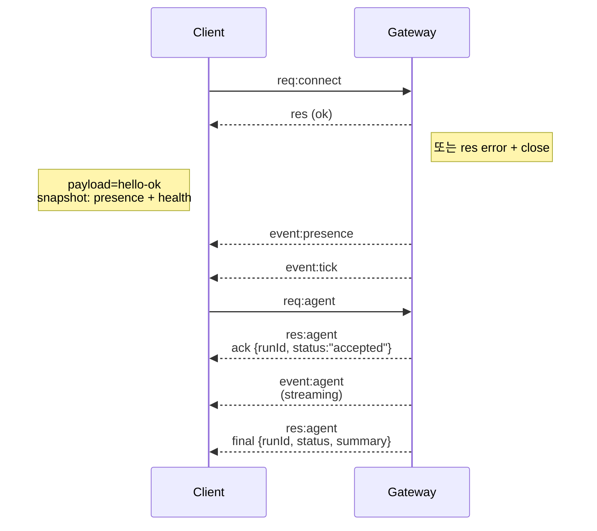

---
read_when:
    - Gateway 프로토콜, 클라이언트 또는 전송 계층 작업 중
summary: WebSocket Gateway 아키텍처, 구성 요소 및 클라이언트 흐름
title: Gateway 아키텍처
x-i18n:
    generated_at: "2026-04-24T06:09:43Z"
    model: gpt-5.4
    provider: openai
    source_hash: 91c553489da18b6ad83fc860014f5bfb758334e9789cb7893d4d00f81c650f02
    source_path: concepts/architecture.md
    workflow: 15
---

## 개요

- 단일 장기 실행 **Gateway**가 모든 메시징 표면을 소유합니다(WhatsApp via Baileys, Telegram via grammY, Slack, Discord, Signal, iMessage, WebChat).
- 제어 평면 클라이언트(macOS 앱, CLI, 웹 UI, 자동화)는 구성된 바인드 호스트(기본값 `127.0.0.1:18789`)에서 **WebSocket**을 통해 Gateway에 연결합니다.
- **Node**(macOS/iOS/Android/헤드리스)도 **WebSocket**을 통해 연결되지만, 명시적인 cap/명령과 함께 `role: node`를 선언합니다.
- 호스트당 Gateway는 하나이며, WhatsApp 세션을 여는 유일한 위치입니다.
- **canvas host**는 다음 경로로 Gateway HTTP 서버에서 제공됩니다:
  - `/__openclaw__/canvas/` (에이전트가 편집 가능한 HTML/CSS/JS)
  - `/__openclaw__/a2ui/` (A2UI 호스트)
    동일한 Gateway 포트(기본값 `18789`)를 사용합니다.

## 구성 요소 및 흐름

### Gateway (데몬)

- Provider 연결을 유지합니다.
- 타입 지정된 WS API(요청, 응답, 서버 푸시 이벤트)를 노출합니다.
- 인바운드 프레임을 JSON Schema로 검증합니다.
- `agent`, `chat`, `presence`, `health`, `heartbeat`, `cron` 같은 이벤트를 방출합니다.

### 클라이언트(mac 앱 / CLI / 웹 관리자)

- 클라이언트당 하나의 WS 연결.
- 요청 전송(`health`, `status`, `send`, `agent`, `system-presence`).
- 이벤트 구독(`tick`, `agent`, `presence`, `shutdown`).

### Node(macOS / iOS / Android / 헤드리스)

- **동일한 WS 서버**에 `role: node`로 연결합니다.
- `connect`에서 기기 정체성을 제공합니다. 페어링은 **기기 기반**(`role: node`)이며 승인은 기기 페어링 저장소에 저장됩니다.
- `canvas.*`, `camera.*`, `screen.record`, `location.get` 같은 명령을 노출합니다.

프로토콜 세부 정보:

- [Gateway 프로토콜](/ko/gateway/protocol)

### WebChat

- 채팅 기록과 전송을 위해 Gateway WS API를 사용하는 정적 UI입니다.
- 원격 설정에서는 다른 클라이언트와 동일한 SSH/Tailscale 터널을 통해 연결됩니다.

## 연결 수명 주기(단일 클라이언트)



## 와이어 프로토콜(요약)

- 전송: WebSocket, JSON 페이로드를 담은 텍스트 프레임.
- 첫 번째 프레임은 반드시 `connect`여야 합니다.
- 핸드셰이크 후:
  - 요청: `{type:"req", id, method, params}` → `{type:"res", id, ok, payload|error}`
  - 이벤트: `{type:"event", event, payload, seq?, stateVersion?}`
- `hello-ok.features.methods` / `events`는 검색 메타데이터이며, 호출 가능한 모든 헬퍼 경로의 생성된 덤프가 아닙니다.
- 공유 시크릿 인증은 구성된 Gateway 인증 모드에 따라 `connect.params.auth.token` 또는 `connect.params.auth.password`를 사용합니다.
- Tailscale Serve (`gateway.auth.allowTailscale: true`) 또는 non-loopback `gateway.auth.mode: "trusted-proxy"` 같은 신원 기반 모드는 `connect.params.auth.*` 대신 요청 헤더에서 인증을 충족합니다.
- private-ingress `gateway.auth.mode: "none"`은 공유 시크릿 인증을 완전히 비활성화합니다. 이 모드는 공개/비신뢰 인그레스에서 사용하지 마세요.
- 부작용이 있는 메서드(`send`, `agent`)에는 안전한 재시도를 위해 멱등성 키가 필요합니다. 서버는 수명이 짧은 중복 제거 캐시를 유지합니다.
- Node는 `connect`에 `role: "node"`와 함께 cap/명령/권한을 포함해야 합니다.

## 페어링 + 로컬 신뢰

- 모든 WS 클라이언트(운영자 + Node)는 `connect`에 **기기 정체성**을 포함합니다.
- 새 기기 ID는 페어링 승인이 필요하며, Gateway는 이후 연결을 위해 **기기 토큰**을 발급합니다.
- 동일 호스트 UX를 부드럽게 유지하기 위해 직접 local loopback 연결은 자동 승인될 수 있습니다.
- OpenClaw는 신뢰할 수 있는 공유 시크릿 헬퍼 흐름을 위해 좁게 제한된 backend/container-local self-connect 경로도 제공합니다.
- same-host tailnet 바인드를 포함한 tailnet 및 LAN 연결은 여전히 명시적 페어링 승인이 필요합니다.
- 모든 연결은 `connect.challenge` nonce에 서명해야 합니다.
- 시그니처 페이로드 `v3`는 `platform` + `deviceFamily`도 바인딩합니다. Gateway는 재연결 시 페어링된 메타데이터를 고정하며, 메타데이터 변경 시 복구 페어링을 요구합니다.
- **비로컬** 연결은 여전히 명시적 승인이 필요합니다.
- Gateway 인증(`gateway.auth.*`)은 로컬이든 원격이든 **모든** 연결에 여전히 적용됩니다.

자세한 내용: [Gateway 프로토콜](/ko/gateway/protocol), [페어링](/ko/channels/pairing),
[보안](/ko/gateway/security).

## 프로토콜 타이핑 및 코드 생성

- TypeBox 스키마가 프로토콜을 정의합니다.
- JSON Schema는 이러한 스키마에서 생성됩니다.
- Swift 모델은 JSON Schema에서 생성됩니다.

## 원격 접근

- 권장: Tailscale 또는 VPN.
- 대안: SSH 터널

  ```bash
  ssh -N -L 18789:127.0.0.1:18789 user@host
  ```

- 동일한 핸드셰이크 + 인증 토큰이 터널 위에서도 적용됩니다.
- 원격 설정에서는 WS에 대해 TLS + 선택적 핀닝을 활성화할 수 있습니다.

## 운영 스냅샷

- 시작: `openclaw gateway` (포그라운드, 로그를 stdout으로 출력).
- 상태: WS를 통한 `health` (`hello-ok`에도 포함됨).
- 감독: 자동 재시작을 위한 launchd/systemd.

## 불변 조건

- 정확히 하나의 Gateway가 호스트당 단일 Baileys 세션을 제어합니다.
- 핸드셰이크는 필수이며, JSON이 아니거나 첫 프레임이 `connect`가 아니면 즉시 연결을 닫습니다.
- 이벤트는 재생되지 않으므로, 클라이언트는 누락이 발생하면 새로 고침해야 합니다.

## 관련 문서

- [에이전트 루프](/ko/concepts/agent-loop) — 상세한 에이전트 실행 주기
- [Gateway 프로토콜](/ko/gateway/protocol) — WebSocket 프로토콜 계약
- [큐](/ko/concepts/queue) — 명령 큐와 동시성
- [보안](/ko/gateway/security) — 신뢰 모델 및 강화
