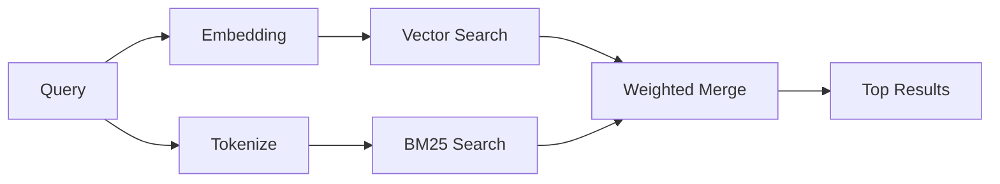

---
read_when:
    - '`memory_search`가 어떻게 작동하는지 이해하려고 합니다'
    - 임베딩 공급자를 선택하려고 합니다
    - 검색 품질을 조정하려고 합니다
summary: 메모리 검색이 임베딩과 하이브리드 검색을 사용해 관련 노트를 찾는 방법
title: 메모리 검색
x-i18n:
    generated_at: "2026-04-25T12:24:35Z"
    model: gpt-5.4
    provider: openai
    source_hash: 5cc6bbaf7b0a755bbe44d3b1b06eed7f437ebdc41a81c48cca64bd08bbc546b7
    source_path: concepts/memory-search.md
    workflow: 15
---

`memory_search`는 원래 텍스트와 표현이 달라도 메모리 파일에서 관련 노트를 찾아냅니다. 메모리를 작은 청크로 인덱싱한 뒤, 임베딩, 키워드 또는 둘 다를 사용해 검색하는 방식으로 작동합니다.

## 빠른 시작

GitHub Copilot 구독, OpenAI, Gemini, Voyage 또는 Mistral API 키가 구성되어 있으면 메모리 검색이 자동으로 작동합니다. 공급자를 명시적으로 설정하려면 다음을 사용하세요.

```json5
{
  agents: {
    defaults: {
      memorySearch: {
        provider: "openai", // 또는 "gemini", "local", "ollama" 등
      },
    },
  },
}
```

API 키 없이 로컬 임베딩을 사용하려면, OpenClaw 옆에 선택적 `node-llama-cpp` 런타임 패키지를 설치하고 `provider: "local"`을 사용하세요.

## 지원되는 공급자

| 공급자 | ID | API 키 필요 | 참고 |
| -------------- | ---------------- | ------------- | ---------------------------------------------------- |
| Bedrock | `bedrock` | 아니요 | AWS 자격 증명 체인을 확인할 수 있으면 자동 감지 |
| Gemini | `gemini` | 예 | 이미지/오디오 인덱싱 지원 |
| GitHub Copilot | `github-copilot` | 아니요 | 자동 감지, Copilot 구독 사용 |
| Local | `local` | 아니요 | GGUF 모델, 약 0.6GB 다운로드 |
| Mistral | `mistral` | 예 | 자동 감지 |
| Ollama | `ollama` | 아니요 | 로컬, 명시적으로 설정해야 함 |
| OpenAI | `openai` | 예 | 자동 감지, 빠름 |
| Voyage | `voyage` | 예 | 자동 감지 |

## 검색 방식

OpenClaw는 두 개의 검색 경로를 병렬로 실행한 뒤 결과를 병합합니다.



- **벡터 검색**은 의미가 비슷한 노트를 찾습니다(예: "gateway host"가 "OpenClaw를 실행하는 머신"과 일치).
- **BM25 키워드 검색**은 정확히 일치하는 항목(ID, 오류 문자열, 구성 키)을 찾습니다.

한 경로만 사용할 수 있는 경우(임베딩 없음 또는 FTS 없음), 다른 경로만 단독으로 실행됩니다.

임베딩을 사용할 수 없더라도 OpenClaw는 단순한 원시 정확 일치 순서로만 대체하지 않고, 여전히 FTS 결과에 대한 어휘 기반 순위를 사용합니다. 이 저하 모드에서는 쿼리 용어를 더 잘 포괄하는 청크와 관련 파일 경로의 점수를 높이므로 `sqlite-vec`나 임베딩 공급자가 없어도 재현율을 유용한 수준으로 유지할 수 있습니다.

## 검색 품질 개선

노트 기록이 많을 때 도움이 되는 선택적 기능 두 가지가 있습니다.

### 시간 감쇠

오래된 노트는 순위 가중치가 점차 줄어들어 최근 정보가 먼저 노출됩니다. 기본 반감기인 30일을 기준으로 하면 지난달의 노트 점수는 원래 가중치의 50%가 됩니다. `MEMORY.md` 같은 상시 유지 파일은 감쇠되지 않습니다.

<Tip>
에이전트에 수개월치 일일 노트가 있고 오래된 정보가 최근 컨텍스트보다 계속 더 높은 순위에 오르면 시간 감쇠를 활성화하세요.
</Tip>

### MMR(다양성)

중복 결과를 줄입니다. 예를 들어 노트 5개가 모두 같은 라우터 구성을 언급하더라도, MMR은 상위 결과가 반복되지 않고 서로 다른 주제를 다루도록 보장합니다.

<Tip>
서로 다른 일일 노트에서 거의 중복된 스니펫을 `memory_search`가 계속 반환한다면 MMR을 활성화하세요.
</Tip>

### 둘 다 활성화

```json5
{
  agents: {
    defaults: {
      memorySearch: {
        query: {
          hybrid: {
            mmr: { enabled: true },
            temporalDecay: { enabled: true },
          },
        },
      },
    },
  },
}
```

## 멀티모달 메모리

Gemini Embedding 2를 사용하면 Markdown과 함께 이미지 및 오디오 파일도 인덱싱할 수 있습니다. 검색 쿼리는 계속 텍스트이지만 시각 및 오디오 콘텐츠와 일치할 수 있습니다. 설정 방법은 [메모리 구성 참조](/ko/reference/memory-config)를 확인하세요.

## 세션 메모리 검색

선택적으로 세션 대화록을 인덱싱하여 `memory_search`가 이전 대화를 회상할 수 있도록 할 수 있습니다. 이 기능은 `memorySearch.experimental.sessionMemory`를 통해 옵트인 방식으로 활성화합니다. 자세한 내용은 [구성 참조](/ko/reference/memory-config)를 확인하세요.

## 문제 해결

**결과가 없나요?** 인덱스를 확인하려면 `openclaw memory status`를 실행하세요. 비어 있으면 `openclaw memory index --force`를 실행하세요.

**키워드 일치만 나오나요?** 임베딩 공급자가 구성되지 않았을 수 있습니다. `openclaw memory status --deep`를 확인하세요.

**CJK 텍스트가 검색되지 않나요?** `openclaw memory index --force`로 FTS 인덱스를 다시 빌드하세요.

## 추가 읽을거리

- [Active Memory](/ko/concepts/active-memory) -- 대화형 채팅 세션을 위한 서브에이전트 메모리
- [메모리](/ko/concepts/memory) -- 파일 레이아웃, 백엔드, 도구
- [메모리 구성 참조](/ko/reference/memory-config) -- 모든 구성 옵션

## 관련 항목

- [메모리 개요](/ko/concepts/memory)
- [Active Memory](/ko/concepts/active-memory)
- [내장 메모리 엔진](/ko/concepts/memory-builtin)
