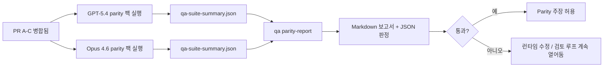

---
read_when:
    - GPT-5.4 / Codex parity PR 시리즈 검토하기
    - parity 프로그램 뒤의 6개 계약 agentic 아키텍처 유지 관리하기
summary: GPT-5.4 / Codex parity 프로그램을 네 개의 병합 단위로 검토하는 방법
title: GPT-5.4 / Codex parity 유지 관리자 참고 사항
x-i18n:
    generated_at: "2026-04-24T06:18:19Z"
    model: gpt-5.4
    provider: openai
    source_hash: 803b62bf5bb6b00125f424fa733e743ecdec7f8410dec0782096f9d1ddbed6c0
    source_path: help/gpt54-codex-agentic-parity-maintainers.md
    workflow: 15
---

이 문서는 GPT-5.4 / Codex parity 프로그램을 원래의 6개 계약 아키텍처를 잃지 않고 4개의 병합 단위로 검토하는 방법을 설명합니다.

## 병합 단위

### PR A: strict-agentic execution

소유 범위:

- `executionContract`
- GPT-5 우선 same-turn 후속 실행
- 비종결 진행 추적용 `update_plan`
- 계획만 있고 조용히 멈추는 대신 명시적 blocked 상태

소유하지 않는 범위:

- auth/runtime 실패 분류
- permission truthfulness
- replay/continuation 재설계
- parity 벤치마킹

### PR B: runtime truthfulness

소유 범위:

- Codex OAuth scope 정확성
- 타입 지정된 provider/runtime 실패 분류
- truthful `/elevated full` 가용성 및 blocked 이유

소유하지 않는 범위:

- 도구 스키마 정규화
- replay/liveness 상태
- benchmark gating

### PR C: execution correctness

소유 범위:

- provider 소유 OpenAI/Codex 도구 호환성
- 매개변수 없는 strict 스키마 처리
- replay-invalid 노출
- paused, blocked, abandoned 장기 작업 상태 가시성

소유하지 않는 범위:

- 자체 선택 continuation
- provider hook 외부의 일반 Codex dialect 동작
- benchmark gating

### PR D: parity harness

소유 범위:

- 첫 번째 파동 GPT-5.4 대 Opus 4.6 시나리오 팩
- parity 문서화
- parity 보고서 및 릴리스 게이트 메커니즘

소유하지 않는 범위:

- QA-lab 외부의 런타임 동작 변경
- harness 내부의 auth/proxy/DNS 시뮬레이션

## 원래 6개 계약으로 다시 매핑

| 원래 계약 | 병합 단위 |
| ---------------------------------------- | ---------- |
| Provider 전송/인증 정확성 | PR B |
| 도구 계약/스키마 호환성 | PR C |
| Same-turn 실행 | PR A |
| Permission truthfulness | PR B |
| Replay/continuation/liveness 정확성 | PR C |
| Benchmark/release gate | PR D |

## 검토 순서

1. PR A
2. PR B
3. PR C
4. PR D

PR D는 증명 계층입니다. 런타임 정확성 PR이 지연되는 이유가 되어서는 안 됩니다.

## 확인할 사항

### PR A

- GPT-5 실행이 단순 해설에서 멈추지 않고 동작하거나 닫힌 실패를 수행함
- `update_plan`이 그 자체로는 더 이상 진행처럼 보이지 않음
- 동작이 GPT-5 우선 및 embedded-Pi 범위로 유지됨

### PR B

- auth/proxy/runtime 실패가 더 이상 일반적인 “model failed” 처리로 뭉뚱그려지지 않음
- `/elevated full`은 실제로 사용할 수 있을 때만 사용 가능하다고 설명됨
- blocked 이유가 모델과 사용자 대상 런타임 모두에 보임

### PR C

- strict OpenAI/Codex 도구 등록이 예측 가능하게 동작함
- 매개변수 없는 도구가 strict 스키마 검사에서 실패하지 않음
- replay 및 Compaction 결과가 truthful liveness 상태를 보존함

### PR D

- 시나리오 팩이 이해 가능하고 재현 가능함
- 팩에 읽기 전용 흐름만이 아니라 변경이 있는 replay-safety 레인이 포함됨
- 보고서를 사람이 읽을 수 있고 자동화도 읽을 수 있음
- parity 주장이 일화가 아니라 증거에 기반함

PR D에서 기대되는 아티팩트:

- 각 모델 실행별 `qa-suite-report.md` / `qa-suite-summary.json`
- 집계 및 시나리오 수준 비교가 포함된 `qa-agentic-parity-report.md`
- 기계 판독 가능한 판정이 포함된 `qa-agentic-parity-summary.json`

## 릴리스 게이트

다음이 충족되기 전까지는 GPT-5.4가 Opus 4.6과 parity 또는 superiority를 가진다고 주장하지 마세요.

- PR A, PR B, PR C가 병합됨
- PR D가 첫 번째 파동 parity 팩을 깨끗하게 실행함
- runtime-truthfulness 회귀 테스트 모음이 계속 녹색임
- parity 보고서에 fake-success 사례가 없고 stop 동작 회귀도 없음

parity harness는 유일한 증거 소스가 아닙니다. 검토 시 이 분리를 명시적으로 유지하세요.

- PR D는 시나리오 기반 GPT-5.4 대 Opus 4.6 비교를 소유함
- PR B의 결정적 테스트 모음은 여전히 auth/proxy/DNS 및 full-access truthfulness 증거를 소유함

## 목표-증거 매핑

| 완료 게이트 항목 | 주 소유자 | 검토 아티팩트 |
| ---------------------------------------- | ------------- | ------------------------------------------------------------------- |
| 계획만 있고 멈추는 현상 없음 | PR A | strict-agentic 런타임 테스트 및 `approval-turn-tool-followthrough` |
| 가짜 진행 또는 가짜 도구 완료 없음 | PR A + PR D | parity fake-success 수와 시나리오 수준 보고서 세부 정보 |
| 잘못된 `/elevated full` 안내 없음 | PR B | 결정적 runtime-truthfulness 테스트 모음 |
| replay/liveness 실패가 계속 명시적으로 유지됨 | PR C + PR D | lifecycle/replay 테스트 모음 및 `compaction-retry-mutating-tool` |
| GPT-5.4가 Opus 4.6과 같거나 더 나음 | PR D | `qa-agentic-parity-report.md` 및 `qa-agentic-parity-summary.json` |

## 검토자용 축약: 이전 vs 이후

| 이전의 사용자 가시 문제 | 이후의 검토 신호 |
| ----------------------------------------------------------- | --------------------------------------------------------------------------------------- |
| GPT-5.4가 계획 후 멈춤 | PR A가 해설만 있는 완료 대신 act-or-block 동작을 보여줌 |
| strict OpenAI/Codex 스키마에서 도구 사용이 불안정하게 느껴짐 | PR C가 도구 등록과 매개변수 없는 호출을 예측 가능하게 유지함 |
| `/elevated full` 힌트가 때때로 오해를 불러일으킴 | PR B가 안내를 실제 런타임 capability 및 blocked 이유와 연결함 |
| 장기 작업이 replay/Compaction 모호성 속에 사라질 수 있었음 | PR C가 명시적인 paused, blocked, abandoned, replay-invalid 상태를 내보냄 |
| parity 주장이 일화 수준이었음 | PR D가 두 모델 모두에 동일한 시나리오 범위를 적용한 보고서와 JSON 판정을 생성함 |

## 관련

- [GPT-5.4 / Codex agentic parity](/ko/help/gpt54-codex-agentic-parity)
