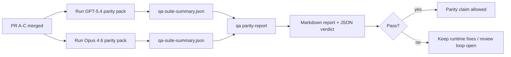

---
read_when:
    - GPT-5.4 / Codex 패리티 PR 시리즈 검토하기
    - 패리티 프로그램의 기반이 되는 6개 계약 에이전트 아키텍처 유지 관리
summary: GPT-5.4 / Codex 패리티 프로그램을 네 개의 머지 단위로 검토하는 방법
title: GPT-5.4 / Codex 패리티 메인테이너 참고 사항
x-i18n:
    generated_at: "2026-04-22T04:22:46Z"
    model: gpt-5.4
    provider: openai
    source_hash: b872d6a33b269c01b44537bfa8646329063298fdfcd3671a17d0eadbc9da5427
    source_path: help/gpt54-codex-agentic-parity-maintainers.md
    workflow: 15
---

# GPT-5.4 / Codex 패리티 메인테이너 참고 사항

이 문서는 원래의 6개 계약 아키텍처를 잃지 않으면서 GPT-5.4 / Codex 패리티 프로그램을 4개의 머지 단위로 검토하는 방법을 설명합니다.

## 머지 단위

### PR A: strict-agentic 실행

담당 범위:

- `executionContract`
- GPT-5 우선 same-turn 후속 실행
- 종료가 아닌 진행 추적으로서의 `update_plan`
- 계획만 있고 조용히 멈추는 대신 명시적인 차단 상태

담당하지 않는 범위:

- 인증/런타임 실패 분류
- 권한 truthfulness
- 리플레이/이어가기 재설계
- 패리티 벤치마킹

### PR B: 런타임 truthfulness

담당 범위:

- Codex OAuth scope 정확성
- 타입화된 provider/런타임 실패 분류
- truthfully 표현된 `/elevated full` 가용성 및 차단 사유

담당하지 않는 범위:

- 도구 스키마 정규화
- 리플레이/liveness 상태
- 벤치마크 게이팅

### PR C: 실행 정확성

담당 범위:

- provider가 소유하는 OpenAI/Codex 도구 호환성
- 매개변수 없는 strict schema 처리
- replay-invalid 노출
- 일시 중지됨, 차단됨, 포기됨 상태의 장기 작업 가시성

담당하지 않는 범위:

- 자체 선택형 이어가기
- provider hook 밖의 일반적인 Codex dialect 동작
- 벤치마크 게이팅

### PR D: 패리티 하니스

담당 범위:

- 1차 GPT-5.4 대 Opus 4.6 시나리오 팩
- 패리티 문서
- 패리티 리포트 및 릴리스 게이트 메커니즘

담당하지 않는 범위:

- QA-lab 밖의 런타임 동작 변경
- 하니스 내부의 인증/프록시/DNS 시뮬레이션

## 원래의 6개 계약으로 다시 매핑

| 원래 계약 | 머지 단위 |
| ---------------------------------------- | ---------- |
| Provider 전송/인증 정확성      | PR B       |
| 도구 계약/스키마 호환성       | PR C       |
| Same-turn 실행                      | PR A       |
| 권한 truthfulness                  | PR B       |
| 리플레이/이어가기/liveness 정확성 | PR C       |
| 벤치마크/릴리스 게이트                   | PR D       |

## 검토 순서

1. PR A
2. PR B
3. PR C
4. PR D

PR D는 증명 계층입니다. 이것이 런타임 정확성 PR의 지연 이유가 되어서는 안 됩니다.

## 확인할 사항

### PR A

- GPT-5 실행이 설명만 하고 멈추지 않고, 실제로 동작하거나 fail closed 되는지
- `update_plan` 자체가 더 이상 진행처럼 보이지 않는지
- 동작이 계속 GPT-5 우선이며 embedded-Pi 범위에 머무는지

### PR B

- 인증/프록시/런타임 실패가 더 이상 일반적인 “model failed” 처리로 뭉개지지 않는지
- `/elevated full`이 실제로 사용 가능할 때만 사용 가능하다고 설명되는지
- 차단 사유가 모델과 사용자 대상 런타임 모두에 표시되는지

### PR C

- strict OpenAI/Codex 도구 등록이 예측 가능하게 동작하는지
- 매개변수 없는 도구가 strict schema 검사에서 실패하지 않는지
- 리플레이와 Compaction 결과가 truthful liveness 상태를 유지하는지

### PR D

- 시나리오 팩이 이해 가능하고 재현 가능한지
- 팩에 읽기 전용 흐름만이 아니라 변경을 수반하는 replay-safety 레인이 포함되는지
- 리포트가 사람과 자동화 모두가 읽기 쉬운지
- 패리티 주장이 일화가 아니라 증거에 기반하는지

PR D에서 기대되는 산출물:

- 각 모델 실행에 대한 `qa-suite-report.md` / `qa-suite-summary.json`
- 집계 및 시나리오 수준 비교가 담긴 `qa-agentic-parity-report.md`
- 기계 판독 가능한 판정을 담은 `qa-agentic-parity-summary.json`

## 릴리스 게이트

다음 조건이 충족되기 전에는 GPT-5.4가 Opus 4.6과 패리티이거나 더 우수하다고 주장하지 마세요:

- PR A, PR B, PR C가 머지됨
- PR D가 1차 패리티 팩을 깨끗하게 실행함
- 런타임 truthfulness 회귀 스위트가 계속 녹색 상태임
- 패리티 리포트에 가짜 성공 사례가 없고 정지 동작 회귀도 없음

패리티 하니스가 유일한 증거 출처는 아닙니다. 검토 시 이 분리를 명확히 유지하세요:

- PR D는 시나리오 기반 GPT-5.4 대 Opus 4.6 비교를 담당합니다
- PR B의 결정적 스위트는 여전히 인증/프록시/DNS 및 전체 액세스 truthfulness 증거를 담당합니다

## 목표-증거 매핑

| 완료 게이트 항목 | 주요 담당 | 검토 산출물 |
| ---------------------------------------- | ------------- | ------------------------------------------------------------------- |
| 계획만 있고 멈추는 현상 없음                      | PR A          | strict-agentic 런타임 테스트 및 `approval-turn-tool-followthrough` |
| 가짜 진행 또는 가짜 도구 완료 없음 | PR A + PR D   | 패리티 가짜 성공 수 및 시나리오 수준 리포트 세부 정보        |
| 잘못된 `/elevated full` 안내 없음       | PR B          | 결정적 런타임 truthfulness 스위트                           |
| 리플레이/liveness 실패가 계속 명시적으로 유지됨 | PR C + PR D   | lifecycle/replay 스위트 및 `compaction-retry-mutating-tool`       |
| GPT-5.4가 Opus 4.6과 같거나 더 우수함        | PR D          | `qa-agentic-parity-report.md` 및 `qa-agentic-parity-summary.json`  |

## 검토자용 축약: 이전 vs 이후

| 이전의 사용자 가시 문제 | 이후의 검토 신호 |
| ----------------------------------------------------------- | --------------------------------------------------------------------------------------- |
| GPT-5.4가 계획 후 멈췄음                              | PR A가 설명만 하는 완료 대신 act-or-block 동작을 보여줌                  |
| strict OpenAI/Codex schema에서 도구 사용이 불안정하게 느껴졌음      | PR C가 도구 등록과 매개변수 없는 호출을 예측 가능하게 유지함                  |
| `/elevated full` 힌트가 때때로 오해를 불러일으켰음            | PR B가 안내를 실제 런타임 기능 및 차단 사유에 연결함                     |
| 장기 작업이 리플레이/Compaction 모호성 속으로 사라질 수 있었음 | PR C가 일시 중지됨, 차단됨, 포기됨, replay-invalid 상태를 명시적으로 내보냄                |
| 패리티 주장이 일화 수준이었음                                | PR D가 두 모델에 동일한 시나리오 범위를 적용한 리포트와 JSON 판정을 생성함 |
