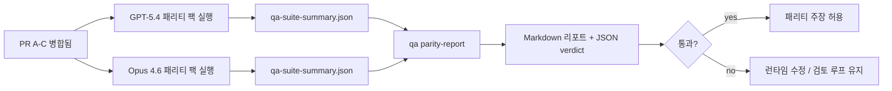

---
read_when:
    - GPT-5.4 / Codex 패리티 PR 시리즈 검토 중
    - 패리티 프로그램을 뒷받침하는 6계약 agentic 아키텍처 유지 관리
summary: GPT-5.4 / Codex 패리티 프로그램을 네 개의 병합 단위로 검토하는 방법
title: GPT-5.4 / Codex 패리티 메인터너 참고 사항
x-i18n:
    generated_at: "2026-04-25T12:26:00Z"
    model: gpt-5.4
    provider: openai
    source_hash: 162ea68476880d4dbf9b8c3b9397a51a2732c3eb10ac52e421a9c9d90e04eec2
    source_path: help/gpt54-codex-agentic-parity-maintainers.md
    workflow: 15
---

이 메모는 원래의 6계약 아키텍처를 잃지 않으면서 GPT-5.4 / Codex 패리티 프로그램을 네 개의 병합 단위로 검토하는 방법을 설명합니다.

## 병합 단위

### PR A: strict-agentic 실행

소유 범위:

- `executionContract`
- GPT-5 우선 same-turn 후속 수행
- 비종료 진행 추적으로서의 `update_plan`
- 계획만 있고 조용히 멈추는 대신 명시적 차단 상태

소유하지 않는 범위:

- 인증/런타임 실패 분류
- 권한 truthfulness
- replay/continuation 재설계
- 패리티 벤치마킹

### PR B: 런타임 truthfulness

소유 범위:

- Codex OAuth scope 정확성
- 타입 지정된 provider/runtime 실패 분류
- truth한 `/elevated full` 가용성 및 차단 사유

소유하지 않는 범위:

- 도구 스키마 정규화
- replay/liveness 상태
- 벤치마크 게이팅

### PR C: 실행 정확성

소유 범위:

- provider 소유 OpenAI/Codex 도구 호환성
- 매개변수 없는 strict schema 처리
- replay-invalid 노출
- 일시 중지됨, 차단됨, 버려짐 상태의 장기 작업 가시성

소유하지 않는 범위:

- 자체 선택 continuation
- provider hook 외부의 일반 Codex dialect 동작
- 벤치마크 게이팅

### PR D: 패리티 하네스

소유 범위:

- 1차 GPT-5.4 vs Opus 4.6 시나리오 팩
- 패리티 문서화
- 패리티 리포트 및 릴리스 게이트 메커니즘

소유하지 않는 범위:

- QA-lab 외부의 런타임 동작 변경
- 하네스 내부의 인증/프록시/DNS 시뮬레이션

## 원래의 6개 계약에 다시 매핑

| 원래 계약                               | 병합 단위 |
| --------------------------------------- | --------- |
| Provider 전송/인증 정확성               | PR B      |
| 도구 계약/스키마 호환성                 | PR C      |
| Same-turn 실행                          | PR A      |
| 권한 truthfulness                       | PR B      |
| Replay/continuation/liveness 정확성     | PR C      |
| 벤치마크/릴리스 게이트                  | PR D      |

## 검토 순서

1. PR A
2. PR B
3. PR C
4. PR D

PR D는 증명 계층입니다. 런타임 정확성 PR이 지연되는 이유가 되어서는 안 됩니다.

## 확인할 사항

### PR A

- GPT-5 실행이 해설만 하다가 멈추지 않고 동작하거나 안전하게 실패하는지
- `update_plan`이 더 이상 그 자체만으로 진행처럼 보이지 않는지
- 동작이 GPT-5 우선이며 embedded-Pi 범위로 유지되는지

### PR B

- 인증/프록시/런타임 실패가 더 이상 일반적인 “model failed” 처리로 뭉뚱그려지지 않는지
- `/elevated full`이 실제로 가능할 때만 사용 가능한 것으로 설명되는지
- 차단 사유가 모델과 사용자 대상 런타임 모두에 표시되는지

### PR C

- strict OpenAI/Codex 도구 등록이 예측 가능하게 동작하는지
- 매개변수 없는 도구가 strict schema 검사에서 실패하지 않는지
- replay 및 Compaction 결과가 truth한 liveness 상태를 보존하는지

### PR D

- 시나리오 팩이 이해 가능하고 재현 가능한지
- 팩에 읽기 전용 흐름뿐 아니라 상태를 변경하는 replay-safety 레인도 포함되는지
- 리포트가 사람과 자동화 모두가 읽을 수 있는지
- 패리티 주장이 일화가 아니라 증거에 기반하는지

PR D에서 기대되는 산출물:

- 각 모델 실행에 대한 `qa-suite-report.md` / `qa-suite-summary.json`
- 집계 및 시나리오 수준 비교를 담은 `qa-agentic-parity-report.md`
- 기계 판독 가능한 verdict를 담은 `qa-agentic-parity-summary.json`

## 릴리스 게이트

다음 조건이 충족되기 전까지 GPT-5.4가 Opus 4.6과 동등하거나 더 우수하다고 주장하지 마세요:

- PR A, PR B, PR C가 병합됨
- PR D가 1차 패리티 팩을 문제 없이 실행함
- 런타임 truthfulness 회귀 스위트가 계속 녹색 상태임
- 패리티 리포트에 가짜 성공 사례가 없고 정지 동작 회귀도 없음

패리티 하네스만이 유일한 증거 원천은 아닙니다. 검토 시 이 분리를 명확히 유지하세요:

- PR D는 시나리오 기반 GPT-5.4 vs Opus 4.6 비교를 소유함
- PR B의 결정적 스위트는 여전히 인증/프록시/DNS 및 full-access truthfulness 증거를 소유함

## 빠른 메인터너 병합 워크플로

패리티 PR을 병합할 준비가 되었고 반복 가능하며 위험이 낮은 절차를 원할 때 이것을 사용하세요.

1. 병합 전에 증거 기준이 충족되었는지 확인:
   - 재현 가능한 증상 또는 실패하는 테스트
   - 수정한 코드에서 검증된 근본 원인
   - 문제 경로에 대한 수정
   - 회귀 테스트 또는 명시적 수동 검증 메모
2. 병합 전 트리아지/라벨링:
   - PR이 병합되면 안 되는 경우 해당 `r:*` 자동 종료 라벨 적용
   - 병합 후보에는 해결되지 않은 blocker 스레드가 없도록 유지
3. 수정된 표면을 로컬에서 검증:
   - `pnpm check:changed`
   - 테스트가 변경되었거나 버그 수정 신뢰도가 테스트 커버리지에 의존하는 경우 `pnpm test:changed`
4. 표준 메인터너 흐름(` /landpr` 프로세스)으로 병합 후 확인:
   - 연결된 이슈의 자동 종료 동작
   - `main`의 CI 및 병합 후 상태
5. 병합 후 관련된 열려 있는 PR/이슈에 대해 중복 검색을 실행하고, 정식 참조가 있는 경우에만 종료

증거 기준 항목 중 하나라도 빠져 있으면 병합 대신 변경 요청을 하세요.

## 목표-증거 매핑

| 완료 게이트 항목                         | 주 소유자     | 검토 산출물                                                          |
| ---------------------------------------- | ------------- | -------------------------------------------------------------------- |
| 계획만 있고 멈추는 현상 없음             | PR A          | strict-agentic 런타임 테스트 및 `approval-turn-tool-followthrough`   |
| 가짜 진행 또는 가짜 도구 완료 없음       | PR A + PR D   | 패리티 fake-success 개수와 시나리오 수준 리포트 세부 정보            |
| 잘못된 `/elevated full` 안내 없음        | PR B          | 결정적 runtime-truthfulness 스위트                                   |
| Replay/liveness 실패가 계속 명시적임     | PR C + PR D   | lifecycle/replay 스위트 및 `compaction-retry-mutating-tool`          |
| GPT-5.4가 Opus 4.6과 같거나 더 우수함    | PR D          | `qa-agentic-parity-report.md` 및 `qa-agentic-parity-summary.json`    |

## 검토자용 축약: 이전 vs 이후

| 이전의 사용자에게 보이는 문제                              | 이후의 검토 신호                                                                          |
| ---------------------------------------------------------- | ----------------------------------------------------------------------------------------- |
| GPT-5.4가 계획 후 멈춤                                     | PR A가 해설만 하고 끝나는 대신 동작 또는 차단 행동을 보여줌                              |
| strict OpenAI/Codex 스키마에서 도구 사용이 불안정해 보임   | PR C가 도구 등록과 매개변수 없는 호출을 예측 가능하게 유지함                             |
| `/elevated full` 힌트가 때때로 오해를 불러일으킴           | PR B가 안내를 실제 런타임 기능 및 차단 사유와 연결함                                     |
| 장기 작업이 replay/Compaction 모호성 속으로 사라질 수 있음 | PR C가 명시적인 일시 중지됨, 차단됨, 버려짐, replay-invalid 상태를 출력함                |
| 패리티 주장이 일화 수준이었음                              | PR D가 두 모델 모두에 대해 동일한 시나리오 커버리지로 리포트와 JSON verdict를 생성함     |

## 관련 항목

- [GPT-5.4 / Codex agentic parity](/ko/help/gpt54-codex-agentic-parity)
