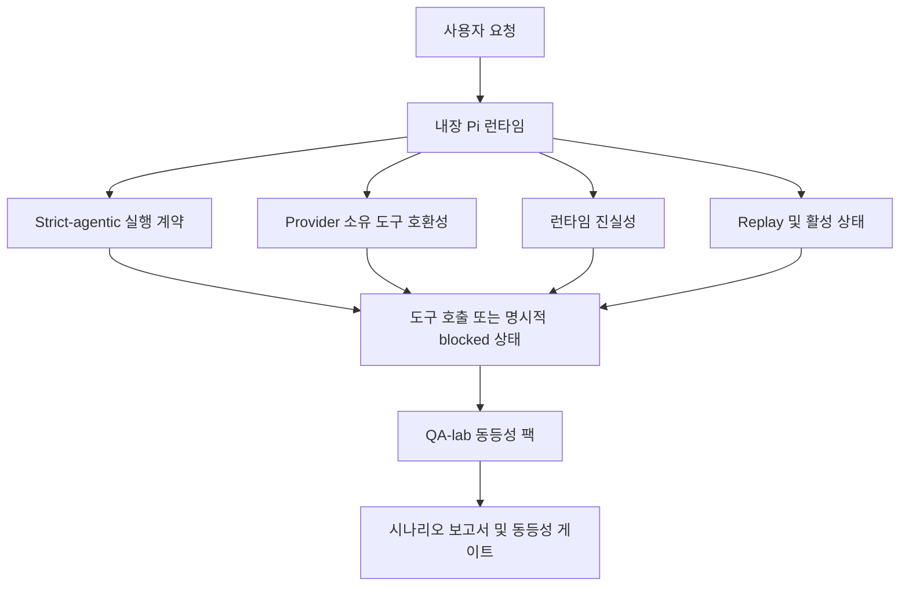
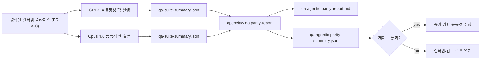

---
read_when:
    - GPT-5.4 또는 Codex 에이전트 동작 디버깅하기
    - 프런티어 모델 전반에서 OpenClaw agentic 동작 비교하기
    - strict-agentic, 도구 스키마, 상승 권한, 재생 수정 사항 검토하기
summary: OpenClaw가 GPT-5.4 및 Codex 스타일 모델의 agentic 실행 격차를 메우는 방식
title: GPT-5.4 / Codex agentic 동등성
x-i18n:
    generated_at: "2026-04-24T06:18:21Z"
    model: gpt-5.4
    provider: openai
    source_hash: 9f8c7dcf21583e6dbac80da9ddd75f2dc9af9b80801072ade8fa14b04258d4dc
    source_path: help/gpt54-codex-agentic-parity.md
    workflow: 15
---

# OpenClaw의 GPT-5.4 / Codex agentic 동등성

OpenClaw는 이미 도구를 사용하는 프런티어 모델과 잘 동작했지만, GPT-5.4와 Codex 스타일 모델은 여전히 몇 가지 실용적인 면에서 성능이 부족했습니다:

- 실제 작업 대신 계획만 세우고 멈출 수 있었습니다
- 엄격한 OpenAI/Codex 도구 스키마를 잘못 사용할 수 있었습니다
- 전체 접근이 불가능한 상황에서도 `/elevated full`을 요청할 수 있었습니다
- replay나 Compaction 중 장기 실행 작업 상태를 잃을 수 있었습니다
- Claude Opus 4.6과의 동등성 주장은 반복 가능한 시나리오가 아니라 일화에 기반하고 있었습니다

이 동등성 프로그램은 검토 가능한 네 개의 슬라이스로 이 격차를 해결합니다.

## 변경된 내용

### PR A: strict-agentic 실행

이 슬라이스는 내장 Pi GPT-5 실행에 대해 옵트인 `strict-agentic` 실행 계약을 추가합니다.

활성화되면 OpenClaw는 더 이상 계획만 있는 턴을 “충분히 좋은” 완료로 받아들이지 않습니다. 모델이 의도만 말하고 실제로 도구를 사용하거나 진전을 만들지 않으면, OpenClaw는 즉시 행동하라는 steer와 함께 재시도한 뒤 작업을 조용히 끝내는 대신 명시적 blocked 상태로 실패 시 닫힘 처리합니다.

이는 특히 다음에서 GPT-5.4 경험을 개선합니다:

- 짧은 “좋아, 해” 후속 요청
- 첫 단계가 명확한 코드 작업
- `update_plan`이 군더더기 텍스트가 아니라 진행 추적이어야 하는 흐름

### PR B: 런타임 진실성

이 슬라이스는 OpenClaw가 두 가지에 대해 사실대로 말하도록 합니다:

- Provider/런타임 호출이 왜 실패했는지
- `/elevated full`이 실제로 가능한지 여부

즉 GPT-5.4는 누락된 범위, 인증 새로고침 실패, HTML 403 인증 실패, 프록시 문제, DNS 또는 타임아웃 실패, 차단된 전체 접근 모드에 대해 더 나은 런타임 신호를 받게 됩니다. 모델이 잘못된 해결책을 환각하거나 런타임이 제공할 수 없는 권한 모드를 계속 요청할 가능성이 줄어듭니다.

### PR C: 실행 정확성

이 슬라이스는 두 종류의 정확성을 개선합니다:

- Provider 소유의 OpenAI/Codex 도구 스키마 호환성
- replay 및 장기 작업 활성 상태 노출

도구 호환성 작업은 특히 파라미터가 없는 도구와 엄격한 객체 루트 기대치 주변에서 엄격한 OpenAI/Codex 도구 등록의 스키마 마찰을 줄입니다. replay/활성 상태 작업은 장기 실행 작업을 더 잘 관찰할 수 있게 만들어, 일시 중지됨, 차단됨, 버려짐 상태가 일반적인 실패 텍스트 속으로 사라지지 않고 드러나게 합니다.

### PR D: 동등성 하네스

이 슬라이스는 GPT-5.4와 Opus 4.6을 동일한 시나리오로 실행하고 공통 증거를 사용해 비교할 수 있도록 첫 번째 QA-lab 동등성 팩을 추가합니다.

동등성 팩은 증명 계층입니다. 이것만으로 런타임 동작을 바꾸지는 않습니다.

두 개의 `qa-suite-summary.json` 아티팩트가 준비되면, 다음 명령으로 릴리스 게이트 비교를 생성하세요:

```bash
pnpm openclaw qa parity-report \
  --repo-root . \
  --candidate-summary .artifacts/qa-e2e/gpt54/qa-suite-summary.json \
  --baseline-summary .artifacts/qa-e2e/opus46/qa-suite-summary.json \
  --output-dir .artifacts/qa-e2e/parity
```

이 명령은 다음을 기록합니다:

- 사람이 읽을 수 있는 Markdown 보고서
- 기계 판독 가능한 JSON 판정
- 명시적인 `pass` / `fail` 게이트 결과

## 이것이 실제로 GPT-5.4를 어떻게 개선하는가

이 작업 이전에는 OpenClaw 위의 GPT-5.4가 실제 코딩 세션에서 Opus보다 덜 agentic하게 느껴질 수 있었습니다. 런타임이 특히 GPT-5 스타일 모델에 해로운 동작을 허용했기 때문입니다:

- 설명만 하는 턴
- 도구 주변의 스키마 마찰
- 모호한 권한 피드백
- 조용한 replay 또는 Compaction 파손

목표는 GPT-5.4가 Opus를 흉내 내게 만드는 것이 아닙니다. 목표는 실제 진전을 보상하고, 더 깔끔한 도구 및 권한 의미 체계를 제공하며, 실패 모드를 기계와 사람이 모두 읽을 수 있는 명시적 상태로 바꾸는 런타임 계약을 GPT-5.4에 제공하는 것입니다.

이로써 사용자 경험은 다음에서:

- “모델이 좋은 계획은 세웠지만 멈췄다”

다음으로 바뀝니다:

- “모델이 실제로 행동했거나, OpenClaw가 왜 행동할 수 없었는지 정확한 이유를 드러냈다”

## GPT-5.4 사용자를 위한 전후 비교

| 이 프로그램 이전 | PR A-D 이후 |
| ---------------------------------------------------------------------------------------------- | ---------------------------------------------------------------------------------------- |
| GPT-5.4는 합리적인 계획 뒤에 다음 도구 단계를 수행하지 않고 멈출 수 있었음 | PR A는 “계획만 있음”을 “지금 행동하거나 blocked 상태를 드러내기”로 전환 |
| 엄격한 도구 스키마가 파라미터 없는 도구나 OpenAI/Codex 형태의 도구를 혼란스럽게 거부할 수 있었음 | PR C는 Provider 소유 도구 등록과 호출을 더 예측 가능하게 만듦 |
| `/elevated full` 안내가 차단된 런타임에서 모호하거나 틀릴 수 있었음 | PR B는 GPT-5.4와 사용자에게 사실에 맞는 런타임 및 권한 힌트를 제공 |
| replay 또는 Compaction 실패가 작업이 조용히 사라진 것처럼 느껴질 수 있었음 | PR C는 일시 중지됨, 차단됨, 버려짐, replay-invalid 결과를 명시적으로 드러냄 |
| “GPT-5.4가 Opus보다 나쁘다”는 주장은 대부분 일화였음 | PR D는 이를 동일한 시나리오 팩, 동일한 메트릭, 명확한 pass/fail 게이트로 전환 |

## 아키텍처



## 릴리스 흐름



## 시나리오 팩

현재 첫 번째 동등성 팩은 다섯 가지 시나리오를 다룹니다:

### `approval-turn-tool-followthrough`

짧은 승인 이후 모델이 “그렇게 하겠습니다”에서 멈추지 않는지 확인합니다. 같은 턴에서 첫 번째 구체적 행동을 수행해야 합니다.

### `model-switch-tool-continuity`

모델/런타임 전환 경계에서도 도구 사용 작업이 설명으로 초기화되거나 실행 컨텍스트를 잃지 않고 일관되게 유지되는지 확인합니다.

### `source-docs-discovery-report`

모델이 소스와 문서를 읽고, 발견 내용을 종합하고, 얇은 요약을 만든 뒤 멈추는 대신 agentic하게 작업을 계속할 수 있는지 확인합니다.

### `image-understanding-attachment`

첨부 파일이 포함된 혼합 모드 작업이 실행 가능성을 유지하고 모호한 서술로 무너지지 않는지 확인합니다.

### `compaction-retry-mutating-tool`

실제 변경 쓰기가 있는 작업이, 실행이 압박 속에서 compaction되거나 재시도되거나 응답 상태를 잃더라도, replay-unsafe임을 조용히 replay-safe처럼 보이게 하지 않고 명시적으로 유지하는지 확인합니다.

## 시나리오 매트릭스

| 시나리오 | 테스트 내용 | 좋은 GPT-5.4 동작 | 실패 신호 |
| ---------------------------------- | --------------------------------------- | ------------------------------------------------------------------------------ | ------------------------------------------------------------------------------ |
| `approval-turn-tool-followthrough` | 계획 이후의 짧은 승인 턴 | 의도를 다시 말하는 대신 즉시 첫 번째 구체적 도구 작업을 시작함 | 계획만 있는 후속 응답, 도구 활동 없음, 또는 실제 차단 사유 없는 blocked 턴 |
| `model-switch-tool-continuity` | 도구 사용 중 런타임/모델 전환 | 작업 컨텍스트를 보존하고 일관되게 계속 행동함 | 설명으로 리셋됨, 도구 컨텍스트 상실, 또는 전환 후 중단 |
| `source-docs-discovery-report` | 소스 읽기 + 종합 + 행동 | 소스를 찾고, 도구를 사용하고, 지연 없이 유용한 보고서를 만듦 | 얇은 요약, 누락된 도구 작업, 또는 불완전한 턴 종료 |
| `image-understanding-attachment` | 첨부 기반 agentic 작업 | 첨부를 해석하고, 도구와 연결하고, 작업을 계속함 | 모호한 서술, 첨부 무시, 또는 구체적 다음 행동 없음 |
| `compaction-retry-mutating-tool` | Compaction 압박 하의 변경 작업 | 실제 쓰기를 수행하고 부작용 이후에도 replay-unsafe임을 명시적으로 유지함 | 변경 쓰기는 발생했지만 replay 안전성이 암시되거나, 누락되거나, 모순됨 |

## 릴리스 게이트

GPT-5.4는 병합된 런타임이 동등성 팩과 런타임 진실성 회귀를 동시에 통과했을 때만 동등하거나 더 낫다고 볼 수 있습니다.

필수 결과:

- 다음 도구 작업이 명확할 때 계획만 세우고 멈추지 않음
- 실제 실행 없는 가짜 완료 없음
- 잘못된 `/elevated full` 안내 없음
- 조용한 replay 또는 Compaction 중단 없음
- 합의된 Opus 4.6 기준선과 같거나 더 강한 동등성 팩 메트릭

첫 번째 하네스에서 게이트는 다음을 비교합니다:

- 완료율
- 의도치 않은 중단 비율
- 유효한 도구 호출 비율
- 가짜 성공 횟수

동등성 증거는 의도적으로 두 계층으로 나뉩니다:

- PR D는 QA-lab으로 동일 시나리오에서의 GPT-5.4 vs Opus 4.6 동작을 증명
- PR B의 결정적 스위트는 하네스 밖에서 인증, 프록시, DNS, `/elevated full` 진실성을 증명

## 목표-증거 매트릭스

| 완료 게이트 항목 | 담당 PR | 증거 소스 | 통과 신호 |
| -------------------------------------------------------- | ----------- | ------------------------------------------------------------------ | ---------------------------------------------------------------------------------------- |
| GPT-5.4가 더 이상 계획 후 멈추지 않음 | PR A | `approval-turn-tool-followthrough` 및 PR A 런타임 스위트 | 승인 턴이 실제 작업 또는 명시적 blocked 상태를 트리거함 |
| GPT-5.4가 더 이상 가짜 진전 또는 가짜 도구 완료를 만들지 않음 | PR A + PR D | 동등성 보고서 시나리오 결과 및 가짜 성공 횟수 | 의심스러운 pass 결과 없음, 설명만 있는 완료 없음 |
| GPT-5.4가 더 이상 잘못된 `/elevated full` 안내를 주지 않음 | PR B | 결정적 진실성 스위트 | 차단 사유와 전체 접근 힌트가 런타임에 정확하게 유지됨 |
| replay/활성 상태 실패가 계속 명시적으로 드러남 | PR C + PR D | PR C 수명 주기/replay 스위트 + `compaction-retry-mutating-tool` | 변경 작업이 조용히 사라지는 대신 replay-unsafe임을 명시적으로 유지함 |
| GPT-5.4가 합의된 메트릭에서 Opus 4.6과 같거나 더 좋음 | PR D | `qa-agentic-parity-report.md` 및 `qa-agentic-parity-summary.json` | 동일한 시나리오 범위와 완료, 중단 동작, 유효 도구 사용에서 회귀 없음 |

## 동등성 판정을 읽는 방법

첫 번째 동등성 팩의 최종 기계 판독 가능한 결정으로 `qa-agentic-parity-summary.json`의 판정을 사용하세요.

- `pass`는 GPT-5.4가 Opus 4.6과 동일한 시나리오를 커버했고, 합의된 집계 메트릭에서 회귀하지 않았다는 뜻입니다.
- `fail`은 하나 이상의 강제 게이트가 발동되었다는 뜻입니다: 더 약한 완료, 더 나쁜 의도치 않은 중단, 더 약한 유효 도구 사용, 가짜 성공 사례 발생, 또는 시나리오 커버리지 불일치.
- “shared/base CI issue”는 그 자체로 동등성 결과가 아닙니다. PR D 외부의 CI 노이즈가 실행을 막는다면, 판정은 브랜치 시절 로그에서 추론하지 말고 정리된 병합 런타임 실행을 기다려야 합니다.
- 인증, 프록시, DNS, `/elevated full` 진실성은 여전히 PR B의 결정적 스위트에서 오므로, 최종 릴리스 주장에는 두 가지가 모두 필요합니다: 통과한 PR D 동등성 판정과 초록불인 PR B 진실성 커버리지.

## 누가 `strict-agentic`을 활성화해야 하나요

다음과 같은 경우 `strict-agentic`을 사용하세요:

- 다음 단계가 명확할 때 에이전트가 즉시 행동해야 하는 경우
- GPT-5.4 또는 Codex 계열 모델이 주 런타임인 경우
- “도움이 되는” 요약 전용 응답보다 명시적인 blocked 상태를 선호하는 경우

다음과 같은 경우 기본 계약을 유지하세요:

- 기존의 더 느슨한 동작을 원하는 경우
- GPT-5 계열 모델을 사용하지 않는 경우
- 런타임 강제가 아니라 프롬프트를 테스트 중인 경우

## 관련 문서

- [GPT-5.4 / Codex parity 유지 관리자 참고](/ko/help/gpt54-codex-agentic-parity-maintainers)
