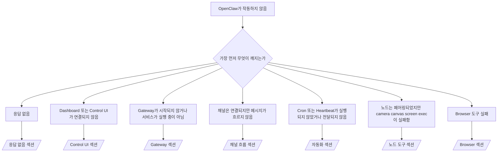

---
read_when:
    - OpenClaw가 작동하지 않아 가장 빠른 해결 경로가 필요합니다
    - 깊이 있는 runbook으로 들어가기 전에 triage 흐름이 필요합니다
summary: 증상 우선 OpenClaw 문제 해결 허브
title: 일반 문제 해결
x-i18n:
    generated_at: "2026-04-24T06:18:55Z"
    model: gpt-5.4
    provider: openai
    source_hash: ce06ddce9de9e5824b4c5e8c182df07b29ce3ff113eb8e29c62aef9a4682e8e9
    source_path: help/troubleshooting.md
    workflow: 15
---

# 문제 해결

2분밖에 없다면 이 페이지를 triage 시작점으로 사용하세요.

## 첫 60초

정확히 이 순서대로 다음 명령을 실행하세요.

```bash
openclaw status
openclaw status --all
openclaw gateway probe
openclaw gateway status
openclaw doctor
openclaw channels status --probe
openclaw logs --follow
```

한 줄로 보는 정상 출력:

- `openclaw status` → 구성된 채널이 표시되고 명백한 인증 오류가 없음.
- `openclaw status --all` → 전체 보고서가 존재하며 공유 가능함.
- `openclaw gateway probe` → 예상된 Gateway 대상에 도달 가능(`Reachable: yes`). `Capability: ...`는 probe가 어떤 인증 수준을 증명할 수 있었는지 알려주며, `Read probe: limited - missing scope: operator.read`는 연결 실패가 아니라 성능 저하된 진단입니다.
- `openclaw gateway status` → `Runtime: running`, `Connectivity probe: ok`, 그리고 그럴듯한 `Capability: ...` 줄. 읽기 범위 RPC 증명도 필요하면 `--require-rpc`를 사용하세요.
- `openclaw doctor` → 차단성 구성/서비스 오류가 없음.
- `openclaw channels status --probe` → 도달 가능한 Gateway는 계정별 라이브
  전송 상태와 `works` 또는 `audit ok` 같은 probe/audit 결과를 반환합니다. Gateway에 도달할 수 없으면
  이 명령은 구성 전용 요약으로 폴백합니다.
- `openclaw logs --follow` → 안정적인 활동이 있으며 반복되는 치명적 오류가 없음.

## Anthropic 장문 컨텍스트 429

다음이 표시되면:
`HTTP 429: rate_limit_error: Extra usage is required for long context requests`,
[/gateway/troubleshooting#anthropic-429-extra-usage-required-for-long-context](/ko/gateway/troubleshooting#anthropic-429-extra-usage-required-for-long-context)로 이동하세요.

## 로컬 OpenAI 호환 백엔드는 직접 호출은 되지만 OpenClaw에서는 실패함

로컬 또는 자체 호스팅 `/v1` 백엔드가 작은 직접
`/v1/chat/completions` probe에는 응답하지만 `openclaw infer model run` 또는 일반
에이전트 턴에서는 실패한다면:

1. 오류에 `messages[].content`가 문자열이어야 한다는 내용이 있으면
   `models.providers.<provider>.models[].compat.requiresStringContent: true`를 설정하세요.
2. 백엔드가 여전히 OpenClaw 에이전트 턴에서만 실패하면
   `models.providers.<provider>.models[].compat.supportsTools: false`를 설정하고 다시 시도하세요.
3. 작은 직접 호출은 여전히 되지만 더 큰 OpenClaw 프롬프트에서 백엔드가
   충돌한다면 남은 문제는 업스트림 모델/서버 제한으로 보고
   심화 runbook으로 계속 진행하세요:
   [/gateway/troubleshooting#local-openai-compatible-backend-passes-direct-probes-but-agent-runs-fail](/ko/gateway/troubleshooting#local-openai-compatible-backend-passes-direct-probes-but-agent-runs-fail)

## Plugin 설치가 누락된 openclaw extensions 오류로 실패함

설치가 `package.json missing openclaw.extensions`로 실패하면, 해당 Plugin 패키지가
OpenClaw가 더 이상 허용하지 않는 오래된 형태를 사용하고 있는 것입니다.

Plugin 패키지에서 수정:

1. `package.json`에 `openclaw.extensions`를 추가합니다.
2. 항목을 빌드된 런타임 파일(보통 `./dist/index.js`)로 지정합니다.
3. Plugin을 다시 게시하고 `openclaw plugins install <package>`를 다시 실행합니다.

예시:

```json
{
  "name": "@openclaw/my-plugin",
  "version": "1.2.3",
  "openclaw": {
    "extensions": ["./dist/index.js"]
  }
}
```

참조: [Plugin 아키텍처](/ko/plugins/architecture)

## 결정 트리



<AccordionGroup>
  <Accordion title="응답 없음">
    ```bash
    openclaw status
    openclaw gateway status
    openclaw channels status --probe
    openclaw pairing list --channel <channel> [--account <id>]
    openclaw logs --follow
    ```

    정상 출력 예시:

    - `Runtime: running`
    - `Connectivity probe: ok`
    - `Capability: read-only`, `write-capable`, 또는 `admin-capable`
    - `channels status --probe`에서 해당 채널의 전송이 연결되어 있고, 지원되는 경우 `works` 또는 `audit ok`가 표시됨
    - 발신자가 승인된 상태로 표시됨(또는 DM 정책이 open/allowlist임)

    일반적인 로그 징후:

    - `drop guild message (mention required` → Discord에서 멘션 게이팅이 메시지를 차단함.
    - `pairing request` → 발신자가 승인되지 않았고 DM 페어링 승인을 기다리는 중.
    - 채널 로그의 `blocked` / `allowlist` → 발신자, 방, 또는 그룹이 필터링됨.

    심화 페이지:

    - [/gateway/troubleshooting#no-replies](/ko/gateway/troubleshooting#no-replies)
    - [/channels/troubleshooting](/ko/channels/troubleshooting)
    - [/channels/pairing](/ko/channels/pairing)

  </Accordion>

  <Accordion title="Dashboard 또는 Control UI가 연결되지 않음">
    ```bash
    openclaw status
    openclaw gateway status
    openclaw logs --follow
    openclaw doctor
    openclaw channels status --probe
    ```

    정상 출력 예시:

    - `openclaw gateway status`에 `Dashboard: http://...`가 표시됨
    - `Connectivity probe: ok`
    - `Capability: read-only`, `write-capable`, 또는 `admin-capable`
    - 로그에 auth loop가 없음

    일반적인 로그 징후:

    - `device identity required` → HTTP/비보안 컨텍스트에서 장치 인증을 완료할 수 없음.
    - `origin not allowed` → 브라우저 `Origin`이 Control UI
      Gateway 대상에 대해 허용되지 않음.
    - 재시도 힌트가 포함된 `AUTH_TOKEN_MISMATCH` (`canRetryWithDeviceToken=true`) → 신뢰된 device-token 재시도 1회가 자동으로 발생할 수 있음.
    - 해당 캐시 토큰 재시도는 페어링된
      device token과 함께 저장된 캐시 범위 집합을 재사용합니다. 명시적 `deviceToken` / 명시적 `scopes` 호출자는 대신 자신이 요청한 범위 집합을 유지합니다.
    - 비동기 Tailscale Serve Control UI 경로에서 동일한
      `{scope, ip}`에 대한 실패 시도는 limiter가 실패를 기록하기 전에 직렬화되므로, 두 번째 동시 잘못된 재시도는 이미 `retry later`를 표시할 수 있습니다.
    - localhost
      브라우저 origin에서 `too many failed authentication attempts (retry later)` → 같은 `Origin`에서의 반복 실패가 일시적으로
      잠겼다는 뜻입니다. 다른 localhost origin은 별도 버킷을 사용합니다.
    - 해당 재시도 후 반복되는 `unauthorized` → 잘못된 토큰/비밀번호, 인증 모드 불일치, 또는 오래된 페어링 장치 토큰.
    - `gateway connect failed:` → UI가 잘못된 URL/포트 또는 도달 불가능한 Gateway를 대상으로 하고 있음.

    심화 페이지:

    - [/gateway/troubleshooting#dashboard-control-ui-connectivity](/ko/gateway/troubleshooting#dashboard-control-ui-connectivity)
    - [/web/control-ui](/ko/web/control-ui)
    - [/gateway/authentication](/ko/gateway/authentication)

  </Accordion>

  <Accordion title="Gateway가 시작되지 않거나 서비스가 설치되어 있지만 실행되지 않음">
    ```bash
    openclaw status
    openclaw gateway status
    openclaw logs --follow
    openclaw doctor
    openclaw channels status --probe
    ```

    정상 출력 예시:

    - `Service: ... (loaded)`
    - `Runtime: running`
    - `Connectivity probe: ok`
    - `Capability: read-only`, `write-capable`, 또는 `admin-capable`

    일반적인 로그 징후:

    - `Gateway start blocked: set gateway.mode=local` 또는 `existing config is missing gateway.mode` → Gateway 모드가 remote이거나, 구성 파일에 local-mode 스탬프가 없어 복구가 필요함.
    - `refusing to bind gateway ... without auth` → 유효한 Gateway 인증 경로(token/password 또는 구성된 trusted-proxy) 없이 non-loopback bind를 시도함.
    - `another gateway instance is already listening` 또는 `EADDRINUSE` → 포트가 이미 사용 중임.

    심화 페이지:

    - [/gateway/troubleshooting#gateway-service-not-running](/ko/gateway/troubleshooting#gateway-service-not-running)
    - [/gateway/background-process](/ko/gateway/background-process)
    - [/gateway/configuration](/ko/gateway/configuration)

  </Accordion>

  <Accordion title="채널은 연결되지만 메시지가 흐르지 않음">
    ```bash
    openclaw status
    openclaw gateway status
    openclaw logs --follow
    openclaw doctor
    openclaw channels status --probe
    ```

    정상 출력 예시:

    - 채널 전송이 연결되어 있음.
    - 페어링/허용 목록 검사가 통과함.
    - 필요한 경우 멘션이 감지됨.

    일반적인 로그 징후:

    - `mention required` → 그룹 멘션 게이팅이 처리를 차단함.
    - `pairing` / `pending` → DM 발신자가 아직 승인되지 않음.
    - `not_in_channel`, `missing_scope`, `Forbidden`, `401/403` → 채널 권한 토큰 문제.

    심화 페이지:

    - [/gateway/troubleshooting#channel-connected-messages-not-flowing](/ko/gateway/troubleshooting#channel-connected-messages-not-flowing)
    - [/channels/troubleshooting](/ko/channels/troubleshooting)

  </Accordion>

  <Accordion title="Cron 또는 Heartbeat가 실행되지 않았거나 전달되지 않음">
    ```bash
    openclaw status
    openclaw gateway status
    openclaw cron status
    openclaw cron list
    openclaw cron runs --id <jobId> --limit 20
    openclaw logs --follow
    ```

    정상 출력 예시:

    - `cron.status`가 활성 상태이며 다음 wake를 표시함.
    - `cron runs`가 최근 `ok` 항목을 표시함.
    - Heartbeat가 활성화되어 있고 활성 시간 범위 밖이 아님.

    일반적인 로그 징후:

    - `cron: scheduler disabled; jobs will not run automatically` → Cron이 비활성화됨.
    - `reason=quiet-hours`가 포함된 `heartbeat skipped` → 구성된 활성 시간 외부.
    - `reason=empty-heartbeat-file`가 포함된 `heartbeat skipped` → `HEARTBEAT.md`가 존재하지만 빈 내용 또는 헤더만 있는 골격만 포함함.
    - `reason=no-tasks-due`가 포함된 `heartbeat skipped` → `HEARTBEAT.md` 작업 모드가 활성화되어 있지만 아직 어떤 작업 간격도 도래하지 않음.
    - `reason=alerts-disabled`가 포함된 `heartbeat skipped` → 모든 Heartbeat 가시성이 비활성화됨(`showOk`, `showAlerts`, `useIndicator`가 모두 꺼짐).
    - `requests-in-flight` → main 레인이 바쁨. Heartbeat wake가 연기됨.
    - `unknown accountId` → Heartbeat 전달 대상 계정이 존재하지 않음.

    심화 페이지:

    - [/gateway/troubleshooting#cron-and-heartbeat-delivery](/ko/gateway/troubleshooting#cron-and-heartbeat-delivery)
    - [/automation/cron-jobs#troubleshooting](/ko/automation/cron-jobs#troubleshooting)
    - [/gateway/heartbeat](/ko/gateway/heartbeat)

  </Accordion>

  <Accordion title="노드는 페어링되었지만 tool fails camera canvas screen exec">
    ```bash
    openclaw status
    openclaw gateway status
    openclaw nodes status
    openclaw nodes describe --node <idOrNameOrIp>
    openclaw logs --follow
    ```

    정상 출력 예시:

    - 노드가 role `node`에 대해 연결되고 페어링된 것으로 표시됨.
    - 호출 중인 명령에 대한 capability가 존재함.
    - 도구에 대한 permission 상태가 허용됨.

    일반적인 로그 징후:

    - `NODE_BACKGROUND_UNAVAILABLE` → 노드 앱을 foreground로 가져오세요.
    - `*_PERMISSION_REQUIRED` → OS 권한이 거부되었거나 없음.
    - `SYSTEM_RUN_DENIED: approval required` → exec 승인이 대기 중임.
    - `SYSTEM_RUN_DENIED: allowlist miss` → 명령이 exec 허용 목록에 없음.

    심화 페이지:

    - [/gateway/troubleshooting#node-paired-tool-fails](/ko/gateway/troubleshooting#node-paired-tool-fails)
    - [/nodes/troubleshooting](/ko/nodes/troubleshooting)
    - [/tools/exec-approvals](/ko/tools/exec-approvals)

  </Accordion>

  <Accordion title="Exec가 갑자기 승인을 요청함">
    ```bash
    openclaw config get tools.exec.host
    openclaw config get tools.exec.security
    openclaw config get tools.exec.ask
    openclaw gateway restart
    ```

    변경된 내용:

    - `tools.exec.host`가 설정되지 않은 경우 기본값은 `auto`입니다.
    - `host=auto`는 샌드박스 런타임이 활성 상태이면 `sandbox`, 아니면 `gateway`로 확인됩니다.
    - `host=auto`는 라우팅만 담당합니다. 프롬프트 없는 "YOLO" 동작은 gateway/node에서 `security=full` + `ask=off`로 결정됩니다.
    - `gateway`와 `node`에서 `tools.exec.security`가 설정되지 않으면 기본값은 `full`입니다.
    - `tools.exec.ask`가 설정되지 않으면 기본값은 `off`입니다.
    - 결과적으로 승인이 표시된다면, 일부 호스트 로컬 또는 세션별 정책이 현재 기본값보다 더 엄격하게 exec를 제한한 것입니다.

    현재 기본 no-approval 동작 복원:

    ```bash
    openclaw config set tools.exec.host gateway
    openclaw config set tools.exec.security full
    openclaw config set tools.exec.ask off
    openclaw gateway restart
    ```

    더 안전한 대안:

    - 안정적인 호스트 라우팅만 원한다면 `tools.exec.host=gateway`만 설정하세요.
    - 허용 목록 미스 시 검토를 유지하면서 호스트 exec를 원한다면 `security=allowlist`와 `ask=on-miss`를 사용하세요.
    - `host=auto`가 다시 `sandbox`로 확인되길 원한다면 샌드박스 모드를 활성화하세요.

    일반적인 로그 징후:

    - `Approval required.` → 명령이 `/approve ...`를 기다리는 중입니다.
    - `SYSTEM_RUN_DENIED: approval required` → node-host exec 승인이 대기 중입니다.
    - `exec host=sandbox requires a sandbox runtime for this session` → 암시적/명시적 샌드박스 선택이지만 샌드박스 모드는 꺼져 있습니다.

    심화 페이지:

    - [/tools/exec](/ko/tools/exec)
    - [/tools/exec-approvals](/ko/tools/exec-approvals)
    - [/gateway/security#what-the-audit-checks-high-level](/ko/gateway/security#what-the-audit-checks-high-level)

  </Accordion>

  <Accordion title="Browser 도구 실패">
    ```bash
    openclaw status
    openclaw gateway status
    openclaw browser status
    openclaw logs --follow
    openclaw doctor
    ```

    정상 출력 예시:

    - Browser status가 `running: true`와 선택된 browser/profile을 표시함.
    - `openclaw`가 시작되거나, `user`가 로컬 Chrome 탭을 볼 수 있음.

    일반적인 로그 징후:

    - `unknown command "browser"` 또는 `unknown command 'browser'` → `plugins.allow`가 설정되어 있고 `browser`를 포함하지 않음.
    - `Failed to start Chrome CDP on port` → 로컬 browser 시작 실패.
    - `browser.executablePath not found` → 구성된 바이너리 경로가 잘못됨.
    - `browser.cdpUrl must be http(s) or ws(s)` → 구성된 CDP URL이 지원되지 않는 스킴을 사용함.
    - `browser.cdpUrl has invalid port` → 구성된 CDP URL의 포트가 잘못되었거나 범위를 벗어남.
    - `No Chrome tabs found for profile="user"` → Chrome MCP attach profile에 열린 로컬 Chrome 탭이 없음.
    - `Remote CDP for profile "<name>" is not reachable` → 구성된 원격 CDP 엔드포인트에 이 호스트에서 도달할 수 없음.
    - `Browser attachOnly is enabled ... not reachable` 또는 `Browser attachOnly is enabled and CDP websocket ... is not reachable` → attach-only profile에 살아 있는 CDP 대상이 없음.
    - attach-only 또는 원격 CDP profile에서 오래된 viewport / dark-mode / locale / offline 재정의 → `openclaw browser stop --browser-profile <name>`를 실행해 Gateway를 재시작하지 않고 활성 control 세션을 닫고 에뮬레이션 상태를 해제하세요.

    심화 페이지:

    - [/gateway/troubleshooting#browser-tool-fails](/ko/gateway/troubleshooting#browser-tool-fails)
    - [/tools/browser#missing-browser-command-or-tool](/ko/tools/browser#missing-browser-command-or-tool)
    - [/tools/browser-linux-troubleshooting](/ko/tools/browser-linux-troubleshooting)
    - [/tools/browser-wsl2-windows-remote-cdp-troubleshooting](/ko/tools/browser-wsl2-windows-remote-cdp-troubleshooting)

  </Accordion>

</AccordionGroup>

## 관련

- [FAQ](/ko/help/faq) — 자주 묻는 질문
- [Gateway 문제 해결](/ko/gateway/troubleshooting) — Gateway 관련 문제
- [Doctor](/ko/gateway/doctor) — 자동 상태 점검 및 복구
- [채널 문제 해결](/ko/channels/troubleshooting) — 채널 연결 문제
- [자동화 문제 해결](/ko/automation/cron-jobs#troubleshooting) — Cron 및 Heartbeat 문제
