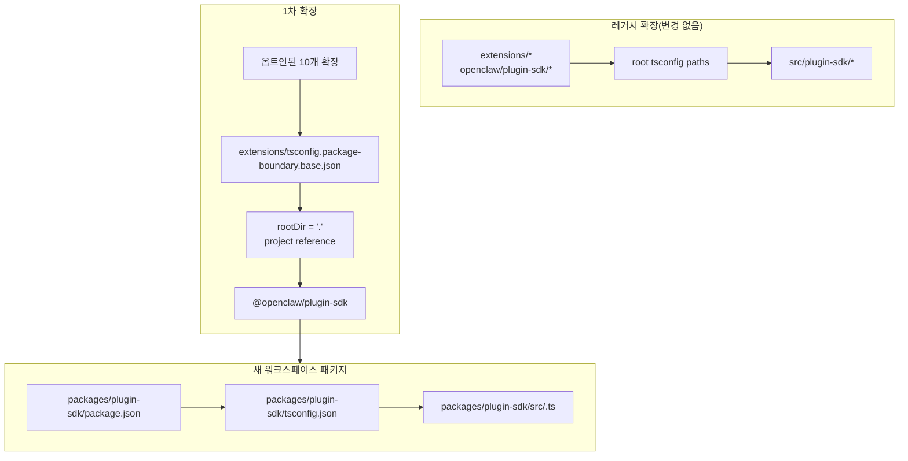

# 리팩터링: plugin-sdk를 점진적으로 실제 워크스페이스 패키지로 만들기

## 개요

이 계획은 `packages/plugin-sdk`에 plugin SDK용 실제 워크스페이스 패키지를 도입하고, 이를 사용해 소수의 1차 확장 세트에 컴파일러 강제 패키지 경계를 옵트인 방식으로 적용합니다. 목표는 선택된 번들 제공자 확장 세트에 대해 일반적인 `tsc`에서 불법 상대 import가 실패하도록 만드는 것이며, 저장소 전체 마이그레이션이나 거대한 병합 충돌 표면을 강제하지 않는 것입니다.

핵심적인 점진적 조치는 한동안 두 가지 모드를 병행 실행하는 것입니다.

| 모드 | import 형태 | 사용 대상 | 강제 방식 |
| ---- | ----------- | --------- | --------- |
| 레거시 모드 | `openclaw/plugin-sdk/*` | 기존의 모든 비옵트인 확장 | 현재의 관대한 동작 유지 |
| 옵트인 모드 | `@openclaw/plugin-sdk/*` | 1차 확장만 | 패키지 로컬 `rootDir` + 프로젝트 참조 |

## 문제 프레임

현재 저장소는 대규모 공개 plugin SDK 표면을 export하지만, 이는 실제 워크스페이스 패키지가 아닙니다. 대신 다음과 같습니다.

- 루트 `tsconfig.json`은 `openclaw/plugin-sdk/*`를
  `src/plugin-sdk/*.ts`에 직접 매핑합니다.
- 이전 실험에 옵트인되지 않은 확장도 여전히 해당
  전역 소스 별칭 동작을 공유합니다.
- 허용된 SDK import가 확장 패키지 외부의 원시 저장소 소스로 해석되지 않게 된 뒤에야
  `rootDir` 추가가 동작합니다.

즉, 저장소는 원하는 경계 정책을 설명할 수는 있지만, TypeScript는 대부분의 확장에 대해 이를 깔끔하게 강제하지 못합니다.

필요한 것은 다음을 만족하는 점진적 경로입니다.

- `plugin-sdk`를 실제 패키지로 만들기
- SDK를 `@openclaw/plugin-sdk`라는 워크스페이스 패키지로 점진적으로 이동하기
- 첫 번째 PR에서는 약 10개의 확장만 변경하기
- 확장 트리의 나머지는 나중에 정리할 때까지 기존 방식에 남겨두기
- 1차 롤아웃의 주요 메커니즘으로 `tsconfig.plugin-sdk.dts.json` + postinstall 생성 선언 워크플로를 피하기

## 요구 사항 추적

- R1. `packages/` 아래에 plugin SDK용 실제 워크스페이스 패키지를 생성합니다.
- R2. 새 패키지 이름을 `@openclaw/plugin-sdk`로 지정합니다.
- R3. 새 SDK 패키지에 자체 `package.json`과 `tsconfig.json`을 부여합니다.
- R4. 마이그레이션 기간 동안 비옵트인 확장에 대해 레거시 `openclaw/plugin-sdk/*` import가 계속 동작하도록 유지합니다.
- R5. 첫 번째 PR에서는 소규모 1차 확장 세트만 옵트인합니다.
- R6. 1차 확장에서는 패키지 루트를 벗어나는 상대 import가 fail-closed 되어야 합니다.
- R7. 1차 확장은 루트 `paths` 별칭이 아니라 패키지 의존성과 TS 프로젝트 참조를 통해 SDK를 사용해야 합니다.
- R8. 이 계획은 에디터 정합성을 위해 저장소 전체에 필수적인 postinstall 생성 단계를 피해야 합니다.
- R9. 1차 롤아웃은 저장소 전체 300개 이상 파일 리팩터링이 아니라, 리뷰 가능하고 병합 가능한 중간 규모 PR이어야 합니다.

## 범위 경계

- 첫 번째 PR에서 모든 번들 확장을 완전히 마이그레이션하지 않습니다.
- 첫 번째 PR에서 `src/plugin-sdk` 삭제를 요구하지 않습니다.
- 모든 루트 빌드 또는 테스트 경로를 즉시 새 패키지를 사용하도록 재배선할 필요는 없습니다.
- 모든 비옵트인 확장에 대해 VS Code squiggle을 강제하려고 하지 않습니다.
- 확장 트리 나머지 부분에 대한 광범위한 lint 정리를 하지 않습니다.
- 옵트인된 확장의 import 해석, 패키지 소유권, 경계 강제 외에 큰 런타임 동작 변경은 하지 않습니다.

## 컨텍스트 및 조사

### 관련 코드 및 패턴

- `pnpm-workspace.yaml`은 이미 `packages/*`와 `extensions/*`를 포함하므로
  `packages/plugin-sdk` 아래의 새 워크스페이스 패키지는 기존 저장소
  레이아웃에 맞습니다.
- `packages/memory-host-sdk/package.json`
  및 `packages/plugin-package-contract/package.json` 같은 기존 워크스페이스 패키지는 이미
  `src/*.ts`를 루트로 하는 패키지 로컬 `exports` 맵을 사용합니다.
- 루트 `package.json`은 현재
  `dist/plugin-sdk/*.js` 및 `dist/plugin-sdk/*.d.ts`를 기반으로 하는
  `./plugin-sdk` 및 `./plugin-sdk/*` export를 통해 SDK 표면을 게시합니다.
- `src/plugin-sdk/entrypoints.ts`와 `scripts/lib/plugin-sdk-entrypoints.json`은
  이미 SDK 표면의 정식 진입점 인벤토리 역할을 합니다.
- 루트 `tsconfig.json`은 현재 다음을 매핑합니다.
  - `openclaw/plugin-sdk` -> `src/plugin-sdk/index.ts`
  - `openclaw/plugin-sdk/*` -> `src/plugin-sdk/*.ts`
- 이전 경계 실험은 허용된 SDK import가 확장 패키지 외부의 원시 소스로 더 이상 해석되지 않게 된 이후에야
  패키지 로컬 `rootDir`이 불법 상대 import에 대해 동작함을 보여주었습니다.

### 1차 확장 세트

이 계획은 1차 세트가 복잡한 채널 런타임 엣지 케이스를 끌어들일 가능성이 가장 적은, 제공자 중심 세트라고 가정합니다.

- `extensions/anthropic`
- `extensions/exa`
- `extensions/firecrawl`
- `extensions/groq`
- `extensions/mistral`
- `extensions/openai`
- `extensions/perplexity`
- `extensions/tavily`
- `extensions/together`
- `extensions/xai`

### 1차 SDK 표면 인벤토리

1차 확장은 현재 관리 가능한 SDK 서브패스 하위 집합을 import합니다.
초기 `@openclaw/plugin-sdk` 패키지는 다음만 포함하면 됩니다.

- `agent-runtime`
- `cli-runtime`
- `config-runtime`
- `core`
- `image-generation`
- `media-runtime`
- `media-understanding`
- `plugin-entry`
- `plugin-runtime`
- `provider-auth`
- `provider-auth-api-key`
- `provider-auth-login`
- `provider-auth-runtime`
- `provider-catalog-shared`
- `provider-entry`
- `provider-http`
- `provider-model-shared`
- `provider-onboard`
- `provider-stream-family`
- `provider-stream-shared`
- `provider-tools`
- `provider-usage`
- `provider-web-fetch`
- `provider-web-search`
- `realtime-transcription`
- `realtime-voice`
- `runtime-env`
- `secret-input`
- `security-runtime`
- `speech`
- `testing`

### 제도적 학습

- 이 작업 트리에는 관련 `docs/solutions/` 항목이 없었습니다.

### 외부 참고 자료

- 이 계획에는 외부 조사가 필요하지 않았습니다. 저장소에 이미 관련 워크스페이스 패키지 및 SDK export 패턴이 포함되어 있습니다.

## 핵심 기술 결정

- 새 워크스페이스 패키지로 `@openclaw/plugin-sdk`를 도입하면서
  마이그레이션 동안 레거시 루트 `openclaw/plugin-sdk/*` 표면은 유지합니다.
  근거: 이렇게 하면 모든 확장과 모든 루트 빌드 경로를 한 번에 바꾸지 않고도 1차 확장 세트를 실제 패키지 해석으로 이동시킬 수 있습니다.

- 모든 사람의 기존 확장 베이스를 대체하는 대신
  `extensions/tsconfig.package-boundary.base.json` 같은 전용 옵트인 경계 베이스 구성을 사용합니다.
  근거: 저장소는 마이그레이션 중 레거시 확장 모드와 옵트인 확장 모드를 동시에 지원해야 합니다.

- 1차 확장에서 `packages/plugin-sdk/tsconfig.json`으로의 TS 프로젝트 참조를 사용하고
  옵트인 경계 모드에 대해 `disableSourceOfProjectReferenceRedirect`를 설정합니다.
  근거: 이렇게 하면 `tsc`에 실제 패키지 그래프를 제공하면서, 에디터와 컴파일러가 원시 소스 순회로 되돌아가는 것을 억제할 수 있습니다.

- 1차 단계에서는 `@openclaw/plugin-sdk`를 private로 유지합니다.
  근거: 즉각적인 목표는 표면이 안정되기 전 제2의 외부 SDK 계약을 게시하는 것이 아니라, 내부 경계 강제와 마이그레이션 안전성입니다.

- 첫 구현 슬라이스에서는 1차 SDK 서브패스만 이동하고,
  나머지는 호환성 브리지를 유지합니다.
  근거: `src/plugin-sdk/*.ts`의 315개 파일 전체를 하나의 PR에서 물리적으로 이동하는 것은
  이 계획이 피하려는 바로 그 병합 충돌 표면입니다.

- 1차 단계에서는 `scripts/postinstall-bundled-plugins.mjs`에 의존해
  SDK 선언을 빌드하지 않습니다.
  근거: 명시적인 빌드/참조 흐름이 이해하기 쉽고 저장소 동작을 더 예측 가능하게 유지합니다.

## 열린 질문

### 계획 수립 중 해결됨

- 어떤 확장을 1차에 포함해야 하는가?
  위에 나열된 10개의 provider/web-search 확장을 사용합니다. 더 무거운 채널 패키지보다 구조적으로 더 격리되어 있기 때문입니다.

- 첫 번째 PR이 전체 확장 트리를 대체해야 하는가?
  아니요. 첫 번째 PR은 두 가지 모드를 병렬로 지원하고 1차 세트만 옵트인해야 합니다.

- 1차에 postinstall 선언 빌드가 필요한가?
  아니요. 패키지/참조 그래프는 명시적이어야 하며, CI는 관련 패키지 로컬 타입체크를 의도적으로 실행해야 합니다.

### 구현으로 연기됨

- 1차 패키지가 프로젝트 참조만으로 패키지 로컬 `src/*.ts`를 직접 가리킬 수 있는지, 아니면 `@openclaw/plugin-sdk` 패키지에 여전히 소규모 선언 방출 단계가 필요한지 여부
  이는 구현이 소유하는 TS 그래프 검증 질문입니다.

- 루트 `openclaw` 패키지가 1차 SDK 서브패스를 즉시 `packages/plugin-sdk` 출력으로 프록시해야 하는지, 아니면 계속
  `src/plugin-sdk` 아래 생성된 호환성 shim을 사용할지 여부
  이는 CI를 녹색 상태로 유지하는 최소 구현 경로에 따라 달라지는 호환성 및 빌드 형태 세부 사항입니다.

## 상위 수준 기술 설계

> 이는 의도된 접근 방식을 설명하는 것으로, 구현 명세가 아니라 리뷰를 위한 방향성 가이드입니다. 구현 에이전트는 이를 재현할 코드가 아니라 컨텍스트로 취급해야 합니다.

## 구현 단위

- [ ] **단위 1: 실제 `@openclaw/plugin-sdk` 워크스페이스 패키지 도입**

**목표:** 저장소 전체 마이그레이션을 강제하지 않고도 1차 서브패스 표면을 소유할 수 있는 SDK용 실제 워크스페이스 패키지를 만듭니다.

**요구 사항:** R1, R2, R3, R8, R9

**의존성:** 없음

**파일:**

- 생성: `packages/plugin-sdk/package.json`
- 생성: `packages/plugin-sdk/tsconfig.json`
- 생성: `packages/plugin-sdk/src/index.ts`
- 생성: 1차 SDK 서브패스를 위한 `packages/plugin-sdk/src/*.ts`
- 수정: 패키지 글롭 조정이 필요한 경우에만 `pnpm-workspace.yaml`
- 수정: `package.json`
- 수정: `src/plugin-sdk/entrypoints.ts`
- 수정: `scripts/lib/plugin-sdk-entrypoints.json`
- 테스트: `src/plugins/contracts/plugin-sdk-workspace-package.contract.test.ts`

**접근 방식:**

- `@openclaw/plugin-sdk`라는 새 워크스페이스 패키지를 추가합니다.
- 전체 315개 파일 트리가 아니라 1차 SDK 서브패스만으로 시작합니다.
- 1차 진입점을 직접 이동하면 diff가 과도하게 커지는 경우,
  첫 번째 PR에서는 먼저 `packages/plugin-sdk/src`에 해당 서브패스를 얇은
  패키지 래퍼로 도입한 뒤, 후속 PR에서 해당 서브패스 클러스터의 source of truth를 패키지로 전환할 수 있습니다.
- 기존 진입점 인벤토리 메커니즘을 재사용하여 1차 패키지 표면이 하나의 정식 위치에 선언되도록 합니다.
- 워크스페이스 패키지가 새로운 옵트인 계약이 되는 동안 레거시 사용자를 위한 루트 패키지 export는 유지합니다.

**따를 패턴:**

- `packages/memory-host-sdk/package.json`
- `packages/plugin-package-contract/package.json`
- `src/plugin-sdk/entrypoints.ts`

**테스트 시나리오:**

- 정상 경로: 워크스페이스 패키지가 계획에 나열된 모든 1차 서브패스를 export하며 필요한 1차 export가 누락되지 않습니다.
- 엣지 케이스: 1차 진입점 목록이 재생성되거나 정식 인벤토리와 비교될 때 패키지 export 메타데이터가 안정적으로 유지됩니다.
- 통합: 새 워크스페이스 패키지를 도입한 뒤에도 루트 패키지의 레거시 SDK export가 계속 존재합니다.

**검증:**

- 저장소에 안정적인 1차 export 맵을 갖춘 유효한 `@openclaw/plugin-sdk` 워크스페이스 패키지가 존재하며, 루트 `package.json`에 레거시 export 회귀가 없습니다.

- [ ] **단위 2: 패키지 강제 확장을 위한 옵트인 TS 경계 모드 추가**

**목표:** 옵트인된 확장이 사용할 TS 구성 모드를 정의하면서, 다른 모든 확장에 대한 기존 확장 TS 동작은 변경하지 않습니다.

**요구 사항:** R4, R6, R7, R8, R9

**의존성:** 단위 1

**파일:**

- 생성: `extensions/tsconfig.package-boundary.base.json`
- 생성: `tsconfig.boundary-optin.json`
- 수정: `extensions/xai/tsconfig.json`
- 수정: `extensions/openai/tsconfig.json`
- 수정: `extensions/anthropic/tsconfig.json`
- 수정: `extensions/mistral/tsconfig.json`
- 수정: `extensions/groq/tsconfig.json`
- 수정: `extensions/together/tsconfig.json`
- 수정: `extensions/perplexity/tsconfig.json`
- 수정: `extensions/tavily/tsconfig.json`
- 수정: `extensions/exa/tsconfig.json`
- 수정: `extensions/firecrawl/tsconfig.json`
- 테스트: `src/plugins/contracts/extension-package-project-boundaries.test.ts`
- 테스트: `test/extension-package-tsc-boundary.test.ts`

**접근 방식:**

- 레거시 확장을 위해 `extensions/tsconfig.base.json`은 그대로 둡니다.
- 다음을 수행하는 새 옵트인 베이스 구성을 추가합니다.
  - `rootDir: "."` 설정
  - `packages/plugin-sdk` 참조
  - `composite` 활성화
  - 필요 시 프로젝트 참조 소스 리디렉션 비활성화
- 같은 PR에서 루트 저장소 TS 프로젝트를 재구성하는 대신,
  1차 타입체크 그래프를 위한 전용 솔루션 구성을 추가합니다.

**실행 참고:** 이 패턴을 10개 전체에 적용하기 전에
옵트인된 확장 하나에 대해 실패하는 패키지 로컬 카나리 타입체크부터 시작합니다.

**따를 패턴:**

- 이전 경계 작업의 기존 패키지 로컬 확장 `tsconfig.json` 패턴
- `packages/memory-host-sdk`의 워크스페이스 패키지 패턴

**테스트 시나리오:**

- 정상 경로: 각 옵트인 확장이 패키지 경계 TS 구성을 통해 성공적으로 타입체크됩니다.
- 오류 경로: 옵트인된 확장에서 `../../src/cli/acp-cli.ts`로의 카나리 상대 import가 `TS6059`로 실패합니다.
- 통합: 비옵트인 확장은 영향을 받지 않으며 새 솔루션 구성에 참여할 필요가 없습니다.

**검증:**

- 10개의 옵트인 확장을 위한 전용 타입체크 그래프가 존재하며, 그중 하나에서 잘못된 상대 import는 일반 `tsc`를 통해 실패합니다.

- [ ] **단위 3: 1차 확장을 `@openclaw/plugin-sdk`로 마이그레이션**

**목표:** 1차 확장이 패키지 의존성 메타데이터, 프로젝트 참조, 패키지명 import를 통해 실제 SDK 패키지를 사용하도록 변경합니다.

**요구 사항:** R5, R6, R7, R9

**의존성:** 단위 2

**파일:**

- 수정: `extensions/anthropic/package.json`
- 수정: `extensions/exa/package.json`
- 수정: `extensions/firecrawl/package.json`
- 수정: `extensions/groq/package.json`
- 수정: `extensions/mistral/package.json`
- 수정: `extensions/openai/package.json`
- 수정: `extensions/perplexity/package.json`
- 수정: `extensions/tavily/package.json`
- 수정: `extensions/together/package.json`
- 수정: `extensions/xai/package.json`
- 수정: 현재 `openclaw/plugin-sdk/*`를 참조하는 각 10개 확장 루트 아래의 프로덕션 및 테스트 import

**접근 방식:**

- 1차 확장의 `devDependencies`에
  `@openclaw/plugin-sdk: workspace:*`를 추가합니다.
- 해당 패키지의 `openclaw/plugin-sdk/*` import를
  `@openclaw/plugin-sdk/*`로 교체합니다.
- 로컬 확장 내부 import는 `./api.ts` 및 `./runtime-api.ts` 같은 로컬 배럴에 유지합니다.
- 이 PR에서는 비옵트인 확장은 변경하지 않습니다.

**따를 패턴:**

- 기존 확장 로컬 import 배럴(`api.ts`, `runtime-api.ts`)
- 다른 `@openclaw/*` 워크스페이스 패키지에서 사용하는 패키지 의존성 형태

**테스트 시나리오:**

- 정상 경로: 마이그레이션된 각 확장이 import 재작성 후에도 기존 플러그인 테스트를 통해 계속 등록/로드됩니다.
- 엣지 케이스: 옵트인 확장 세트의 테스트 전용 SDK import도 새 패키지를 통해 올바르게 해석됩니다.
- 통합: 마이그레이션된 확장은 타입체크를 위해 루트 `openclaw/plugin-sdk/*` 별칭 경로를 필요로 하지 않습니다.

**검증:**

- 1차 확장은 레거시 루트 SDK 별칭 경로 없이 `@openclaw/plugin-sdk`를 기준으로 빌드 및 테스트됩니다.

- [ ] **단위 4: 부분 마이그레이션 중 레거시 호환성 유지**

**목표:** 마이그레이션 중 SDK가 레거시와 새 패키지 형태로 공존하는 동안 저장소의 나머지 부분이 계속 동작하도록 유지합니다.

**요구 사항:** R4, R8, R9

**의존성:** 단위 1-3

**파일:**

- 수정: 필요 시 1차 호환성 shim을 위한 `src/plugin-sdk/*.ts`
- 수정: `package.json`
- 수정: SDK 아티팩트를 조립하는 빌드 또는 export 배관
- 테스트: `src/plugins/contracts/plugin-sdk-runtime-api-guardrails.test.ts`
- 테스트: `src/plugins/contracts/plugin-sdk-index.bundle.test.ts`

**접근 방식:**

- 아직 이동하지 않은 레거시 확장 및 외부 소비자를 위해
  루트 `openclaw/plugin-sdk/*`를 호환성 표면으로 유지합니다.
- `packages/plugin-sdk`로 이동한 1차 서브패스에는 생성된 shim 또는 루트 export 프록시 배선을 사용합니다.
- 이 단계에서 루트 SDK 표면을 폐기하려고 하지 않습니다.

**따를 패턴:**

- `src/plugin-sdk/entrypoints.ts`를 통한 기존 루트 SDK export 생성
- 루트 `package.json`의 기존 패키지 export 호환성

**테스트 시나리오:**

- 정상 경로: 새 패키지가 존재한 뒤에도 비옵트인 확장에 대해 레거시 루트 SDK import가 계속 해석됩니다.
- 엣지 케이스: 1차 서브패스가 마이그레이션 기간 동안 레거시 루트 표면과 새 패키지 표면 모두를 통해 동작합니다.
- 통합: plugin-sdk index/bundle 계약 테스트가 계속 일관된 공개 표면을 확인합니다.

**검증:**

- 저장소는 변경되지 않은 확장을 깨뜨리지 않으면서 레거시와 옵트인 SDK 소비 모드를 모두 지원합니다.

- [ ] **단위 5: 범위 지정 강제 추가 및 마이그레이션 계약 문서화**

**목표:** 전체 확장 트리가 마이그레이션되었다고 가장하지 않으면서, 1차 세트에 대한 새 동작을 강제하는 CI 및 기여자 가이드를 도입합니다.

**요구 사항:** R5, R6, R8, R9

**의존성:** 단위 1-4

**파일:**

- 수정: `package.json`
- 수정: 옵트인 경계 타입체크를 실행해야 하는 CI 워크플로 파일
- 수정: `AGENTS.md`
- 수정: `docs/plugins/sdk-overview.md`
- 수정: `docs/plugins/sdk-entrypoints.md`
- 수정: `docs/plans/2026-04-05-001-refactor-extension-package-resolution-boundary-plan.md`

**접근 방식:**

- `packages/plugin-sdk`와 10개의 옵트인 확장에 대해 전용 `tsc -b` 솔루션 실행 같은 명시적인 1차 게이트를 추가합니다.
- 저장소가 이제 레거시와 옵트인 확장 모드를 모두 지원하며, 새 확장 경계 작업은 새 패키지 경로를 우선 사용해야 한다고 문서화합니다.
- 이후 PR이 아키텍처를 다시 논쟁하지 않고 더 많은 확장을 추가할 수 있도록 다음 웨이브 마이그레이션 규칙을 기록합니다.

**따를 패턴:**

- `src/plugins/contracts/` 아래의 기존 계약 테스트
- 단계적 마이그레이션을 설명하는 기존 문서 업데이트

**테스트 시나리오:**

- 정상 경로: 새 1차 타입체크 게이트가 워크스페이스 패키지와 옵트인 확장에 대해 통과합니다.
- 오류 경로: 옵트인 확장에 새 불법 상대 import를 도입하면 범위 지정 타입체크 게이트가 실패합니다.
- 통합: CI는 아직 비옵트인 확장에 대해 새 패키지 경계 모드를 요구하지 않습니다.

**검증:**

- 1차 강제 경로는 전체 확장 트리 마이그레이션을 강제하지 않고도 문서화되고, 테스트되며, 실행 가능합니다.

## 시스템 전반 영향

- **상호작용 그래프:** 이 작업은 SDK source of truth, 루트 패키지 export, 확장 패키지 메타데이터, TS 그래프 레이아웃, CI 검증에 영향을 줍니다.
- **오류 전파:** 주요 의도된 실패 모드는 옵트인 확장에서 사용자 지정 스크립트 전용 실패가 아니라 컴파일 타임 TS 오류(`TS6059`)가 됩니다.
- **상태 수명 주기 위험:** 이중 표면 마이그레이션은 루트 호환성 export와 새 워크스페이스 패키지 사이의 드리프트 위험을 도입합니다.
- **API 표면 동등성:** 전환 중 1차 서브패스는 `openclaw/plugin-sdk/*`와 `@openclaw/plugin-sdk/*`를 통해 의미적으로 동일해야 합니다.
- **통합 범위:** 경계를 증명하려면 단위 테스트만으로는 충분하지 않으며, 범위 지정 패키지 그래프 타입체크가 필요합니다.
- **변경되지 않는 불변 조건:** 비옵트인 확장은 PR 1에서 현재 동작을 유지합니다. 이 계획은 저장소 전체 import 경계 강제를 주장하지 않습니다.

## 위험 및 의존성

| 위험 | 완화책 |
| ---- | ------ |
| 1차 패키지가 여전히 원시 소스로 다시 해석되어 `rootDir`이 실제로 fail-closed 되지 않음 | 첫 구현 단계를 전체 세트로 확대하기 전에, 옵트인 확장 하나에 대한 패키지 참조 카나리로 만듭니다 |
| SDK 소스를 한 번에 너무 많이 이동하여 원래의 병합 충돌 문제가 다시 생김 | 첫 번째 PR에서는 1차 서브패스만 이동하고 루트 호환성 브리지를 유지합니다 |
| 레거시 및 새 SDK 표면이 의미적으로 드리프트함 | 단일 진입점 인벤토리를 유지하고, 호환성 계약 테스트를 추가하며, 이중 표면 동등성을 명시적으로 만듭니다 |
| 루트 저장소의 빌드/테스트 경로가 통제되지 않은 방식으로 우연히 새 패키지에 의존하기 시작함 | 전용 옵트인 솔루션 구성을 사용하고, 첫 번째 PR에서는 루트 전체 TS 토폴로지 변경을 제외합니다 |

## 단계별 전달

### 1단계

- `@openclaw/plugin-sdk` 도입
- 1차 서브패스 표면 정의
- 하나의 옵트인 확장이 `rootDir`을 통해 fail-closed 될 수 있음을 증명

### 2단계

- 10개의 1차 확장을 옵트인
- 나머지 모두를 위해 루트 호환성 유지

### 3단계

- 이후 PR에서 더 많은 확장 추가
- 더 많은 SDK 서브패스를 워크스페이스 패키지로 이동
- 레거시 확장 세트가 사라진 뒤에만 루트 호환성 폐기

## 문서 / 운영 참고 사항

- 첫 번째 PR은 자신을 저장소 전체 강제 완료가 아니라, 이중 모드 마이그레이션으로 명시적으로 설명해야 합니다.
- 마이그레이션 가이드는 이후 PR이 동일한 패키지/의존성/참조 패턴을 따라 더 많은 확장을 쉽게 추가할 수 있게 해야 합니다.

## 소스 및 참고 자료

- 이전 계획: `docs/plans/2026-04-05-001-refactor-extension-package-resolution-boundary-plan.md`
- 워크스페이스 구성: `pnpm-workspace.yaml`
- 기존 SDK 진입점 인벤토리: `src/plugin-sdk/entrypoints.ts`
- 기존 루트 SDK export: `package.json`
- 기존 워크스페이스 패키지 패턴:
  - `packages/memory-host-sdk/package.json`
  - `packages/plugin-package-contract/package.json`
