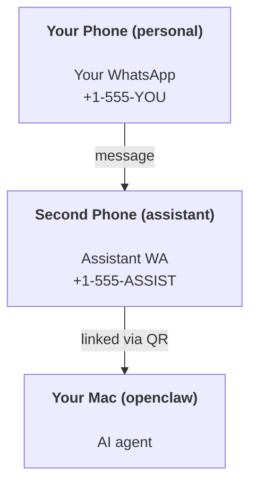

---
read_when:
    - 새 assistant 인스턴스 온보딩하기
    - 안전/권한 영향 검토하기
summary: 안전 주의 사항을 포함한 개인 비서로 OpenClaw를 실행하는 종단 간 가이드
title: 개인 비서 설정
x-i18n:
    generated_at: "2026-04-24T06:36:56Z"
    model: gpt-5.4
    provider: openai
    source_hash: 3048f2faae826fc33d962f1fac92da3c0ce464d2de803fee381c897eb6c76436
    source_path: start/openclaw.md
    workflow: 15
---

# OpenClaw로 개인 비서 만들기

OpenClaw는 Discord, Google Chat, iMessage, Matrix, Microsoft Teams, Signal, Slack, Telegram, WhatsApp, Zalo 등과 AI 에이전트를 연결하는 자체 호스팅 Gateway입니다. 이 가이드는 “개인 비서” 설정, 즉 항상 켜져 있는 AI 비서처럼 동작하는 전용 WhatsApp 번호 설정을 다룹니다.

## ⚠️ 먼저 안전부터

에이전트에게 다음과 같은 위치를 맡기게 됩니다.

- 머신에서 명령 실행(도구 정책에 따라 다름)
- 워크스페이스에서 파일 읽기/쓰기
- WhatsApp/Telegram/Discord/Mattermost 및 기타 번들 채널을 통해 메시지 다시 보내기

보수적으로 시작하세요.

- 항상 `channels.whatsapp.allowFrom`을 설정하세요(개인 Mac에서 전 세계에 열린 상태로 실행하지 마세요).
- 비서용으로 전용 WhatsApp 번호를 사용하세요.
- Heartbeat는 이제 기본적으로 30분마다 실행됩니다. 설정을 신뢰하기 전까지는 `agents.defaults.heartbeat.every: "0m"`으로 비활성화하세요.

## 사전 요구 사항

- OpenClaw 설치 및 온보딩 완료 — 아직 하지 않았다면 [Getting Started](/ko/start/getting-started)를 참조하세요
- 비서용 두 번째 전화번호(SIM/eSIM/선불 번호)

## 두 개의 휴대폰 설정(권장)

원하는 구성은 다음과 같습니다:



개인 WhatsApp을 OpenClaw에 연결하면, 나에게 오는 모든 메시지가 “에이전트 입력”이 됩니다. 보통 이것은 원하는 동작이 아닙니다.

## 5분 빠른 시작

1. WhatsApp Web 페어링(QR 표시, 비서 전화로 스캔):

```bash
openclaw channels login
```

2. Gateway 시작(계속 실행해 두기):

```bash
openclaw gateway --port 18789
```

3. 최소 config를 `~/.openclaw/openclaw.json`에 넣기:

```json5
{
  gateway: { mode: "local" },
  channels: { whatsapp: { allowFrom: ["+15555550123"] } },
}
```

이제 허용 목록에 있는 휴대폰에서 비서 번호로 메시지를 보내세요.

온보딩이 끝나면 OpenClaw는 dashboard를 자동으로 열고 깔끔한(토큰 없는) 링크를 출력합니다. dashboard가 인증을 요구하면 구성된 공유 비밀을 Control UI 설정에 붙여 넣으세요. 온보딩은 기본적으로 토큰(`gateway.auth.token`)을 사용하지만 `gateway.auth.mode`를 `password`로 바꿨다면 비밀번호 인증도 동작합니다. 나중에 다시 열려면: `openclaw dashboard`.

## 에이전트에 워크스페이스 주기(AGENTS)

OpenClaw는 워크스페이스 디렉터리에서 운영 지침과 “메모리”를 읽습니다.

기본적으로 OpenClaw는 `~/.openclaw/workspace`를 에이전트 워크스페이스로 사용하며, setup/첫 에이전트 실행 시 자동으로 생성하고 시작용 `AGENTS.md`, `SOUL.md`, `TOOLS.md`, `IDENTITY.md`, `USER.md`, `HEARTBEAT.md`도 함께 만듭니다. `BOOTSTRAP.md`는 워크스페이스가 완전히 새것일 때만 생성됩니다(삭제한 뒤에는 다시 생기지 않아야 합니다). `MEMORY.md`는 선택 사항이며(자동 생성되지 않음), 존재하면 일반 세션에서 로드됩니다. 하위 에이전트 세션은 `AGENTS.md`와 `TOOLS.md`만 주입합니다.

팁: 이 폴더를 OpenClaw의 “메모리”처럼 다루고 git repo(가능하면 비공개)로 만들어 `AGENTS.md`와 메모리 파일을 백업하세요. git이 설치되어 있으면 완전히 새로운 워크스페이스는 자동으로 초기화됩니다.

```bash
openclaw setup
```

전체 워크스페이스 레이아웃 + 백업 가이드: [Agent workspace](/ko/concepts/agent-workspace)
메모리 워크플로: [Memory](/ko/concepts/memory)

선택 사항: `agents.defaults.workspace`로 다른 워크스페이스를 선택할 수 있습니다(`~` 지원).

```json5
{
  agent: {
    workspace: "~/.openclaw/workspace",
  },
}
```

이미 repo에서 자체 워크스페이스 파일을 제공하고 있다면 부트스트랩 파일 생성을 완전히 비활성화할 수 있습니다.

```json5
{
  agent: {
    skipBootstrap: true,
  },
}
```

## 이것을 "비서"로 바꾸는 config

OpenClaw는 좋은 assistant 설정을 기본으로 제공하지만, 보통 다음을 조정하고 싶을 것입니다:

- [`SOUL.md`](/ko/concepts/soul)의 페르소나/지침
- 사고 기본값(원할 경우)
- Heartbeat(신뢰가 생긴 후)

예시:

```json5
{
  logging: { level: "info" },
  agent: {
    model: "anthropic/claude-opus-4-6",
    workspace: "~/.openclaw/workspace",
    thinkingDefault: "high",
    timeoutSeconds: 1800,
    // 처음에는 0으로 시작; 나중에 활성화.
    heartbeat: { every: "0m" },
  },
  channels: {
    whatsapp: {
      allowFrom: ["+15555550123"],
      groups: {
        "*": { requireMention: true },
      },
    },
  },
  routing: {
    groupChat: {
      mentionPatterns: ["@openclaw", "openclaw"],
    },
  },
  session: {
    scope: "per-sender",
    resetTriggers: ["/new", "/reset"],
    reset: {
      mode: "daily",
      atHour: 4,
      idleMinutes: 10080,
    },
  },
}
```

## 세션과 메모리

- 세션 파일: `~/.openclaw/agents/<agentId>/sessions/{{SessionId}}.jsonl`
- 세션 메타데이터(토큰 사용량, 마지막 경로 등): `~/.openclaw/agents/<agentId>/sessions/sessions.json` (레거시: `~/.openclaw/sessions/sessions.json`)
- `/new` 또는 `/reset`은 해당 채팅에 대해 새 세션을 시작합니다(`resetTriggers`로 구성 가능). 단독으로 보내면 에이전트는 재설정을 확인하기 위해 짧은 인사말로 응답합니다.
- `/compact [instructions]`는 세션 컨텍스트를 Compaction하고 남은 컨텍스트 예산을 보고합니다.

## Heartbeat(능동 모드)

기본적으로 OpenClaw는 30분마다 다음 프롬프트로 Heartbeat를 실행합니다:
`Read HEARTBEAT.md if it exists (workspace context). Follow it strictly. Do not infer or repeat old tasks from prior chats. If nothing needs attention, reply HEARTBEAT_OK.`
비활성화하려면 `agents.defaults.heartbeat.every: "0m"`을 설정하세요.

- `HEARTBEAT.md`가 존재하지만 사실상 비어 있으면(빈 줄과 `# Heading` 같은 Markdown 헤더만 있으면), OpenClaw는 API 호출을 아끼기 위해 Heartbeat 실행을 건너뜁니다.
- 파일이 없으면 Heartbeat는 여전히 실행되고 모델이 무엇을 할지 결정합니다.
- 에이전트가 `HEARTBEAT_OK`로 응답하면(선택적으로 짧은 패딩 포함, `agents.defaults.heartbeat.ackMaxChars` 참조), OpenClaw는 해당 Heartbeat의 아웃바운드 전달을 억제합니다.
- 기본적으로 DM 스타일 `user:<id>` 대상에 대한 Heartbeat 전달은 허용됩니다. 직접 대상 전달은 막되 Heartbeat 실행은 유지하려면 `agents.defaults.heartbeat.directPolicy: "block"`을 설정하세요.
- Heartbeat는 전체 에이전트 턴으로 실행되므로, 간격이 짧을수록 더 많은 토큰을 소모합니다.

```json5
{
  agent: {
    heartbeat: { every: "30m" },
  },
}
```

## 입출력 미디어

인바운드 첨부 파일(이미지/오디오/문서)은 템플릿을 통해 명령에 노출될 수 있습니다:

- `{{MediaPath}}` (로컬 임시 파일 경로)
- `{{MediaUrl}}` (의사 URL)
- `{{Transcript}}` (오디오 전사가 활성화된 경우)

에이전트의 아웃바운드 첨부 파일: 자체 줄에 `MEDIA:<path-or-url>`를 포함하세요(공백 없음). 예:

```
Here’s the screenshot.
MEDIA:https://example.com/screenshot.png
```

OpenClaw는 이것들을 추출하여 텍스트와 함께 미디어로 전송합니다.

로컬 경로 동작은 에이전트와 동일한 파일 읽기 신뢰 모델을 따릅니다.

- `tools.fs.workspaceOnly`가 `true`이면 아웃바운드 `MEDIA:` 로컬 경로는 OpenClaw 임시 루트, 미디어 캐시, 에이전트 워크스페이스 경로, sandbox가 생성한 파일로 제한됩니다.
- `tools.fs.workspaceOnly`가 `false`이면 아웃바운드 `MEDIA:`는 에이전트가 이미 읽을 수 있는 호스트 로컬 파일을 사용할 수 있습니다.
- 호스트 로컬 전송도 여전히 미디어 및 안전한 문서 유형(이미지, 오디오, 비디오, PDF, Office 문서)만 허용합니다. 일반 텍스트 및 비밀처럼 보이는 파일은 전송 가능한 미디어로 취급되지 않습니다.

즉, fs 정책이 이미 해당 읽기를 허용하는 경우 워크스페이스 밖에서 생성된 이미지/파일도 이제 전송할 수 있으며, 임의의 호스트 텍스트 첨부 파일 유출을 다시 열지 않습니다.

## 운영 체크리스트

```bash
openclaw status          # 로컬 상태(자격 증명, 세션, 대기 중 이벤트)
openclaw status --all    # 전체 진단(읽기 전용, 그대로 붙여 넣기 가능)
openclaw status --deep   # gateway에 라이브 상태 probe 요청(지원되는 경우 채널 probe 포함)
openclaw health --json   # gateway 상태 스냅샷(WS; 기본값은 새 캐시 스냅샷 반환 가능)
```

로그는 `/tmp/openclaw/` 아래에 저장됩니다(기본값: `openclaw-YYYY-MM-DD.log`).

## 다음 단계

- WebChat: [WebChat](/ko/web/webchat)
- Gateway 운영: [Gateway runbook](/ko/gateway)
- Cron + 웨이크업: [Cron jobs](/ko/automation/cron-jobs)
- macOS 메뉴 막대 companion: [OpenClaw macOS app](/ko/platforms/macos)
- iOS node 앱: [iOS app](/ko/platforms/ios)
- Android node 앱: [Android app](/ko/platforms/android)
- Windows 상태: [Windows (WSL2)](/ko/platforms/windows)
- Linux 상태: [Linux app](/ko/platforms/linux)
- 보안: [Security](/ko/gateway/security)

## 관련 항목

- [Getting started](/ko/start/getting-started)
- [Setup](/ko/start/setup)
- [채널 개요](/ko/channels)
