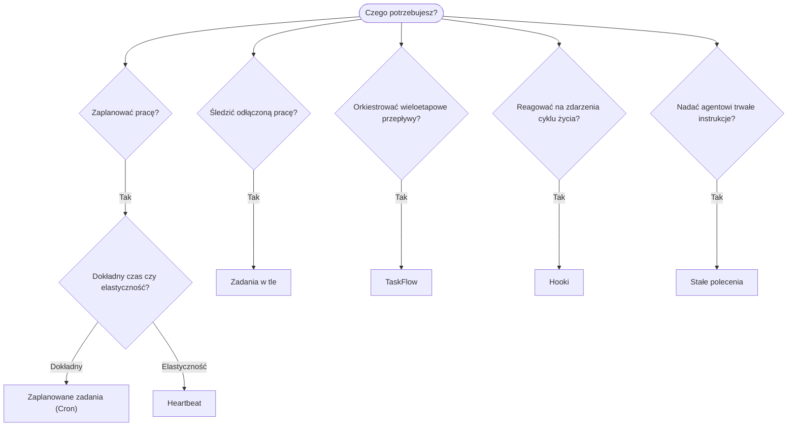

---
read_when:
    - Podejmowanie decyzji o automatyzacji pracy za pomocą OpenClaw
    - Wybór między Heartbeat, Cron, hookami i stałymi poleceniami
    - Wybór właściwego punktu wejścia automatyzacji
summary: 'Przegląd mechanizmów automatyzacji: zadania, Cron, hooki, stałe polecenia i TaskFlow'
title: Automatyzacja i zadania
x-i18n:
    generated_at: "2026-04-25T13:41:06Z"
    model: gpt-5.4
    provider: openai
    source_hash: 54524eb5d1fcb2b2e3e51117339be1949d980afaef1f6ae71fcfd764049f3f47
    source_path: automation/index.md
    workflow: 15
---

OpenClaw uruchamia pracę w tle za pomocą zadań, zaplanowanych zadań, hooków zdarzeń i stałych instrukcji. Ta strona pomaga wybrać odpowiedni mechanizm i zrozumieć, jak współdziałają.

## Szybki przewodnik decyzyjny

| Przypadek użycia                          | Zalecane               | Dlaczego                                        |
| ----------------------------------------- | ---------------------- | ------------------------------------------------ |
| Wyślij codzienny raport dokładnie o 9:00 | Zaplanowane zadania (Cron) | Dokładny czas, izolowane wykonanie           |
| Przypomnij mi za 20 minut                 | Zaplanowane zadania (Cron) | Jednorazowo z precyzyjnym czasem (`--at`)    |
| Uruchamiaj cotygodniową dogłębną analizę  | Zaplanowane zadania (Cron) | Samodzielne zadanie, może używać innego modelu |
| Sprawdzaj skrzynkę co 30 min              | Heartbeat              | Łączy się z innymi kontrolami, zależny od kontekstu |
| Monitoruj kalendarz pod kątem nadchodzących wydarzeń | Heartbeat | Naturalne dopasowanie do okresowej świadomości |
| Sprawdź stan subagenta lub uruchomienia ACP | Zadania w tle       | Rejestr zadań śledzi całą odłączoną pracę       |
| Sprawdź, co zostało uruchomione i kiedy   | Zadania w tle         | `openclaw tasks list` i `openclaw tasks audit` |
| Wieloetapowe badanie, a następnie podsumowanie | TaskFlow          | Trwała orkiestracja ze śledzeniem rewizji      |
| Uruchom skrypt przy resecie sesji         | Hooki                  | Sterowane zdarzeniami, uruchamiane przy zdarzeniach cyklu życia |
| Wykonuj kod przy każdym wywołaniu narzędzia | Plugin hooks         | Hooki in-process mogą przechwytywać wywołania narzędzi |
| Zawsze sprawdzaj zgodność przed odpowiedzią | Stałe polecenia      | Automatycznie wstrzykiwane do każdej sesji     |

### Zaplanowane zadania (Cron) a Heartbeat

| Wymiar          | Zaplanowane zadania (Cron)         | Heartbeat                            |
| --------------- | ---------------------------------- | ------------------------------------ |
| Czas            | Dokładny (wyrażenia Cron, jednorazowo) | Przybliżony (domyślnie co 30 min) |
| Kontekst sesji  | Świeży (izolowany) lub współdzielony | Pełny kontekst głównej sesji       |
| Rekordy zadań   | Zawsze tworzone                    | Nigdy nie są tworzone               |
| Dostarczanie    | Kanał, Webhook lub po cichu        | W treści głównej sesji              |
| Najlepsze do    | Raportów, przypomnień, zadań w tle | Sprawdzania skrzynki, kalendarza, powiadomień |

Używaj Zaplanowanych zadań (Cron), gdy potrzebujesz precyzyjnego czasu lub izolowanego wykonania. Używaj Heartbeat, gdy praca korzysta z pełnego kontekstu sesji, a przybliżony czas jest wystarczający.

## Główne pojęcia

### Zaplanowane zadania (cron)

Cron to wbudowany harmonogram Gateway dla precyzyjnego planowania w czasie. Utrwala zadania, wybudza agenta we właściwym momencie i może dostarczać wyniki do kanału czatu lub punktu końcowego Webhook. Obsługuje jednorazowe przypomnienia, cykliczne wyrażenia i przychodzące wyzwalacze Webhook.

Zobacz [Zaplanowane zadania](/pl/automation/cron-jobs).

### Zadania

Rejestr zadań w tle śledzi całą odłączoną pracę: uruchomienia ACP, uruchomienia subagentów, izolowane wykonania Cron i operacje CLI. Zadania to rekordy, a nie harmonogramy. Używaj `openclaw tasks list` i `openclaw tasks audit`, aby je sprawdzać.

Zobacz [Zadania w tle](/pl/automation/tasks).

### TaskFlow

TaskFlow to warstwa orkiestracji przepływów ponad zadaniami w tle. Zarządza trwałymi wieloetapowymi przepływami z trybami synchronizacji managed i mirrored, śledzeniem rewizji oraz `openclaw tasks flow list|show|cancel` do inspekcji.

Zobacz [TaskFlow](/pl/automation/taskflow).

### Stałe polecenia

Stałe polecenia przyznają agentowi stałe uprawnienia operacyjne dla zdefiniowanych programów. Znajdują się w plikach obszaru roboczego (zwykle `AGENTS.md`) i są wstrzykiwane do każdej sesji. Łącz je z Cron do egzekwowania opartego na czasie.

Zobacz [Stałe polecenia](/pl/automation/standing-orders).

### Hooki

Wewnętrzne hooki to skrypty sterowane zdarzeniami, wyzwalane przez zdarzenia cyklu życia agenta
(`/new`, `/reset`, `/stop`), Compaction sesji, uruchamianie Gateway oraz przepływ
wiadomości. Są automatycznie wykrywane z katalogów i można nimi zarządzać
za pomocą `openclaw hooks`. Do przechwytywania wywołań narzędzi in-process używaj
[Plugin hooks](/pl/plugins/hooks).

Zobacz [Hooki](/pl/automation/hooks).

### Heartbeat

Heartbeat to okresowa tura głównej sesji (domyślnie co 30 minut). Łączy wiele kontroli (skrzynka odbiorcza, kalendarz, powiadomienia) w jednej turze agenta z pełnym kontekstem sesji. Tury Heartbeat nie tworzą rekordów zadań. Używaj `HEARTBEAT.md` dla małej listy kontrolnej albo bloku `tasks:`, jeśli chcesz okresowych kontroli tylko po terminie wewnątrz samego heartbeat. Puste pliki heartbeat są pomijane jako `empty-heartbeat-file`; tryb zadań tylko po terminie jest pomijany jako `no-tasks-due`.

Zobacz [Heartbeat](/pl/gateway/heartbeat).

## Jak to współdziała

- **Cron** obsługuje precyzyjne harmonogramy (codzienne raporty, cotygodniowe przeglądy) oraz jednorazowe przypomnienia. Wszystkie wykonania Cron tworzą rekordy zadań.
- **Heartbeat** obsługuje rutynowe monitorowanie (skrzynka odbiorcza, kalendarz, powiadomienia) w jednej połączonej turze co 30 minut.
- **Hooki** reagują na określone zdarzenia (resety sesji, Compaction, przepływ wiadomości) za pomocą niestandardowych skryptów. Plugin hooks obejmują wywołania narzędzi.
- **Stałe polecenia** zapewniają agentowi trwały kontekst i granice uprawnień.
- **TaskFlow** koordynuje wieloetapowe przepływy ponad pojedynczymi zadaniami.
- **Zadania** automatycznie śledzą całą odłączoną pracę, dzięki czemu można ją sprawdzać i audytować.

## Powiązane

- [Zaplanowane zadania](/pl/automation/cron-jobs) — precyzyjne harmonogramy i jednorazowe przypomnienia
- [Zadania w tle](/pl/automation/tasks) — rejestr zadań dla całej odłączonej pracy
- [TaskFlow](/pl/automation/taskflow) — trwała orkiestracja wieloetapowych przepływów
- [Hooki](/pl/automation/hooks) — skrypty cyklu życia sterowane zdarzeniami
- [Plugin hooks](/pl/plugins/hooks) — hooki in-process dla narzędzi, promptów, wiadomości i cyklu życia
- [Stałe polecenia](/pl/automation/standing-orders) — trwałe instrukcje agenta
- [Heartbeat](/pl/gateway/heartbeat) — okresowe tury głównej sesji
- [Dokumentacja referencyjna konfiguracji](/pl/gateway/configuration-reference) — wszystkie klucze konfiguracji
