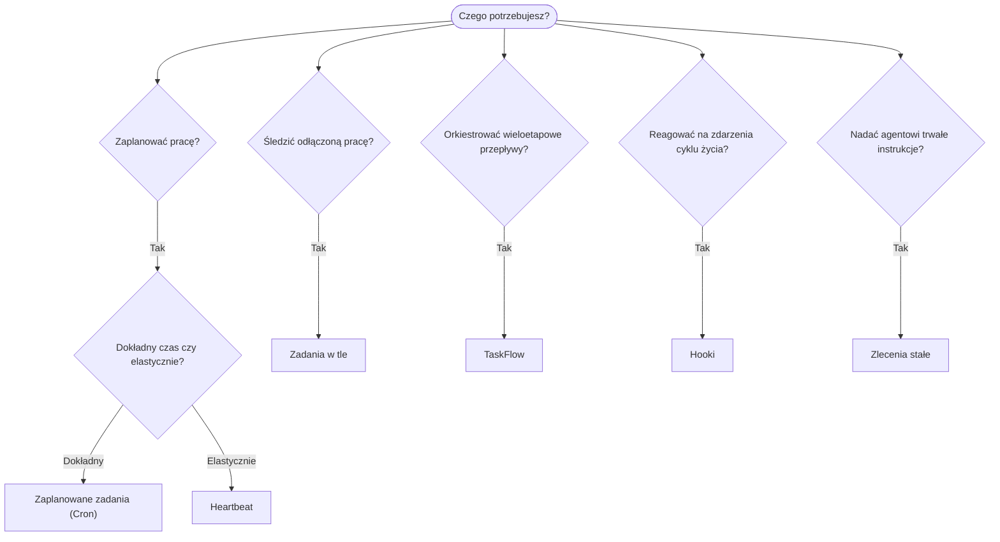

---
read_when:
    - Podejmowanie decyzji, jak zautomatyzować pracę za pomocą OpenClaw
    - Wybór między Heartbeat, Cron, hookami i zleceniami stałymi
    - Szukanie właściwego punktu wejścia automatyzacji
summary: 'Przegląd mechanizmów automatyzacji: zadania, Cron, hooki, zlecenia stałe i TaskFlow'
title: Automatyzacja i zadania
x-i18n:
    generated_at: "2026-04-26T11:22:56Z"
    model: gpt-5.4
    provider: openai
    source_hash: 6d2a2d3ef58830133e07b34f33c611664fc1032247e9dd81005adf7fc0c43cdb
    source_path: automation/index.md
    workflow: 15
---

OpenClaw uruchamia pracę w tle za pomocą zadań, zadań harmonogramowanych, hooków zdarzeń i stałych instrukcji. Ta strona pomaga wybrać właściwy mechanizm i zrozumieć, jak ze sobą współpracują.

## Krótki przewodnik decyzyjny

| Przypadek użycia                         | Zalecane               | Dlaczego                                        |
| ---------------------------------------- | ---------------------- | ------------------------------------------------ |
| Wysyłanie codziennego raportu dokładnie o 9:00 | Zaplanowane zadania (Cron) | Dokładny czas, odizolowane wykonanie             |
| Przypomnij mi za 20 minut                | Zaplanowane zadania (Cron) | Jednorazowe z precyzyjnym czasem (`--at`)        |
| Uruchamianie cotygodniowej dogłębnej analizy | Zaplanowane zadania (Cron) | Samodzielne zadanie, może używać innego modelu   |
| Sprawdzanie skrzynki odbiorczej co 30 min | Heartbeat              | Grupuje się z innymi kontrolami, świadome kontekstu |
| Monitorowanie kalendarza pod kątem nadchodzących wydarzeń | Heartbeat              | Naturalne dopasowanie do okresowej świadomości   |
| Sprawdzanie statusu subagenta lub uruchomienia ACP | Zadania w tle       | Rejestr zadań śledzi całą odłączoną pracę        |
| Audyt tego, co zostało uruchomione i kiedy | Zadania w tle       | `openclaw tasks list` i `openclaw tasks audit`   |
| Wieloetapowe badanie, a następnie podsumowanie | TaskFlow              | Trwała orkiestracja ze śledzeniem rewizji        |
| Uruchamianie skryptu przy resecie sesji  | Hooki                  | Sterowane zdarzeniami, uruchamiane przy zdarzeniach cyklu życia |
| Wykonywanie kodu przy każdym wywołaniu narzędzia | Plugin hooks       | Hooki w procesie mogą przechwytywać wywołania narzędzi |
| Zawsze sprawdzaj zgodność przed odpowiedzią | Zlecenia stałe      | Automatycznie wstrzykiwane do każdej sesji       |

### Zaplanowane zadania (Cron) vs Heartbeat

| Wymiar          | Zaplanowane zadania (Cron)          | Heartbeat                            |
| --------------- | ----------------------------------- | ------------------------------------ |
| Czas            | Dokładny (wyrażenia cron, jednorazowe) | Przybliżony (domyślnie co 30 min) |
| Kontekst sesji  | Świeży (izolowany) lub współdzielony | Pełny kontekst głównej sesji       |
| Rekordy zadań   | Zawsze tworzone                     | Nigdy nie są tworzone                |
| Dostarczanie    | Kanał, Webhook lub bezgłośnie       | Inline w głównej sesji               |
| Najlepsze do    | Raportów, przypomnień, zadań w tle  | Sprawdzania skrzynki, kalendarza, powiadomień |

Używaj Zaplanowanych zadań (Cron), gdy potrzebujesz precyzyjnego czasu lub odizolowanego wykonania. Używaj Heartbeat, gdy praca korzysta z pełnego kontekstu sesji i przybliżony czas jest wystarczający.

## Podstawowe pojęcia

### Zaplanowane zadania (cron)

Cron to wbudowany harmonogram Gateway do precyzyjnego planowania czasu. Utrwala zadania, wybudza agenta we właściwym momencie i może dostarczać dane wyjściowe do kanału czatu lub punktu końcowego Webhook. Obsługuje jednorazowe przypomnienia, wyrażenia cykliczne i przychodzące wyzwalacze Webhook.

Zobacz [Zaplanowane zadania](/pl/automation/cron-jobs).

### Zadania

Rejestr zadań w tle śledzi całą odłączoną pracę: uruchomienia ACP, uruchomienia subagentów, izolowane wykonania cron i operacje CLI. Zadania są rekordami, a nie harmonogramami. Użyj `openclaw tasks list` i `openclaw tasks audit`, aby je sprawdzać.

Zobacz [Zadania w tle](/pl/automation/tasks).

### TaskFlow

TaskFlow to warstwa orkiestracji przepływów ponad zadaniami w tle. Zarządza trwałymi wieloetapowymi przepływami z trybami synchronizacji zarządzanej i lustrzanej, śledzeniem rewizji oraz `openclaw tasks flow list|show|cancel` do inspekcji.

Zobacz [TaskFlow](/pl/automation/taskflow).

### Zlecenia stałe

Zlecenia stałe nadają agentowi trwałe uprawnienia operacyjne dla zdefiniowanych programów. Znajdują się w plikach obszaru roboczego (zwykle `AGENTS.md`) i są wstrzykiwane do każdej sesji. Łącz je z cron do egzekwowania opartego na czasie.

Zobacz [Zlecenia stałe](/pl/automation/standing-orders).

### Hooki

Wewnętrzne hooki to skrypty sterowane zdarzeniami, wyzwalane przez zdarzenia cyklu życia agenta (`/new`, `/reset`, `/stop`), Compaction sesji, uruchomienie Gateway i przepływ wiadomości. Są automatycznie wykrywane z katalogów i można nimi zarządzać za pomocą `openclaw hooks`. Do przechwytywania wywołań narzędzi w procesie użyj [Plugin hooks](/pl/plugins/hooks).

Zobacz [Hooki](/pl/automation/hooks).

### Heartbeat

Heartbeat to okresowy obrót głównej sesji (domyślnie co 30 minut). Grupuje wiele kontroli (skrzynka odbiorcza, kalendarz, powiadomienia) w jednym obrocie agenta z pełnym kontekstem sesji. Obroty Heartbeat nie tworzą rekordów zadań i nie wydłużają świeżości resetu sesji dziennej/bezczynności. Użyj `HEARTBEAT.md` dla małej listy kontrolnej albo bloku `tasks:`, gdy chcesz wykonywać wyłącznie okresowe kontrole należne w samym heartbeat. Puste pliki heartbeat są pomijane jako `empty-heartbeat-file`; tryb zadań tylko-należnych jest pomijany jako `no-tasks-due`.

Zobacz [Heartbeat](/pl/gateway/heartbeat).

## Jak to działa razem

- **Cron** obsługuje precyzyjne harmonogramy (codzienne raporty, cotygodniowe przeglądy) i jednorazowe przypomnienia. Wszystkie wykonania cron tworzą rekordy zadań.
- **Heartbeat** obsługuje rutynowe monitorowanie (skrzynka odbiorcza, kalendarz, powiadomienia) w jednym grupowanym obrocie co 30 minut.
- **Hooki** reagują na określone zdarzenia (resety sesji, Compaction, przepływ wiadomości) za pomocą niestandardowych skryptów. Plugin hooks obejmują wywołania narzędzi.
- **Zlecenia stałe** zapewniają agentowi trwały kontekst i granice uprawnień.
- **TaskFlow** koordynuje wieloetapowe przepływy ponad pojedynczymi zadaniami.
- **Zadania** automatycznie śledzą całą odłączoną pracę, aby można ją było sprawdzać i audytować.

## Powiązane

- [Zaplanowane zadania](/pl/automation/cron-jobs) — precyzyjne harmonogramowanie i jednorazowe przypomnienia
- [Zadania w tle](/pl/automation/tasks) — rejestr zadań dla całej odłączonej pracy
- [TaskFlow](/pl/automation/taskflow) — trwała orkiestracja wieloetapowych przepływów
- [Hooki](/pl/automation/hooks) — skrypty cyklu życia sterowane zdarzeniami
- [Plugin hooks](/pl/plugins/hooks) — hooki w procesie dla narzędzi, promptów, wiadomości i cyklu życia
- [Zlecenia stałe](/pl/automation/standing-orders) — trwałe instrukcje agenta
- [Heartbeat](/pl/gateway/heartbeat) — okresowe obroty głównej sesji
- [Configuration Reference](/pl/gateway/configuration-reference) — wszystkie klucze konfiguracji
