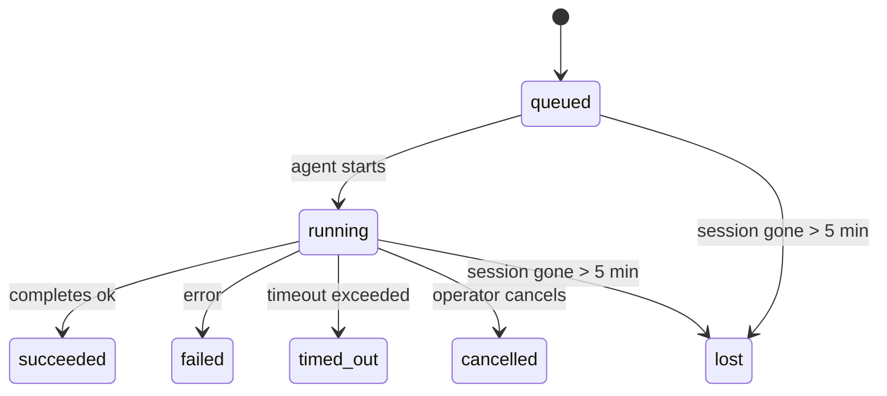

---
read_when:
    - Sprawdzanie trwających lub niedawno ukończonych zadań w tle
    - Debugowanie niepowodzeń dostarczania dla odłączonych uruchomień agentów
    - Zrozumienie, jak uruchomienia w tle odnoszą się do sesji, Cron i Heartbeat
summary: Śledzenie zadań w tle dla uruchomień ACP, subagentów, izolowanych zadań Cron i operacji CLI
title: Zadania w tle
x-i18n:
    generated_at: "2026-04-23T09:55:02Z"
    model: gpt-5.4
    provider: openai
    source_hash: 5cd0b0db6c20cc677aa5cc50c42e09043d4354e026ca33c020d804761c331413
    source_path: automation/tasks.md
    workflow: 15
---

# Zadania w tle

> **Szukasz harmonogramowania?** Zobacz [Automatyzacja i zadania](/pl/automation), aby wybrać właściwy mechanizm. Ta strona opisuje **śledzenie** pracy w tle, a nie jej planowanie.

Zadania w tle śledzą pracę uruchamianą **poza główną sesją rozmowy**:
uruchomienia ACP, tworzenie subagentów, izolowane wykonania zadań Cron oraz operacje inicjowane z CLI.

Zadania **nie** zastępują sesji, zadań Cron ani Heartbeat — są **rejestrem aktywności**, który zapisuje, jaka odłączona praca została wykonana, kiedy i czy zakończyła się powodzeniem.

<Note>
Nie każde uruchomienie agenta tworzy zadanie. Tury Heartbeat i zwykły interaktywny czat tego nie robią. Wszystkie wykonania Cron, uruchomienia ACP, uruchomienia subagentów i polecenia agenta z CLI tworzą zadania.
</Note>

## W skrócie

- Zadania to **rekordy**, a nie harmonogramy — Cron i Heartbeat decydują, _kiedy_ praca się uruchamia, a zadania śledzą, _co się wydarzyło_.
- ACP, subagenci, wszystkie zadania Cron i operacje CLI tworzą zadania. Tury Heartbeat nie.
- Każde zadanie przechodzi przez `queued → running → terminal` (`succeeded`, `failed`, `timed_out`, `cancelled` lub `lost`).
- Zadania Cron pozostają aktywne, dopóki środowisko wykonawcze Cron nadal jest właścicielem zadania; zadania CLI oparte na czacie pozostają aktywne tylko tak długo, jak aktywny jest ich kontekst uruchomienia będący właścicielem.
- Zakończenie jest oparte na wypychaniu: odłączona praca może powiadomić bezpośrednio lub wybudzić sesję żądającą/Heartbeat po zakończeniu, więc pętle odpytywania stanu zwykle nie są właściwym podejściem.
- Izolowane uruchomienia Cron i zakończenia subagentów w miarę możliwości porządkują śledzone karty przeglądarki/procesy dla swojej sesji potomnej przed końcowym porządkowaniem.
- Izolowane dostarczanie Cron tłumi nieaktualne pośrednie odpowiedzi nadrzędne, gdy potomna praca subagentów nadal się opróżnia, i preferuje końcowe dane wyjściowe potomka, jeśli dotrą przed dostarczeniem.
- Powiadomienia o zakończeniu są dostarczane bezpośrednio do kanału lub kolejkowane do następnego Heartbeat.
- `openclaw tasks list` pokazuje wszystkie zadania; `openclaw tasks audit` ujawnia problemy.
- Rekordy końcowe są przechowywane przez 7 dni, a następnie automatycznie usuwane.

## Szybki start

```bash
# Wyświetl wszystkie zadania (od najnowszych)
openclaw tasks list

# Filtruj według środowiska wykonawczego lub statusu
openclaw tasks list --runtime acp
openclaw tasks list --status running

# Pokaż szczegóły konkretnego zadania (według ID, ID uruchomienia lub klucza sesji)
openclaw tasks show <lookup>

# Anuluj uruchomione zadanie (zabija sesję potomną)
openclaw tasks cancel <lookup>

# Zmień politykę powiadomień dla zadania
openclaw tasks notify <lookup> state_changes

# Uruchom audyt kondycji
openclaw tasks audit

# Podejrzyj lub zastosuj utrzymanie
openclaw tasks maintenance
openclaw tasks maintenance --apply

# Sprawdź stan TaskFlow
openclaw tasks flow list
openclaw tasks flow show <lookup>
openclaw tasks flow cancel <lookup>
```

## Co tworzy zadanie

| Źródło                 | Typ środowiska wykonawczego | Kiedy tworzony jest rekord zadania                    | Domyślna polityka powiadomień |
| ---------------------- | --------------------------- | ----------------------------------------------------- | ----------------------------- |
| Uruchomienia ACP w tle | `acp`                       | Utworzenie potomnej sesji ACP                         | `done_only`                   |
| Orkiestracja subagentów | `subagent`                 | Utworzenie subagenta przez `sessions_spawn`           | `done_only`                   |
| Zadania Cron (wszystkie typy) | `cron`               | Każde wykonanie Cron (sesja główna i izolowana)       | `silent`                      |
| Operacje CLI           | `cli`                       | Polecenia `openclaw agent` uruchamiane przez Gateway  | `silent`                      |
| Zadania multimedialne agenta | `cli`                 | Uruchomienia `video_generate` oparte na sesji         | `silent`                      |

Zadania Cron w sesji głównej domyślnie używają polityki powiadomień `silent` — tworzą rekordy do śledzenia, ale nie generują powiadomień. Izolowane zadania Cron również domyślnie używają `silent`, ale są bardziej widoczne, ponieważ działają we własnej sesji.

Uruchomienia `video_generate` oparte na sesji również używają polityki powiadomień `silent`. Nadal tworzą rekordy zadań, ale zakończenie jest przekazywane z powrotem do pierwotnej sesji agenta jako wewnętrzne wybudzenie, aby agent mógł sam napisać wiadomość uzupełniającą i dołączyć gotowy film. Jeśli włączysz `tools.media.asyncCompletion.directSend`, asynchroniczne zakończenia `music_generate` i `video_generate` najpierw próbują bezpośredniego dostarczenia do kanału, a dopiero potem wracają do ścieżki wybudzenia sesji żądającej.

Gdy zadanie `video_generate` oparte na sesji jest nadal aktywne, narzędzie działa także jako zabezpieczenie: powtórzone wywołania `video_generate` w tej samej sesji zwracają status aktywnego zadania zamiast uruchamiać drugie równoległe generowanie. Użyj `action: "status"`, jeśli chcesz jawnie sprawdzić postęp/status po stronie agenta.

**Co nie tworzy zadań:**

- Tury Heartbeat — sesja główna; zobacz [Heartbeat](/pl/gateway/heartbeat)
- Zwykłe interaktywne tury czatu
- Bezpośrednie odpowiedzi `/command`

## Cykl życia zadania



| Status      | Co oznacza                                                               |
| ----------- | ------------------------------------------------------------------------ |
| `queued`    | Utworzone, oczekuje na uruchomienie agenta                               |
| `running`   | Tura agenta jest aktywnie wykonywana                                     |
| `succeeded` | Zakończone pomyślnie                                                     |
| `failed`    | Zakończone błędem                                                        |
| `timed_out` | Przekroczono skonfigurowany limit czasu                                  |
| `cancelled` | Zatrzymane przez operatora przez `openclaw tasks cancel`                 |
| `lost`      | Środowisko wykonawcze utraciło autorytatywny stan zaplecza po 5-minutowym okresie karencji |

Przejścia następują automatycznie — gdy powiązane uruchomienie agenta się kończy, status zadania jest aktualizowany zgodnie z wynikiem.

`lost` zależy od środowiska wykonawczego:

- Zadania ACP: zniknęły metadane potomnej sesji ACP w zapleczu.
- Zadania subagentów: potomna sesja zniknęła z docelowego magazynu agenta.
- Zadania Cron: środowisko wykonawcze Cron nie śledzi już zadania jako aktywnego.
- Zadania CLI: izolowane zadania sesji potomnej używają sesji potomnej; zadania CLI oparte na czacie używają zamiast tego aktywnego kontekstu uruchomienia, więc pozostające wiersze sesji kanału/grupy/bezpośredniej nie utrzymują ich przy życiu.

## Dostarczanie i powiadomienia

Gdy zadanie osiąga stan końcowy, OpenClaw Cię powiadamia. Istnieją dwie ścieżki dostarczania:

**Dostarczenie bezpośrednie** — jeśli zadanie ma docelowy kanał (`requesterOrigin`), wiadomość o zakończeniu trafia bezpośrednio do tego kanału (Telegram, Discord, Slack itp.). W przypadku zakończeń subagentów OpenClaw zachowuje też powiązane trasowanie wątku/tematu, gdy jest dostępne, i może uzupełnić brakujące `to` / konto na podstawie zapisanej trasy sesji żądającej (`lastChannel` / `lastTo` / `lastAccountId`) przed rezygnacją z bezpośredniego dostarczenia.

**Dostarczenie kolejkowane do sesji** — jeśli bezpośrednie dostarczenie się nie powiedzie lub nie ustawiono źródła, aktualizacja jest kolejkowana jako zdarzenie systemowe w sesji żądającego i pojawia się przy następnym Heartbeat.

<Tip>
Zakończenie zadania natychmiast wywołuje wybudzenie Heartbeat, więc wynik zobaczysz szybko — nie musisz czekać na następny zaplanowany takt Heartbeat.
</Tip>

Oznacza to, że typowy przepływ pracy jest oparty na wypychaniu: uruchamiasz odłączoną pracę raz, a potem pozwalasz środowisku wykonawczemu wybudzić Cię lub powiadomić po zakończeniu. Odpytuj stan zadania tylko wtedy, gdy potrzebujesz debugowania, interwencji lub jawnego audytu.

### Polityki powiadomień

Kontroluj, jak dużo informacji otrzymujesz o każdym zadaniu:

| Polityka              | Co jest dostarczane                                                     |
| --------------------- | ----------------------------------------------------------------------- |
| `done_only` (domyślna) | Tylko stan końcowy (`succeeded`, `failed` itd.) — **to jest ustawienie domyślne** |
| `state_changes`       | Każda zmiana stanu i aktualizacja postępu                               |
| `silent`              | Nic                                                                     |

Zmień politykę, gdy zadanie jest uruchomione:

```bash
openclaw tasks notify <lookup> state_changes
```

## Dokumentacja CLI

### `tasks list`

```bash
openclaw tasks list [--runtime <acp|subagent|cron|cli>] [--status <status>] [--json]
```

Kolumny wyjściowe: ID zadania, typ, status, dostarczanie, ID uruchomienia, sesja potomna, podsumowanie.

### `tasks show`

```bash
openclaw tasks show <lookup>
```

Token wyszukiwania akceptuje ID zadania, ID uruchomienia lub klucz sesji. Pokazuje pełny rekord, w tym czasy, stan dostarczenia, błąd i końcowe podsumowanie.

### `tasks cancel`

```bash
openclaw tasks cancel <lookup>
```

W przypadku zadań ACP i subagentów zabija to sesję potomną. W przypadku zadań śledzonych przez CLI anulowanie jest zapisywane w rejestrze zadań (nie ma osobnego uchwytu środowiska wykonawczego potomka). Status przechodzi do `cancelled`, a powiadomienie o dostarczeniu jest wysyłane tam, gdzie ma to zastosowanie.

### `tasks notify`

```bash
openclaw tasks notify <lookup> <done_only|state_changes|silent>
```

### `tasks audit`

```bash
openclaw tasks audit [--json]
```

Ujawnia problemy operacyjne. Ustalenia pojawiają się również w `openclaw status`, gdy wykryte zostaną problemy.

| Ustalenie               | Ważność | Wyzwalacz                                            |
| ----------------------- | ------- | ---------------------------------------------------- |
| `stale_queued`          | warn    | Oczekuje dłużej niż 10 minut                         |
| `stale_running`         | error   | Uruchomione dłużej niż 30 minut                      |
| `lost`                  | error   | Zniknęła własność zadania oparta na środowisku wykonawczym |
| `delivery_failed`       | warn    | Dostarczenie nie powiodło się, a polityka powiadomień nie jest `silent` |
| `missing_cleanup`       | warn    | Zadanie końcowe bez znacznika czasu czyszczenia      |
| `inconsistent_timestamps` | warn  | Naruszenie osi czasu (na przykład zakończenie przed rozpoczęciem) |

### `tasks maintenance`

```bash
openclaw tasks maintenance [--json]
openclaw tasks maintenance --apply [--json]
```

Użyj tego, aby podejrzeć lub zastosować uzgadnianie, oznaczanie czyszczenia i przycinanie dla zadań oraz stanu Task Flow.

Uzgadnianie zależy od środowiska wykonawczego:

- Zadania ACP/subagentów sprawdzają swoją potomną sesję zaplecza.
- Zadania Cron sprawdzają, czy środowisko wykonawcze Cron nadal jest właścicielem zadania.
- Zadania CLI oparte na czacie sprawdzają właścicielski aktywny kontekst uruchomienia, a nie tylko wiersz sesji czatu.

Czyszczenie po zakończeniu także zależy od środowiska wykonawczego:

- Zakończenie subagenta w miarę możliwości zamyka śledzone karty przeglądarki/procesy dla sesji potomnej, zanim będzie kontynuowane ogłaszanie czyszczenia.
- Zakończenie izolowanego Cron w miarę możliwości zamyka śledzone karty przeglądarki/procesy dla sesji Cron, zanim uruchomienie całkowicie się zakończy.
- Dostarczanie izolowanego Cron w razie potrzeby czeka na dalsze działania potomnych subagentów i tłumi nieaktualny tekst potwierdzenia nadrzędnego zamiast go ogłaszać.
- Dostarczanie zakończenia subagenta preferuje najnowszy widoczny tekst asystenta; jeśli jest pusty, wraca do oczyszczonego najnowszego tekstu `tool`/`toolResult`, a uruchomienia wywołań narzędzi kończące się wyłącznie limitem czasu mogą zostać zredukowane do krótkiego podsumowania częściowego postępu. Końcowe uruchomienia zakończone błędem ogłaszają status niepowodzenia bez odtwarzania przechwyconego tekstu odpowiedzi.
- Błędy czyszczenia nie maskują rzeczywistego wyniku zadania.

### `tasks flow list|show|cancel`

```bash
openclaw tasks flow list [--status <status>] [--json]
openclaw tasks flow show <lookup> [--json]
openclaw tasks flow cancel <lookup>
```

Używaj tych poleceń, gdy interesuje Cię orkiestrujący TaskFlow, a nie pojedynczy rekord zadania w tle.

## Tablica zadań czatu (`/tasks`)

Użyj `/tasks` w dowolnej sesji czatu, aby zobaczyć zadania w tle powiązane z tą sesją. Tablica pokazuje aktywne i niedawno zakończone zadania wraz ze środowiskiem wykonawczym, statusem, czasem oraz szczegółami postępu lub błędów.

Gdy bieżąca sesja nie ma widocznych powiązanych zadań, `/tasks` przechodzi awaryjnie do lokalnych dla agenta liczników zadań,
dzięki czemu nadal otrzymujesz przegląd bez ujawniania szczegółów innych sesji.

Aby zobaczyć pełny rejestr operatora, użyj CLI: `openclaw tasks list`.

## Integracja statusu (obciążenie zadaniami)

`openclaw status` zawiera szybkie podsumowanie zadań:

```
Tasks: 3 queued · 2 running · 1 issues
```

Podsumowanie raportuje:

- **active** — liczba `queued` + `running`
- **failures** — liczba `failed` + `timed_out` + `lost`
- **byRuntime** — podział według `acp`, `subagent`, `cron`, `cli`

Zarówno `/status`, jak i narzędzie `session_status` używają migawki zadań uwzględniającej czyszczenie: aktywne zadania są
preferowane, nieaktualne zakończone wiersze są ukrywane, a niedawne awarie są pokazywane tylko wtedy, gdy nie pozostała żadna aktywna praca.
Dzięki temu karta statusu pozostaje skupiona na tym, co ma znaczenie w danej chwili.

## Przechowywanie i utrzymanie

### Gdzie znajdują się zadania

Rekordy zadań są trwale przechowywane w SQLite pod adresem:

```
$OPENCLAW_STATE_DIR/tasks/runs.sqlite
```

Rejestr jest ładowany do pamięci przy starcie Gateway i synchronizuje zapisy do SQLite, aby zapewnić trwałość po ponownym uruchomieniu.

### Automatyczne utrzymanie

Proces czyszczący uruchamia się co **60 sekund** i obsługuje trzy rzeczy:

1. **Uzgadnianie** — sprawdza, czy aktywne zadania nadal mają autorytatywne zaplecze środowiska wykonawczego. Zadania ACP/subagentów używają stanu sesji potomnej, zadania Cron używają własności aktywnego zadania, a zadania CLI oparte na czacie używają właścicielskiego kontekstu uruchomienia. Jeśli ten stan zaplecza zniknie na dłużej niż 5 minut, zadanie zostanie oznaczone jako `lost`.
2. **Oznaczanie czyszczenia** — ustawia znacznik czasu `cleanupAfter` dla zadań końcowych (`endedAt` + 7 dni).
3. **Przycinanie** — usuwa rekordy po przekroczeniu ich daty `cleanupAfter`.

**Retencja**: rekordy końcowe zadań są przechowywane przez **7 dni**, a następnie automatycznie usuwane. Nie jest wymagana żadna konfiguracja.

## Jak zadania odnoszą się do innych systemów

### Zadania i Task Flow

[Task Flow](/pl/automation/taskflow) to warstwa orkiestracji przepływu ponad zadaniami w tle. Pojedynczy przepływ może w czasie swojego działania koordynować wiele zadań, używając zarządzanych lub lustrzanych trybów synchronizacji. Użyj `openclaw tasks`, aby sprawdzić pojedyncze rekordy zadań, a `openclaw tasks flow`, aby sprawdzić orkiestrujący przepływ.

Szczegóły znajdziesz w [Task Flow](/pl/automation/taskflow).

### Zadania i Cron

**Definicja** zadania Cron znajduje się w `~/.openclaw/cron/jobs.json`; stan wykonania w czasie działania znajduje się obok niej w `~/.openclaw/cron/jobs-state.json`. **Każde** wykonanie Cron tworzy rekord zadania — zarówno w sesji głównej, jak i izolowanej. Zadania Cron w sesji głównej domyślnie używają polityki powiadomień `silent`, dzięki czemu są śledzone bez generowania powiadomień.

Zobacz [Zadania Cron](/pl/automation/cron-jobs).

### Zadania i Heartbeat

Uruchomienia Heartbeat są turami sesji głównej — nie tworzą rekordów zadań. Gdy zadanie się zakończy, może wywołać wybudzenie Heartbeat, aby wynik był widoczny od razu.

Zobacz [Heartbeat](/pl/gateway/heartbeat).

### Zadania i sesje

Zadanie może odwoływać się do `childSessionKey` (gdzie wykonywana jest praca) oraz `requesterSessionKey` (kto ją uruchomił). Sesje to kontekst rozmowy; zadania to śledzenie aktywności nałożone na ten kontekst.

### Zadania i uruchomienia agentów

`runId` zadania wskazuje uruchomienie agenta wykonujące pracę. Zdarzenia cyklu życia agenta (start, koniec, błąd) automatycznie aktualizują status zadania — nie musisz zarządzać cyklem życia ręcznie.

## Powiązane

- [Automatyzacja i zadania](/pl/automation) — przegląd wszystkich mechanizmów automatyzacji
- [Task Flow](/pl/automation/taskflow) — orkiestracja przepływu ponad zadaniami
- [Zaplanowane zadania](/pl/automation/cron-jobs) — harmonogramowanie pracy w tle
- [Heartbeat](/pl/gateway/heartbeat) — okresowe tury sesji głównej
- [CLI: Tasks](/pl/cli/tasks) — dokumentacja poleceń CLI
